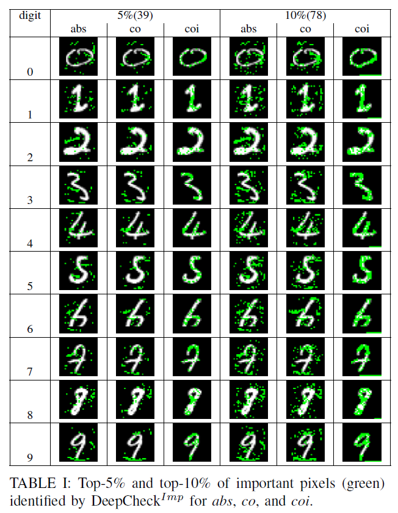
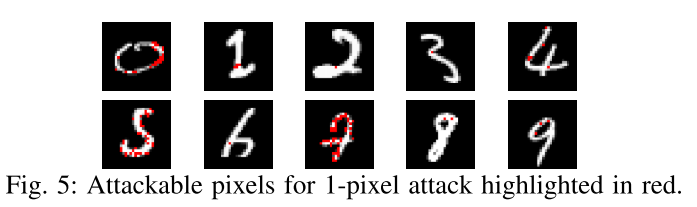

原文：Symbolic Execution for Deep Neural Networks （ISSRE'18)  <!--more-->

代码：没找到

## 概括

提出DNN上的符号执行测试方法。将DNN转换为程序（激活函数转换成if-else），利用相关性识别出重要像素。约束求解器求解激活模式相同但预测标签不同的输入（改变重要像素的值）。

## 识别重要像素

TODO

## 确定攻击像素

构造约束求解问题：改变像素的值，使得新图片与原图激活模式相同，但预测标签不同。使用约束求解器Z3求解。

## 实验

### 实验配置

- 数据集和模型
  - MNIST
  - 模型结构：784×10×10×10×10
  - 训练集：60000张图片
  - 准确率：92%
- 选择训练集里的10张图片（0-9）作为原始图片种子 

### 实验1：重要像素识别效果

- Top 5% 和10%重要像素识别结果

### 实验2：用符号执行进行1或2像素攻击的效果

- 对1像素攻击：首先穷举每个像素（共784个）来确认其是否可攻击（改变像素值后激活模式不变，但预测标签改变），10张图片的可攻击像素如下：

## 可控制参数及变量总结

- 重要像素百分比（如5%、10%）
- 初始种子集合：10张图片