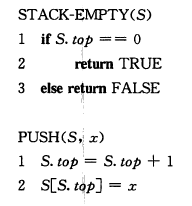
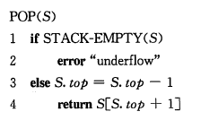
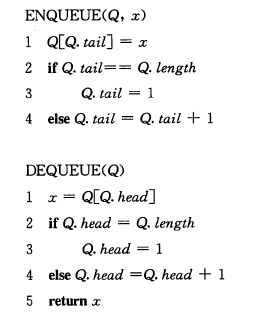
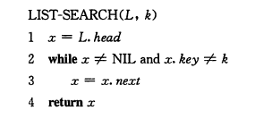
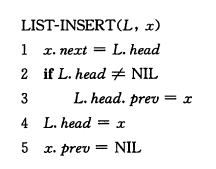
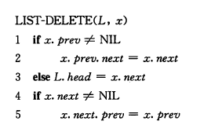

## 基本数据结构

### 栈和队列

#### 栈

- 后进先出

- S.top指向最新插入的元素
  - S.top=0：栈为空





#### 队列

- 先进先出

- Q.head指向队头元素，Q.tail指向下一个新元素将插入的位置

- Q.head=Q.tail时：队列为空

- 初始时：Q.head=Q.tail=1

- Q.head=Q.tail+1时：队满

  

```c++
// LeetCode 622：实现循环队列
class MyCircularQueue {
private:
    vector<int> Q;
    int head, tail;
    int size;
public:
    MyCircularQueue(int k) {
        size = k + 1;
        Q.resize(size);
        head = 0;
        tail = 0;
    }
    
    bool enQueue(int value) {
        if (isFull())
            return false;
        Q[tail] = value;
        tail = (tail + 1) % size;
        return true;
    }
    
    bool deQueue() {
        if (isEmpty())
            return false;
        head = (head + 1) % size;
        return true;
    }
    
    int Front() {
        if(isEmpty())
            return -1;
        return Q[head];
    }
    
    int Rear() {
        if(isEmpty())
            return -1;
        return Q[(tail - 1 + size) % size];
    }
    
    bool isEmpty() {
        return head == tail;
    }
    
    bool isFull() {
        return (tail + 1) % size == head;
    }
};
```


```c++
// LeetCode 641：实现循环双端队列
class MyCircularDeque {
private:
    vector<int> D;
    int size, head, tail;
public:
    /** Initialize your data structure here. Set the size of the deque to be k. */
    MyCircularDeque(int k) {
        size = k + 2;
        head = 0;
        tail = 1;
        D.resize(size);
    }
    
    /** Adds an item at the front of Deque. Return true if the operation is successful. */
    bool insertFront(int value) {
        if(isFull())
            return false;
        D[head] = value;
        head = (head - 1 + size) % size;
        return true;
    }
    
    /** Adds an item at the rear of Deque. Return true if the operation is successful. */
    bool insertLast(int value) {
        if(isFull())
            return false;
        D[tail] = value;
        tail = (tail + 1) % size;
        return true;
    }
    
    /** Deletes an item from the front of Deque. Return true if the operation is successful. */
    bool deleteFront() {
        if(isEmpty())
            return false;
        head = (head + 1) % size;
        return true;
    }
    
    /** Deletes an item from the rear of Deque. Return true if the operation is successful. */
    bool deleteLast() {
        if(isEmpty())
            return false;
        tail = (tail - 1 + size) % size;
        return true;
    }
    
    /** Get the front item from the deque. */
    int getFront() {
        if (isEmpty())
            return -1;
        return D[(head + 1) % size];
    }
    
    /** Get the last item from the deque. */
    int getRear() {
        if(isEmpty())
            return -1;
        return D[(tail - 1 + size) % size];
    }
    
    /** Checks whether the circular deque is empty or not. */
    bool isEmpty() {
        return (head + 1) % size == tail;
    }
    
    /** Checks whether the circular deque is full or not. */
    bool isFull() {
        return (tail + 1) % size == head;
    }
};
```


### 链表

- 搜索：$O(n)$

  

- 插入：$O(1)$

  

- 删除：$O(1)$

  

- 哨兵

  

```c++
// LeetCode 622：设计循环队列
struct Node
{
    int val;
    Node* prev, *next;
    Node(int x): val(x), prev(NULL), next(NULL) {}
};
class MyLinkedList {
private:
    Node* dummy;	// 哨兵
public:
    /** Initialize your data structure here. */
    MyLinkedList()
    {
        dummy = new Node(-1);
        dummy->prev = dummy;    // dummy->prev指向表尾
        dummy->next = dummy;    // dummy->next指向表头
    }
    
    /** Get the value of the index-th node in the linked list. If the index is invalid, return -1. */
    int get(int index)
    {
        Node* p = dummy -> next;
        for(int i = 0; i < index; i ++)
        {
            p = p -> next;
            if(p == dummy)
                return -1;
        }
        return p -> val;
    }
    
    /** Add a node of value val before the first element of the linked list. After the insertion, the new node will be the first node of the linked list. */
    void addAtHead(int val)
    {
        Node* n = new Node(val);
        n -> next = dummy -> next;
        n -> prev = dummy;
        dummy -> next -> prev = n;
        dummy -> next = n;
    }
    
    /** Append a node of value val to the last element of the linked list. */
    void addAtTail(int val)
    {
        Node* n = new Node(val);
        n -> next = dummy;
        n -> prev = dummy -> prev;
        dummy -> prev -> next = n;
        dummy -> prev = n;
    }
    
    /** Add a node of value val before the index-th node in the linked list. If index equals to the length of linked list, the node will be appended to the end of linked list. If index is greater than the length, the node will not be inserted. */
    void addAtIndex(int index, int val)
    {
        if (index <= 0)
        {
            addAtHead(val);
            return;
        }
        Node* p = dummy -> next;
        for(int i = 0; i < index; i ++)
        {
            p = p -> next;
            if(p == dummy)
            {
                if (i + 1 == index) {
                    addAtTail(val);
                    return;
                }
                else return;
            }
        }
        Node* n = new Node(val);
        n -> next = p;
        n -> prev = p -> prev;
        p -> prev -> next = n;
        p -> prev = n;
    }
    
    /** Delete the index-th node in the linked list, if the index is valid. */
    void deleteAtIndex(int index)
    {
        Node* p = dummy -> next;
        for(int i = 0; i < index; i ++)
        {
            p = p -> next;
            if(p == dummy)
                return;
        }
        p -> prev -> next = p -> next;
        p -> next -> prev = p -> prev;
        delete p;
    }
};
```


```c++
//LeetCode 206 反转链表：
// 递归写法
ListNode* reverseList(ListNode* head)
{
    if(head == NULL || head-> next == NULL)
        return head;
    ListNode* plast = reverseList(head -> next);
    ListNode* p = plast; 
    head-> next ->next = head;
    head -> next = NULL;
    return plast;
}

// 非递归写法
ListNode* reverseList(ListNode* head) 
{
    ListNode* prev = NULL, *curr = head, *next;
    while(curr != NULL)
    {
        next = curr->next;
        curr->next = prev;
        prev = curr;
        curr = next;
    }
    return prev;
}
```


### 有根树


## 散列表

