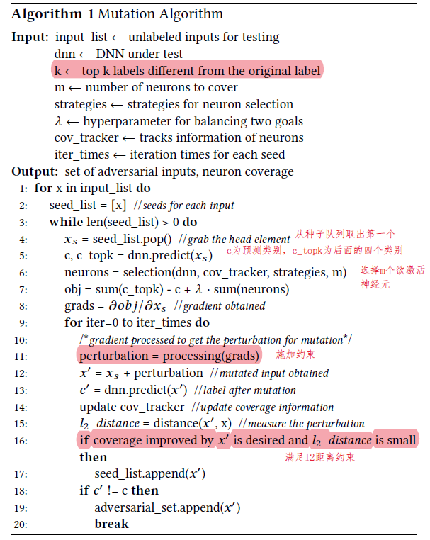
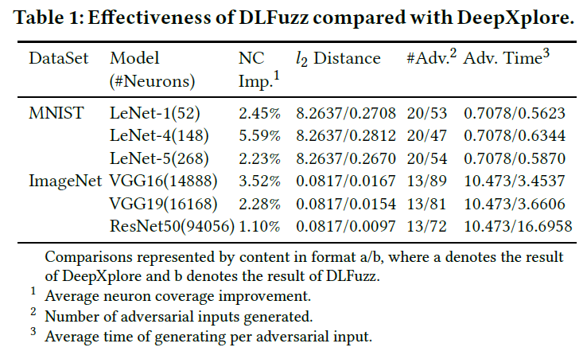
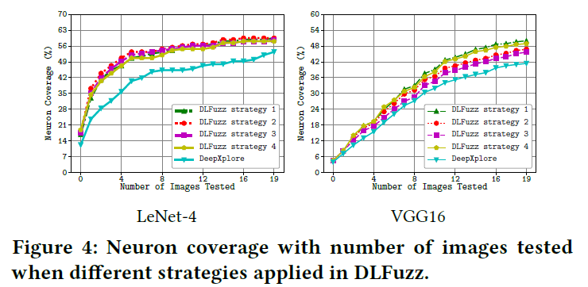

原文：DLFuzz: Differential Fuzzing Testing of Deep Learning Systems （ESEC/FSE’18）<!--more-->

代码：https://github.com/turned2670/DLFuzz 

## 可控制变量及参数总结

- 输入集合（未标注）
- 待测试DNN
- $k$：除原预测标签外，top-k个其他标签
- $m$：欲覆盖的神经元个数
-  strategies：神经元选择策略
  - 策略1：选择过去测试中常被覆盖的神经元

  - 策略2：选择过去测试中极少被覆盖到的神经元

  - 策略3：选择权重高的神经元
  - 策略4：选择激活阈值附近的神经元
- $\lambda$：平衡两个目标（预测类别差异和覆盖新的神经元）的参数
- predict_weight：代码里在上公式中$\sum c_i$前的权重，默认为0.5（未在论文里出现的参数）
- iter_times: 每个种子的迭代次数
- threshold: 神经元激活阈值
- learning_step：步长，代码里设为0.02

## 算法

- 梯度约束：论文里说可以加保持符号约束或DeepXplore里的约束，但代码似乎没加任何约束，直接在输入上增加梯度*步长

- 生成图像距离约束：满足L2距离（<0.02）（计算方式为L2_norm / orig_L2_norm）

- 约束：一个输入能提升的神经元覆盖率随着时间的增加而下降，对应的保留种子的阈值也随着运行时间的增加而降低（代码里体现为保留种子时最少需要提升的覆盖率随迭代次数增加而降低）

  

## 实验

### 数据集和模型

MNIST（LeNet-1, LeNet-4, LeNet-5）和ImageNet（VGG-16, VGG-19, ResNet50）

与DeepXplore相同

### 默认参数设置

- 随机选择20个初始输入（类别是否平衡？20是否过少？）

- $k=4,m=10$，strategy为策略1，iter_times=3 

### 实验1：DLFuzz与DeepXplore比较

- 实验方法：对相同的20个初始输入，比较DLFuzz相对DeepXplore神经元覆盖率、l2距离、生成对抗样本的个数、每个对抗样本平均生成时间

- 实验结果：

  - 覆盖率提升（DLFuzz的优化目标选择了10个神经元，DeepXplore只选了一个）

  - L2距离很小，生成的扰动更隐秘（DeepXplore未对距离做限制，甚至认为L1距离越大多样性越好）

  - 生成对抗样本数量更多（DeepXplore对每组DNN每张图片最多只生成一个对抗样本，DLFuzz每个模型每张图片可以生成多个对抗样本）

  - 更短的时间消耗（除了ResNet50，因为神经元数量大所以选择神经元的耗时长）

### 实验2：四种神经元选择策略比较

- 实验方法：比较四种策略和DeepXplore，随着测试图片生成数量增多，神经元覆盖率的增长趋势

- 实验结果：策略1略好（生成数量是否过少？19张神经元覆盖率就趋于平缓）

  

###  实验3：用生成图片重新训练

- 实验方法：用生成的114个对抗样本重新训练MNIST的三个DNN模型，平均提升准确率1.8%（太少？）

