On Decomposing a Deep Neural Network into Modules （FSE'20）<!--more-->

会议视频：https://www.youtube.com/watch?v=EH1aUbFj0HQ

代码：https://github.com/rangeetpan/decomposeDNNintoModules

## 背景

- 传统软件的模块化分解与重组：可用于软件重用、替换、独立测试、独立开发等

  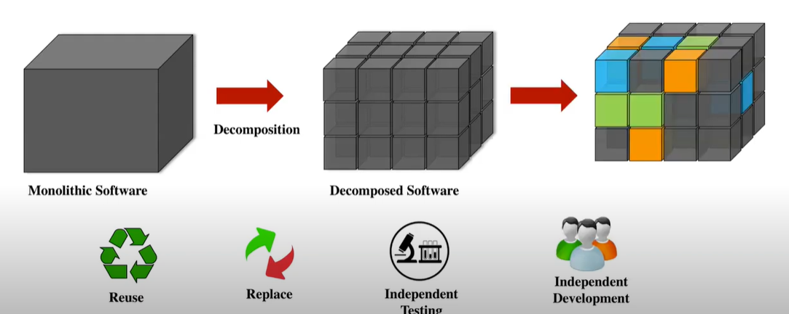

- 为什么DNN也需要模块分解？应用场景举例

  - 场景1：数据集内部分解

    - 手写数字识别→0，1识别，传统方法需要重新训练，本方法可直接将DNN解构成10个模块，组合成0、1识别模型。

    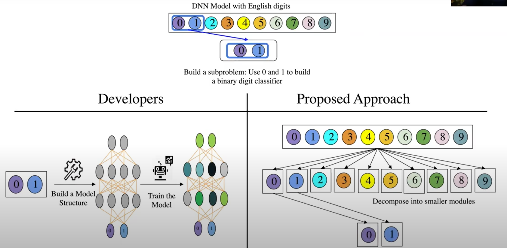

  - 场景2：数据集之间

    - 数字识别+字母识别->16进制数字识别

      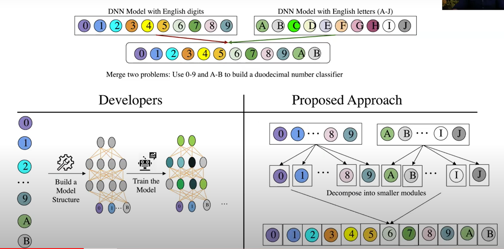

  - 场景3：模块替换

    - 数字识别模型中某个数字5识别效果较差，从另一个模型中分解出单独识别5的模块，与A的其他模块组合在一起

      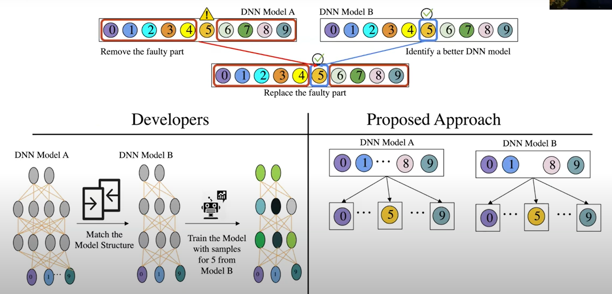

## 方法

### 步骤1：关注点识别 Concern Identification (CI)

- 关注点识别本质上是识别出整体模型中对特定功能或关注点有贡献的那些部分，解构DNN。
- 具体地，依次对模型喂入关注类别的训练样本：
  - 对未激活节点：将输入边和输出边的权重都置为零（删除边）
  - 对激活节点：将输出边权重置为正（`算法1没看懂为什么是min`）
  - 删除与输出层其他类别相连的边。

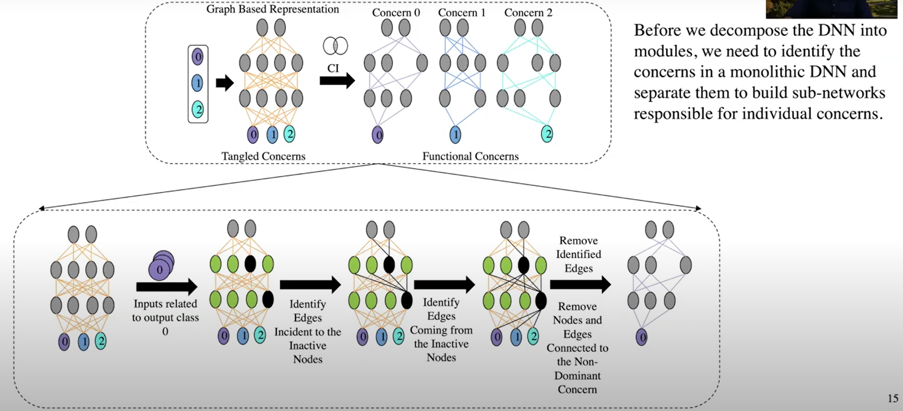

### 步骤2：纠缠识别 Tangling Identification（TI）

- 第一步之后，解构出的模块只对目标类别的识别起作用，即目前只是一个**单分类器**，无法对非本类的样本进行判断。这就好比从一个程序中删除一个条件及其分支，从而产生直接执行剩余分支功能的子程序，但无条件地这样做。（`即所有样本都会被分类成这一个类别`）

- 解决方法：加回一些节点和边，帮助区分非目标类别。四种TI方法：

  - Imbalance (TI-I)

    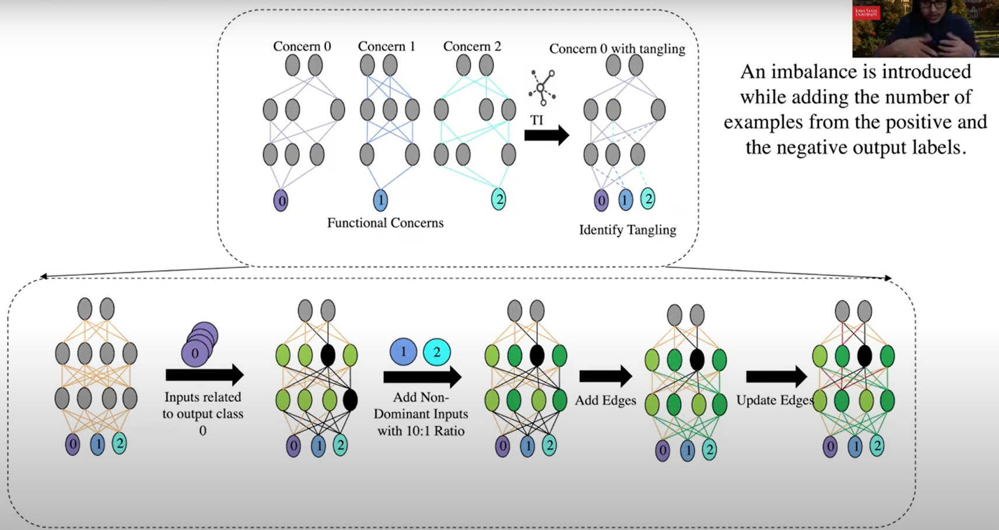

  - Punish Negative Examples (TI-PN)

    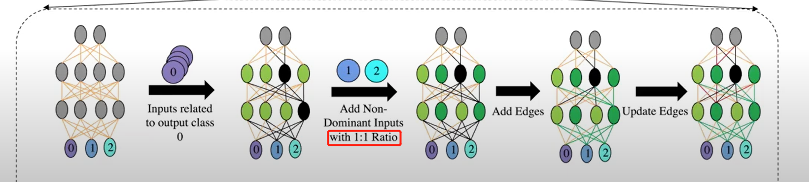

  - Higher Priority to Negative Examples (TI-HP)

    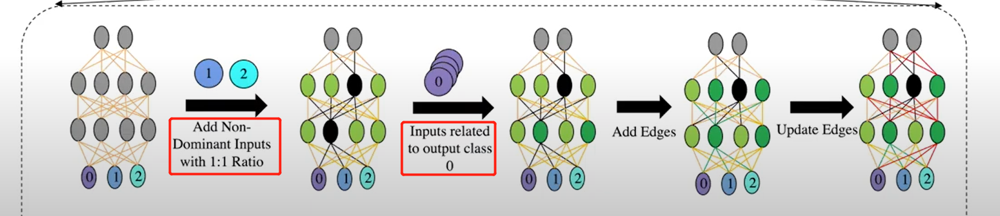

  - Strong Negative Edges (TI-SNE)

    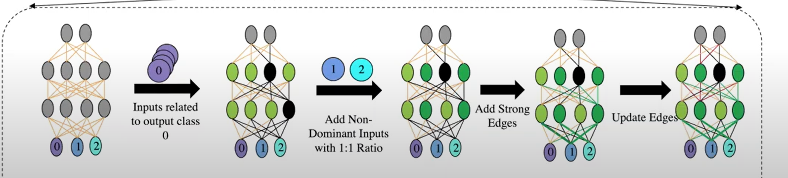

### 步骤3：关注点模块化 Concern Modularization (CM)

这一步作用是将多个非关注点及其相应的神经元和边，抽象成一个输出层的节点（如下图的非0节点）：

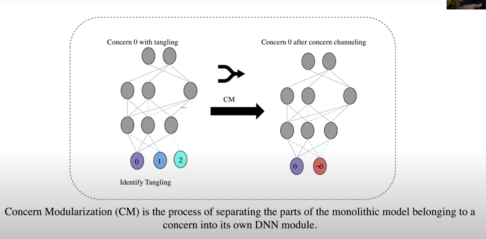

- Channeling (CM-C)：将最后一层输出到非关注点的边，通过取权重的平均值，都改向到一个”非“节点上

  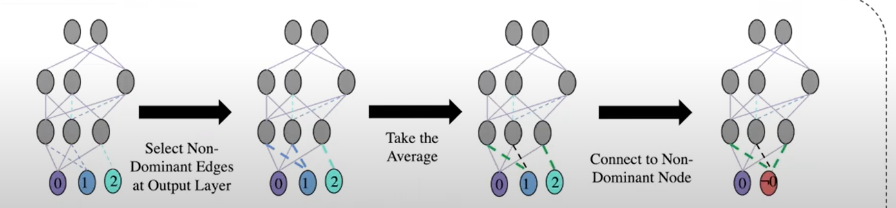

- Remove Irrelevant Edges (CM-RIE)：在Channeling之前，去掉倒数第二层仅对非关注点有贡献的边及其相关神经元

  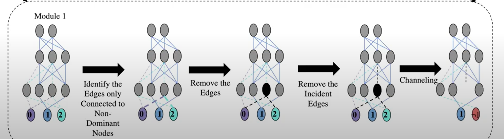

  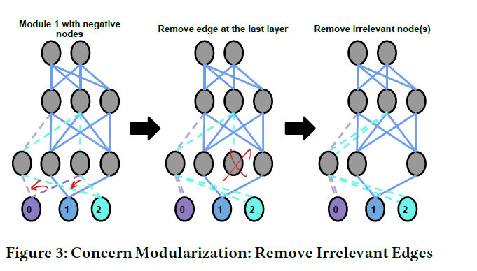

## 实验

### 实验设计

- 数据集：
  - MNIST
  - EMNSIT（手写英文字母）：只用A-J（10个字母）训练
  - FMNIST：衣服
  - KMNIST：日语字母
- 模型：
  - 4个数据集分别训练带1、2、3、4个隐藏层的全连接神经网络，每个隐藏层49个神经元
- 测试准则
  - 准确率：衡量DNN模型模块化后的准确率，对输入的样本用分解后的每个模块进行预测，将给出positive预测结果且置信度最高并的子模型预测结果作为预测类别（投票）。
  - Jaccard系数（JI）：衡量模块之间的相似度，将所有权重和偏置放在一个向量中，比较Jaccard系数。

### 实验结果

- 实验1：分解后的模块有效性如何？

  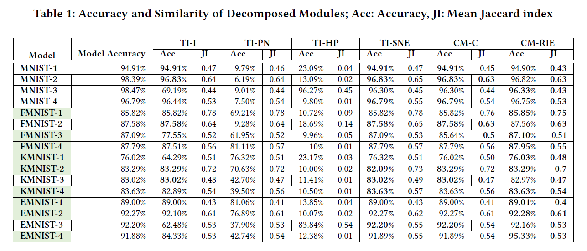

  - TI-HP方法：JI最低，但准确率同样很低
    - 因为先更新负类样本权重，再更新正类样本权重，负类样本权重被覆盖
  - TI-PN方法：多个模型上低准确率
    - 先更新正类样本权重，再更新负类样本权重，JI较高，因为负类样本权重重合较多
  - TI-SNE方法：准确率最高
  - CM-RIE相比CM-C降低了JI系数，且在准确率上表现较好。
  - 准确率不变或有提升的模型中：33.79%的边是失效的，说明这些模型与原模型并不是完全一样。
  - 调整了每层神经元的个数至70个之后，CM-RIE方法效果几乎一致。

- 实验2：模块化后的DNN支持**重用**吗？

  - 数据集内部重用

    - 从原模型模型构造两类别模型（共C(10,2)=45种情况)：用这两类数据重训练的相同结构的模型作为对比。结果显示与重训练的模型准确率差不多。

      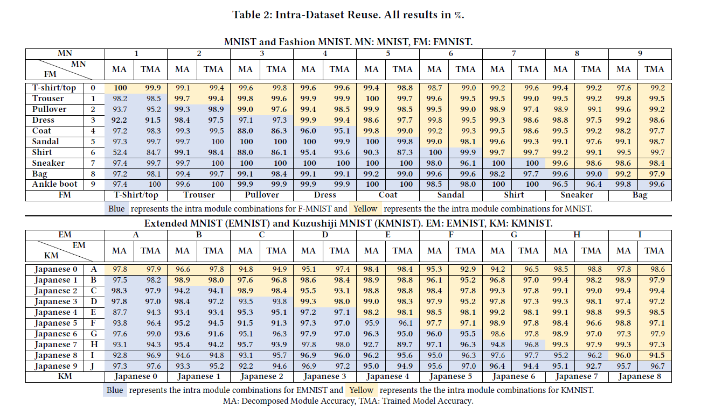

      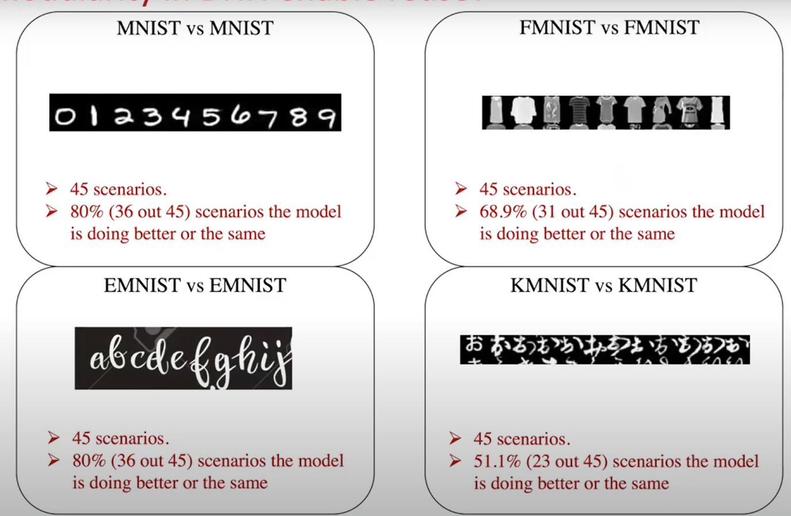

  - 数据集之间重用

    - 绝大多数模型有一定的精度下降

    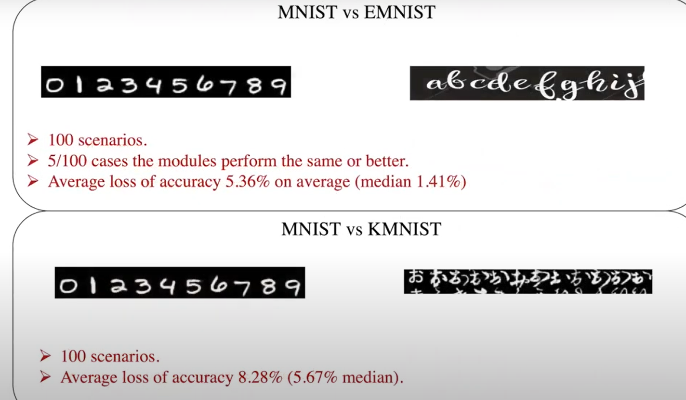

    

- 实验3：模块化后的DNN支持**替换**吗？

  - 同数据集模型替换

  - 不同数据集模型替换

    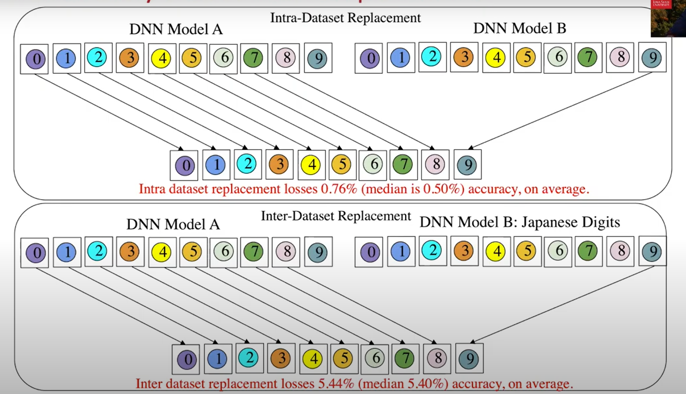

## 思考

- 应用场景设想很新颖。

- 文章笔误太多，算法解释得不清楚。

- 直接对模型权重进行操纵的做法很大胆，实验用的模型都是全联接的小型模型，怀疑在其他大型模型上的可行性。