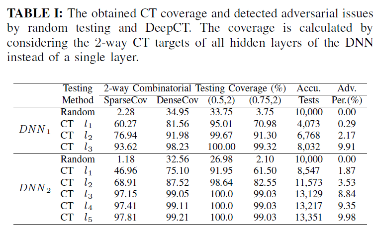

原文：DeepCT: Tomographic Combinatorial Testing for Deep Learning Systems （SANER'19 ERA Track Paper)  <!--more-->

代码：没找到

## 概括

提出了DNN系统的组合测试方法，根据目标要覆盖的神经元激活模式组合，从种子输入开始，通过search-based testing, 或guided random testing, 或symbolic constraint solving based testing方法生成满足条件的输入，同时最小化L∞距离。以生成覆盖更多的神经元激活模式组合的输入。

## 动机

- 为什么层析（tomographic）？
  - DNN学习到的特征随着层数增加越来越复杂、抽象
- 为什么组合（combinatorial）？
  - 每层神经元只与前后两层发生交互。逻辑单元之间可能存在逻辑(无形)的相互作用，其中当前层的神经元共同决定其下一层神经元的逻辑。我们想用CT捕捉和检查每一层神经元之间的这些无形的相互作用。

## 组合测试标准

### 神经元激活配置（Neuron-activation configuration)

对第$i$层的一组神经元$M=\{n_1,n_2,...,n_k\}$，激活配置为一个元组$c=(b_1,b_2,...,b_k)$，其中$b_i \in \{0,1\}$。若测试集$T$中存在样本$t$能使得激活模式等于$c$，则称$T$可以覆盖$c$。

$\Theta(t,L_i)$: 第$i$层神经元所有$t$-路覆盖组合

$\theta \in \Theta(t,L_i)$：是$t$个神经元的集合，拥有$2^t$种激活配置

$\Theta_{Full}(t,L_i,T) \subseteq \Theta(t,L_i)$：能被$T$完全覆盖的$t$-路覆盖组合

### $t$-路组合稀疏覆盖

$T$的组合稀疏覆盖=覆盖了所有神经元配置的组合数 / 所有组合数

例子：

$L_i$层中共有4个神经元${n1,n2,n3,n4}$，
2-路组合共有六种：$\{n1,n2\}，\{n1,n3\}，\{n1,n4\}，\{n2,n3\}，\{n2,n4\}，\{n3,n4\}$
每个2-路组合有四种神经元激活配置$(0，0)、(0，1)、(1，0)$和$(1，1)$
在6个双向组合中，T只覆盖了$\{n1，n2\}，\{n1，n4\}，\{n2，n3\}$和$\{n3，n4\}$的四种神经元激活配置(只有这四个组合出现了四种神经元激活配置)
则Li层的2-路组合稀疏覆盖率$= 4 / 6= 66.6\%$

由于$t$-路组合稀疏覆盖不能考虑每个神经元组合内的覆盖，接下来我们引入t-way组合稠密覆盖。

### $t$-路组合稠密覆盖

$T$的组合稀疏覆盖= 被覆盖了的激活配置数 / 所有组合的所有激活配置数目

例子：同上图

由于$L_i$中有六个神经元的双向组合，并且每个组合有四个神经元激活配置,总共有24种激活配置

测试集T可以覆盖20种配置，未覆盖的神经元激活配置为$\{n1，n3\}=(0，1)，\{n1，n3\}=(1，0)，\{n2，n4\}=(0，1)，\{n2，n4\}=(1，0)$,因此，T的双向组合密集覆盖率为83.3%。

### $(p,t)$完备性

达到$p$(百分比)覆盖的组合比例

例子：同上图

在神经元的双向组合中，$\{n1，n2\}，\{n1，n4\}，\{n2，n3\}，\{n3，n4\}$的覆盖双向构型比为100%，$\{n1，n3\}$和$\{n2，n4\}$的覆盖双向构型比为50%。则$L_i$的(0.5，2)-完备性为100%，$L_i$的(1，2)-完备性为66.6%。即达到100%覆盖的有4个,达到50%以上覆盖的有6个。

## DNN的鲁棒性测试

### $d$-局部鲁棒性

$$ \forall x':\parallel x'-x \parallel \leq d \Rightarrow C(x) = C(x')$$

约束：$L_{\infty}-norm$

### 算法

- 输入
  - DNN
  - $t$:测试粒度，每个组合内神经元个数
  - 组合测试标准
  - 初始种子集合
- 输出
  - 正确样本集合
  - 对抗样本集合
- 测试用例生成方法
  - 没有特殊规定，基于搜索、覆盖率引导的随机测试、符号分析/约束求解都可以
  - 本文实验：DNN使用ReLU激活函数，约束求解方法（Cplex solver）生成测试用例
    - 即将CT覆盖目标编码为目标的线性约束，使种子输入的$L_{\infty}$-范数扰动距离最小。

## 实验

- 数据集和模型
  - MNIST和两个预训练好的DNN模型DNN1和DNN2（结构和精度略）
- 从原测试集随机选择1000个样本作为初始种子，且这1000个都能被原DNN正确分类
- 随机测试（Random Testing)
  - 随机生成10000个测试用例（如何随机生成的？），然后检测健壮性问题
  - 实验结果：RT已经能够检测到DNN1上的194个样本和DNN2上的178个样本的健壮性问题，总共266个独特的问题，其中106个是DNN1和DNN2上共同的问题。
- DeepCT测试
  - 1000个样本中去掉266个随机测试已经发现问题的样本，剩余的734个样本中随机采样50个进一步分析$d$-局部鲁棒性（$d$设为0.15，使用2-路CT标准）
  - 实验结果：
    - 生成图片数量相当的情况下，DeepCT达到的覆盖率远超随机测试
    - 随着测试层数和生成的测试用例增加，覆盖率也逐渐增加

## 可控制参数/变量总结

- $t$：覆盖粒度
- $d$：鲁棒性约束
- $L_{\infty}$约束的参数
- 初始种子集合
- $p$：完备性指标

## 参考

[1] https://blog.csdn.net/qq_33935895/article/details/105454414