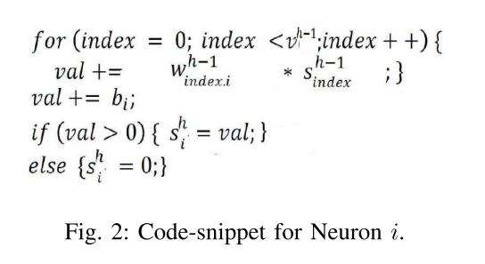
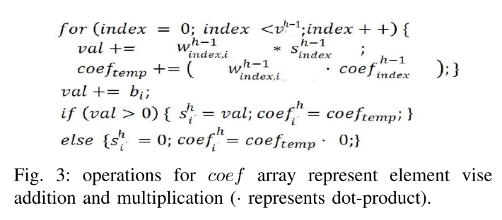
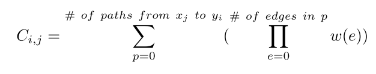
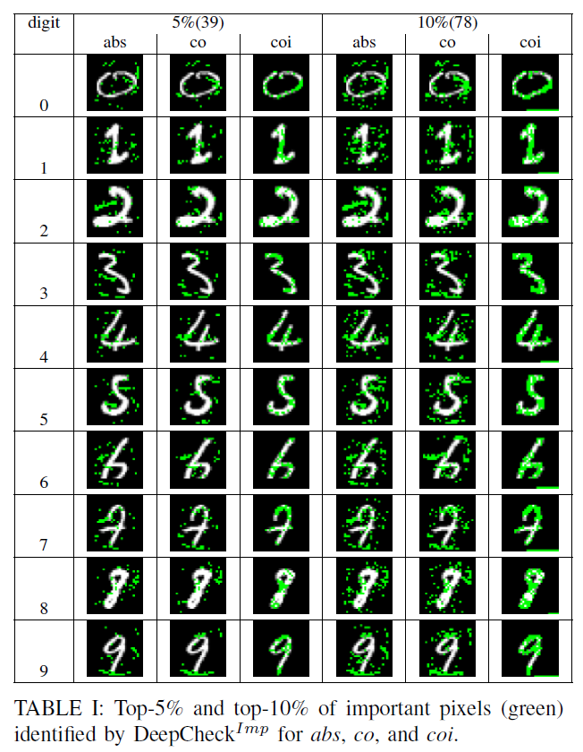
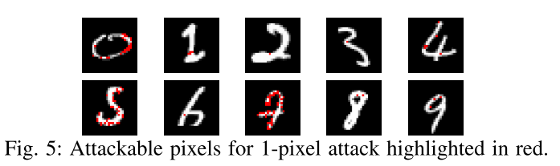
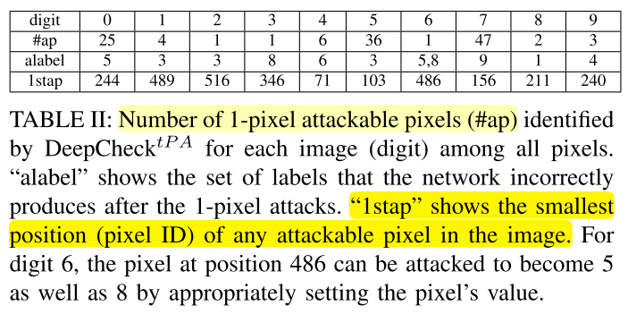
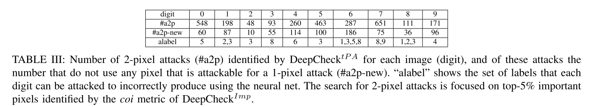
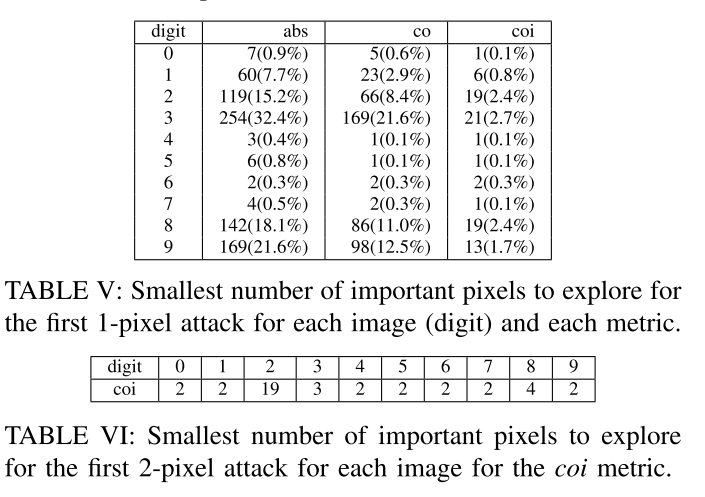

原文：Symbolic Execution for Deep Neural Networks （ISSRE'18)  <!--more-->

代码：没找到

## 概括

提出DNN上的符号执行测试方法。将DNN转换为程序（激活函数转换成if-else），利用相关性识别出重要像素。约束求解器求解激活模式相同但预测标签不同的输入（改变重要像素的值）。

## 动机

### 传统软件测试的符号执行

软件测试中的符号执行主要目标是: 在给定的探索尽可能多的、不同的程序路径(program path)。对于每一条程序路径，(1) 生成一个具体输入的集合(主要能力)；(2) 检查是否存在各种错误，包括断言违规、未捕获异常、安全漏洞和内存损坏。使用符号执行分析一个程序时，该程序会使用符号值作为输入，而非一般执行程序时使用的具体值。在达到目标代码时，分析器可以得到相应的路径约束，然后通过约束求解器来得到可以触发目标代码的具体值。

### 在DNN上使用符号执行的挑战

- DNN没有分支 
- DNN高度非线性，没有约束求解器 
- 扩展性差：DNN神经元数量庞大，远远超出了当前符号推理工具的能力。

我们的方法：

- 将ReLU激活函数看作if-else语句，这样DNN就有了分支

## 符号执行框架

翻译DNN：

- 将ReLU函数转换为分支语句，则一个神经元可以看做代码段：

  

## 识别重要像素

维护一个相关性数组$coef^h_{i,j}$：$h$层第$i$个神经元与输入中第$j$个像素的相关性

- 初始化：若$i=j$，$coef^0_{i,j}=1$，其他为0 

- 迭代计算coef：

  

- 最终输出单元的Coef计算结果为：

  

  从像素$x_j$到输出$y_i$的所有路径（输出非0）上所有权重的总和（依赖于给定输入集合的具体执行）

然后我们计算每个输入变量重要分数，使用三个指标:

- $co$: 相关性分数，即$C_{i,j}$
- $coi$：相关性分数乘以对应的输入变量：$C_{i,j} \times x_j$
- $abs$：相关性分数的绝对值$|C_{i,j}|$

## 确定攻击像素

构造约束求解问题：改变像素的值，使得新图片与原图**激活模式相同**，但**预测标签不同**。使用约束求解器Z3求解。

- 激活模式相同：($H$为神经网络中所有激活函数的个数，即每个神经元激活模式都保持不变)

  $ PC= \land _{h=1}^{H}(B^{h}+ \sum _{i=1}^{t}C_{i}^{h} \cdot X_{i} \gamma 0) $ , 其中$ \gamma \in \left\{ > , \leq\right\} $ 

- 预测标签不同：($l' \neq l$)

  $$ AC= \land _{j=1,j\neq l'}^{n}f_{j}(X)<f_{l^{ \prime }}(X) $$

- 约束：$ RA= \land _{1}^{t} lo  \leqslant X_i \leqslant hi $  ($lo$和$hi$是输入值标准化后的上下界)

- 最终约束求解器目标：$PC \land AC \land RA$

- 攻击
  - 1像素攻击
  - 2像素攻击：对前5%的重要像素的任意两两组合进行约束求解。

## 实验

### 实验配置

- 数据集和模型
  - MNIST
  - 模型结构：784×10×10×10×10
  - 训练集：60000张图片
  - 准确率：92%
- 选择训练集里的10张图片（0-9）作为原始图片种子 

### 实验1：重要像素识别效果

- Top 5% 和10%重要像素识别结果
  - 总的来说，符号执行的使用能够识别重要的像素，这有助于解释神经网络的分类决策。

### 实验2：用符号执行进行1或2像素攻击的效果

- 对1像素攻击：首先穷举每个像素（共784个）来确认其是否可攻击（改变像素值后激活模式不变，但预测标签改变），10张图片的可攻击像素如下：

- 1-像素攻击：10个数字可攻击像素的个数和最小可攻击像素的ID（即穷举搜索需要尝试的个数）

  

- 2-像素攻击：

  - 许多2像素攻击由一个可攻击1像素的像素组成。然而，一些新的攻击对不包括任何像素可攻击的像素被发现为1像素攻击。

  

### 实验3：比较识别出的重要像素和攻击使用的像素

- 表V显示了对于每幅图像，在发现1像素攻击之前，三个指标中的每一个都必须探索的重要像素的最小数量。对于所有指标和所有图像，需要检查的重要像素不超过前三分之一，以找到攻击像素。
- coi识别效果最好。
- 总的来说，利用本文重要像素识别算法，对于寻找1像素和2像素攻击具有重要作用。

## 可控制参数及变量总结

- 重要像素百分比（如5%、10%）
- 初始种子集合：10张图片
- 重要像素判断指标：$co,coi,abs$
- 攻击像素个数

## 思考

本文将DNN转换成程序从而获得执行路径的方法或许值得借鉴。

但开销过大，只能在小型数据集和模型上使用。