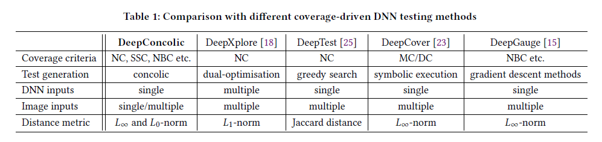
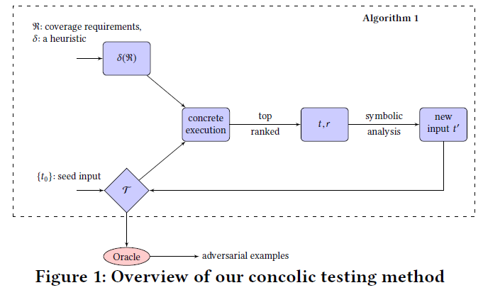
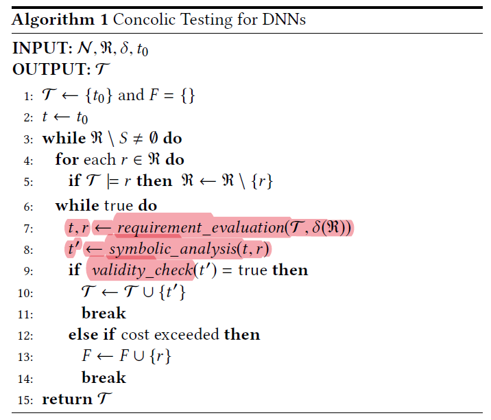
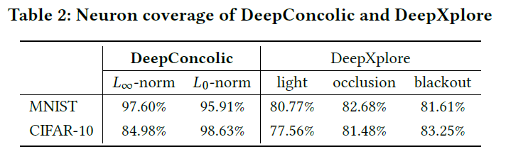
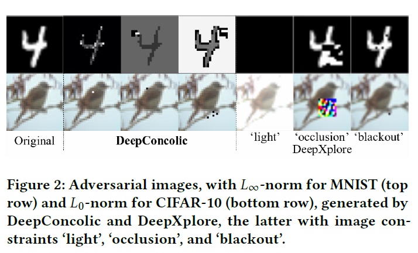
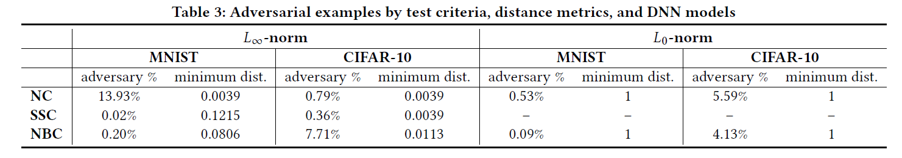
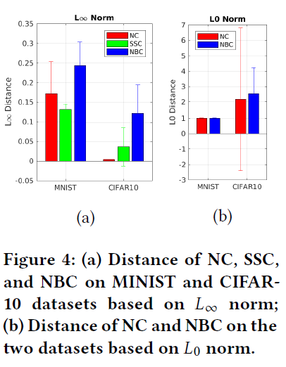
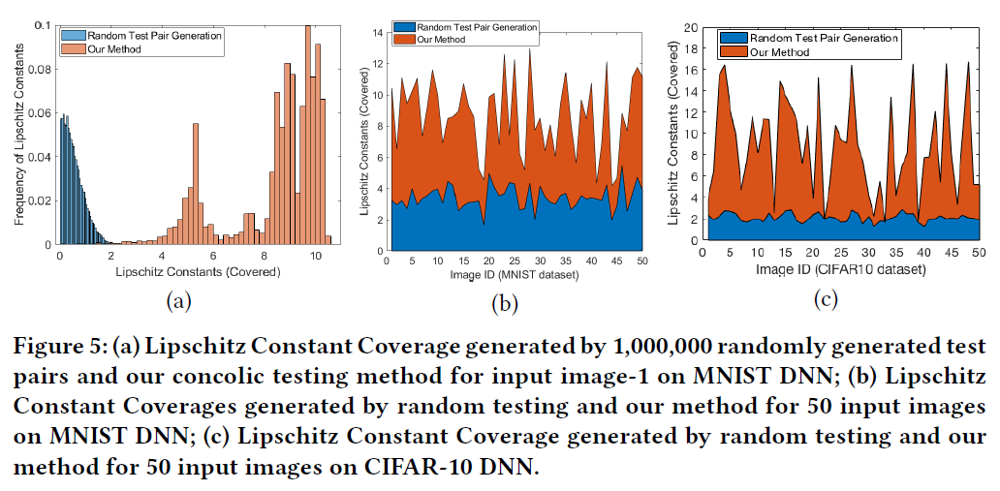

原文：Concolic Testing for Deep Neural Networks （ASE'18) <!--more-->

代码地址：https://github.com/TrustAI/DeepConcolic （利普希茨覆盖测试部分用MATLAB写的）

## 概括

- 提出了第一种DNN的Concolic测试方法。通过具体执行获得激活模式，通过反转神经元的值，优化得到变换后的输入（类似约束求解器）。使测试集达到高覆盖率。
- 提出利普希茨常数覆盖标准。

- 与其他方法比较：

（DeepTest中的Jaccard距离并不是用来约束图片距离的，只是比较激活神经元的差异）

## 形式化定义

### 激活模式

$ap[t]_{k,l} \in \{true,false\}$ 表示输入$t$的第$k$层第$l$个神经元是否被$ReLU$函数激活。

### 覆盖要求

略，公式较多但比较好理解，逻辑形式表达覆盖标准。

### 覆盖要求的可满足性

给定一组测试用例$T$和覆盖要求$r$  ，$T \vDash r$表示测试用例满足了覆盖要求。

### 覆盖要求的复杂度

检查$T \vDash r$需要能在多项式时间内完成。

### 覆盖率

给定一个覆盖要求的集合$R$,测试用例集$T$可满足要求的数量所占比例即覆盖率。

## 特定覆盖要求介绍

本节用上面的方法形式化定义了目前学术界已有的一些覆盖标准。

### 利普希茨连续条件（Lipschitz Continuity）

对一个神经网络$N$，若存在$c\geq0$，使得对输入样本集合$D_{L1}$中的任意两个样本$x_1$、$x_2$，满足：

$$\parallel v[x_1]_1-v[x_2]_1 \parallel \leq c \cdot \parallel x_1-x_2 \parallel$$

其中$v[x]_1$表示输入层神经元的激活向量（？），$c$为利普希茨常数。满足条件的最小的$c$称为最佳利普希茨常数$c_{best}$。

利普希茨覆盖：是一组覆盖要求的集合，要求体现了给定输入子空间中的任意两个输入$x_1$、$x_2$满足上述利普希茨连续条件的情况

### 神经元覆盖率（NC）

DeepXplore中定义的神经元覆盖率，形式化表示为一组覆盖标准：

$\{\exists x.ap[x]_{k,i}=true|2\leq k \leq K-1,1 \leq i \leq s_k\}$

即对每个神经元提出一个覆盖要求——存在输入x能将其激活。

### MC/DC覆盖率（SS coverage）

DeepCover提出，

### 神经元边缘覆盖率（NBC）

DeepGauge中提出，

## 本文方法

### 算法概览

- 输入
  - 一个DNN $N$
  -  一个输入样本$t_0$
  - 一组覆盖要求$R$
  - 启发式$\delta$：与选择的覆盖要求有关，使得第7行能尽可能找到一组容易满足的要求
- 输出：
  - 一组测试样本$T$，最初只包含$t_0$
- validity_check函数：检查$t'$是否有效

- 当$R$中所有要求被满足或不能满足$R$中的其他要求时算法停止

### 要求评估（requirement_evaluation函数，具体执行部分)

- 寻找一组$(t,r)$，使得$t$变换成$t'$后最有可能满足要求$r$。

- 定义$arg max_x a:e$ ：满足布尔表达式$e$的所有样本里，使得算数表达式$a$最大的$x$

- 启发式：略，得到使得覆盖要求表达式（即前面的四种覆盖率）值取到最大的样本
  - 利普希茨连续
  - NC
  - SSC
  - NBC

### 符号分析（symbolic_analysis函数）

根据$(t,r)$变换$t$生成$t'$，有三种方法：

#### 1、利用线性编程进行符号分析

将DNN实例$N(x)$映射到可以使用线性编程(LP)建模的激活模式$ap[x]$，并根据不同覆盖准则定义新的激活模式$ap'[x]$:

- NC：反转某神经元$n_{k,i}$的值，保持第$k$层之前的层的输出不变，因为该神经元只受之前层的影响。之后层的输出不用管。
- SSC：反转$n_{k+1,j}$和$n_{k,i}$
- NBC：目标使得神经元$n_{k,i}$的激活值超过其上界或低于其下界

LP模型将对$ap'[x]$进行编码并求解满足要求$r$的输入$t'$

#### 2、基于全局优化的符号分析

基于全局优化算法达到上述目标生成$t'$

#### 3、Lipschitz测试用例生成

本文提出了一种新颖的交替式罗盘搜索方案（略）

### 测试预言（约束）

给定实数$b$，如果测试用例$t' \in T$满足：

$$\parallel t-t' \parallel \leq b$$

则称$t'$为有效的。若$t$与$t'$的预测结果一致，则称DNN通过了测试预言。

## 实验

- 时间限制：12h
- 所有覆盖结果均运行10次以上取平均

### 实验1：与DeepXplore对比

- 数据集：MNIST、CIFAR-10

- 实验方法

  - 从随机采样的初始种子集合开始
  - DeepXplore要求多个模型差分测试：采用目标测试的DNN模型+DeepXplore论文里的2个模型
  - 比较二者达到的覆盖率

- 实验结果

  

  - DeepConcolic能达到比DeepXplore更高的覆盖率
  - 但DeepXplore更快，几秒内运行结束（没有说DeepConcolic的运行时间）
  - 生成的图像：(几乎完全反相也符合约束？)

  

### 实验2：比较NC, SCC和NBC

- 实验方法

  - NC：从一张初始种子开始
  - SCC和NBC：初始集合包含1000张图片，且仅测试一部分神经元（和NC差别很大）
  - 设置$L _\infty$的距离上界为0.3，$L_0$的距离上界为100个像素

- 实验结果

  

  

  - 使用全局优化进行符号分析的开销太高。因此，具有$L_0$范数的SSC结果被排除在外。(?右图没有蓝色条形)

  - 总体而言，DeepConcolic实现了高覆盖率，并使用健壮性检查检测到大量的对抗性示例。然而，NBC的覆盖范围是有限的

  - concolic测试可以发现距离极小的对抗样本：如1255≈0.0039（$L_{\infty}$范数），1像素（$L_0$范数）

  - 对抗样本的平均距离：(对于同一网络，当距离度量改变时，使用NC发现的对抗性示例的数量可能会有很大变化。在设计DNN的覆盖标准时，需要使用各种距离度量来检查它们。)

    

### 实验3：利普希茨常数检验结果

- 我们通过随机测试生成的方式产生了100万个测试对，但最大Lipschitz转换率只达到了3.23，并且大多数测试对都在[0.01，2]的范围内。另一方面，我们的Concolic方法可以覆盖[0.01，10.38]的Lipschitz范围，其中大多数情况位于[3.5，10]，而随机测试生成很难覆盖这一范围。
- 目标：覆盖较大Lipschitz常数范围。如对于自动驾驶汽车等安全关键应用，Lipschitz常数较大的DNN本质上表明它更容易受到对手的扰动。因此，可以覆盖较大Lipschitz常数的测试方法为训练的DNN提供了有用的鲁棒性指标。我们认为，对于DNNs的安全测试，Lipschitz常数覆盖的Concolic测试方法可以补充现有的方法来实现更好的覆盖。

## 可控制参数和变量总结

- 初始样本集合
- 覆盖标准：利普希茨常数覆盖、NC、NBC、SSC
- 变换约束条件（$L_\infty$、$L_0$及其参数）
- 测试的神经元（全部还是部分）

