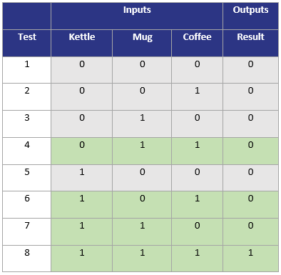
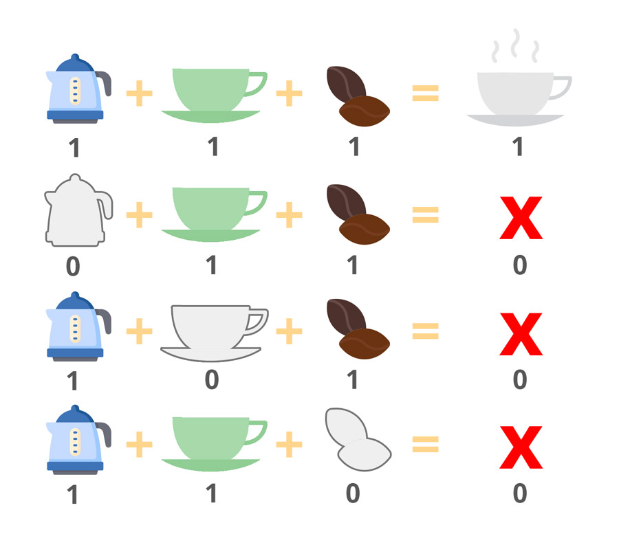
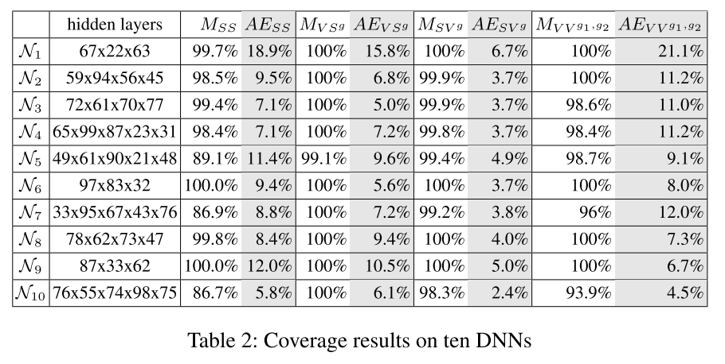
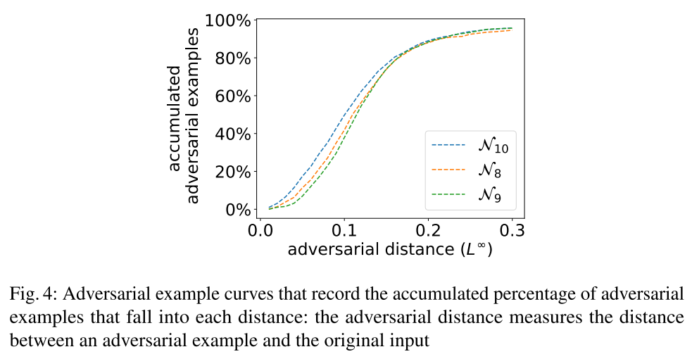
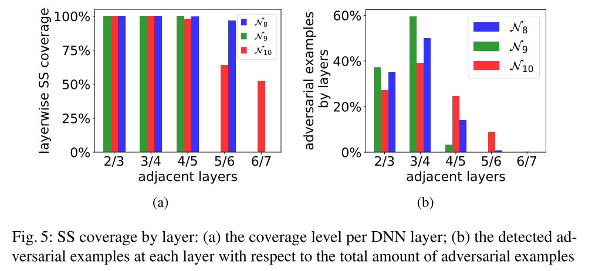
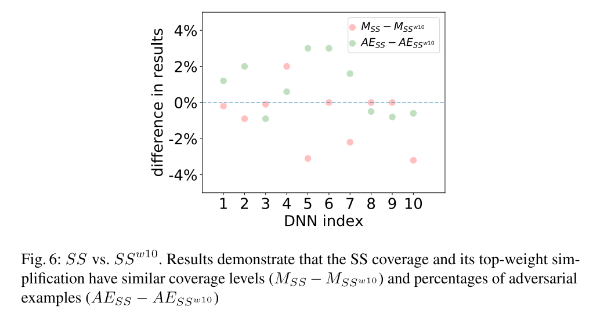
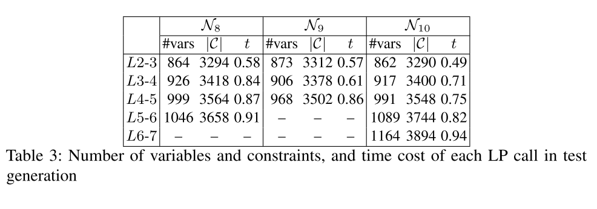
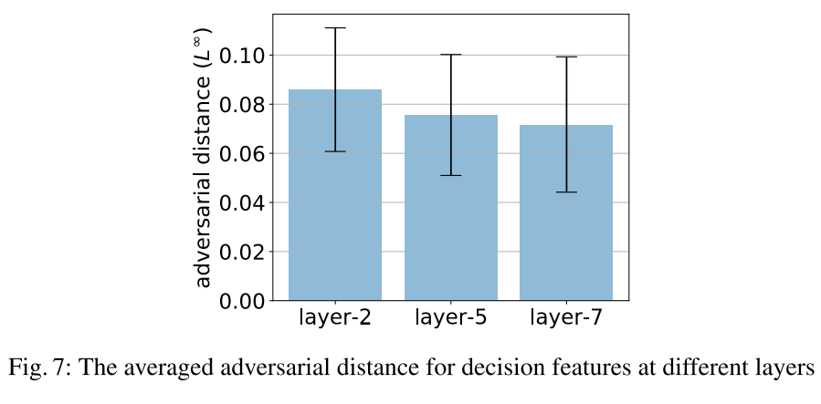
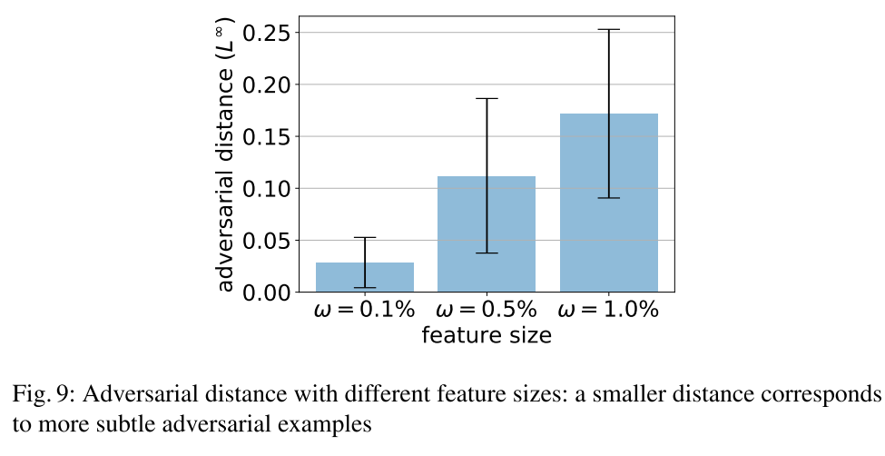

原文：Testing Deep Neural Networks （TECS’19）<!--more-->

（与DeepConcolic作者相同）

代码地址：https://github.com/TrustAI/DeepCover


## 概括

受MC/DC思想启发提出4种覆盖标准，使用线性规划模型进行约束求解（借助DeepConcolic的方法），生成满足“独立影响”条件且变化较小的测试用例。


## 传统MC/DC覆盖

MC/DC是DO-178B Level A认证标准中规定的，欧美民用航空器强制要求遵守该标准。MC/DC覆盖测试<font color='red'>在每个判定中的每个条件都曾独立影响判定的结果至少一次（独立影响意思是在其他条件不变的情况下，改变一个条件）</font>。

举个例子，制作咖啡需要同时满足壶、杯子和咖啡豆的条件：

```c
if( kettle && cup && coffee ) {
  return cup_of_coffee;
}
else {
  return false;
}
```

三个条件的取值共有8种情况：



但仅4种情况（Test 4、6、7、8）就可以达到100%MC/DC覆盖率，因为：

- Tests 4 & 8 ：Kettle可以独立影响结果
- Tests 6 & 8 ：Mug可以独立影响结果
- Tests 7 & 8：Coffe可以独立影响结果




## 方法

### DNN中的决策和条件

- $\Psi_k$: 一个集合，其中每个元素是神经网络第$k$层节点的一个子集合，表示一个**特征**
  - 核心思想：不仅要测试某个特征的存在，而且要测试简单特征对更复杂特性的影响。
- $t_k = |\Psi_k|$：特征个数
- $\psi_{k,l} (1 \leq l \leq t_k)$：第$l$个特征
- 每个特征代表一个**决策（decision）**，其**条件（conditions）**是前一层与其相连的特征
- 特征的使用将DNN中的基本构建单位从**单个节点**推广到**一组节点**。

- 特征对$(\psi_{k,i},\psi_{k+1,j})$：相邻层的一对特征
- 符号变化
  - $sc(\psi_{k,l},x_1,x_2)$：对$\psi_{k,l}$中的任意神经元 $n_{k,j}$，$sign(n_{k,j},x_1)\ne sign(n_{k,j},x_2)$
  - $nsc(\psi_{k,l},x_1,x_2)$：对$\psi_{k,l}$中的任意神经元 $n_{k,j}$，$sign(n_{k,j},x_1) = sign(n_{k,j},x_2)$
- 值变化
  - $vc(g,\psi_{k,l},x_1,x_2)$：$g(\psi_{k,l},x_1,x_2)=true$，$g$是一个值函数

### 覆盖方法

- Sign-Sign Coverage (SSC)

  - 对一个特征对$\alpha = (\psi_{k,i},\psi_{k+1,j})$，$\alpha$被两个测试用例$x_1$、$x_2$SS-覆盖，记为$SS(\alpha,x_1,x_1)$。其定义为：

    - $sc(\psi_{k,i},x_1,x_2)$ 且$nsc(P_k  \backslash \psi_{k,i},x_1,x_2)$，其中$P_k$为第$k$层所有节点的集合
    - $sc(\psi_{k+1,j},x_1,x_2)$

    <font color='red'>（即一个条件特征量$\psi_{k,i}$的符号变化独立影响下一层决策特征$\psi_{k+1,j}的$符号变化)</font>

- Value-Sign Coverage (VSC)

  - 对一个特征对$\alpha = (\psi_{k,i},\psi_{k+1,j})$，值函数$g$，$\alpha$被两个测试用例$x_1$、$x_2$VS-覆盖，记为$VS^g(\alpha,x_1,x_1)$。其定义为：
    - $vc(g,\psi_{k,i},x_1,x_2)$ 且$nsc(P_k ,x_1,x_2)$，其中$P_k$为第$k$层所有节点的集合
    - $sc(\psi_{k+1,j},x_1,x_2)$

- Sign-Value Coverage (SVC)

  - 对一个特征对$\alpha = (\psi_{k,i},\psi_{k+1,j})$，值函数$g$，$\alpha$被两个测试用例$x_1$、$x_2$SV-覆盖，记为$SV^g(\alpha,x_1,x_1)$。其定义为：

    - $sc(\psi_{k,i},x_1,x_2)$ 且$nsc(P_k  \backslash \psi_{k,i},x_1,x_2)$，其中$P_k$为第$k$层所有节点的集合
    - $vc(g,\psi_{k+1,j},x_1,x_2)$且$nsc(\psi_{k+1,j},x_1,x_2)$

    <font color='red'>(捕获符号更改情况的决策特征的重大更改)</font>

- Value-Value Coverage (VVC)

  - 对一个特征对$\alpha = (\psi_{k,i},\psi_{k+1,j})$，值函数$g_1$、$g_2$，$\alpha$被两个测试用例$x_1$、$x_2$SV-覆盖，记为$VV^{g_1,g_2}(\alpha,x_1,x_1)$。其定义为：

    - $vc(g_1,\psi_{k,i},x_1,x_2)$ 且$nsc(P_k ,x_1,x_2)$，其中$P_k$为第$k$层所有节点的集合
    - $vc(g_2,\psi_{k+1,j},x_1,x_2)$且$nsc(\psi_{k+1,j},x_1,x_2)$

    <font color='red'>(条件特征没有符号变化，但决策特征的值发生显著变化)</font>

### 覆盖率计算

令$F= \left\{ SS,VS^{g},SV^{g},VV^{g_{1},g_{2}} \right\}$，给定DNN$N$和覆盖方法$f \in F$，测试特征对集合$O$，测试集$T$的覆盖率：

$$ M_{f}(N,T)= \frac{| \left\{ \alpha \in O| \exists x_{1},x_{2} \in T:f( \alpha ,x_{1},x_{2}) \right\} |}{|O|} $$

即被覆盖的测试特征对所占比例。

### 与现有覆盖标准的强弱关系


### 自动测试用例生成

- 测试预言
  - $X$为一组被正确标记的测试用例，$x \in X$，若$x'$与$x$足够接近且预测标签一致，则称$x'$通过测试预言
- **通过线性编程（LP）生成测试用例**
  - 方法同DeepConcolic
- **通过启发式搜索生成测试用例**
  - 基于梯度下降搜索覆盖特定特征对的输入对


## 实验

### 数据集

- MNIST、CIFAR-10、ImageNet

### 可控制参数及变量

- LP调用时使用的约束：$\parallel x_2 - x_1 \parallel _ \infty$
- $SV^g$中：$ g= \frac{u_{k+1},j \left[ x_{2} \right] }{u_{k+1},j \left[ x_{1} \right] } \geqslant \sigma $ ，$\sigma = 2$
- $VV^{g_1,g_2}$中：$\sigma = 5$
- 每个特征包含神经元个数
  - 大小用参数$w$来调节：$\psi _{k,i} \leq w \cdot s_k$

### MNIST上的实验结果

- 一个特征即一个神经元
- 训练10个DNN（准确率>97%)



- DNN错误查找结果：
  - 测试用例生成算法有效地实现了对所有覆盖标准的高覆盖，
  - 覆盖方法被认为是有用的，因为找出了很多对抗样本。
- DNN安全分析：
  - 覆盖率$M_f$和对抗性实例百分比$AE_f$一起提供了评估DNN的定量统计数据。一般来说，给定一个测试集，一个具有高覆盖率水平$M_f$和低对抗百分比$AE_f$的DNN被认为是鲁棒的。
  - 下图展示了对抗样本的距离和累积对抗样本数的关系。一个更稳健的DNN将在小距离末端(接近0)有更低的形状，因为报告的敌对的例子相对于他们原始的正确输入是更远的。直觉上，这意味着需要付出更多的努力来愚弄一个稳健的DNN，使其从正确的分类变成错误的标签。



- 逐层的行为：
  - 当深入DNN时，神经元对的覆盖会变得更加困难。在这种情况下，为了提高覆盖性能，在生成测试对时需要使用较大的数据集。图5b给出了在不同层中发现的敌对示例的百分比(在所有敌对示例中)。有趣的是，大多数对抗性的例子似乎都是在测试中间层时发现的。



- 高权重的SSC：

  - 为了减少测试特征对的数量，仅选择带有较高权重的一些神经元作为特征，改变前后二者的区别不大，因此实际使用时可以采用这种方式减少开销。

  

- 调用LP的开销
  - 对于每个DNN，我们选择一组神经元对，其中每个决策神经元位于不同的层。然后，我们测量变量和约束的数量，以及在解决每个LP调用上花费的时间(以秒计算)。表3中的结果证实了部分激活模式的LP模型确实是轻量级的，并且在遍历一个DNN的更深层时，其复杂度以线性方式增加。



### CIFAR10上的实验结果

- 在不失一般性的前提下，卷积层节点的激活是通过激活一个子集的先例节点来计算的，每个节点都属于其层中的一个feature map。我们将算法1中的启发式测试用例生成应用于SS覆盖率，并在每个不同的层分别度量决策特征的覆盖率结果。
- 总的来说，SS覆盖率高于90%是通过相当一部分的敌对示例实现的。
- 一个有趣的观察是,<font color='red'>更深层的因果变化的特性能够检测小扰动的输入导致对抗的行为</font>,而这有可能为开发人员提供有用的反馈调试或优化神经网络参数。



### ImageNet上的实验结果

- VGG16+启发式测试用例生成算法

- 特征：一组神经元

  - 大小用参数$w$来调节：$\psi _{k,i} \leq w \cdot s_k$，$s_k$为该层神经元总数

- 我们测试了2000个随机特征对的SS覆盖情况，$w \in \{0.1\%、0.5\%、1.0\%\}$。

  - 覆盖结果：10.5%，13.6%和14.6%是对抗样本。对抗样本的平均距离和标准偏差：

    

  - 结果表明，特征对与输入扰动之间存在一定的关系。在生成的对抗样本中，<font color='red'>更细粒度的特征比粗糙的特征能够捕获更小的扰动。</font>

- <font color='red'>我们注意到访问边界激活值很可能要求对DNNs进行更大的更改。</font>我们设置功能大小使用$w$= 10%,获得的测试集中有22.7%的对抗样本。然而，这些敌对的例子的距离，平均L∞-norm距离3.49，标准差3.88，远远大于SS覆盖的距离