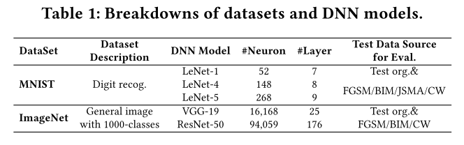
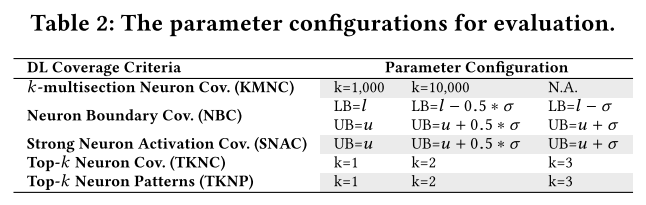
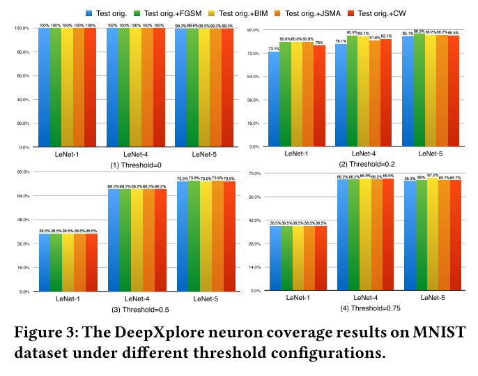

原文：DeepGauge: Multi-Granularity Testing Criteria for Deep Learning Systems （ASE'18）<!--more-->

介绍网址：https://deepgauge.github.io/

## 概括

提出基于深度神经网络的主功能区、边界区、层级三类覆盖率标准。

## 方法

$\phi (x,n)$：输入$x$在神经元$n$上的输出值

### 神经元级别的覆盖率

- **K-multisection Neuron Coverage (KMNC)**

  - 主功能区：设一个神经元$n$在训练集的下界为$low_n$，上界为$high_n$，主功能区为$[low_n,high_n]$

  - 将主功能区$[low_n,high_n]$均分为$k$等份，每份为$S_i^n$，则该神经元在测试集$T$上的覆盖率：

    $$ \frac{ \left\{ S_{i}^{n}| \exists x \in T: \phi (x,n) \in S_{i}^{n} \right\} )}{k} $$

  - 对所有神经元，KMNC定义为：（即所有神经元取平均）

    $ KMNCov(T,k)= \frac{ \sum _{n \in N}| \left\{ S_{i}^{n}| \exists x \in T: \phi (x,n) \in S_{i}^{n} \right\} |}{k \times |N|}$ 

- **Neuron Boundary Coverage（NBC）**

  - 边界区：$ (- \infty , low_n) \cup (high_n,+ \infty ) $ 

  - NBC定义为所有神经元边缘被覆盖的比例：

    $$ NBCov(T)= \frac{|UpperCornerNeuron|+|LowerCornerNeuron| }{2 \times |N|}$$

-  **Strong Neuron Activation Coverage (SNAC)**

  - 这些极度活跃的神经元可能在神经网络中传递有用的学习模式

  - SNAC只计算上边界覆盖率：

    $$ SNACov(T)= \frac{|UpperCornerNeuron|}{|N|} $$

### 层级别的覆盖率

- **Top-k Neuron Coverage (TKNC)**

  - 表示所有神经元中有多少曾经做过top-k（存在某个$x$使得其激活值在该层属于top-k）

    $ TKNCov(T,k)= \frac{|U_{x \in T}(U_{1 \leqslant i \leqslant 1}top_{k}(x,i))|}{|N|} $ 

- **Top-k Neuron Patterns**

  - 给定一个测试输入$x$，每一层的top-k神经元序列也形成一个模式:

    $$ TKNPat(T,k)=| \left\{ (top_{k}(x,1), \ldots ,top_{k}(x,l))|x \in T \right\} | $$

## 实验

### 实验设置

- 数据集和模型

- 对抗样本生成算法

  - FGSM、BIM、JSMA、CW

- 实验步骤

  - 对于MNIST：

    - 对于每个模型，生成10000张对抗样本和原10000张测试集图片混合在一起

    - 参数设置

      - $\sigma$:方差

      

    - 总共：3 (models)×5 (datasets)×14 (criterion settings) = 210 evaluation configurations

  - 对于ImageNet：

    - 随机选择5000张测试图片
    - 总共：2 (models)×4 (datasets)×14 (criterion settings) = 112 experimental configurations
      - （JSMA因为开销问题无法运行，dataset少一个）

### 实验结果

- 覆盖率的增加表明对抗样本测试数据总体上探索了新的DNNs的内部状态，其中一些未被原始测试覆盖。
- 主功能区和边界区均可能出错
- 覆盖率提升意味着错误检测能力提升
- 测试数据更多覆盖主功能区域
- 低边界区比高边界区更难覆盖

### 与神经元覆盖率（NC）比较

- NC难以捕捉对抗样本和原测试集样本的区别
- NC使用**相同的阈值**作为所有神经元的激活评价。但是，我们发现不同神经元的输出统计分布差异很大。给定一个用于分析的测试套件，一些神经元的输出可能表现出相当小的方差，但平均值很大，而另一些神经元可能表现出很大的方差，但平均值很低。
  因此，对所有神经元使用相同的阈值而不考虑神经元功能分布的差异会大大降低精度。例如，给定一个具有非常小的平均值和标准偏差的神经元，即使用户指定的阈值稍微大一点，通常也会确定该神经元不能被覆盖。
- NC对神经元取值进行了**标准化（归约到[0,1])**，所以相同的激活值在不同数据集代表了不同的意义（因为每个数据集的max和min不同）。

## 可控制变量及参数

- KMNC和TKNC的$k$
- NBC和SNAC可选增加参数$\sigma$(在分析过程中神经元输出的标准方差)