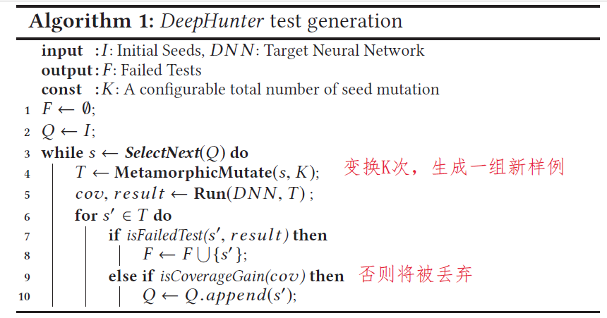
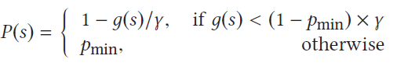
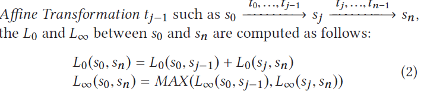
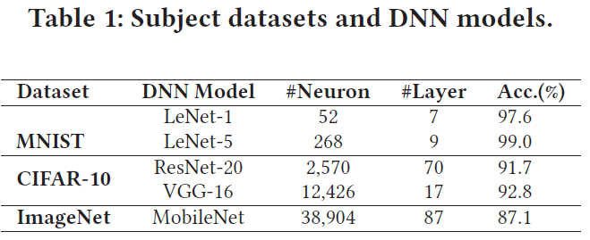
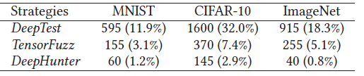
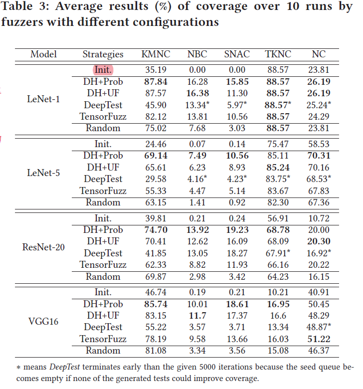
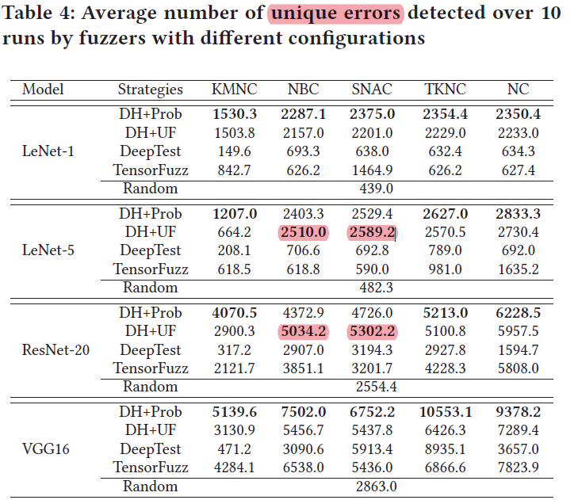
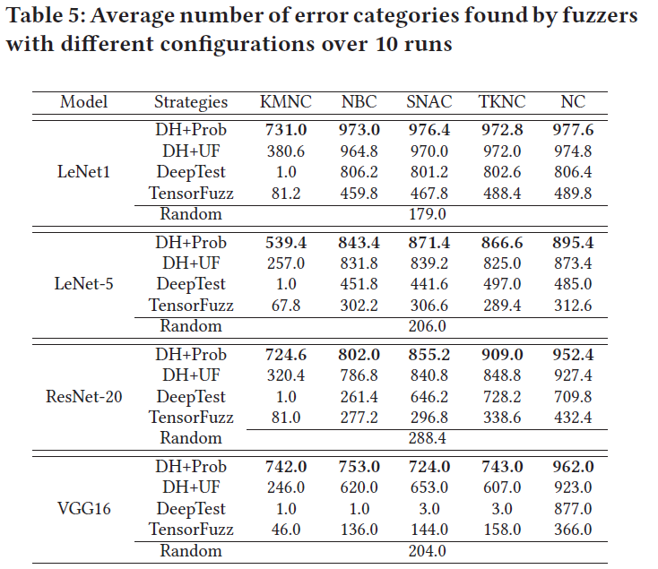
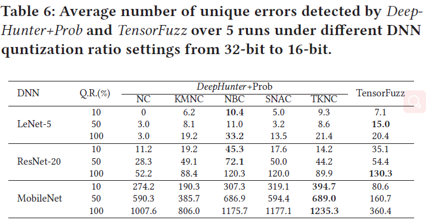

原文：DeepHunter: A Coverage-Guided Fuzz Testing Framework for Deep Neural Networks （ISSTA'19)

Coverage-guided Fuzzing for Feedforward Neural Networks (ASE'19)  <!--more-->

代码地址：https://bitbucket.org/xiaofeixie/deephunter/src/master/

## 算法

- 输入和可控变量：

  - 初始种子集合
  - 种子选择策略：
    - ①随机
    - ②根据新鲜程度选择
    - ③平衡新鲜和多样
      - 带有参数$\gamma$、$p_{min}$
  - 蜕变变换方法
    - 8种图像变换方法
      - 4种像素级别变换（像素值改变）：反相、亮度、模糊、噪声
      - 4种仿射变换（移动像素位置）：平移、缩放、裁剪、旋转
    - 约束策略中的$\alpha$、$\beta$参数
  - K：常数，变换次数
  - 覆盖率标准：5种（NC、KMNC、NBC、SNAC、TKNC）标准及其附带参数

- 输出：1、能最大化覆盖率的预测正确的样例 2、预测错误的样例

  

  ### 保持蜕变变换语义不变的策略

  - 8种图像变换方法
    - 4种像素级别变换（像素值改变）：反相、亮度、模糊、噪声
    - 4种仿射变换（移动像素位置）：平移、缩放、裁剪、旋转

  - 假设一次变换语义不变（参数合适的情况下）。

  - 策略：只允许一次仿射变换，像素变换可以使用多次，但要进行约束

    - 约束条件：像素变换应满足f(s,s')的条件，$L_0$表示发生变化的像素数目的最大值，$L_\infty$表示像素值变化的最大值。即：要么发生变化的像素数不多，要么变化的像素数多，但像素值变化都不大。平衡二者

      

  - reference image：一张图像在经过一系列变换后（最多一次仿射变换），计算f(s,s')。如果没有仿射变换的话，参考图像为原图；否则参考图像为中间经过一次仿射变换后的图像。

    - 如果有仿射变换，则$L_0$、$L_\infty$计算方法如下

      

  - 种子选择策略（三种）
    - 传统程序和TensorFuzz、DeepTest：用栈，选最新生成的种子

    - uniform：随机选一个种子

    - 新策略Probability：平衡新鲜性和多样性，种子s被选择的概率：

      

## 实验

### 数据集和DNN模型

### 共同参数设置

- NC阈值：0.75（与DeepXplore相同）

- KMNC的K=1000

- SNAC、NBC、TKNC与DeepGauge相同设置

- TRY_NUM=50

- $\gamma=20$，$p_{min}=0.5$ 
- $K=20$

### RQ1（蜕变变换）：从人类角度看，不同的变换及约束策略对生成和原图片相同语义的新图效果如何？

- 实验设计
  - 比较三种变换及约束策略：（仅约束策略还是连带变换策略？没说清楚）

    - DeepHunter：用f(s,s')限制，设置$\alpha=0.02，\beta=0.2$

    - TensorFuzz： 用 $L_\infty=0.4$限制

    - DeepTest： 用保守的参数限制(原文的MSE限制仅限回归任务，所以没用)

  - 每个数据集随机选择30个种子输入生成5000张图片，3个数据集\*3种生成方法\*生成5000张图片=共45000张图片

  - 9个测试者每人看一组图片：如果生成的图片与原图分类不同、或是没有语义则被标记为invalid。

- 实验结果

  

  - 对三种策略：CIFAR-10数据集的无效率普遍高于其他两个数据集
    - 原因：CIFAR-10分辨率较低，即使是DNN能识别的有效输入，对于人类常难以识别
  - 即使DeepTest的参数设置很保守，但是仍生成了很多无效输入；TensorFuzz经过L∞限制后无效输入少了很多
  - 结论：DeepHunter的蜕变变换策略有效减少了生成无效图片的数量

### RQ2（覆盖率）：CGF是否在DNN测试领域仍能有效提升覆盖率？不同覆盖标准下，不同的seed生成策略对提升覆盖率效果如何？

- RQ2&3 实验设计

  - 比较5种seed选取策略
    - Random testing (RT)without coverage guidance. 作为baseline，随机测试，无覆盖率作为向导
    - DeepHunter+Uniform (DH+UF) ：使用不同的覆盖率标准作为向导，随机选择种子顺序
    - DeepHunter+Probability (DH+Prob)：使用不同的覆盖率标准作为向导，用概率策略选择种子顺序
    - DeepTest seed selection strategy with coverage guidance：选最新的；如果一个种子生成的所有新样例都不能提升覆盖率，则该种子被移出队列。队列可能变空。
    - TensorFuzz seed selection strategy with coverage guidance：随机选一个种子和队列最后的5个种子，再从中随机选一个
  - 21个fuzzers：5 个覆盖准则 × 4 个seed选择策略 + 1 RT with no coverage guidance，使用的模型为MNIST和CIFAR-10的四个模型；每个fuzzer运行10遍取平均

  - 初始种子1000个：被所有模型都正确分类的测试数据
  - 每个fuzzer迭代次数相同（5000次），使用的蜕变变换策略相同（是什么？）

-  实验结果

  

- 结论

  - 尽管基本结构与传统程序很不同，CGF方法与随机测试相比较还是能有效最大化DNN程序的覆盖率

  - 与传统软件的fuzzer优先选择最新生成的用例作为种子不同，DNN testing中种子选择的优先策略（多样性）也很重要

  - 不同覆盖率标准提升的难易程度不同，KMNC, TKNC, 和 NC提升较容易。NBC and SNAC关注corner cases，本身初始seed覆盖率就极低，提升较难

### RQ3（错误检测）：现有的覆盖标准在引导错误检测的效果上有何不同？使用不同seed选取标准检测错误的效果有何不同？不同seed选取标准检测出的错误行为有何不同？

- 实验结果
  - 检测错误数量

    

    - DH+Prob和DH+UF检测错误数目多于另外三种策略，且模型较小时二者类似，模型较大时DF+Prob更优
    - KMNC在检测错误数目上少于其他4个覆盖率标准，因为cover更简单；但DH+Prob的表现还是优于其他策略
    - 在最后的seed queue中，易于cover的覆盖率标准剩余的seed更多

  - 检测出的错误的多样性

    

    - 定义从同一个seed变换产生的错误属于同一类别，共1000类
    - DH+Prob和DH+UF能检测出更多类的错误，DeepTest和TensorFuzz检测出的错误甚至有的比RT还少，因为这二者都倾向于选择最新的seed
    - RT：过于随机，难以发现corner cases
    - 选最新的seed：能发现Corner cases，但类别过于单一

### RQ4（平台迁移）：DeepHunter是否适用于平台迁移过程中DNN量化引入的具体缺陷检测? 

- 实验设计
  - 每个数据集选择一个模型，原模型都是32bit

  - 3种量化方式

    - 随机选10%的权重缩减：32比特->16比特

    - 随机选50%的权重缩减：32比特->16比特

    - 所有权重缩减：32比特->16比特

  - 对前两种量化方式（10%和50%的量化模型）：sample10次得到10个模型，每个模型运行5遍取均值

  - 为每个原始模型分配10小时生成图片，重复每种配置5次并平均结果

- 实验结果

  

  - corner相关的覆盖率标准更易发现量化错误
  - DNN模型越大，发现的错误越多
  - QR率越大，错误越多