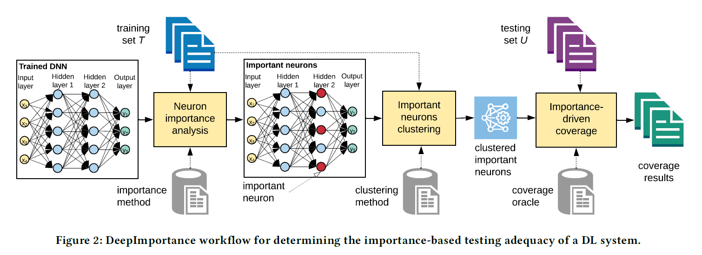
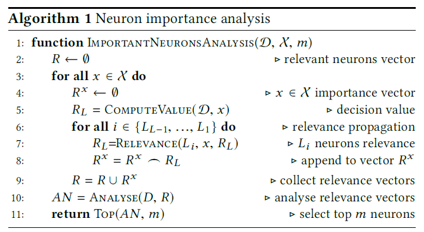
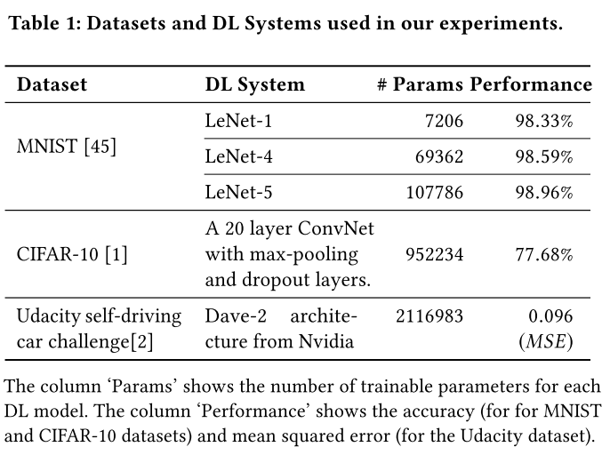
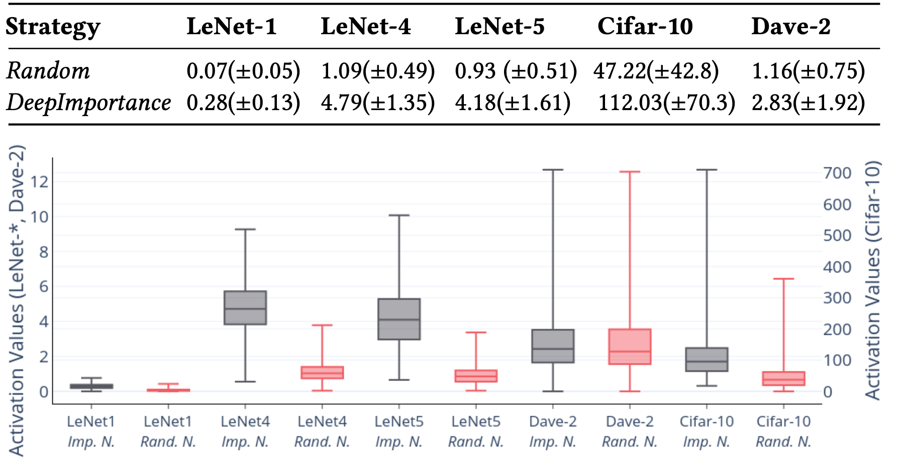
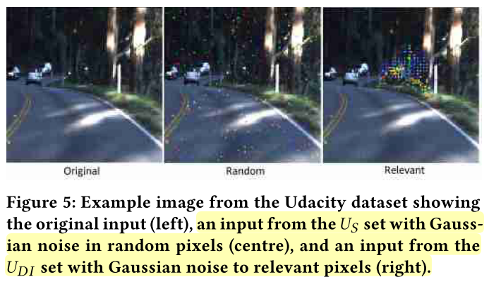
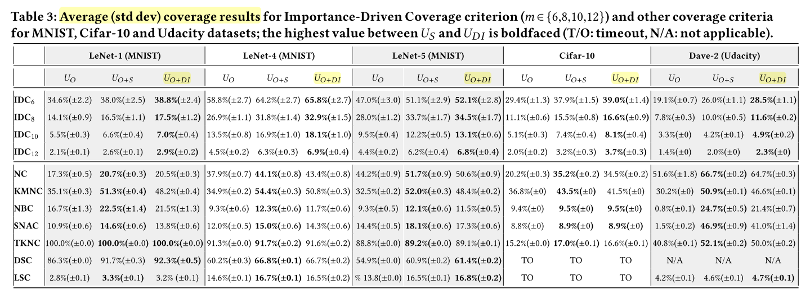
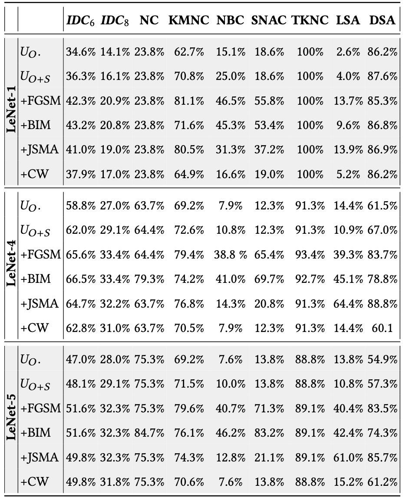
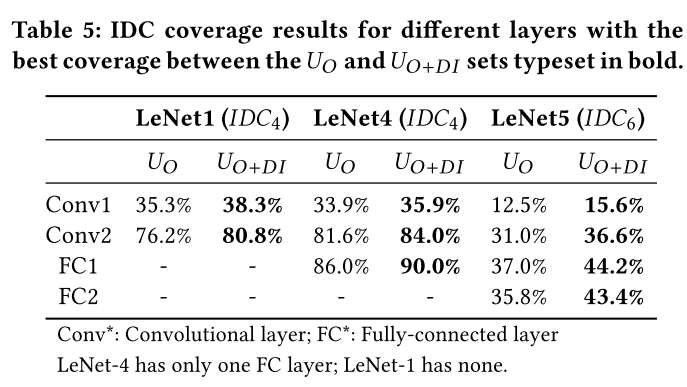

原文：Importance-Driven Deep Learning System Testing （ICSE'20)  <!--more-->

代码地址：https://github.com/DeepImportance/deepimportance_code_release

## 概述

提出了一种重要性驱动的覆盖标准，首先从训练集和预训练后的DNN模型中分析出重要神经元，然后将重要神经元的激活值聚类，计算测试集对重要神经元激活值簇的组合的覆盖比例，用于评价测试集的语义多样性。

## 动机

作者认为前人提出的覆盖标准（如DeepXplore和DeepGauge）：

- 这些标准只是神经元(或神经元区域)的集合，它们的激活值符合一定的条件。通过只关注这些受约束的神经元属性而忽略整体DL系统行为，测试集和决策之间的因果关系是无信息性的。
  - 一个神经元可能有助于增强对其他类的信心，而不是正确的类，这是无法区分的。
- 这些标准的实例化依赖于用户自定义的条件(所选择神经元的区域、取值上限)，这些条件可能不能充分地表示DL系统的实际行为。
- 这些标准不能有效提供单个测试输入的贡献。

## 方法

### Overview

步骤：

1、分析重要神经元

2、重要神经元激活值聚类

3、评价测试集的重要神经元覆盖率

### 重要神经元分析

- 逐层相关性传播算法（layer-wise relevance propagation）：
  - 全连接层中：每个神经元的相关性由下一层所有神经元的相关性计算得出：（分母为什么是$\sum i$ ??)

    $$ R_{ij}= \sum _{k} \frac{ \phi (x,n_{ij})w_{ijk}}{ \sum _{i} \phi (x,n_{ij})w_{ijk}+ \epsilon }R_{i+1,k} $$

    - 相关性与激活值成正比：激活值越高的神经元相关性贡献越大
    - 相关性与连接权重$w_{ijk}$成正比：通过更重要的连接，会产生更多的相关性

- 重要性计算算法

  

  - 第5行：通过前向传播获得最后一层输出值（softmax之前的值）
  - 6-8行：反向传播计算相关性
  - 第10行：分析函数分析所有输入的所有神经元的相关性得分，并根据优先级标准(例如，累积相关性，标准化相关性)对它们进行优先级排序（实验中我们使用累积相关性）
  - 第11行：返回最重要的m个神经元

- 相关性分析

  - 使用相关性来识别最重要的神经元是我们的方法的一个关键成分。基于最近DL系统可解释性的研究，其目标是识别负责预测的输入部分，深度重要性的目标是识别最具影响力的神经元;这些是高风险的神经元，应该进行彻底的测试。尽管超出了这项工作的范围，我们也强调**其他可解释性驱动技术**可以用于鉴定最重要的神经元
  - 与敏感性分析有很大区别：敏感性分析关注的是什么使**已标记**的样本(例如，一只狗)更多或更少地被归类为**目标标签**，而相关性分析研究的是什么使样本被归类为该标签。敏感度分数并不能真正解释为什么样本以某种方式被预测，而是解释输出在输入空间的哪个方向最敏感（输入空间而不是神经元）。相反，相关性得分表明哪些神经元/输入对分类是关键的。

### 重要神经元聚类

- 动机
  - 由于每个神经元负责感知输入区域内的特定特征，我们认为，对于具有类似特征的输入，那些重要神经元的激活值集中在它们的值域中的特定区域。非正式地说，这些区域形成一种模式，捕获DL系统中最具影响力的神经元的活动。
  - 与DeepGauge中的KMNC相比较，我们的方法生成的簇对应每个神经元不同的**语义特征**。
- 算法
  - $k$-means聚类：我们将每个重要神经元的激活值划分为组(簇)，使同一组内的激活值与同一组内的其他激活值更相似，而与其他组内的激活值不相似。
  - 如何确定$k$值？
    - 我们使用Silhouette index自动识别一种神经元特异性的最优策略，用于聚类每个重要神经元的激活值。（略）

### 基于重要性的覆盖率（IDC）

评价测试集对于重要神经元的激活值簇的组合的覆盖情况。

重要神经元激活值簇的组合定义为：

$$ INCC= \prod _{n \in D_{m}} \left\{ CENTROID( \Phi _{n}^{i})|\forall 1 \leqslant i \leqslant | \Phi _{n}| \right\} $$

IDC定义为：(即有多少组组合被覆盖)

$IDC(Y)= \frac{| \left\{ INCC(j)|\exists y \in Y:\forall V_{n}^{i} \in INCC(j) \bullet \min d( \phi (y,n),V_{n}^{i} \right\} |}{|INCC|}$

## 实验

### 数据集和模型

### 参数设置

- 神经元覆盖率NC：阈值为0.75
- TKNC：$k=3$
- KMNC：$k=1000$
- NBC、SNAC：训练集激活值的最值为上下界
- DSC、LSC：上界为2、2000，bucket数为1000
- 选择重要性神经元的层：**倒数第二层**
- $m \in \{6,8,10,12\}$
- 最大运行时间：3h
- 对抗样本生成方法：FGSM、BIM、JSMA、C&W

### RQ1(重要性):神经元重要性分析能识别出最重要的神经元吗?

- 实验方法：使用[11]中可解释性工作的方法识别出前10%的重要像素，扰动这些像素的值（超过0.5则设为0，不足0.5设为1），测量随机选取的神经元和DeepImportance选取的重要神经元的值的改动情况，如下表所示。
- 实验结果：DeepImportance选取出的重要神经元变动幅度更大，说明这些神经元对给定输入的相关像素的变化更敏感。

### RQ2(多样性):DeepImportance能有助于选择多样化的测试集吗?

- 实验方法：

  - $U_{DI}$: 在所有图片前2%重要像素（识别方法同上）上增加高斯白噪声扰动（MNIST 15个像素，CIFAR-10 20个像素，driving 200个像素）

  - $U_S$:和$U_{DI}$一样，但像素位置是随机选的

    

- 实验结果

  

  - 对于IDC标准：$U_{O+DI}$在所有实验配置上覆盖率最高。表明IDC对决策任务中重要的输入特性更为敏感，而不是随机选择的特性。
  - 随着$m$增加，IDC覆盖率逐渐降低，

### RQ3(有效性):DeepImportance在识别DL系统中的错误行为时的效果?

- 生成对抗样本
  - FGSM、BIM、JSMA、C&W和RQ1中的白噪音数据集（$U_S$:方差为0.3,准确率97.4%）

- 实验结果：
  - 与原始测试集$U_O$相比，所有DL系统的增强测试集的IDC覆盖率结果都有相当大的增长。
  - 与高斯类噪声输入$U_{O+S}$相比，在含有对抗样本的测试集中，这种增长更为显著。
  - IDC对敌对的输入很敏感，并且在输入与之前遇到的输入在语义上不同的测试集中能够有效地检测出错误行为。

### RQ4(相关性):DeepImportance与现有覆盖率标准的相关性?

- 如上图。IDC显示了与DL系统其他覆盖标准相似的行为;因此，二者之间存在正相关关系。

### RQ5(层灵敏度):特定神经元层的选择如何影响DeepImportance的行为?

- 我们观察到，当分析在较深的层而不是浅层执行时，IDC值会增加
- IDC对具有不同语义输入的测试集更敏感($U_{O+DI}$)
- 目标层的选择会影响IDC的结果。由于倒数第二层负责理解语义上重要的高级特性，我们认为它是使用IDC评估测试集充分性的合适选择。

## 可控制参数/变量

- $m$：选择的重要神经元个数，决定了测试的粒度，$m$越大组合数爆炸式增长
- 选择重要性神经元的层

## 思考

这篇文章所采用的重要性神经元识别方法非原创（来自《On Pixel-Wise Explanations for Non-Linear Classifier Decisions by Layer-Wise Relevance Propagation》）；覆盖率计算方法也很简单（组合测试）。亮点在于将DNN测试覆盖标准与语义可解释性相结合，这可能是未来的一个趋势。