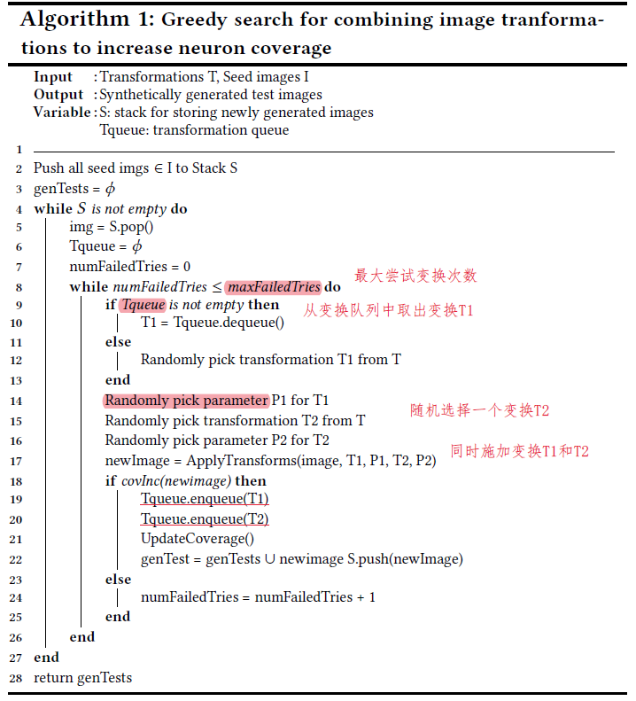
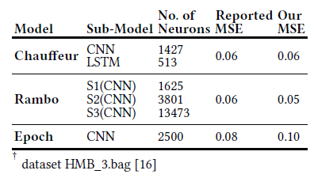
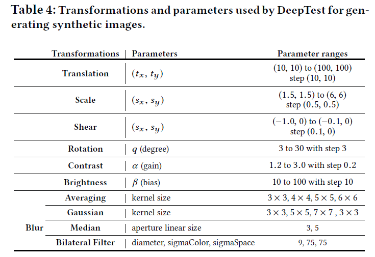
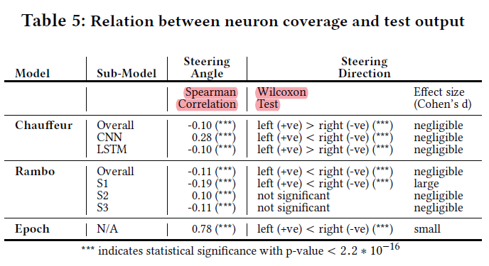
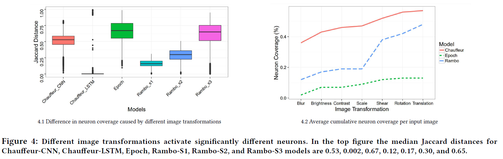
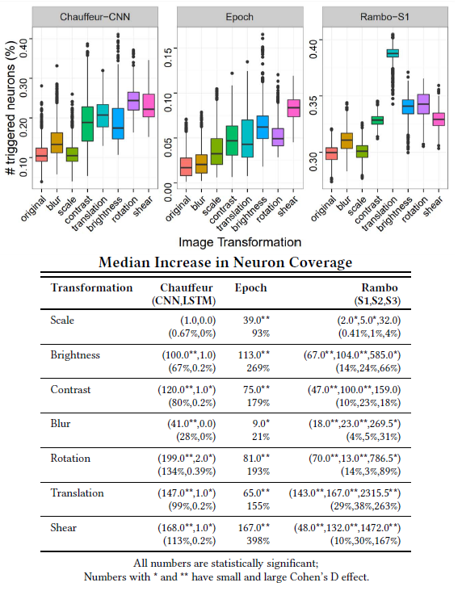
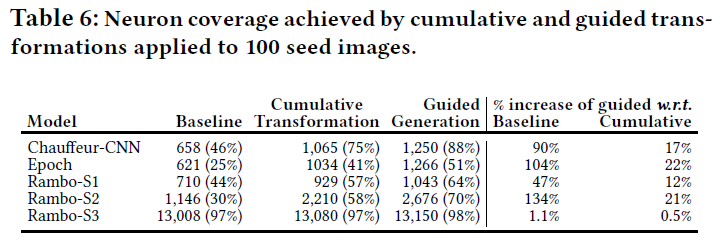
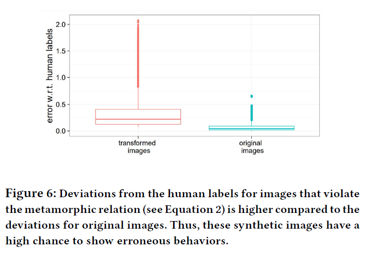
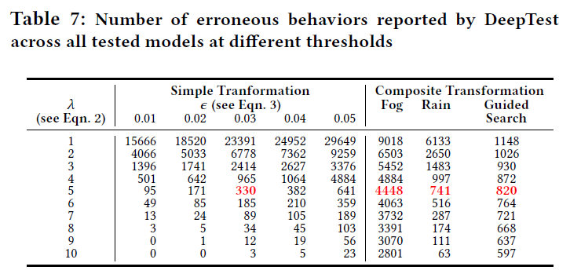
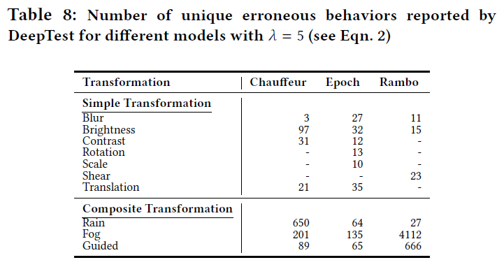

原文：DeepTest: Automated Testing of Deep-Neural-Network-driven Autonomous Cars  (ICSE’18)  <!--more-->

代码地址：https://github.com/ARiSE-Lab/deepTest

## 算法

- 神经元覆盖率计算方式：卷积层与DeepXplore有所不同，输出特征图的平均值与激活阈值做比较

- 9种图像变换方式：
  - 线性变换：
    - 亮度：所有像素值加/减一个常数
    - 对比度：所有像素值乘以一个常数
  - 仿射变换：平移、缩放、水平修剪、旋转 （模拟摄像头的移动）
  - 卷积变换：
    - 模糊（4种：averaging, Gaussian, median, and bilateral）
    - 雾雨（Adobe Photoshop）

- 覆盖率引导的贪心搜索变换叠加算法

  

  - 蜕变关系约束

    - 对一张图片，蜕变后的预测角度$\theta_{ti}$与真实标记$θ_i$之间的差距应小于原始数据集平均MSE的λ倍

      $$(\theta_i-\theta_{ti}) \leq \lambda MSE_{orig}$$

## 实验

### 数据集及模型

- 数据集：Driving

- 模型：Udacity比赛排名第2、3、6的模型Rambo、Chauffeur、Epoch

  

### 可控制参数或变量

- maxFailedTries: 变换叠加时最大尝试次数

- 各变换参数及可选范围：

  

- $\lambda$: 控制蜕变关系约束

- $\epsilon$：控制变换约束大小

- 神经元激活值

### 实验1：不同输入输出对是否覆盖不同神经元

- 实验方法：检查不同模型覆盖率与驾驶方向的Spearman相关性、覆盖率与驾驶角度的Wilcoxon非参数检验结果。（该实验设计是否合理？覆盖率增加，应对应的是输入或输出种类增加而非角度增大？？）

- 实验结果
  - 随着神经元覆盖率的增加，转向角度增加，反之亦然。即不同输出对应不同的神经元，神经元覆盖率可以很好地近似估计输入输出对的多样性。（相关系数结果并不明显？）
  - 神经元覆盖率随导向方向的变化具有统计学意义($p<2.2∗10^{−16}$时) ，有些子模型比其他子模型更负责改变方向。
  - 总结：对于不同的输入输出对，神经元的覆盖范围很不同。因此，神经覆盖定向(NDG)测试策略可以帮助发现corner样本。

### 实验2：不同图像变换是否激活不同神经元

- 实验2-1：从测试集随机选择1000张图片，对每张图片分别做7种变换（blur, brightness, contrast, rotation, scale, shear, and translation）以及尝试变换的多种参数，得到共70000张生成图片。在各个模型上运行这些图片，记录神经元激活情况。对任意两种变换的组合（如模糊vs旋转，旋转vs平移等等），设激活神经元集合分别为N1、N2，测量二者的差异大小（Jaccard距离）
  - 结果：（左图）：除了Chauffeur_LTSM模型之外，不同的变换激活的神经元有较大区别

- 实验2-2：七种变换依次叠加在图片上，查看覆盖率提升情况
  - 结果（右图）：叠加每种变换后神经元覆盖率都增加了，说明每种变换都能激活不同神经元。（覆盖率提升是因为变换种类增多还是离原图距离越来越远？）

- 实验2-3：单个变换触发神经元的比例分布情况及平均神经元增加百分比情况
  - 结果：不同的图像变换以不同程度增加神经元的覆盖率。（下表的两行没看懂）

    

### 实验3：结合不同变换是否能进一步提升神经元覆盖率

- 实验方法：
  - Baseline组：原始的100个种子输入
  - 累积变换组：在100个种子输入上叠加7种变换的10种参数组合，得到7000张生成图片。
  - 覆盖率引导的贪心搜索组：仅生成了254、221、864张图片（对应三个模型）

- 实验结果：通过系统地结合不同的图像变换，神经元的覆盖率比原始种子图像的覆盖率提高了约100%。

  

### 实验4：使用蜕变关系是否能检测到错误行为

- 实验4-1：生成图片与原图片和真实标记之间的偏差情况

  

  - 结果：生成图片集合的MSE为0.41，原图片集合为0.035。因此生成的图片更有可能触发错误行为

- 实验4-2：生成错误图片数量

  - 实验方法：

    - **约束：为了防止图片变化过大或误报出现（如旋转后旋转角度应跟着变化），使用的变换（除了雾、雨）及其参数必须满足：**

      $$|MSE(trans,param)-MSE_{org}|\leq \epsilon$$ （计算MSE用到了人工标记的oracle，在实际测试没有oracle时怎么办？)

  - 实验结果：

    - λ越大、$\epsilon$越小，错误数量越少（总生成图片数量没说？）

      

    - 对于某些转换，有些模型比其他模型更容易出现错误行为。（$\lambda=5，\epsilon=0.03$）

      

- 实验4-3：人工检查误报情况
  
  - 结果：误报较少

 

### 实验5：使用生成图片重新训练DNN能否提高准确率

- 实验方法：用HMB_3的图片生成雾、雨图片，其中66%和原训练集一起重新训练Epoch模型，剩下34%做测试。（用的转换太少了）

- 实验结果：MSE降低。