原文：DeepXplore: Automated Whitebox Testing of Deep Learning Systems（SOSP’17）<!--more-->

代码地址：https://github.com/peikexin9/deepxplore

## 可控制参数或变量

- 种子输入集合数量 (类别均衡，随机选择，<u>约束：所有DNN模型必须对每个种子的初始预测结果相同</u>)

- 多个DNN

- $\lambda_1$：平衡其他DNN和被选中DNN预测的差别（$\lambda_1$越大，选中DNN预测为原类别c的概率越低，$\lambda_1$越小，越能维持其他DNN的预测结果）

  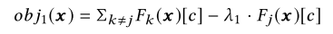

- $\lambda_2$：平衡两个优化目标大小（即预测差异和神经元覆盖率，$\lambda_2$越大，越关注覆盖更多神经元，否则更关注生成预测差异图片）

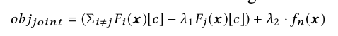

- $s$: 梯度下降步长（$s$过大可能会导致极小值附近震荡，$s$过小导致迭代次数多）
- $t$: 神经元覆盖率阈值（$t$越大，达到覆盖率目标越难）
- $p$: 覆盖率目标
- 梯度下降迭代最大次数（代码里）
- 在每次迭代的梯度$G$上施加的真实领域约束:
  - （1）不同亮度模拟光照：$G$被$mean(G)$ 取代
  - （2）单个矩形($m*n$大小)模拟意外或故意遮挡：
    - 选择矩形左上顶点所在的位置$(i,j)$，将$G_{i:i+m,j:j+n}$施加于原图相应位置。
    - $m$、$n$的大小和$(i,j)$为自定义的参数，迭代多次都在相同位置
  - （3） 多个随机黑色小矩形模拟镜头污垢
    - 位置随机的若干个$m*m$大小的黑色矩形（每次迭代位置不同，$m$值自定义，与数据集图片大小有关）
    - 如果$mean(G_{i:i+m,j:j+m})$，则图片不动，否则变黑（即只允许降低像素值）

## 算法

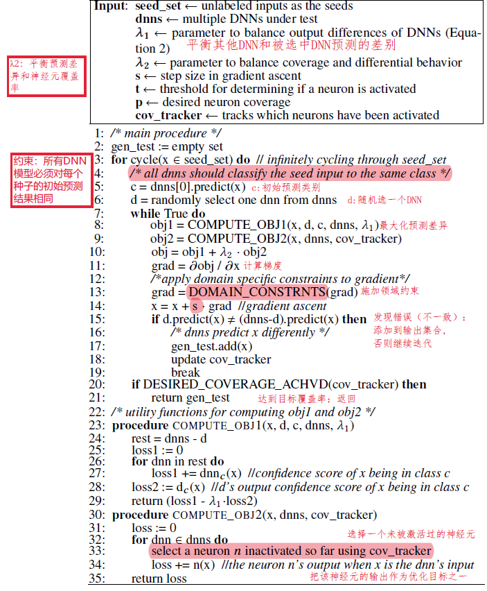

## 实验

### 数据集和模型

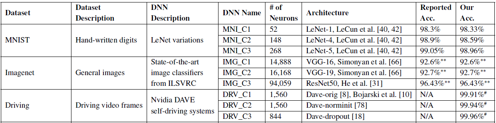

### 参数设置

- 种子输入集合：随机从测试集选择2000个输入（保持类别平衡，满足所有DNN预测结果相同的约束）
- 参数$\lambda_1,\lambda_2,s,t$

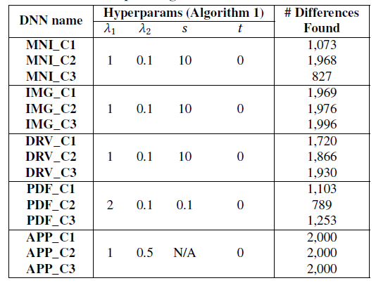

### 实验1：神经元覆盖率的优势

#### 实验1-1：神经元覆盖率与代码覆盖率比较

- 实验方法：随机选择10个测试输入，测量代码覆盖率和神经元覆盖率大小

- 参数设置：设置$t=0.75$（神经元激活阈值，按比例缩放至[0,1]区间，不同DNN阈值区别很大？）前面都设的0，故意设大t凸显结果差异）

- 实验结果：少量测试输入即可达到100%代码覆盖率，但神经元覆盖率最多只有34%：

  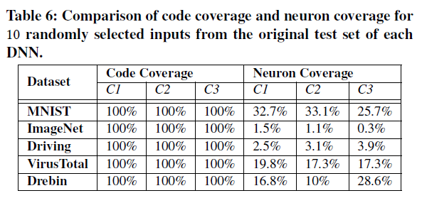

#### 实验1-2：神经元覆盖率对DeepXplore生成能导致预测差异样本的作用

- 实验方法：从MNIST测试集随机选择2000种子输入，分别设置$\lambda_2$为1和0（$\lambda_2=0$时优化目标里不考虑覆盖新的神经元）。测量生成预测差异样本（difference-inducing inputs）的多样性**（平均$L_1$距离：改变前后像素值之差的和，是否适合作为衡量多样性的指标？）**
- 参数设置：$t=0.25$
- 实验结果：神经元覆盖率帮助提升了生成样本的多样性（①神经元覆盖率NC提升并不明显？作者的解释是NC很高的情况下，NC的一点点提升就能带来多样性的大幅提升。②生成数量#Diffs减少了：作者的解释是设置$\lambda_2=1$后更倾向于生成不同输入而不是提高输入数量，作者认为生成数量并不是一个好的衡量生成样本的方式）

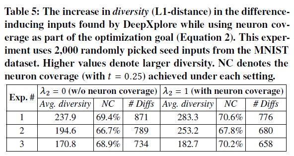

#### 实验1-3：不同***类别***输入对激活神经元的影响

- 实验方法：MNIST数据集的LeNet-5模型，运行100对相同类别（如类别8）图片，和100对不同类别（如类别8和类别4）图片，测量平均激活神经元个数和共同激活神经元的个数（overlap）。
- 实验结果：相同类别共同激活的平均神经元个数$>$不同类别。神经元覆盖率可以有效地估计DNN测试中激活的不同规则的数量。

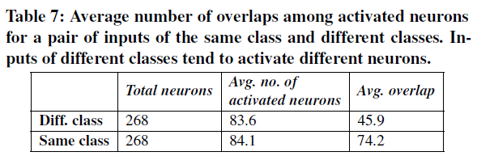

### 实验2：DeepXplore的效果

#### 实验2-1：DeepXplore在神经元覆盖率上的表现

- 实验方法：使用三种方法（DeepXplore、对抗样本FGSM、原测试集随机选择）生成相同数量（测试集的1%）的输入，比较神经元覆盖率

- 实验结果：DeepXplore能达到更高的覆盖率，且随着$t$的提升，覆盖率逐渐降低。

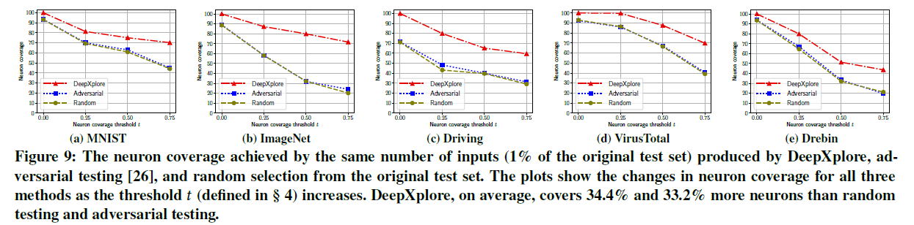

#### 实验2-2：运行时间

- 实验方法：不同数据集和模型生成100%覆盖率输入所需时间及相应的生成数量。所有图像分类模型不考虑全连接层的覆盖（作者解释因为全连接层有的神经元非常难覆盖到，但全连接层的覆盖情况应该意义更大？）

- 实验结果：DeepXplore生成高覆盖率的输入效率非常高。

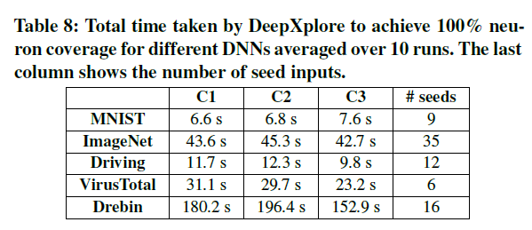

#### 实验2-3：不同参数设置的影响

- 实验方法：改变参数$s$、$\lambda_1$、$\lambda_2$，比较找到第一个导致预测差异的输入平均运行时间（这个指标是否足够适合评价参数？）
- 实验结果

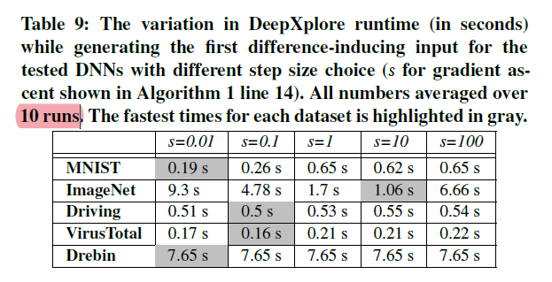

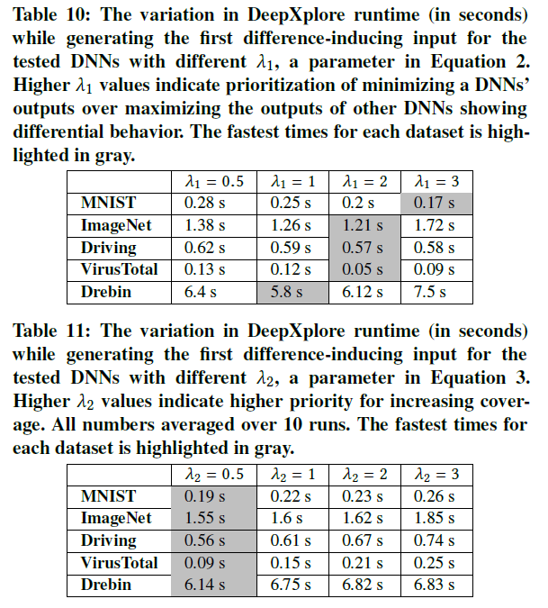

#### 实验2-4：当多个DNN决策边界相似时DeepXplore的效果

- 实验方法：
  - 对照组：MNIST训练集（60000个样本）和LeNet-1模型，10个epoch
  - 实验组：改变①训练集样本个数，②DNN卷积层模型filter个数，③训练epoch数
  - 设置初始种子数为100，对比发现生成第一个使得实验组DNN和对照组DNN预测差异样本的平均迭代次数
- 实验结果：DeepXplore从非常相似的DNN中也能发现错误样本（除了第一行diff为1时），越相似，迭代轮数越多。

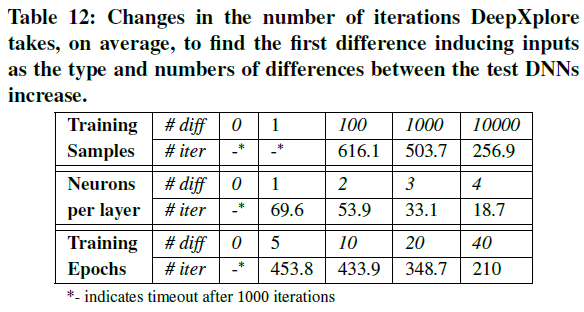

### 实验3：使用DeepXplore提升DNN

#### 实验3-1：使用生成样本扩大训练集，重新训练DNN

- 与对抗样本训练不同的是：不需标注（采取投票形式）
- 实验方法：重新训练MNIST数据集的三个模型5个epoch，增加100张DeepXplore生成的错误图片，与对抗样本和随机从测试集选择样本比较准确率。（测试样本是什么？多个DNN从何而来？）
- 实验结果：DeepXplore平均提升准确率1%-3%

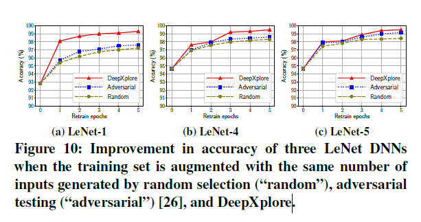

#### 实验3-2：检测被污染的训练样本

- 实验过程：用两个MNIST LeNet-5模型，一个正常训练，另一个类别9的样本中30%被故意标记成了类别1。使用DeepXplore生成被错误预测成9或1的样本，在训练集中找和错误样本结构相似的样本。能识别出95.6%的污染样本。（写得很简略）