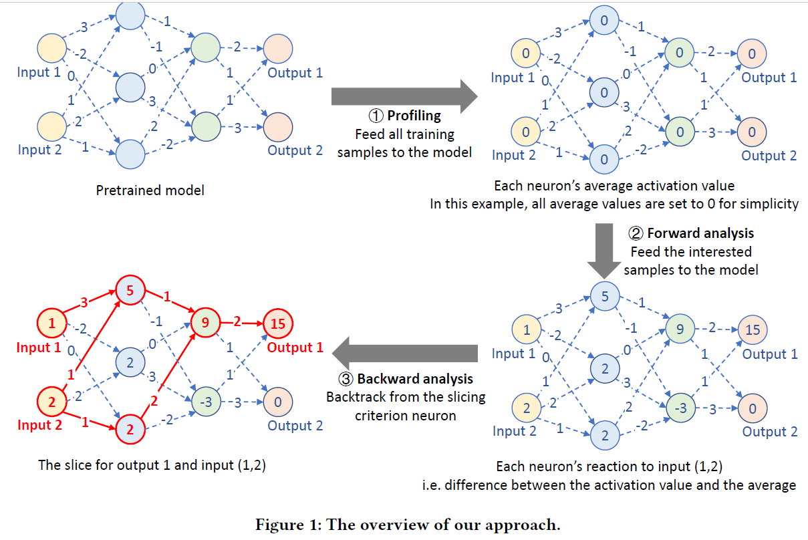
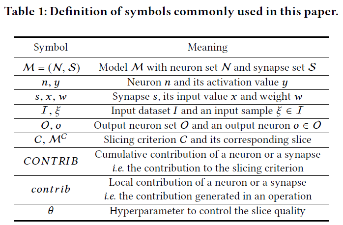
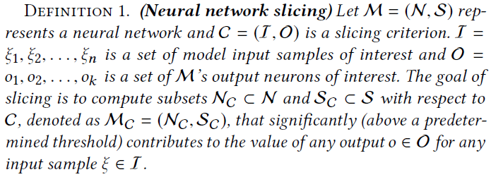
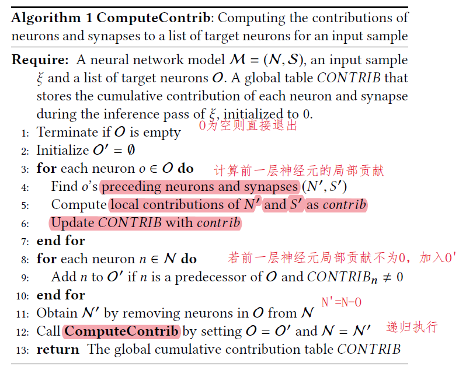
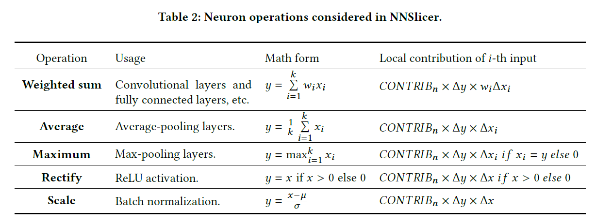
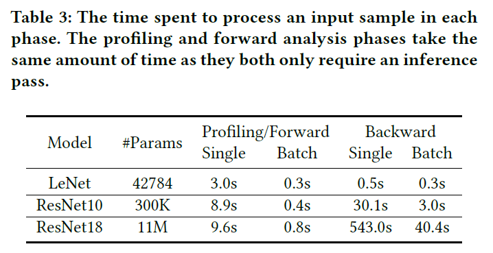
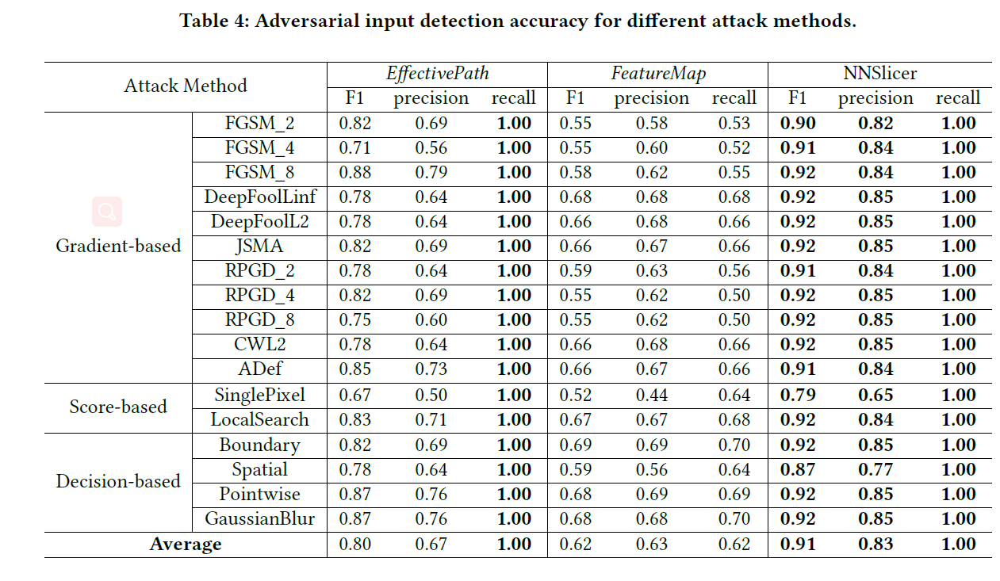
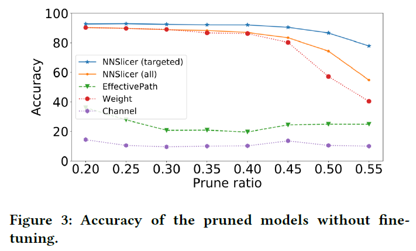
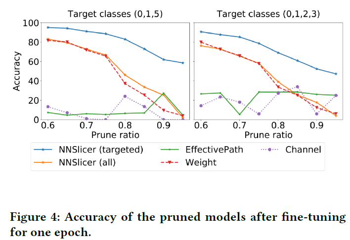
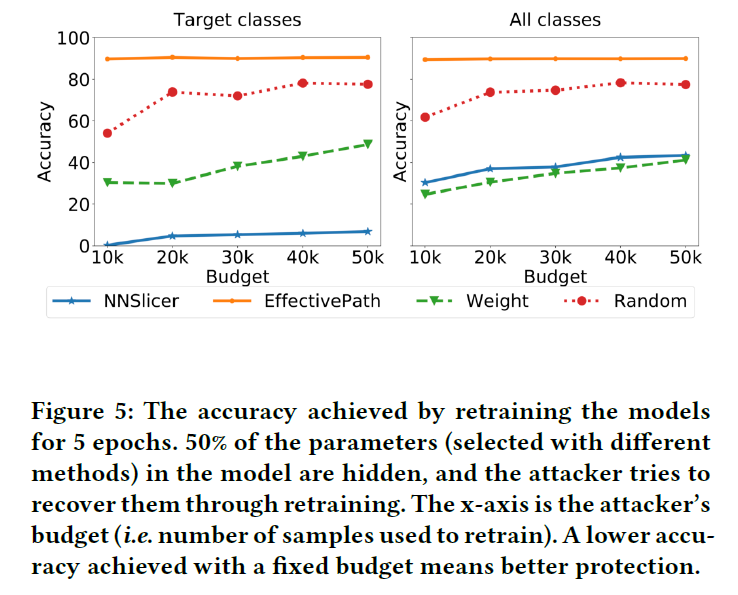

Dynamic Slicing for Deep Neural Networks （FSE'20）<!--more-->

## Introduction

- 传统程序切片技术：旨在从程序中提取满足一定约束条件（切片标准）的代码片段，是一种用于分解程序的程序分析技术。

  - 例如，通过将切片标准设置为某个导致错误的特定输出，可以获得与错误相关但比整个程序小得多的程序切片，因此更容易分析。

- **DNN切片**的定义：计算获得一个神经元和突触子集，使其可以显著影响某些感兴趣的神经元的值。

  - 有助于理解神经网络的决策
  - 有助于减小模型大小
  - 把模型划分为重要/非重要部分，有利于优先保护模型的重要部分

- 目标：找到在决策过程中更重要的神经元和突触的子集。

- DNN切片的挑战：

  - 神经元的权重、连接难以理解
  - 神经网络输出与几乎所有神经元都有关，因此必须区分每个神经元的贡献重要程度
  - DNN非常庞大，对性能要求高

- 本文方法：**NNSlicer**

  - 一种基于数据流分析的神经网络动态切片技术

  - **切片标准**的定义：一组具有特殊意义的神经元

    - 如输出层神经元

  - **神经网络切片**的定义：一组对切片标准产生重要影响的神经元集合

  - 动态切片：针对一组特定输入切片，而不是静态、与输入独立的

  - 包括三个阶段：

    

    - Profiling phase：对每个神经元的平均行为（输出值）建模。训练集在该神经元输出的均值作为baseline。
    - Forward analysis phase：对欲切片的一组感兴趣的输入，喂进DNN，记录神经元输出。输出与baseline的差异代表了神经元对输入的敏感程度
    - Backward analysis phase：切片过程从切片标准中定义的神经元开始，逐层向前分析具有重要影响的神经元。

  - 效率

    - 一个样本：
      - ResNet10：40s
      - ResNet18：550s
    - 批样本：
      - ResNet10：3s
      - ResNet18：40s

  - 应用：

    - 对抗样本检测
    - 模型剪枝
    - 模型保护

## 问题形式化定义

- 符号

- 程序切片

  

## 方法

### Profiling 和 Forward analysis阶段

- Profiling阶段：记录每个神经元在训练样本上的输出均值$\overline{y^{n}( \mathcal{D})}$（卷积层一个通道看作一个神经元）
- Forward analysis阶段：对特定的输入样本，计算神经元n的输出值与均值的差$ \Delta y^{n}( \xi )=y^{n}( \xi )- \overline{y^{n}( \mathcal{D} )} $。绝对值越大表示越敏感。

### Backward Analysis 和切片提取

- 对每个神经元和连接都计算一个贡献值$CONTRIB$，$CONTRIB \neq 0$表示该神经元或连接是重要的，$CONTRIB>0$表示贡献值是正向的，否则是负向的。

- $CONTRIB$的计算方法

  - **递归**地从后向前计算

    

  - 局部贡献值计算

    - 如Weighted sum操作: 对神经元$n$，前一层第$i$个神经元的局部贡献值$contrib_{i}=CONTRIB_{n} \times \Delta y^{n} \times w_{i} \Delta x_{i} $，其中$CONTRIB_n$为该神经元$n$当前的全局贡献值，$\Delta y^{n}$为该神经元$n$在forward analysis阶段计算出的相对敏感度，$\Delta x_{i}$为前一层神经元$n_i$的相对敏感度，即$\Delta y^{n_i}$。乘积$w_{i} \Delta x_{i}$表示$n_i$和$s_i$对全局贡献值$CONTRIB_n$的影响，比如，如果$\Delta y^{n}$是负的，$w_{i} \Delta x_{i}$是正的，说明$n_i$扩大了$n$的负性，对于$CONTRIB_n$有负向贡献。

    

  - 全局贡献值=SIGN(局部贡献值)的累加，即局部贡献值只在{-1,0,1}中取值

- 参数$\theta$控制切片粒度：抛弃贡献值低于$\theta$的前层神经元

- 多个样本的集合：贡献值=单个样本贡献值的和

- 切片：去掉贡献值为0的神经元和连接。

### GPU和多线程加速

对于大样本集合$I$，前向分析过程在GPU上大批次处理，反向分析过程在CPU上一个小批次用一个线程处理。

## 实验

### Overhead

### 对抗防御

- 思想：对抗样本和正常样本的切片应该不同。从正常样本集合我们可获得一个切片，若新的输入切片与正常样本切片非常不同，则很有可能是对抗样本。

- 方法：假设DNN模型为$\mathcal{M}$，输入样本为$\xi$，其在$\mathcal{M}$上预测的输出为$\mathcal{M}(\xi)$，对于切片标准$\mathcal{C}=(\xi, \mathcal{M}(\xi))$，使用NNSlicer方法得到切片$\mathcal{M}_\xi$。构造一个切片分类器$F$，其在训练样本上学习得到切片形状与输出类别之间的关系，若$F(M_\xi) \neq \mathcal{M(\xi)}$，则判断该样本为对抗样本。

  - $F$的输入是一个切片$M_\xi$，具体表示为一个向量$vec_\xi$，即所有神经元之间的连接及该连接的贡献的集合。
  - 本文采用决策树算法构造分类器$F$。

- 用NNSlicer检测对抗样本的好处

  - 不需要更改或重训练模型
  - 支持大型模型
  - 只需要正常样本来训练分类器，不需要对抗样本

- 实验设置

  - 对比方法：FeatureMap和EffectivePath，都使用了分类器
  - 数据集和模型：CIFAR10和ResNet10，10000张正常样本训练分类器。
  - 对抗攻击方法：17种（FoolBox实现）
    - FGSM_2，FGSM_4，FGSM_8
    - DeepFoolL2，DeepFoolLinf
    - JSMA
    - RPGD_2,RPGD_4,RPGD_8
    - CWL2
    - ADef
    - SinglePixel
    - LocalSearch
    - Boundary
    - Spatial
    - PointWise
    - GaussianBlur

- 实验结果

  - 平均Recall为100%，平均Precision为83%

  

  

### 网络简化和剪枝

- 一般的简化方法针对所有类别，NNSlicer针对特定的几个类别简化（如区分ImageNet里的各种狗）
- 方法：假设我们想对模型$\mathcal{M}$进行简化，目标类别为$\mathcal{O}^T$，剪枝比例为$r$。令$\mathcal{I}^T$为目标类别的输入样本，使用NNSlicer计算每个连接s的贡献$CONTRIB_s$，对每层每个连接的贡献值排序，剪掉最小的比例为$r$的这些连接，如果一个神经元的所有连接都被剪掉，则该神经元也被去掉。
- 实验设计：CIFAR10的10个类别中所有子集（210个）都作为目标类别，
  - 对比方法
    - EffectivePath
    - Weight：去掉权重绝对值最小的边
    - Channel：去掉平均权值最小的神经元
- 实验结果：NNSlicer能保持准确率降低较少，这是因为我们牺牲其他类别的连接来保障目标类别的准确率能缓慢降低

- 一轮微调：用10k个样本重训练一轮，即使剪枝比例很大，但NNSlicer已能达到较高的准确率

  

### 模型保护

- 保护贡献值大的连接

- 对比方法

  - EffectivePath
  - Weight
  - Random：随机选择连接

- 实验设计：假设50%的连接参数被隐藏，攻击者试图用训练数据重训练的方式恢复连接参数，重训练准确率越低表示保护方法越好。

- 实验结果

  - Target classes上准确率非常低，但All classes上准确率与Weight接近，说明非目标类上准确率可能很高，但NNSlicer不保护非目标类。

  