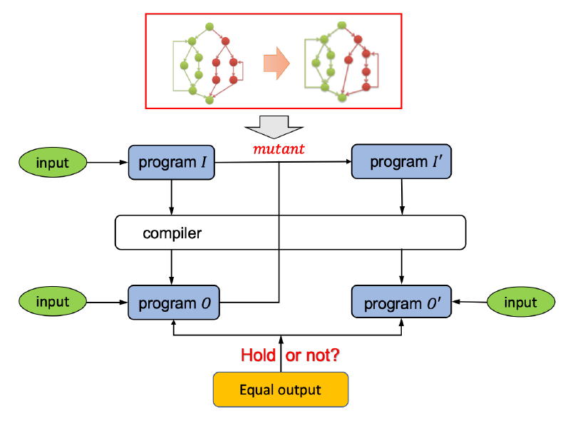

原文：Compiler Validation via Equivalence Modulo Inputs （PLDI'14) <!--more-->

## Equivalence Modulo Inputs (EMI)

- 给定程序$P$和一组输入值$I$，由$I$可生成一组程序集合$\mathcal{P}$，使得$\mathcal{P}$中每个程序$Q$都等价于$P$ modulo $I$：$\forall i \in I, Q(i) = P(i) $。则集合$\mathcal{P}$可用于对任意一个编译器$Comp$进行差分测试（differential testing），若存在某个$i \in I$和$Q \in \mathcal{P}$，使得$Comp(P)(i) \neq Comp(Q)(i)$，则该编译器存在bug。

- 核心思想：尽管$Q$只在输入集合$I$上与程序$P$语义等价，但编译器及其使用的静态分析和优化算法应该能为$Q$生成能在$I$上完全运行正确的中间代码。$P$和$Q$在数据流和控制流上可能很不同，经编译器优化后生成的代码也很不同，但结果应该完全一致。

  

- 生成EMI 变体的策略
  
  - 在$P$上运行输入集合$I$，获得运行轨迹，随机在未执行代码上做剪枝、插入、修改操作（假设$P$是一个确定的程序）

编译器的两类bug：

- 导致编译器崩溃
- 生成错误代码（更加严重）
  - 导致正确的程序运行有bug
  - 难以发现