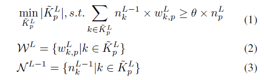
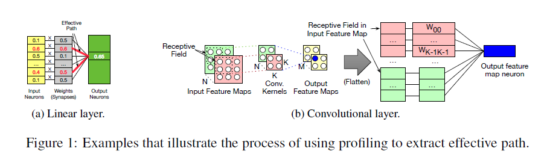
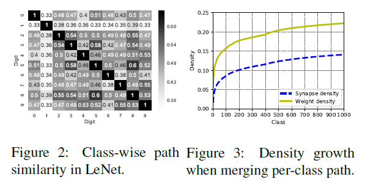
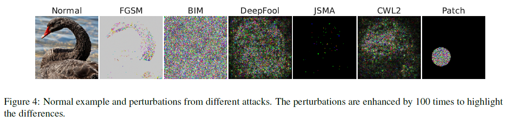
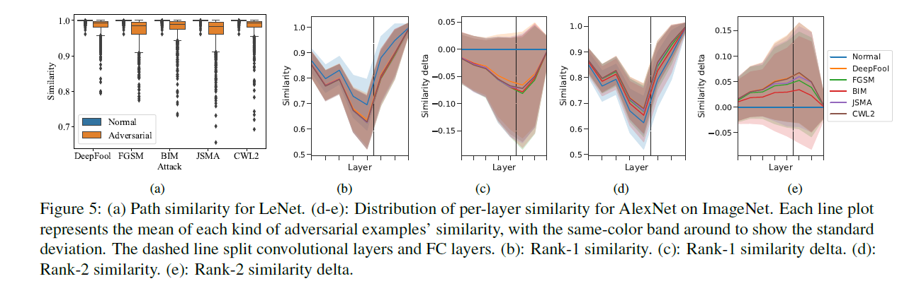

原文：Adversarial Defense Through Network Profiling Based Path Extraction （CVPR'19)  <!--more-->

## 方法

- 基本思想：找到Effective Path——一组重要连接和神经元的集合，使得模型得到最终的预测类别结果。可类比普通程序的执行路径。

- 前人方法（CDRP）
  - 需要重训练
  - 维度过高
- 提取路径信息的方法受到了传统程序分析中控制流和基本块的启发

### 单张图片提取

欲提取有效路径$\mathcal{P=(N,S,W)}$，其中$\mathcal{N、S、W}$分别为重要神经元、连接、权重的集合。

- 提取过程（由后向前）
  - 最后一层：只包括输出类别的神经元$n^L_p$

  - 重要权重：最小权重集合，使得只计算该部分输出时，结果大于神经元$n^L_p$原本输出的$\theta$倍。由此得到前一层的重要神经元集合$N^{L-1}$。

    - 最小组合选取方法：对输入和权重的乘积进行排序，选最小且满足条件的组合

    

  - 对前一层的每个重要神经元：重复上述方法

  - 卷积层特殊处理：

    

    - 根据感受野转换成全连接层
    - 计算最小权重组合时无需对所有神经元排序，只需排感受野内的
    - 由于卷积，多个连接可能共享相同的权重

### 多张图片提取

- 单张图片的路径相当于是神经元或连接的一个二元掩膜，指示了其是否在预测过程中产生了影响。多张图片的有效路径即其中所有单张图片路径组成的集合。使用每个类别预测正确的图片可得到per-class effective path，使用所有训练集预测正确的图片可得到overall effective path。
- 路径的稀疏性：
  - 设置$\theta=0.5$时，LeNet5、AlexNet、ResNet50、InceptionV4、VGG16上，Overall effective path在所有路径和权重中的占比分别为13.8%, 20.5%, 22.2%, 41.7%,17.2%，说明提取出的有效路径非常稀疏。

## 路径的特殊化现象

不同类别的有效路径将网络拆分成不同的组件，可用于理解网络以及研究更改网络结构所带来的影响。

- 路径特殊化现象：不同类别的有效路径相差很大

  - 计算Jacarrd系数（图2）：不同类别之间的相似度几乎都小于0.5，说明一半左右是共同激活的路径，一半是不同的

  - 逐个合并ImageNet1000个类别的有效路径，密度一开始迅速上升然后在50个类别时开始趋于平缓（图3），与ImagNet有100个左右的基础类别这一事实相符合。

    

## 对抗样本防御

- 6种对抗攻击方法

  

- 对抗样本检测方法：计算**路径相似度**

  - 计算待测图像的有效路径与该预测类别的有效路径之间的相似程度，因为单张图片的有效路径密度远低于类别的有效路径，所以Jaccard系数基本上取决于二者的交集占该图片有效路径的比例大小

    - LeNet实验结果（图(a)）：正常样本相似度基本都是1.0左右，对抗样本相似度较低
    - AlexNet实验结果：
      - Rank-1类别path：划分成不同层的相似度，对抗样本相似度同样较低（图c）。正常样本与对抗样本相似度之差（图d）显示中间层下降最多。
      - Rank-2类别path：正常样本相似度反而最低（图d），因为对抗样本的rank2类别往往是正常样本的rank1类别，所以对抗样本路径相似度更高。

    

  - 防御模型

    - 使用rank1和rank2类别的有效路径来检测对抗样本

    - 线性模型：每层rank1类别有效路径相似度$-$每层rank2类别有效路径相似度：$ \tilde{J}_{P}= \sum _{l=1}^{L} \omega ^{l}J_{P}^{l}- \sum _{l=1}^{L} \omega ^{l^{ \prime }}J_{P}^{l^\prime} $，若小于某阈值则判断为对抗样本

    - 其他模型：random forest, AdaBoost, and gradient boosting

      