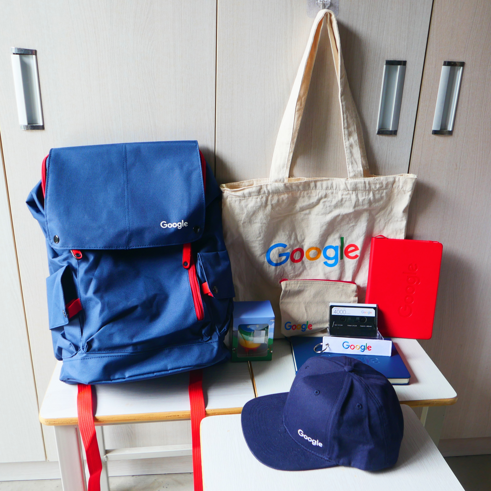
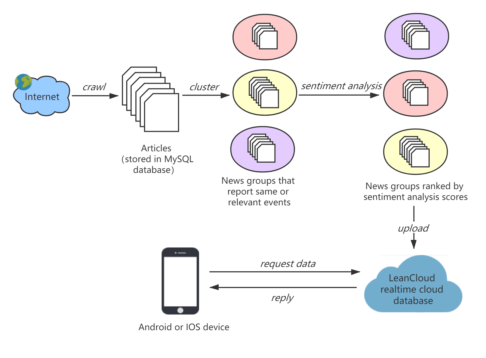

【8月27日更新】终于收齐所有奖品啦~~:grin::grin:  

一整套​Google周边:point_down:<!--more-->

--------

今年的Google女生黑客马拉松比赛历时四个月终于在上个周末结束啦。我们队伍获得项目第一名（1/198）和最受欢迎奖（所有决赛参赛者投票投出来的），这个结果其实在意料之外也在意料之中，不过归根结底还是很不容易（要知道去年我可是连简历关都没过= = |||），今天来总结一下赛后感。

今年由于疫情，比赛改成了线上举办，赛题为设计并开发出一款对疫情有帮助的产品，形式不限，必须用到至少一个Google的工具。初赛交设计方案，复赛交代码、文档和视频Demo，决赛线上展示和答辩。（比赛主页：https://events.withgoogle.com/google-girl-hackathon-cn/#content ）

我们提交的产品是一款疫情国际新闻浏览APP，但与一般新闻APP不同的是，我们的APP将不同媒体报道的同一新闻（或相关新闻）聚集成一个个新闻组，对新闻组里每条新闻组进行情绪分析后，将包含情绪分差较大的新闻组排到前面展示给用户。核心思想是情绪差异较大的文章往往意味着观点上的差异也较大，从中我们可以发现媒体偏见，尽管每篇文章本身并非完全客观的，但通过对比不同观点的文章，希望用户从中培养理性和独立思考的习惯，摒弃偏见和成见，增进互相理解、齐心抗疫。

这是我们的演示视频（更新后的版本）：

<iframe width="560" height="315" src="https://www.youtube.com/embed/8401Arz0FHs" frameborder="0" allow="accelerometer; autoplay; encrypted-media; gyroscope; picture-in-picture" allowfullscreen></iframe>

APP前端用的是Google的Flutter，这个是第一次写，以前只写过IOS和一点点安卓，不过上手还是蛮快的，现成的模板有很多。下面是APP后端运行的一个原理流程图↓，后端由Python编写，新闻爬虫部分使用的是GitHub上的一个开源工具NewsPaper3k，能够自动从指定的新闻网站链接爬取新闻（标题、内容、图片等，共50多个英文网站），先保存在本地的MySQL数据库里。接下来我们将每篇文章用TF-IDF算法进行编码，然后使用基于密聚类度的DBSCAN算法将相关新闻聚类，选择合适参数下聚类效果还是不错的，其余没被聚成类的文章则被丢弃。然后用Vader工具对新闻组里的文章进行情绪分析，Vader使用的是基于词典的无监督情绪分析算法，根据标题和正文的综合得分给出每篇文章的情绪分数，Vader是跟其他两个工具（包括TextBlob和另外一个忘了）进行人工比较效果后选择的，效果还是可以的，比如我们观察到跟朝鲜相关的新闻，几乎都是一水儿的超级负面情绪，（评委曾问我如何评价效果，这个因为没有标注我说只能人工检查，或者说我们的效果依赖于使用工具的效果，暂时没想到更好的检查方法）。最后我们将包含情绪分差较大的新闻组排在前面，并上传到LeanCloud后端云数据库中（其实本来想用的是Google的Firebase，但网实在不太好，而且Firebase竟然没有关于在Flutter上如何使用的文档，震惊）。前端的设备直接和LeanCloud交互获得数据，以及完成一些辅助功能如评论、收藏、搜索等。

总结一下我觉得此次能得奖的关键之处吧（开始不要脸的自夸）：

首先我们的立足点足够大、解决的问题足够广泛，评委在颁奖时强调了我们产品注重多样性的特点与Google致力的目标一致。这个idea其实是我日常刷完各种公众号、豆瓣、知乎之后半夜躺在床上有感而发想出来的，视频和PPT里引用的谭德塞的话是某天知乎热榜标题上看到的，所以动机其实也是带着真情实感的。。虽然受到过队友质疑反对但还是据理力争做下来了。尽管情绪分析的方法很简单常见，但我们的最终目标其实是发现不同观点的文章，情绪分析只是我们挑选的一个容易下手的角度，还有更多复杂的观点分析方法可以运用在我们的产品中。

高中语文课学过的课文我一篇也记不起来了，但语文老师有两句话我一直记得，一句是他在我们文理分科前建议我们学理科，因为科技可以改变世界，但记住一定要做一个“有情怀的理科生”。另一句是他语重心长地和我们说人应该常怀“悲悯“。当时之所以印象深刻，可能是因为这两个词都曾被他大大地写在了黑板上，但那时候却并不明白个中意味，直到最近几年才常想起才觉得常想常新。我想今天拿到这个比赛结果也算没有辜负他的话。我始终觉得，作为科技行业从业者，开发出为人们提供日常生活便利和娱乐的产品当然好，但更高的要求是看到人世间的苦难并尝试为其做出一点改变，或是对人们的思想和精神领域带来正面的影响。

第二也要感激这一年的研究生生活，从写论文、看论文、讲论文的过程中不知不觉培养了自己英文学术写作和演示的能力。逐渐发现作品本身质量固然重要，但如何讲好一个完整的故事有时候更加重要，一个专业、逻辑清晰完整、美观大方的展示会给产品大大加分，反之搞不好会给本来不错的产品扣印象分，那就得不偿失了。

