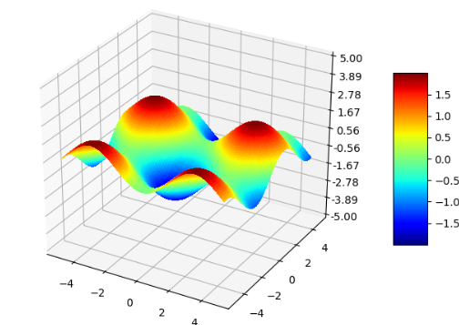
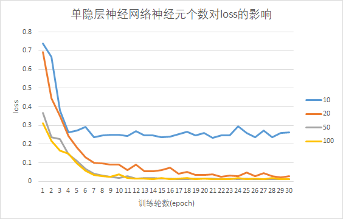
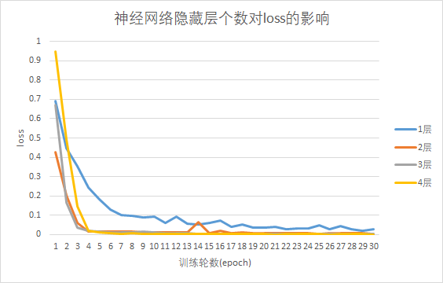
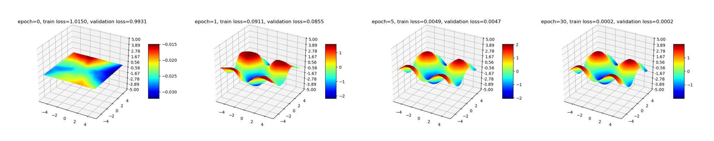
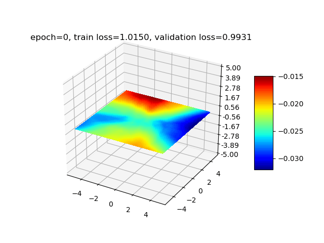

不用tensorflow、pytorch等任何现有深度学习框架以及各种封装好的机器学习库，仅使用python语言及矩阵运算的库，从零开始实现一个全联接的神经网络。<!--more-->

## 任务描述

我们以一个回归任务为例，实现一个多层神经网络来拟合一个非线性函数$ y= \sin (x_{1})- \cos (x_{2}),x_{1} \in \left[ -5,5 \right] ,x_{2} \in \left[ -5,5 \right] $，函数图像如下图所示，输入层包含2个神经元，输出层包含1个神经元，隐藏层的数目和神经元数自定义，隐藏层采用ReLU作为激活函数，输出层用恒等函数做为激活函数，损失函数为均方误差（MSE）。

实际上我们实现的神经网络可以自定义输入输出大小、隐藏层结构、激活函数、损失函数等，因此用在其他任务上也是完全可以的。




## 准备工作

训练神经网络之前，我们需要先完成一些准备工作，包括生成训练和验证的数据集、定义用到的激活函数和损失函数。

### 数据集生成

在轴$x_1$和$x_2$的$[-5,5]$区间上每隔0.1均匀地对样本点进行采样，然后计算目标函数的值，生成100*100=10000个训练数据，转换成为numpy​矩阵，作为训练数据集：

```python
# 生成训练数据集
x_train = []
y_train = []
for x1 in np.arange(-5, 5, 0.1):
    for x2 in np.arange(-5, 5, 0.1):
        x_train.append([x1, x2])
        y_train.append(np.sin(x1)-np.cos(x2))
x_train = np.array(x_train)
y_train = np.array(y_train)
```


另外随机采样并生成大小为1000的验证数据集：

```python
# 生成验证数据集
x_val = []
y_val = []
for i in range(1000):
    x1 = random.uniform(-5, 5)
    x2 = random.uniform(-5, 5)
    x_val.append([x1, x2])
    y_val.append(np.sin(x1)-np.cos(x2))
x_val = np.array(x_val)
y_val = np.array(y_val)
 
```


### 激活函数和损失函数

定义本次任务用到的数学函数，包括激活函数和损失函数：

- 激活函数

  定义ActivationFunction类作为激活函数的基类，包括calculate（计算）和derivative（求导）两个抽象方法。本次任务中用到了ReLU和Pureline两种激活函数，若想使用其他激活函数可以仿照下面的形式定义（注意接受的参数x都是一个numpy矩阵）。

  ```python
  import numpy as np
  from abc import ABCMeta, abstractmethod
  
  class ActivationFunction:
      '''激活函数基类'''
      __metaclass__ = ABCMeta
  
      @abstractmethod
      def calculate(self, x):
          pass
  
      @abstractmethod
      def derivative(self, x):
          pass
  
  class ReLU(ActivationFunction):
      '''relu激活函数'''
  
      @classmethod
      def calculate(self, x):
          return np.maximum(x, 0)
  
      @classmethod
      def derivative(self, x):
          return np.where(x > 0, 1, 0)
  
  class Pureline(ActivationFunction):
      '''恒等激活函数'''
  
      @classmethod
      def calculate(self, x):
          return x
  
      @classmethod
      def derivative(self, x):
          return np.ones(shape=x.shape)
  ```


- MSE损失函数

  假设样本个数为$n$，计算公式：$MSE=\frac{1}{n} \sum_{i=1}^{n}(y_{true}[i]-y_{pred}[i])^2$

  ```python
  def mse_loss(y_true, y_pred):
      '''MSE损失函数'''
      return ((y_true - y_pred) ** 2).mean()
  ```


## 模型训练

### 数据结构定义和初始化

首先定义类NeuralNetwork表示神经网络类，初始化时用户向类构造函数传入参数input_size（输入层维度）、output_size（输出层维度）、hidden_size（隐藏层维度，用一个数组表示，如[5,3]表示两个隐藏层，分别包含5个和3个神经元），从而可以达到任意调整神经网络结构的目的。

接着定义两个数组self.w和self.b表示神经网络的权重和偏移量，每层的权重是一个numpy矩阵，用np.random.normal函数进行高斯分布初始化（设置均值为0，方差为0.1）；同时定义一个数组self.activations表示每层的激活函数，这里隐藏层激活函数为ReLU，输出层激活函数为Pureline：

```python
# 随机初始化权重和偏移量
self.len = len(hidden_size) + 1    # 层数(除输入层)
loc = 0.0
scale = 0.1
# 隐藏层
self.w = [np.random.normal(loc, scale, size=(input_size, hidden_size[0]))]
self.b = [np.random.normal(loc, scale, size=(hidden_size[0],))]
self.activations = [ReLU]
for i in range(len(hidden_size)-1):
    self.w.append(np.random.normal(loc, scale, size=(hidden_size[i], hidden_size[i+1])))
    self.b.append(np.random.normal(loc, scale, size=(hidden_size[i+1],)))
    self.activations.append(ReLU)
# 输出层
self.w.append(np.random.normal(loc, scale, size=(hidden_size[-1], output_size)))
self.b.append(np.random.normal(loc, scale, size=(output_size,)))
self.activations.append(Pureline)
```

然后定义五个数组用于保存训练时的中间结果，均初始化为全0：

- self.z：每个神经元激活前的输出。
- self.a：每个神经元激活后的输出。
- self.delta：神经单元误差$\delta$，即loss对每个神经元激活前输出$z$的梯度（用于反向传播更新权重）。
- self.delta_w：权重w的累积更新值，用于处理完每个batch后更新权重。
- self.delta_b：权重b的累积更新值。


### 前向计算中间结果

每轮训练首先调用一个自定义的shuffle方法打乱训练样本集合。然后开始训练，设置训练轮数为30，batch_size为10，初始学习率为0.01。对每个输入样本，通过前向传播计算得到每层的输出self.z和self.a，如假设第$i$层（$i>1$)的输入为$a[i-1]$，权重和偏移为$w[i]$和$b[i]$，则有:

$z[i]=a[i-1]\times w[i] + b[i]$，

$a[i]=activations[i].calculate(z[i])$

```python
def shuffle(x, y):
    '''随机打乱数据'''
    xy= np.c_[x,y]
    np.random.shuffle(xy)
    x = xy[:, :-1]
    y = xy[:, -1]
    return x, y

def train(self, x_train, y_train, x_val, y_val, epochs=30, batch_size=10, lr=0.01):
    '''训练模型'''

    self.validate(0, x_train, y_train, x_val, y_val)

    for epoch in range(epochs):
        x_train_shuffle, y_train_shuffle = shuffle(x_train, y_train)
        batch_count = 0
        for x, y_true in zip(x_train_shuffle, y_train_shuffle):
            # 前向传播得到每层输出
            layer_output = x
            for layer in range(0, self.len):
                self.z[layer] = np.matmul(layer_output, self.w[layer]) + self.b[layer]
                layer_output = self.activations[layer].calculate(self.z[layer])
                self.a[layer] = layer_output
```


### 反向传播计算梯度

接下来计算输出层（第-1层）的神经单元误差$\delta$，对于每个样本，假如输出层维度为$m$，损失函数$C=\frac{1}{m}\sum_{i=1}^{m}(y_{true}[i]-a[-1][i])^2$（本次任务中$m=1$），则$\delta[-1] = \frac{\partial C}{\partial z[-1]} = \frac{\partial C}{\partial a[-1]} \cdot \frac{\partial a[-1]}{\partial z[-1]}=  \frac{1}{m} \cdot 2 \cdot (a[-1] - y_{true}) \cdot \theta'(z[-1])$，其中$\theta$为输出层的激活函数。

然后可以通过递推式反向计算出前面每层的神经单元误差，第$i$层的神经单元误差$\delta[i]=w[i+1] \times \delta[i+1] \times \theta'(z[i])$ ，其中$\theta$表示第$i$层的激活函数。

通过神经单元误差$\delta$我们可以计算出损失函数对w和b的导数，对第$i$层：$\frac{\partial C}{\partial w[i]} = a[i-1]^T \cdot \delta[i]$，$\frac{\partial C}{\partial b[i]}= \delta[i]$。并将导数累加结果记录在self.delta_w、self.delta_b数组中。

```python
# 计算最后一层的神经单元误差δ
self.delta[-1] = 2 * (self.a[-1] - y_true) * self.activations[-1].derivative(self.z[-1]) / len(self.delta[-1])

# 反向递推计算每层神经单元误差δ
for layer in range(self.len-2, -1, -1):
    self.delta[layer] = np.matmul(self.w[layer + 1], self.delta[layer + 1]) * self.activations[layer].derivative(self.z[layer])

# 累加导数
last_layer_output = x
for layer in range(self.len):
    self.delta_w[layer] += np.matmul(np.transpose([last_layer_output]), [self.delta[layer]])
    self.delta_b[layer] += self.delta[layer]
    last_layer_output = self.a[layer]
```


### 更新权重

每个batch结束后，更新w和b。对第i层：

$w[i] \leftarrow w[i]- lr \cdot \Delta w[i]$

$b[i] \leftarrow b[i]- lr \cdot \Delta b[i]$

```python
# 每个batch结束后更新w、b
batch_count += 1
if batch_count == batch_size:
    for layer in range(self.len):
        self.w[layer] -= lr * self.delta_w[layer]
        self.b[layer] -= lr * self.delta_b[layer]
        self.delta_w[layer].fill(0)
        self.delta_b[layer].fill(0)
batch_count = 0
```


### 学习率衰减

这里采用了简单的学习率衰减方案，每过三轮学习率衰减为0.9倍。大家可以尝试其他衰减方案。

```python
if (epoch + 1) % 3 == 0:
    lr *= 0.9
```


## 验证和可视化

每轮训练完成后调用validate方法验证模型在训练数据集和验证数据集上的损失，并绘制图像。

```python
def feedforward(self, x):
    '''前向传播计算预测结果'''
    layer_output = x
    for layer in range(0, self.len):
        layer_output = self.activations[layer].calculate((np.matmul(layer_output, self.w[layer]) + self.b[layer]))
    return layer_output.squeeze()

def validate(self, epoch, x_train, y_train, x_val, y_val):
    '''计算训练集和验证集上的损失，生成可视化图像'''
    y_pred_train = self.feedforward(x_train)
    train_loss = mse_loss(y_train, y_pred_train)
    y_pred_val = self.feedforward(x_val)
    val_loss = mse_loss(y_val, y_pred_val)
    self.visualize(epoch, y_pred_train, train_loss, val_loss)
    print("Epoch %d, train loss: %.4f, validation loss: %.4f" % (epoch, train_loss, val_loss))

def visualize(self, epoch, y_pred, train_loss, val_loss):
   '''可视化训练结果'''
    fig = plt.figure()
    ax = fig.gca(projection='3d')
    X = np.arange(-5, 5, 0.1)
    Y = np.arange(-5, 5, 0.1)
    X, Y = np.meshgrid(X, Y)
    Z = y_pred.reshape((100,100))
    surf = ax.plot_surface(X, Y, Z, rstride=1, cstride=1, cmap=cm.jet, linewidth=0, antialiased=False)
    ax.set_zlim(-5, 5)
    ax.zaxis.set_major_locator(LinearLocator(10))
    ax.zaxis.set_major_formatter(FormatStrFormatter('%.02f'))
    ax.set_title('epoch=%d, train loss=%.4f, validation loss=%.4f'% (epoch, train_loss, val_loss))
    fig.colorbar(surf, shrink=0.5, aspect=5)
    plt.savefig('figure/%04d.png' % epoch)
    plt.show()
```


## 拟合效果

### 增加隐藏层宽度对拟合效果的影响

设置神经网络只有一个隐藏层，考察隐藏层分别包含10、20、50、100个神经元时，训练集loss随训练轮数增加的变化情况（如下图）。（设置学习率为恒定值0.001，训练轮数为30轮）



可见随着训练轮数增长，各个模型的训练集loss首先快速下降，接着缓慢下降。单隐藏层神经元个数越多，训练完成后的loss越低，说明增加神经元宽度能提升模型对目标函数的拟合能力。


### 增加隐藏层深度对拟合效果的影响

考察神经网络分别包含1、2、3、4个隐藏层，且每个隐藏层包含20个神经元时，训练集loss随训练轮数增加的变化情况（如下图）。（设置学习率为恒定值0.001，训练轮数为30轮）。



由图可见，神经网络层数越多，30轮训练结束后训练集的loss越低，说明层数越多，模型对目标函数的拟合能力越强。


### 最终效果

经过以上实验，我们验证了增加隐藏层的宽度和深度能减小拟合的误差。最后为了让拟合误差尽量小，经过多次尝试后，我们最终选择设置隐藏层个数为5，分别包含100、80、50、30、10个神经元，学习率衰减方案为每经过3轮训练，lr衰减为0.9倍。最终训练集loss为0.00015，验证集loss为0.00016。第0轮（训练前）、第1轮、第5轮、第30轮训练后的拟合结果可视化后如下图所示：



动图效果：




完整代码见：https://github.com/rubychen0611/MyNeuralNetwork

