原文：Guiding Deep Learning System Testing using Surprise Adequacy (ICSE‘19)  <!--more-->

代码地址：https://github.com/coinse/sadl

## 概述

提出了一个叫Surprise Adequacy的指标，对一个给定的测试用例，基于可能性或距离来衡量其激活模式相对于DNN训练集的新颖程度。实验部分较详细。

## 动机

已有的覆盖方法：

- 无法针对**单个**输入提供信息：比如更高神经元覆盖率的输入是否比更低的好？
- 评估的重点是显示对抗样本和提出的标准之间的相关性，而不是评估和指导它们**在实际测试DL系统时的使用**。

直观地说，DL系统的一个好的测试输入集应该是系统多样化的，包括从类似于训练数据的输入、到明显不同和对抗的输入。在单个样本的粒度上，SADL测量输入对于训练系统的数据对DL系统的惊讶程度:

- 基于系统看到类似的输入的可能性在训练
- 或基于神经元激活向量之间的距离

## 方法

设神经元集合为$N$，训练集为$T$，两种方式衡量测试输入$x$与训练集神经元激活向量$A_N(T)$之间的相似程度

### 基于可能性的SA（LSA）

采用核密度估计（KDE）来获得输入数据的分布密度函数，这里使用高斯核函数

在这种方法的时候,为了减少计算量,有如下两种规则

- 只选定特定的某层

- 方差过滤：过滤掉那些激活值的方差小于预先定义的阈值$t$的神经元

密度函数定义：

$$ \widehat{f}(x)= \frac{1}{|A_{N_L}(T)|} \sum _{x_{i} \in T}K_{H}( \alpha _{N_{L}}(x)- \alpha _{N_{L}}(x_{i})) $$

公式的直观理解：对于所有的训练集中的用例，每个用例使用高斯核函数计算该用例与新输入x的激活迹的差值。概率密度低说明输入更加稀有，概率密度高说明输入更加相似。

LSA定义：

$$ LSA(x)=- \log ( \widehat{f}(x)) $$

实际应用中只使用类别$c$的训练集数据$T_c$计算LSA。

### 基于距离的SA（DSA）

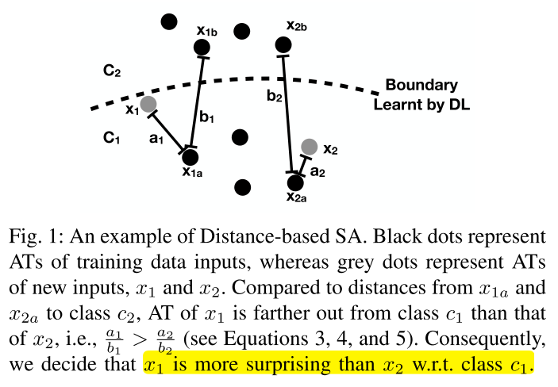

- 对于输入样本$x$，其预测标签为$c_x$，设$x_a$为与其标签相同且激活向量距离最近的训练样本，$x_b$为激活向量离$x_a$最近且类别不同的训练样本，DSA定义为：

  $$ DSA(x)= \frac{dist_{a}}{dist_{b}} $$

- DSA越大，说明$x$对于类别$c_x$来说越surprise

- DSA 只适用于分类任务

### 意外覆盖率的计算（SC)

因为LSA和DSA取值都是连续的，我们用被覆盖的段数除以总段数来表示覆盖率：

给定上界$U$，将$(0,U]$分成n个SA段的bucket：$B=\{b_1,b_2,...,b_n\}$，一组输入$X$的SC定义如下：

$$ SC(X)= \frac{| \{ b_{i}| \exists x \in X:SA(x) \in \left[ U \cdot \frac{i-1}{n},U \cdot \frac{i}{n} \right] \}|}{n}  $$

注意：一组具有较高SC的输入应该是一组多样化的输入。然而，具有特别高SA值的输入可能**与问题域无关**(如交通标志的图像将与动物图片分类器的测试无关)。因此，SC只能相对于**预定义的上界**来测量。（提前设置好的上界很重要）

## 实验

### 实验配置

- 数据集和模型

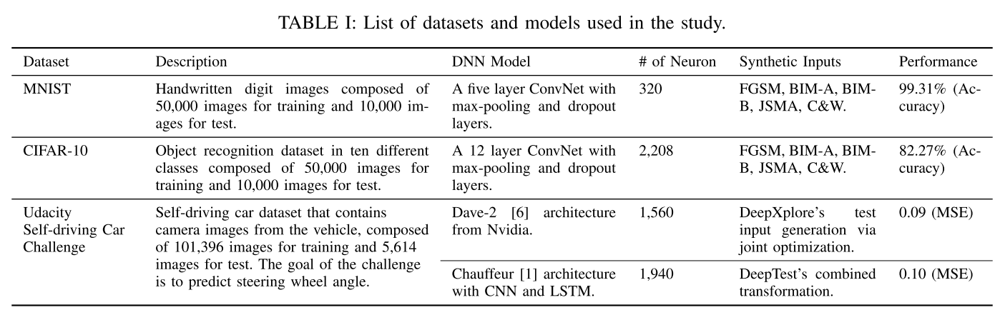

- 对抗样本生成方法

  - FGSM
  - BIM-A、BIM-B
  - JSMA
  - C&W

- 合成图像生成方法（Driving数据集）

  - Dave2模型：DeepXplore的输入生成（亮度、矩形、污点）和联合优化方法（3个DNN：Dave-2、Dave-dropout、Dave-norminit）
  - Chauffeur模型：DeepTest输入生成方法（translation, scale, shear, rotation, contrast, brightness, and blur）

- 参数设置

  - LSA默认方差阈值：$10^{-5}$

  - kde的带宽使用scott规则设置

  - RQ1

    - MNIST选择activation_2层，CIFAR-10选择activation_6层

  - RQ2

    - CIFAR10的activation_7和activation_8层的LSA默认方差阈值设置为$10^{-4}$（减少计算消耗）

  - RQ3

    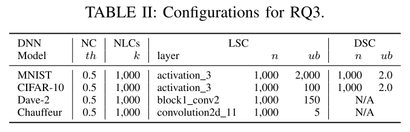

  - RQ4
    - MNIST选择activation_3层，CIFAR-10选择activation_5层
    - 每次重新练运行20次

### RQ1 SADL是否能够捕获DL系统输入的相对惊讶程度?

- 实验方法

  - 从原始数据集检查是否SA越高的样本越难被分类正确
  - 检查对抗样本是否SA较高
  - 最后，我们使用逻辑回归对SA值进行对抗样本分类训练。对于每个敌对攻击策略，我们使用MNIST和CIFAR-10提供的10,000张原始测试图像生成10,000个对抗样本。使用随机选取的1,000张原始测试图像和1,000个对抗样本，我们训练**logistic回归分类器**。(标签是如何确定的？）最后，我们使用剩余的9000幅原始测试图像和9000个敌对例子来评估训练过的分类器。如果SA值正确地捕获DL系统的行为，我们期望基于SA的分类器能够成功地检测出对抗样本。我们使用ROC-AUC进行评估。

- 实验结果

  - 红点对应的图像集合(Ascending SA)从最小SA开始，随着SA的上升，越来越多的高SA

  - 蓝点对应的图像组在相反的方向生长(即从SA高的图像到SA低的图像)。

  - 作为参考，绿点表示在20次重复中随机增长的集合的平均精度。

  - 可以看出，包含LSA值较高的图像，即更多令人惊讶的图像，会导致精度较低。

    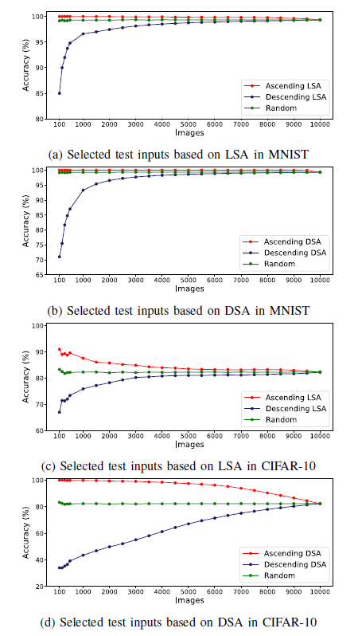

  - 为了在另一个数据集上进行视觉确认，我们也选择了DeepTest为Chauffeur从三个不同级别的LSA值合成的输入集:图3显示，LSA值越高，图像视觉识别就越困难。无论是从数量上还是从视觉上，观察到的趋势都支持了我们的声明，即SADL捕获输入的意外:即使对于看不见的输入，SA也可以度量给定输入的意外程度，这与DL系统的性能直接相关。

  - 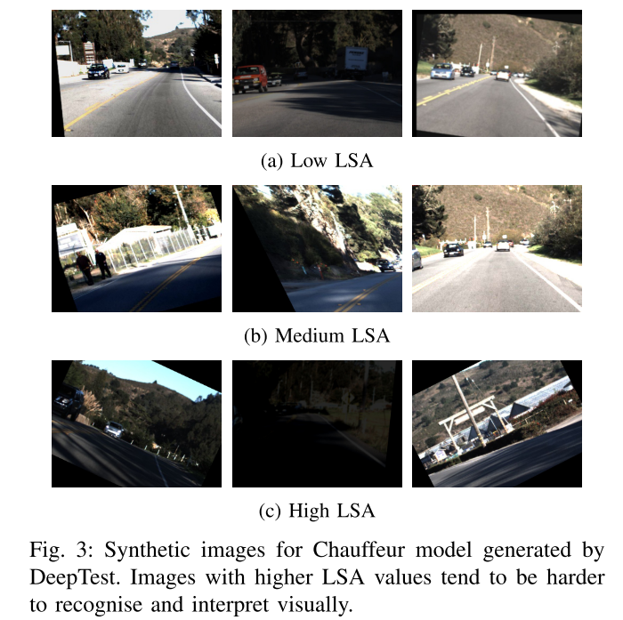

  - 图4显示了由五种技术中的每一种生成的10,000个对抗样本的DSA值的排序图，以及原始的测试输入：

    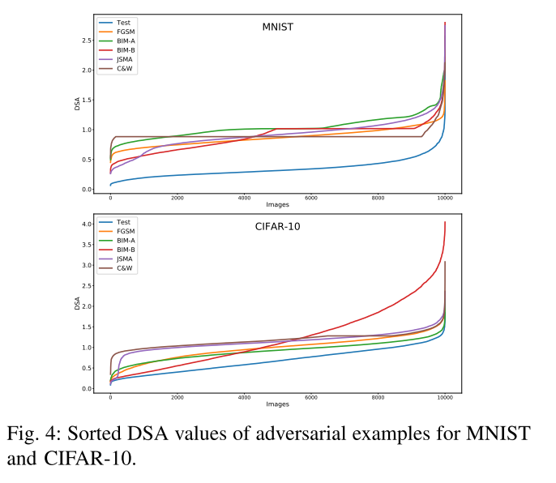

  - 图5是在MNIST和cifar-10的**不同层**中随机选取2000个对抗样本和原始测试集的LSA值的相似图。对于MNIST和cifar10，数据集提供的测试输入(用蓝色表示)往往是最不令人吃惊的，而大多数对抗样本通过较高的SA值与测试输入明显分开。这支持了我们的说法，即SADL可以捕获敌对示例中DL系统行为的差异。

    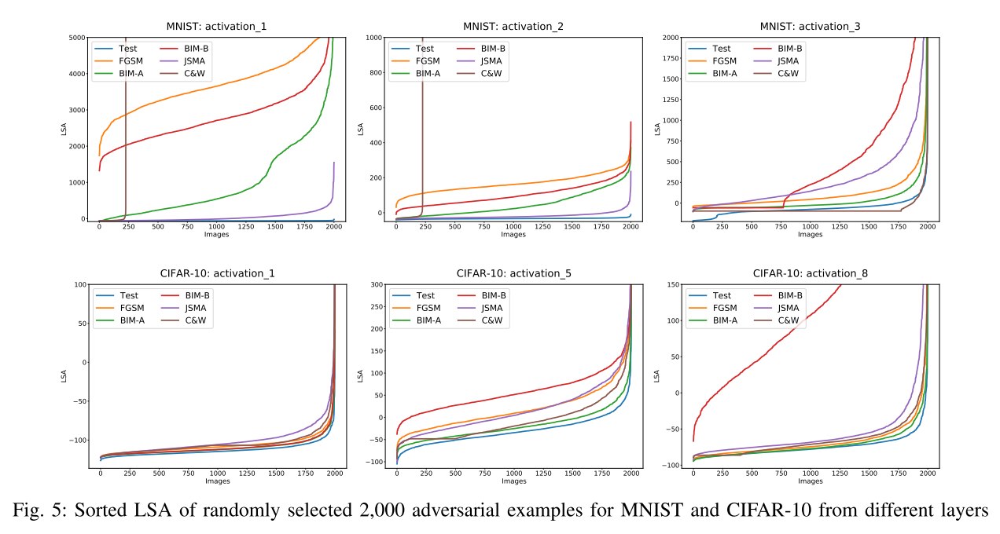

  - 最后，表III给出了MNIST和CIFAR-10中使用所有神经元进行基于DSA的分类的ROC-AUC结果。结果表明，图4中DSA值的差距可以用于对敌对的例子进行高精度的分类。

  - 对于相对简单的MNIST模型，分类器的ROC-AUC范围在96.97% - 99.38%之间，可以检测出对抗样本。

  - 对于更复杂的CIFAR-10模型，基于DSA的分类显示较低的ROC-AUC值，但RQ2的回答表明，来自特定层次的DSA可以产生明显更高的精度。

    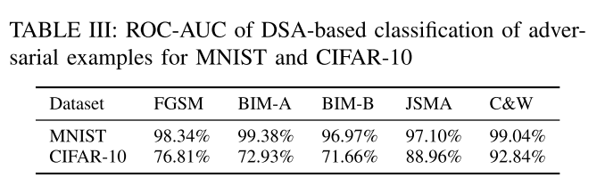

  - **基于三种不同的分析，RQ1的答案是SADL可以捕获输入的相对惊喜。高SA的输入更难正确分类;对抗性实例的SA值较高，可以根据SA进行相应的分类**。

### RQ2：神经元层的选择是否对SA反映DL系统行为的准确性有任何影响?

- 实验方法：我们通过计算各层的LSA和DSA，然后通过比较各层在SA上训练的对抗性例分类器来评估在SA上下文中的假设。

- MNIST实验结果

  - 表IV给出了对敌示例分类的ROC-AUC，结果每一行分别对应MNIST中特定层的LSA和DSA上训练的分类器。行按其深度排序，即，activation_3是MNIST中最深也是最后一个隐藏层。每种攻击策略的最高ROC-AUC值以粗体显示。对于MNIST来说，没有明确的证据表明最深的一层是最有效的。

    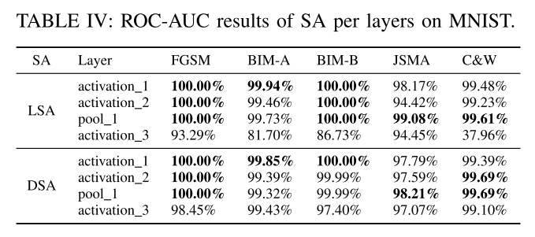

    - 图5可以解释ROC-AUC是100%的情况：MNIST activation_1对抗样本和测试集里的样本曲线清晰地分离。而MNIST activation_3的LSA曲线有很多交叉。（这个结果比较反直觉）

- CIFAR-10实验结果

  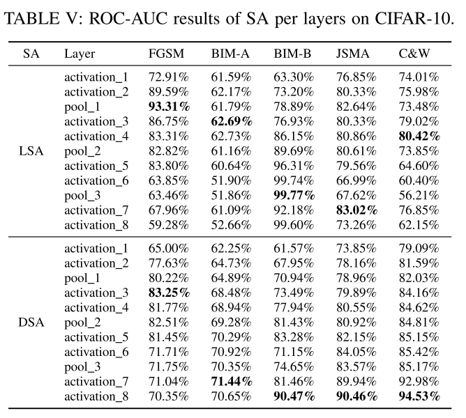

  - 对于LSA，没有强有力的证据表明最深的层产生最准确的分类器。
  - 然而，对于DSA，最深层次为五种攻击策略中的三种(BIM-B、JSMA和C&W)生成最准确的分类器，而第二层为BIM-A生成最准确的分类器。更重要的是，**单层**DSA比所有**神经**元DSA值产生的分类结果要准确得多（从表III与表IV和表v的对比可以看出）。

- 总结：DSA对其计算的层的选择很敏感，选择较深的层是有益的。然而，对于LSA，没有明确的证据支持更深层次的假设。不同的实例生成策略的层敏感性不同。

### RQ3：SC是否与DL系统的现有覆盖率标准存在相关性?

- 实验方法

  - 我们通过累计添加输入控制输入的多样性，执行DL与这些输入，系统研究和比较各种覆盖标准的观察到的变化。包括SC和四个现有的标准:NC、KMNC、NBC、SNAC。
  - 对于MNIST和cifar-10，我们从数据集提供的原始测试数据(10000幅图像)开始，每一步添加由FGSM、BIM-A、BIM-B、JSMA和C&W生成的1000个对抗性示例。
  - 对于Dave-2，我们从原始测试数据(5614张图像)开始，在每一步添加由DeepXplore生成的700张合成图像。
  - 对于Chauffeur来说，每一步增加1000张合成图像(Set1到Set3)，每一张图像都是通过应用随机数量DeepTest的变换生成的。

- 实验结果

  - 表6显示了不同的覆盖率标准如何对日益增加的多样性水平作出反应。列表示步骤，在每一个步骤中会向原始测试集添加更多的输入。如果与前一个步骤相比，**步骤中覆盖率的增加小于0.1个百分点，则该值加下划线**。

    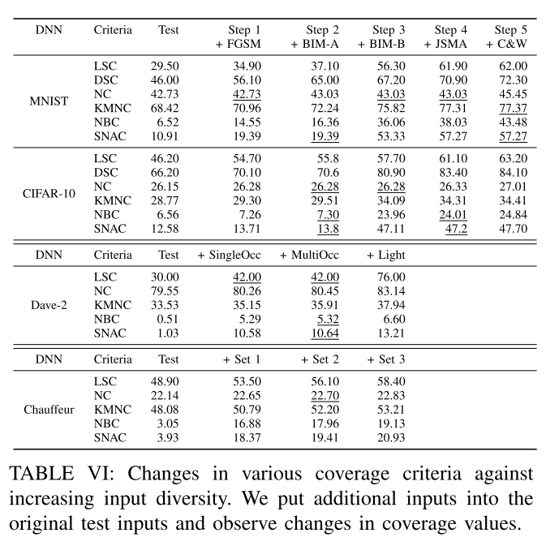

  - 图6显示了来自CIFAR-10和Chauffeur的结果的可视化。(注意DSC不能为这两个DL系统计算，因为它们不是分类器。)

    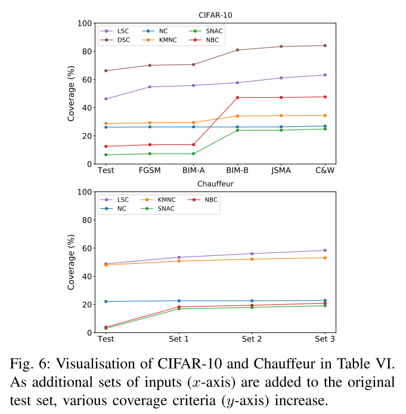

  - 总的来说，大多数研究的标准会随着每一步的额外输入而增加。**值得注意的例外是NC，它会在许多步骤中停滞不前。**这与DeepGauge的结果一致。

  - 添加的输入类型与不同标准的响应之间存在相互作用:SNAC、KMNC和NBC在CIFAR-10中加入BIM-B示例时显著增加，但在添加C&W输入时变化不大。但是，对于Chauffeur，只有SNAC和NBC在增加输入集1时表现出类似的增长，而KMNC的增长更为稳定。

  - 总的来说，除了NC之外，我们回答了RQ3, SC与到目前为止引入的其他覆盖率标准相关。

### RQ4：SA能否指导DL系统的再训练，以提高它们在对抗样本和由DeepXplore生成的合成测试输入时的准确性?

- 实验方法：

  - 我们检查SA是否可以指导额外训练输入的选择。从这些模型的对抗样本和合成输入中，我们从四个不同的SA范围中选择了4组100张图像。已知$U$为RQ3中用于计算SC的上界，我们将SA $[0, U]$的范围划分为四个重叠的子集: 第一个子集包括低25%的SA值($[0,\frac{U}{4}]$)，第二个子集包括低25%的SA值($[0,\frac{2U}{4}]$)，第三个子集包括低75%的SA值($[0,\frac{3U}{4}]$)，最后是整个范围$[0,U]$。这四个子集代表越来越多样化的投入。我们将范围R设为这四个中的一个，从每个R中随机抽取100张图像，并对现有的模型进行5个额外的epoch训练。最后，我们分别测量每个模型在整个敌对和合成输入下的性能(MNIST和cifar-10的精度，Dave-2的MSE)。我们期望用更多样化的子集进行再培训将会带来更高的性能。

- 实验结果

  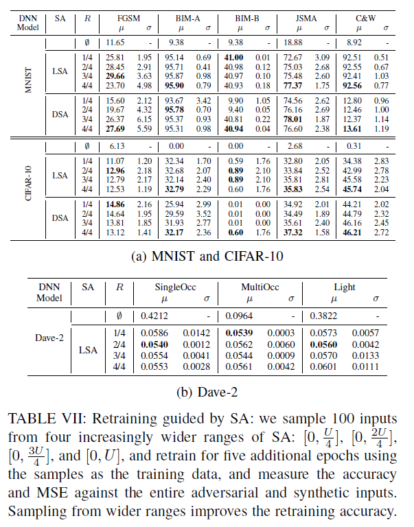

  - 虽然我们的观察局限于DL系统和这里研究的输入生成技术，我们回答RQ4, SA可以提供指导，更有效的再训练DL系统。

## 可控制参数/变量

- 选择神经元的层（单层/所有层）
- 过滤神经元的方差阈值
- SA预定义的上界$U$
- 覆盖率计算式bucket个数（划分的段数）

## 参考

https://blog.csdn.net/qq_33935895/article/details/101155270