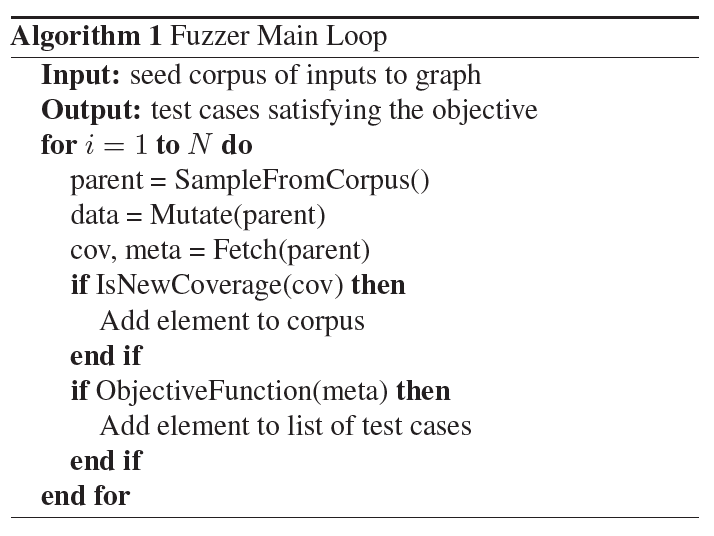
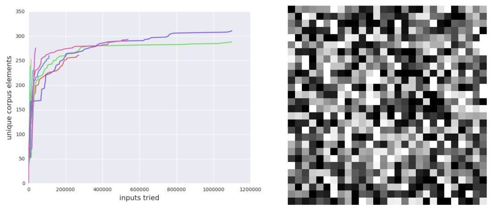

原文：TensorFuzz: Debugging Neural Networks with Coverage-Guided Fuzzing （ICML'19) <!--more-->

代码：https://github.com/brain-research/tensorfuzz

## 方法

### CGF基本流程

### 方法细节

- 输入选择：选择更新鲜的输入

- 输入变换：①白噪声（参数由用户给出）；②增加$L_{\infty}$约束的白噪声

- 目标函数：用户根据覆盖率和元数据情况自定义

-  覆盖分析器：当我们得到一个新的激活向量时，我们可以查找它的最近邻居，然后检查这个最近的邻居在欧几里得距离中有多远，如果这个距离大于某个量，就向语料中添加输入。
  - 可只选择部分神经元的值作为激活向量，如只选logits或logits前一层

## 实验

### 实验1：CGF可以高效地找到已训练神经网络的数值错误（导致NaN的错误）

- 实验方法：使将检查数值运算添加到元数据并运行模糊测试器（fuzzer）。我们训练了一个完全连接的神经网络来对MNIST数据集里的数字进行分类，故意用了一个很糟糕的交叉熵损失，这样就有可能出现数值误差。模型进行了35000步的训练，mini-batch size为100，验证精度为98%。检查MNIST数据集中不含导致数值误差的样本。

- 实验结果：TensorFuzz 却在10次随机初始化后快速找到了 NaN错误。

  

  - 基于梯度的搜索技术可能无助于查找数值误差
  - 随机搜索对于查找数值误差来说效率极低。

  ### 实验2：CGF 解决模型和量化版本不一致的问题

  - 仅检查已有的数据只能找到很少的错误：作为基线实验，我们训练了一个使用 32 位浮点数的 MNIST 分类器（这一次没有故意引入数值错误）。然后把所有权重和激活值修剪为 16 位。之后，我们对比了 32 位和 16 位模型在 MNIST 测试集上的预测，没有找到任何不一致性。

  - CGF 可以快速在数据周围的小区域中找到很多错误：然后运行 fuzzer，变化限制在种子图像周围的半径为 0.4 的无限范数球中，其中仅使用了 32 位模型作为覆盖的激活值。我们将输入限制在种子图像附近，因为这些输入几乎都有明确的类别语义。模型的两个版本在域外的垃圾数据（没有真实类别）上出现不一致性并没有什么意义。通过这些设置，fuzzer 可以生成 70% 样本的不一致性。因此，CGF 允许我们寻找在测试时出现的真实错误.

  ### 实验3：TensorFuzz可以发现流行模型实现中的bug

  ### 实验4：TensorFuzz可以帮助进行保持语义的代码转换

## 可控制变量及参数总结

-  输入选择策略

- 变换参数

- 目标函数

- 激活神经元集合

- 距离阈值L

