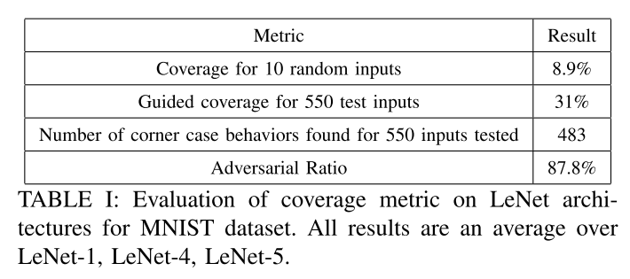

原文：Towards Improved Testing For Deep Learning（ICSE-NIER’19）<!--more-->

## 概括

提出了一种2-路覆盖标准：每个神经元单独对下一层神经元值的条件影响以及上一层中神经元值的组合对下一层神经元值的影响。

## 当前领域的提升空间

### 目前覆盖方法的局限性
- DeepXplore：神经元覆盖率粗糙、不充分
- DeepCover：DeepCover的覆盖标准考虑了DNN相邻层中的条件判定依赖性。该方法除了时在相对较小的网络上测试之外，它的前提条件还要求DNN是前馈全连接的神经网络。而且它不能推广到诸如RNN、LSTM、attention网络等的架构。DeepCover不考虑神经元在其所在层的环境，即同一层中神经元输出的组合。
- DeepCT：DeepCT的组合测试是启发于覆盖标准：根据每层激活的神经元比值描述测试输入所使用的逻辑比值。它没有考虑DNN中的层级之间的关系，并且也没有被证实可以扩展到具有不同类型层的、能用于真实世界的DNN

### 目前测试输入生成方法的局限性

测试输入可以通过指导方式生成或选择得到，它通常有两个主要目标：最大化未覆盖故障的数量，并最大化覆盖范围。 目前测试输入生成方法存在一些主要缺点：

- 修改现有测试输入直到找到满足标准的测试输入的迭代过程单次执行耗时长。
- 与总的测试和生成的输入数量相比，那些能够导致覆盖范围和/或发现的角落案例增加的测试输入数量相当低。

### Oracle选择方面的局限性

- 最直接的方法是收集尽可能多的实际数据并手动标记以检查其是否正确。但是，这样的过程需要大量的手动工作。
- 在某些工作中，会使用同一任务的多个实现作为oracle，并将其中的的差异行为标记为角落案例行为。然而，我们观察到这种方法会错误地将某些角落情况分类为正确的行为，此外，此方法仅在具有多个高精度且相似的实现的应用程序中有效。

## 本文方法

在本文中，作者基于对内部决策逻辑的覆盖提出了一个包含两个因子的覆盖标准:  DNN中的每个三元组$(n_{i,k-1}, n_{j,k-1}, n_{q,k})$的组合覆盖情况

（覆盖率居然没有形式化定义？？）

解释：

- 每个神经元单独对下一层神经元值的条件影响
  - 受MC/DC启发
- 上一层中神经元值的组合对下一层神经元值的影响
  - 受组合测试启发

对于一个初始测试输入的结果，我们通过联合优化来实现指导测试输入的生成。任何没有达到100%覆盖率的三元组被随机选择，以确定哪些激活值的组合没有被覆盖。比如若对一个DNN三元组激活实例：$n_{i,k-1}$激活, $n_{j,k-1}$不激活，$n_{q,k}$激活，优化目标为：（直接将三者相加）

$ F_{n,t}=f_{n_{i,k-1}}(t)+f_{n_{j,k-1}}(t)+f_{n_{q,k}}(t) $ 

通过这种迭代修改输入的方式最大化目标函数，以达到期望的三元组某种激活状态，从而覆盖三元组不同的激活状态，达到100%覆盖。

## 实验

- 数据集和模型：MNIST上的三个DNN——LeNet-1，LeNet-4和LeNet-5
- 覆盖指标：
  - 10个随机测试输入获得的覆盖率（理想情况下应该很低）
  - 边角案例数与总测试输入数的比率
- 借鉴DeepXplore，我们使用**多种实现**作为oracle，只有一种图像处理——**亮度**。

- 实验结果

  - 结果显示，前面工作在相同的指标下获得了更高的覆盖率和对比值，而使用作者提出的标准时覆盖率直线下降，体现出作者提出的标准较于先前工作粒度更细。

    

  

## 参考

https://blog.csdn.net/ChapterZ/article/details/96116870