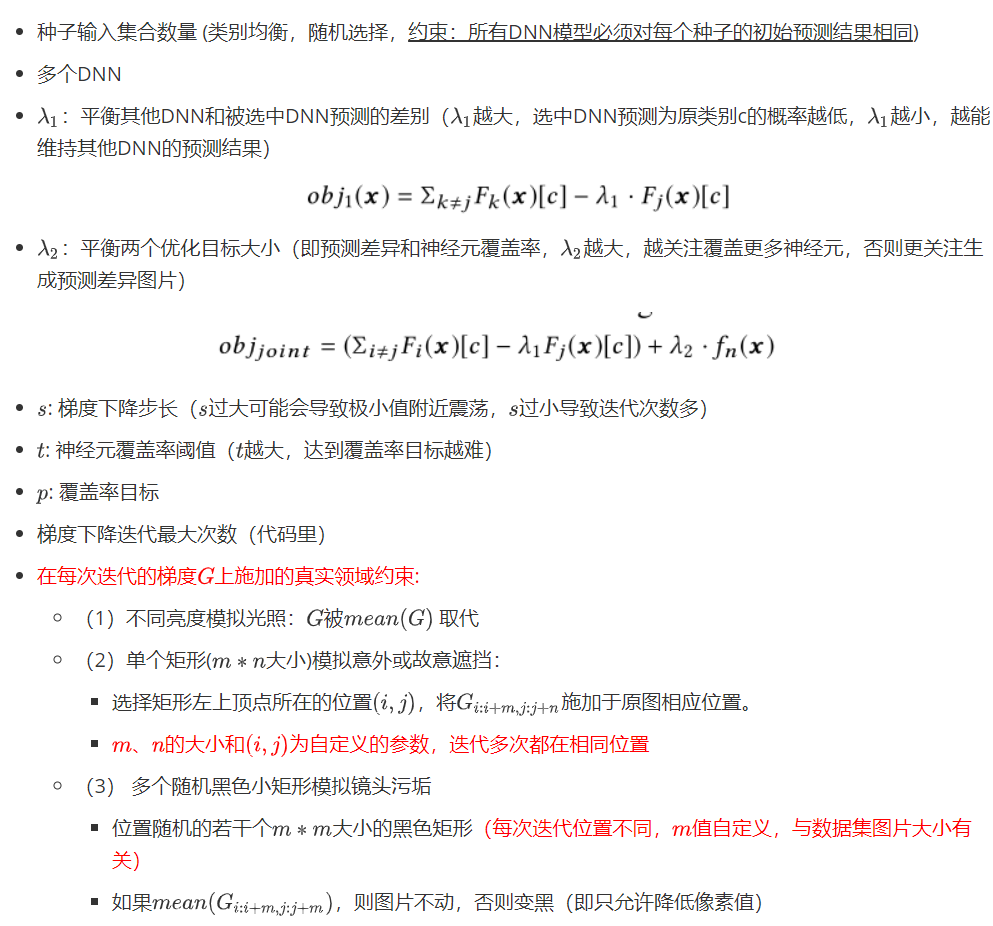
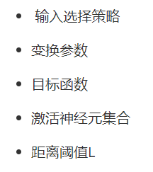
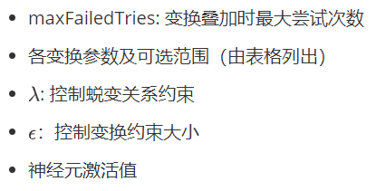
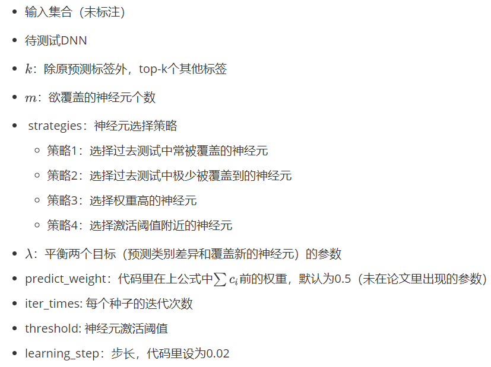
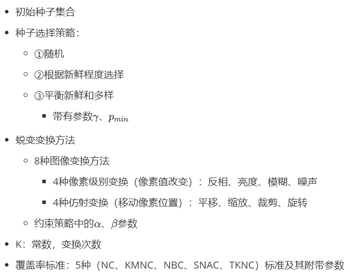
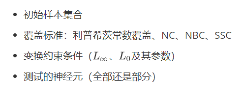
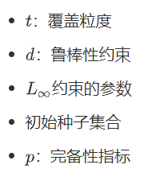
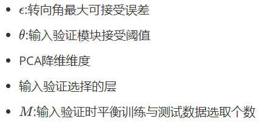

## 共同参数或变量总结<!--more-->

- 初始输入种子集合相关变量
  - 数量：1个到几千个不等
  - 采样方式：均为随机
    - DeepXplore还要求了**类别平衡**
  - 是否标注
    - 若已标注，是否要求**初始预测结果正确**（DeepCT要求了）
    - 未标注（DeepXplore要求其使用的多个模型预测一致，DLFuzz）
- 测试标准/覆盖率相关变量
  - 计算方式
    - DeepTest中修改了卷积层神经元覆盖率的计算方式：输出特征图的平均值与激活阈值做比较
  - 神经元覆盖率采用的激活阈值
    - 原算法：将所有输出值缩放到[0,1]，然后设置阈值（离群点等会否导致不同数据集阈值差距很不同）
    - DeepXplore中用过多种阈值（0、0.25、0.75等），后人多数用的0，也有0.75等
  - 覆盖神经元集合的选择：
    - 多数选择所有层的神经元
    - 个别选择去掉一些层
      - 如DeepXplore测试达到100%覆盖率所用的时间时去掉了全连接层（但覆盖全连接层意义应该更大？）
      - TensorFuzz要求用户自己选择层
- 图像上增加的扰动相关变量
  - 扰动生成方式
    - 基于梯度优化
    - 基于覆盖率引导的模糊测试
    - 基于约束求解
    - 基于搜索
  - 扰动种类
    - DeepTest说不同种类变换能激活不同神经元（存疑）
  - 扰动位置：
    - DeepXplore中的单个矩形位置由用户提前设定，多个黑色矩形的位置随机
  - 扰动大小：
    - DeepXplore中的矩形大小由用户提前设定（与数据集图像大小有关）
  - 扰动约束条件：
    - $L_0-norm$
      - 如DeepCheck（识别重要像素攻击）
    - $L_1-norm$
      - DeepXplore未对距离做限制，甚至认为$L_1$距离越**大**多样性越好
    - $L_2-norm$
      - 如DLFuzz：满足L2距离（<0.02）（计算方式为L2_norm / orig_L2_norm）
    - $L\infty-norm$
      - 如TensorFuzz
    - 平衡$L_0$和$L\infty-norm$
      - 如DeepHunter采用的
    - 约束MSE（DeepTest)：$|MSE(trans,param)-MSE_{org}|\leq \epsilon$ (用到了oracle)

- 模糊测试相关变量（DLFuzz、TensorFuzz、DeepHunter、DeepTest）
  - 判断种子是否应该保留在队列时最少需提升的覆盖率
  - 每个种子的迭代次数
  - 从队列中优先挑选哪些种子的策略
    - 随机
    - 选择新鲜的
    - 平衡新鲜和多样性
- 优化算法相关变量
  - 优化目标选择需要新激活的神经元个数？
- 其他
  - 每个种子生成对抗样本的个数
    - 有的方法只生成一张，有的多张
  - 蜕变关系
    - 图像分类问题：扰动满足约束的情况下，预测类别应该不变
    - 回归问题：
      - DeepTest：因为只测试了Driving数据集（回归问题），使用MSE判断蜕变关系是否满足$(\theta_i-\theta_{ti}) \leq \lambda MSE_{orig}$
      - DeepRoad：没有使用MSE，直接比较输出结果是否小于阈值$\epsilon$

## 测试输入生成类论文总结

|                            文章名                            | 可控制参数/变量总结                                          |
| :----------------------------------------------------------: | :----------------------------------------------------------- |
|                   DeepXplore (SOSP’17)                   |            |
|                   TensorFuzz (ICML’19)                   |  |
|                    DeepTest (ICSE'18)                    |  |
|                   DLFuzz (ESEC/FSE’18)                   |  |
|                 DeepHunter （ISSTA’19）                  |  |
|                 DeepConcolic （ASE’18）                  |  |
| DeepCT (SANER’19) (未找到代码) |  |
| DeepCheck （ISSRE’18） (未找到代码) |  |
| DeepRoad （ASE’18） (未找到代码) |  |

