原文：Adversarial Sample Detection for Deep Neural Network through Model Mutation Testing  (ICSE'19)  <!--more-->

代码地址：https://github.com/dgl-prc/m_testing_adversatial_sample

## 动机

目前对抗样本检测方法：

- 训练数据扩充+重训练：不能防止未知的对抗样本
- 鲁棒优化、对抗训练：增加了训练成本
- 测试标准、黑盒测试、白盒测试、concolic测试等：不能提升DNN鲁棒性，也不能为DNN在被对抗攻击时提供鲁棒性保证
- 形式化验证DNN的鲁棒性：高成本、只针对少量特定类型DNN和特定性质

本文：

- 通过DNN模型的变异测试和提出了一种运行时检测对抗样本的方法。
- 基于的观察：相比正常样本，对抗样本对于模型的变异更加敏感（预测标签更易改变）

## 方法

### 模型变异方法

采用DeepMutation中的4个模型级变异方法（无须训练）：

- Gaussian Fuzzing（GF）：根据高斯分布扰动权重

  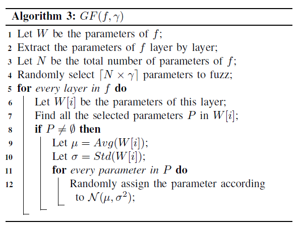

- Weight Shuffing（WS）：随机排列选中的权重

  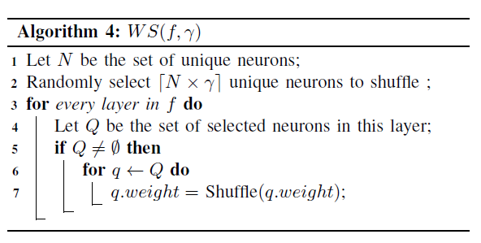

- Neuron Switch（NS）：交换同一层的两个神经元

  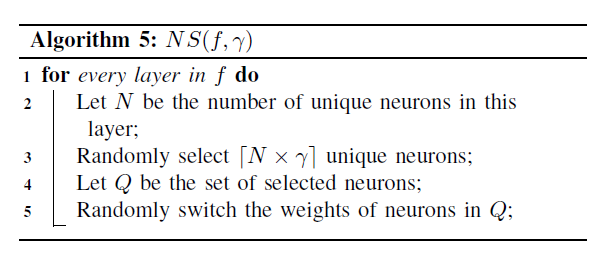

- Neuron Activation Inverse（NAI）：变更神经元的激活状态

  

### 验证假设（Empirical study）

通过实验验证对抗样本和正常样本的标签改变率（Label change rate， LCR）的差异。由于生成的变异模型可能存在质量很低的情况，因此我们扔掉了在验证集上低准确率的模型（如准确率低于90%的）。

令变异后的模型集合为$F$，变异模型$f_i$对于输入$x$的预测标签$f_i(x)$，LCR的计算方法：

$\zeta ( x ) = \frac { | \{ f _ { i } | f _ { i } \in F \text { and } f _ { i } ( x ) \neq f ( x ) \} | } { | F | }$

直觉上，LCR衡量了一个输入$x$对于DNN变异模型的敏感程度。

**在MNIST和CIFAR-10上的实证研究**

- 使用NAI变异方法生成了500个变异模型（随机选择一些神经元，更改激活状态）
- 实验结果：对抗样本的预测标签更易受到扰动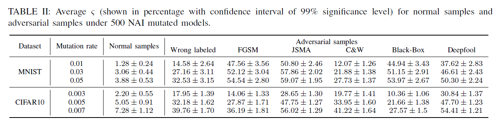
- 解释：对抗样本常处于决策边界附近，更易受到模型扰动的干扰。

### 检测算法

- 输入：一个DNN模型$f$，一个样本$x$，阈值$\zeta_ h$（可自动计算获得）

- 使用假设检验：

  ​	$ H_{0}: \zeta (x) \geqslant \zeta_ h $

  ​	$ H_{1}: \zeta (x) \leqslant \zeta_ h $

  - 三个标准参数$\alpha$、$\beta$、$\delta$，控制错误可能性
    - Type I 错误（H0为真但拒绝H0）的可能性小于$\alpha$
    - Type II 错误（H1为真但拒绝H1）的可能性小于$\beta$
    - indifferent region：$(r-\delta,r+\delta)$

- 不断生成mutate后的模型（准确率大于阈值），直到触发停止条件。（模型可保存使用，无需运行时生成）

- 两种方法决定算法是否停止（我们有足够信心拒绝假设）

  - 1、Fixed-size Sampling Test (FSST)：运行固定数量的测试

  - 2、Sequential Probability Ratio Test (SPRT)：模型数量不固定，每次更新阈值$\zeta_ h$后自动判断是否停止，一般运行速度更快（拒绝假设后就停止运行）。

    - SPRT概率计算方法：$ pr= \frac{p_{1}^{z}(1-p_{1})^{n-z}}{p_{0}^{z}(1-p_{0})^{n-z}} $，其中$p_1=\zeta_ h - \delta$，$p_0=\zeta_ h + \delta$

    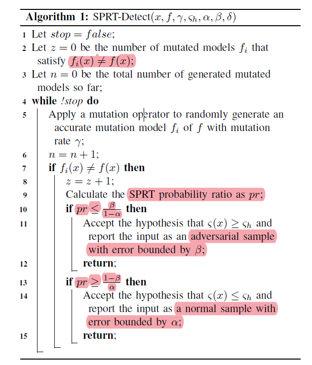

## 实验

### 实验设置

- 模型和数据集

  - MNIST-LeNet：236个神经元
  - CIFAR10-GoogleNet：7914个神经元

- 变异率

  - MNIST模型：{0.01,0.03,0.05}
  - CIFAR10模型：{0.003,0.005,0.007}

- 保留测试集上准确率高于90%的变异模型。每种变异率生成500个变异模型。

- 对抗样本生成方法

  - FGSM
  - JSMA
  - C&W
  - DeepFool
  - Black-Box

- 每种攻击方法生成1000张图片（不一定都攻击成功）

  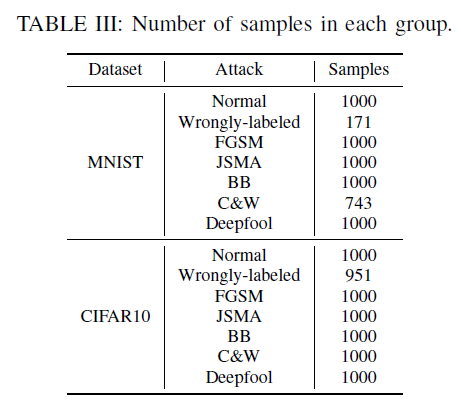

- 评价指标

  - 标签改变率的距离$d_{lcr}=\zeta_{adv}/\zeta_{nor}$，越大表明对抗样本与正常样本的标签改变率差异越大
  - ROC、AUC
  - 检测准确率：二分类（正常/异常样本）准确率

### RQ1 正常样本和对抗样本的LCR是否有显著差异？

结合Table II和IV可见，对抗样本LCR显著高于正常样本。

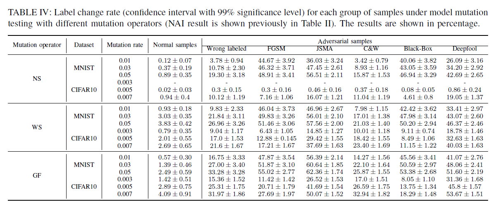

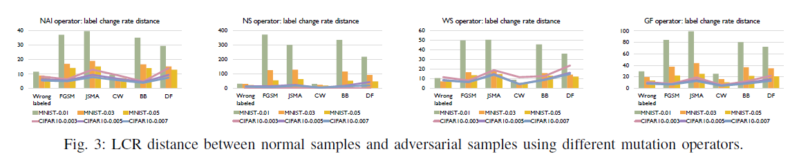

### RQ2：LCR是否适合作为检测指标？

多数情况下LCR比baseline的AUROC更高。

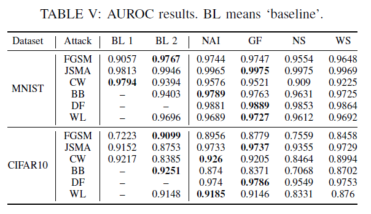

### RQ3：检测对抗样本的效果如何？

检测精度和最少mutation次数：

- 设置$\zeta_h=\rho \cdot \zeta_{nor}$，其中$\zeta_{nor}$为正常样本lcr的上界

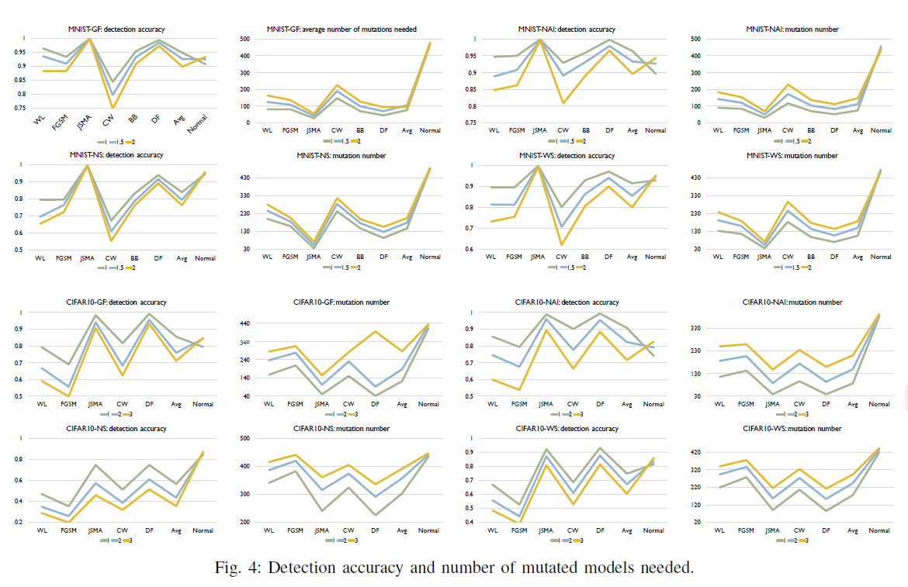

### RQ4：检测算法的开销如何？

$c_g$：生成变异模型的时间

$c_f$：前向传播预测的时间

检测一张图片的时间开销：$C=n(c_g+c_f)$，$n$为生成模型的个数

检测$m$张图片的时间开销：$C(m)=m\cdot n \cdot c_f + n \cdot c_g$

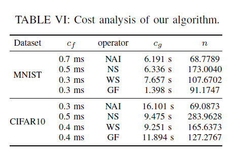

