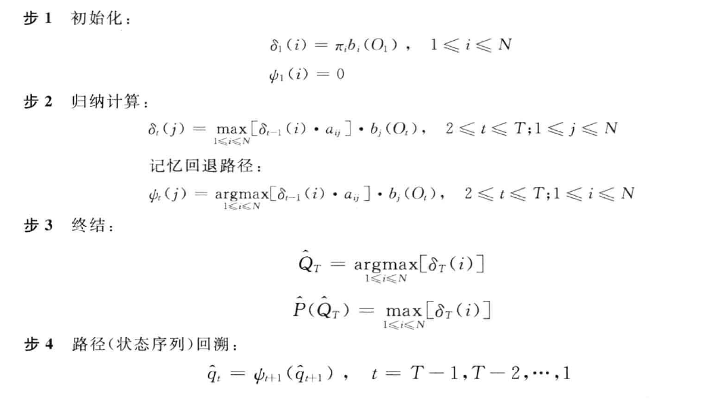

## 1 基于规则的传统自然语言处理方法
### 什么是自然语言处理<!--more-->

- 语⾔
  - 自然语⾔（⼈类语⾔）
  - 程序语⾔（⼈⼯语⾔）
  - 是⼀种由三部分组成的符号交流系统：记号，意义和连接两者的符码。
  - 语⾔视作由组合语法规则制约、旨在传达语义的记号形式系统。
  - ⼀种口头或符号上的⼈类交流系统。
- **自然语言处理（Natural Language Processing, NLP）**
  - **利用计算机为⼯具对自然语言进⾏各种加⼯处理、信息提取及应⽤的技术。**
  - **自然语言理解：强调对语言<u>含义和意图的深层次解释</u>**
  - 计算语⾔学：强调可计算的语⾔理论

### 自然语言处理的实现方法

- **基于知识工程的理性方法（ Rationalist approach）**
  - 以**规则**形式表达语言知识。
  - 基于规则进行符号推理 ，从而实现语言信息处理。
  - 强调人对语言知识的理性整理（受 Chomsky 主张的<u>人具有先天语言能力观点</u>的影响 ）。
- **基于数据的经验方法（ Empiricist approach）**
  - 以大规模语料库为语言知识基础。
  - 利用统计学习 和基于神经网络的深度学习方法自动获取隐含在语料库中的知识，学习到的知识体现为一系列模型参
    数。 （训练基于学习到的参数和相应的模型进行语言信息处理。）
- **混合方法**
  - **理性方法的优、缺点**
    - 相应的语言学理论基础好
    - 语言知识描述精确
    - 处理效率高（确定性推理）
    - 知识获取困难（需要专业人员，高级劳动）
    - 系统鲁棒性差：不完备的规则系统将导致推理的失败
    - 知识扩充困难，并且很难保证规则之间的一致性
  - **经验方法的优、缺点**
    - 知识获取容易（低级劳动）
    - 系统鲁棒性好（概率大的作为结果）
    - 知识扩充容易、一致性容易维护
    - 相应的语言学理论基础差（可解释性差）
    - 缺乏对语言学知识的深入描述和利用，过于机械
    - 处理效率低（大数据、高维度计算）

- **自然语言处理的难点**
  - **歧义处理**
    - 自然语言充满了大量的歧义（为什么？）
    - <u>有限的词汇和规则表达复杂、多样的对象</u>
  - 语言知识的表示、获取和运用
  - 成语和惯用型的处理
  - **对语言的<u>灵活性和动态性</u>的处理**
    - 灵活性：同一个意图的不同表达，甚至包含错误的语法等
    - 动态性：语言在不断的变化，如：新词等
  - 对常识等与语言无关的知识的利用和处理（上下⽂和世界知识（语⾔⽆关）的利⽤和处理）

### 基于规则的自然语言处理方法（理性方法，传统方法）

#### 概述

- 以 规则 形式表达语言知识。
- 基于规则进行 符号推理 ，从而实现语言信息处理。
- 强调人对语言知识的理性整理（知识工程）。
- 受计算语言学理论指导。
- 语言处理规则作为数据，它与程序分离，程序体现为规则语言的解释器。

#### 词法分析

- 形态还原（针对英语、德语、法语等）
  - 把句子中的词还原成它们的基本词形（原形）。
- 词性标注
  - 为句子中的词标上预定义类别集合中的类。
  - 方法：词典和规则提供候选词性，消歧规则进行消歧
- 命名实体识别
  - 识别出句子中的人名、地名、机构名等。
- 分词（针对汉语、日语等）
  - 识别出句子中的词。
  - 一般通过分词词典和分词规则库进行分词。
  - 中文分词
    - 任务描述：分词是指根据 某个分词规范 ，把一个字串划分成词串。
    - 难点问题
      - 切分歧义
        - 分类
          - 交集型歧义
            - ABC 切分成 AB/C 或 A/BC
            - 如： 和平等
          - 组合型歧义
            - AB 切分成 AB 或 A/B
            - 如： 马上
          - 混合型歧义
            - 由交集型歧义和组合型歧义嵌套与交叉而成
              - 如：“得到达”（交集型、组合型）
      - 一般通过<u>分词词典</u>和<u>分词规则库</u>进行分词。主要方法有：
        - 正向最大匹配 (FMM）或逆向最大匹配 (RMM)
        - 双向最大匹配（能发现交集型歧义）
        - 正向最大、逆向最小匹配（发现组合型歧义）
        - 逐词遍历匹配
          - 在全句中取最长的词，去掉之，对剩下字符串重复该过程
        - 设立切分标记
          - 收集词首字和词尾字，把句子分成较小单位，再用某些方法切分
        - 全切分
          - 获得所有可能的切分，选择最大可能的切分

#### 句法分析

- 确定句子的组成
  - 词、短语以及它们之间的关系
- 句法分析任务的类型
  - 组块分析（浅层句法分析、部分句法分析）：
    - 识别基本短语（非递归的核心成分）
  - **组成分分析（结构分析，完全句法分析）**
    - 识别词如何构成短语、短语如何构成句子
    - 句法分析的目的
      - 判断句子的合法性（句子识别）
      - 确定句子的结构（句子中单词相互关联的方式）
    - 基于上下文无关语法（ CFG ）的句法分析
      - CFG 能描述大部分的自然语言结构
      - 可以构造高效的基于 CFG 的句法分析器
    - 通常采用树形结构来表示句法分析的结果
  - 依存分析
    - 识别词之间的依赖（或支配）关系

#### 语义分析

- 语义分析的目的是给出语言表达的含义或意义 ( 。

- 语义分析包括

  - 词义分析（词义表示及多义词消歧等）
  - 句义分析（句义表示及句义计算等）
  - 篇章语义分析（指代、实体关系等）

- 词汇的语义表示：

  - 义项（义位）

  - 语义类

  - 义素组合

### 往年考题

- 语言、自然语言、自然语言处理
- 你认为自然语言理解和自然语言处理概念本身的区别？

- 相比于程序设计等人工语言，为什么自然语言的处理和理解更难？结合一些示例说明

- 中文分词的任务描述、难点问题以及解决问题的技术和方法

- 规则、统计、神经网络方法的优缺点（结合文本分类）

  - 统计和机器学习方法的特点是，对特征工程的依赖比较大。这是个双刃剑：当训练数据量比较小的时候，我们可以凭着对业务和数据的理解，为模型添加大量先验知识，让它站在我们的肩膀上；当然，这样做会消耗我们的时间和精力。

  - 神经网络的突出优势是：

    (1)结构灵活。可以基于常用结构方便地设计出各式各样的结构，以处理各式各样的任务。

    (2)信息容量大。神经网络是众多机器学习模型中，效果上限最高的之一。神经网络可以拟合任意复杂的函数。

    (3)文本表示自动化。神经网络方法大部分情况下会采用词token的分布式表示作为输入特征——这种特征工程方法的泛化性比较强，不需要太多背景知识就可以得到比较好的特征。“万物皆可嵌入”这句口号还是有点道理的。

- 比尔盖茨说语言理解是人工智能皇冠上的明珠。给出对于这句话的理解。

> 在以计算、记忆为基础的「运算智能」之上，是以听觉、视觉、触觉为代表的「感知智能」，反映在人工智能技术上为语音识别和图像识别。再之上则是「认知智能」，包含语言、知识和推理。金字塔的顶端，则是「创造智能」，想象一些不存在的事情包括理论、方法、技术，通过实验加以验证，然后提出新的理论。
>
> 语言智能是人工智能皇冠上的明珠，如果语言智能能够突破，与他同属认知智能的知识和推理就会得到长足的发展，整个人工智能体系就会得到很好的推进，也有更多的场景可以落地。

## 2 语言模型

### 语言模型

- 定义：语言模型是用来刻画一个句子（词串序列）存在可能性的概率模型

### N-Gram 语言模型

#### N-Gram模型

- 基于历史的模型，有限视野假设(Limited Horizon)：当前词出现的概率只和它前面的k个词相关 
  $$
  P(W)=P(w_{1}w_{2} \ldots w_{n})= \prod _{i=1..n}P(w_{i}|W_{i-k} \cdots W_{i-1})
  $$

  - 二元语言模型：（k=1）1阶马尔可夫链 $ P(W)=P(w_{1}w_{2} \cdots w_{n})=P(w_{1}) \prod _{i=2..n}P(w_{i}|w_{i-1}) $ 
  - 三元语言模型：（k=2）2阶马尔可夫链 $ P(W)=P(w_{1}w_{2} \ldots w_{n})=P(w_{1})P(w_{2}|w_{1}) \prod _{i=3..n}P(w_{i}|w_{i-2}w_{i-1}) $ 

- N-Gram参数估计：相对频率（最大似然）估计
  $$
  P(w_i|w_{i-1})=\dfrac{P(w_{i-1}w_i)}{P(w_{i-1})}=\dfrac{Count(w_{i-1}w_i)}{\sum_wCount(w_{i-1}w)}=\dfrac{Count(w_{i-1}w_i)}{Count(w_{i-1})}
  $$

- Zipf Law：如果以词频排序，词频和排位的乘积是一个常数。
  - Zipf法则隐含的意义：大部分的词都稀有
  - 语言中频繁出现的事件是有限的，不可能搜集到足够的数据来得到稀有事件的完整概率分布。
  - 词（一元）如此，对于二元、三元模型更加严重
  - 零概率还会向下传播，一个2元或者3元文法的零概率，会导致整个句子的零概率
- 数据稀疏（零概率）：没有足够的训练数据，对于未观测到的数据，出现零概率现象
  - 解决方案
    - 构造等价类
    - 参数平滑

#### 参数平滑

- 平滑是指给没观察到的N元组合赋予一个概率值，以保证词序列总能通过语言模型得到一个概率值。约束总该率和为1。
- 思想：稍微减少已观察到的事件概率的大小，同时把少量概率分配到没有看到过的事件上，折扣法，使整个事件空间的概率分布曲线更加平滑。改进模型的整体效果。
  
- “劫富济贫”：高概率调低点，小概率或者零概率调高点。
  
- 1、加法平滑方法：简单，效果不好

  $$ P_{add- \delta }(x)= \dfrac{c(x)+ \delta }{ \sum _{x^{ \prime }}(c(x^{ \prime })+ \delta )} $$

  加一平滑前：

  

  

  加一平滑后：

  

- 2、Laplace平滑

- 3、简单线性插值平滑

#### 模型评价

- 困惑度(Perplexity)：对测试集存在的概率

#### N-gram的缺点

从语言具有的特性看，显得过于简单和幼稚

- 数据稀疏、参数空间过大
- 基于词的，无长距离依赖，无结构、语义支持
- 泛化能力差

### 神经网络语言模型

- 对比N-gram和FNNLM的优缺点 
- FNNLM：复杂，自动提取特征、泛化能力强

### 往年考题

- 自左向右定义一个n-gram，得到一个三元文法，也可以按照相反的顺序自右向左定义得到一个三元文法，证明二者等价。
- 

## 3 文本分类

### 朴素贝叶斯模型

基本思想：**利用特征项和类别的<u>联合概率</u>来估计给定文档的<u>类别概率</u>**

D为待分类的文档，$c_k$指第k个类别
$$
\begin{align}
argmax_{c_k}P(c_k|D)&=arg \max _{c_{k}}\dfrac{P(D|c_k)P(c_k)}{P(D)}\\&=arg \max _{c_{k}}P(D|c_k)P(c_k) \\
\end{align}
$$

#### 伯努利文档模型

- 一个文档被表示成01向量，向量中每一个元素表示相应的单词是否在文档中出现了
- 令$D_i$表示第i个文档的01向量；$D_{it}$表示第i个文档的01向量中第t个元素的值（是一个随机变量），即单词$w_t$是否在文档i中出现了
- $P(w_t|c_k)$表示单词$w_t$在$c_k$类文档中出现的概率，估计：$P(w_t|c_k)=\dfrac{c_k中w_t出现的文档个数}{c_k中所有文档的个数}$ 
- 估计：$ P(c_{k})= \dfrac{c_k类文档数}{所有文档数} $ 
- $c_k$类文档中特征$it$出现的条件估计：$P(D_{it}|c_k)=D_{it}P(w_t|c_k)+(1-D_{it})(1-P(w_t|c_k))$ 
  - $D_{it}=0$时，$P(D_{it}|c_k)=1-P(w_t|c_k)$
  - $D_{it}=1$时，$P(D_{it}|c_k)=P(w_t|c_k)$
- $P(D_i|C_k)=\prod_{t=1}^{|V|}P(D_{it}|c_k)$

$$
\begin{align}
argmax_{c_k}P(c_k|D)&=arg \max _{c_{k}}\dfrac{P(D|c_k)P(c_k)}{P(D)}\\&=arg \max _{c_{k}}P(D|c_k)P(c_k) \\
&=arg \max _{c_{k}}P(c_{k}) \prod _{i=1}^{W_{t}} \left[ D_{jt}P(w_{t}|c_{k})+(1-D_{jt})(1-P(w_{t}|c_{k})) \right]
\end{align}
$$

例：PPT 13-15 

#### 多项式文档模型（Multinomial document model）

- 一个文档被表示成整数向量，向量中每一个元素表示相应的单词在文档中出现了多少次
  $$
  P(D_{i}|c_{k})= \frac{n_{i}!}{ \prod _{i=1}^{|V|}D_{it}!} \prod _{i=1}^{|V|}P(w_{t}|c_{k})^{D_{it}}
  $$
  
- 估计单词$w_i$在$c_k$类文档出现的概率：$ \widehat{P}(w_{i}|c_{k})= \dfrac{ \sum _{i=1}^{N}D_{ij}z_{ik}}{ \sum _{s=1}^{|V|} \sum _{i=1}^{N}D_{is}z_{ik}} $

$$
\begin{align}
argmax_{c_k}P(c_k|D)&=arg \max _{c_{k}}\dfrac{P(D|c_k)P(c_k)}{P(D)}\\&=arg \max _{c_{k}}P(D|c_k)P(c_k) \\
&=arg \max _{c_{k}}P(c_{k}) \frac{n_{i}!}{ \prod _{i=1}^{|V|}D_{it}!} \prod _{i=1}^{|V|}P(w_{t}|c_{k})^{D_{it}} \\ &=arg \max _{c_{k}}P(c_{k})\prod _{i=1}^{|V|}P(w_{t}|c_{k})^{D_{it}}
 \\ &=arg \max _{c_{k}}P(c_{k}) \prod _{h=1}^{len(D_{i})}P(u_{h}|c_{k}) \end{align}
$$

### 线性模型

- 训练句向量

  

- 每个特征具有一个权重
- 定义一个线性函数为句子的类别打分：$ score(y,w)=w^{T}f(y) $ 

- 预测

  

- 朴素贝叶斯模型其实属于线性模型

- 权重学习

  - Perceptron: 0-1 loss
  - Logistic Regression ( Maximum Entropy ): log-loss
  - SVM: hinge-loss

### 文本表示

#### 特征选择方法

- 停词删除

- 基于文档频率(DF)的特征提取法
  从训练预料中统计出包含某个特征的文档的频率(个数),然后根据设定的阈值，当该特征项的DF值小于某个阈值时，从特征空间中去掉该特征项，因为该特征项使文档出现的频率太低，没有代表性；当该特征项的DF值大于另外一个阈值时，从特征空间中也去掉该特征项，因为该特征项使文档出现的频率太高，没有区分度

- **互信息**（计算？ PPT 39-41）

  - 互信息越大，特征$t_i$和类别$C_j$共现的程度越大

  $$
  I(X;Y)= \sum _{y \in Y} \sum _{Y \in X}p(x,y) \log ( \frac{p(x,y)}{p(x)p(y)})
  $$

  

- $ \chi^{2}(Chi-Square) $ 检验

  - 衡量特征$t_i$和类别$C_j$之间的相关联程度

#### TF-IDF

- TF(词频)
  - 出现次数越多的词越重要
  - 标准化后：

$$
TF=\dfrac{某个词在文章中的出现次数}{文章中出现最多词的个数}
$$

- IDF(逆文档频率)

  - 出现在许多不同文档中的词对主题的指示性较差
  - 文档频率：包括了该词的文档个数/文档总数
  - 逆文档频率：文档频率倒数

  $$
  IDF=\log \dfrac{语料库的文档总数}{包含该词的文档数+1}
  $$

- tf-idf

  - 衡量词$i$在文档$j$中表示的重要程度/区分能力的强弱

  $$
  W_{ij}=tf_{ij}\cdot idf_{i}=tf_{ij} \cdot \log _{2}(N/df_{i})
  $$

### 文档分类性能评价

- 二分类：准确率、查全率、查准率、F1-score
- 微平均和宏平均

## 4 情感分类

- 情感分析中如何表示词和句子，才有可能得到更好的情感分类？

## 5 表示学习

文本表示的作用就是将这些非结构化的信息转化为结构化的信息。

### 符号编码（Symbolic Encoding）

#### 词袋模型

- 独热编码（One-hot encoding）
  - 一位有效编码
  - 假设词之间没有相似性，所有向量正交

- 词袋模型：文档中所有单词独热编码的和

  - 优点：简单
  -  **缺点：**
    - **忽略了词的相似性（同义词、多义词）**
    - **维度灾难（可用特征选择方法减轻）**

- N-gram的词袋模型

  - Vocab = set of all n-grams in corpus

  - Document = n-grams in document w.r.t vocab with multiplicity 

  - 例：

    - Sentence 1: "The cat sat on the hat" 

      Sentence 2: "The dog ate the cat and the hat” 

      Vocab = { the cat, cat sat, sat on, on the, the hat, the dog, dog ate, ate the, cat and, and the} 

      Sentence 1: { 1, 1, 1, 1, 1, 0, 0, 0, 0, 0} 

      Sentence 2 : { 1, 0, 0, 0, 0, 1, 1, 1, 1, 1} 

  - 维度过高

    - 特征工程、特征过滤

- 它没有考虑词与词之间内在的联系性，如何表达词之间的相似性？

  - 借助词分类相关的外部知识如WordNet

- 能否用一个**连续的稠密向量去刻画一个word的特征?**

### 潜在语义索引（Latent Semantic Index）

- 刻画单词的分布式语义表示

- "单词-文档"共现矩阵

  

- 奇异值分解：$ X=U \sum V^{T} $ 

- 对角阵$\sum$中的奇异值由大到小排列，由于值越大的奇异值越能代表矩阵的主要特征，因此可以忽略较小的奇异值，从而压缩空间。忽略后重新计算三个矩阵的乘积，得到新的"单词-文档"共现矩阵$ X_{k}=U_{k} \sum _{k}V_{k}^{T} $ (**降维**)

- 词相似度矩阵：$XX^T$

- 文档相似度矩阵：$X^TX$

- 优点

  - 剔除噪声
  - 为单词和文档之间建立语义关联
    - 两篇具有相似词分布的文档可以被认为是有着相近的主题。
    - **上下文环境相似的两个词有着相近的语义**

- 缺点

  - 计算开销大
  - 线性模型，不能处理非线性依赖
  - k值难设置
  - 未考虑词的顺序
  - 难以增加新的词和文档

### 词嵌入向量（WordEmbedding）

- WordEmbedding矩阵给每个单词分配一个固定长度的向量表示，这个长度可以自行设定，比如300，实际上会远远小于字典长度（比如10000）。而且两个单词向量之间的夹角值可以作为他们之间关系的一个衡量。通过简单的余弦函数，我们就可以计算两个单词之间的相关性，简单高效：
  $$
  similarity= \cos ( \theta )= \frac{A \cdot B}{||A||_{2}||B||_{2}}
  $$

- 优势
  - 维度小
  - 语意相似的词在向量空间上也会比较相近。
  - 通用性很强，可以用在不同的任务中。
- 应用
  - 计算相似度，比如man和woman的相似度比man和apple的相似度高；
  - 在一组单词中找出与众不同的一个，例如在如下词汇列表中：[dog, cat, chicken, boy]，利用词向量可以识别出boy和其他三个词不是一类；
  - 直接进行词的运算，例如经典的：woman+king-man =queen；
  - 由于携带了语义信息，还可以计算一段文字出现的可能性，也就是说，这段文字是否通顺。

#### NNLM

- 一个简单的前向反馈神经网络$ f(w_{t-n+1}, \ldots ,w_{t}) $ 来拟合一个词序列的条件概率$ p(w_{t}|w_{1},w_{2}, \ldots ,w_{t-1}) $ 

  - 首先是一个线性的Embedding层。它将输入的N−1个one-hot词向量，通过一个共享的D×V的矩阵C，映射为N−1个分布式的词向量（distributed vector）。其中，V是词典的大小，D是Embedding向量的维度（一个先验参数）。**C矩阵里存储了要学习的word vector。**
  - 其次是一个简单的前向反馈神经网络g。它由一个tanh隐层和一个softmax输出层组成。通过将Embedding层输出的N−1个词向量映射为一个长度为V的概率分布向量，从而对词典中的word在输入context下的条件概率做出预估

  

#### Word2Vec

- CBOW (Continuous Bag-of-Words Model)

  通过上下文来预测当前值。相当于一句话中扣掉一个词，让你猜这个词是什么。

  

  过程简单介绍如下：
  （1）输入为C个V维的vector。其中C为上下文窗口的大小，V为原始编码空间的规模。例如，示例中的C=2，V=4.两个vector分别为4维的He和is的one-hot编码形式；
  （2）激活函数相当简单，在输入层和隐藏层之间，每个input vector分别乘以一个VxN维度的矩阵，得到后的向量各个维度做平均，得到隐藏层的权重。隐藏层乘以一个NxV维度的矩阵，得到output layer的权重；
  （3）隐藏层的维度设置为理想中压缩后的词向量维度。示例中假设我们想把原始的4维的原始one-hot编码维度压缩到2维，那么N=2；
  （4）输出层是一个softmax层，用于组合输出概率。所谓的损失函数，就是这个output和target之间的的差（output的V维向量和input vector的one-hot编码向量的差），该神经网络的目的就是最小化这个loss；
  （5）优化结束后，隐藏层的N维向量就可以作为Word-Embedding的结果。如此一来，便得到了既携带上下文信息，又经过压缩的稠密词向量。

- Skip-gram  (Continuous Skip-gram Model)

  用当前词来预测上下文。相当于给你一个词，让你猜前面和后面可能出现什么词。

### RNN

- LTSM：缓解梯度爆炸、消失问题

- GRU（Gated Recurrent Unit）

### 往年考题

- （1）tf-idf的计算公式。
  （2）词的分布式表示word embedding相比较于one-hot表示的优势。

## 6 词性标注与隐马尔科夫模型

### 词性标注

- 定义及任务描述
  - 词性又称词类，是指词汇基本的语法属性。
  - 划分词类的依据：词的形态、词的语法功能、词的语法意义
- 词性标注的问题－ 标注歧义（兼类词）
  - 一个词具有两个或者两个以上的词性
  - 对兼类词消歧
- 词性标注之重要性
  - 句法分析的预处理
  - 机器翻译
  - Text – Speech （record）
- 词性标注方法
  - 规则方法：
    - 词典提供候选词性
    - 人工整理标注规则
  - 基于错误驱动的方法
    - 错误驱动学习规则
    - 利用规则重新标注词性
  - 统计方法
    - 问题的形式化描述
    - 建立统计模型
      - HMM方法
      - 最大熵方法
      - 条件随机场方法
      - 结构化支持向量机方法
- 词性标注的性能指标
  - 性能指标：标注准确率
  - 当前方法正确率可以达到97%
    - 正确率基线(Baseline)可以达到90%
    - 基线的做法：
      - 给每个词标上它最常见的词性
      - 所有的未登录词标上名词词性
- 形式化为一个分类问题
  - 词串：$x_1x_2…x_n$; 词性串：$y_1y_2…y_n$
- 决定一个词词性的因素
  - 从语言学角度：由词的用法以及在句中的语法功能决定
  - 统计学角度：
    - 和上下文的词性（前后词的标注）相关
    - 和上下文单词（前后词）相关

### 隐马尔科夫模型（HMM）

#### 马尔科夫模型

- 一个系统有$N$个有限状态$S=\{s_1,s_2,…s_N\}$，$Q=(q_1,q_2,…q_T)$是一个随机变量序列。随机变量的取值
  为状态集$S$中的某个状态。

- 系统在时间$t$处于状态$s_j$的概率取决于其在时间$1,2,...,t-1$的状态，该概率为：
  $$
  P(q_t=s_j|q_{t-1}=s_i,q_{t-2}=s_k,...,q_1=s_h)
  $$

- 假设1：有限视野假设

- 假设2：时间独立性(No change over time)

- 示例： 天气预报

  

  - 预测：计算未来天气（序列的概率）

    - 晴-雨-晴-雨-晴-多云-晴，未来七天天气是这种情况的概率

      

#### 隐马尔科夫模型

- 词串W，词性串S

  

- HMM是一阶马尔可夫模型的扩展

  - 隐藏的状态序列满足一阶马尔可夫模型
  - 观察值与状态之间存在概率关系

- 相对于markov模型的又一假设：输出独立性

  $ P(O_{1}, \ldots O_{T}|S_{1}, \ldots S_{T})= \prod _{t}P(O_{t}|S_{t}) $ 

- HMM模型用于词性标注
  - $S$：状态集
    - 预先定义的词性标注集
  - $V$：观察集
    - 文本中的词汇
  - $A$：词性之间的转移概率
  - $B$：某个词性生成某个词的概率
    - 例，P(我|“代词”)
  - $π$：初始概率
  - 可见的观察序列为$w_1w_2…w_T$

  

### 隐马尔科夫模型的三个基本问题

#### 求解观察序列的概率

给定模型$\lambda=(A,B,\pi)$和观测序列$O=(o_1,o_2,...,o_T)$,计算在模型$\lambda$下观测序列$O$出现的概率$P(O|\lambda)$

- 暴力算法：枚举所有可能的状态序列，依次算出其生成观察序列$O$的概率，求和
  - 指数爆炸

##### 前向算法

- 定义前向概率:

  给定隐马尔科夫模型$\lambda$,定义到时刻$t$部分观测序列为$o_1,o_2,...,o_t$且状态为$s_i$的概率为前向概率,记作
  $$
  \alpha_t(i)=P(o_1,o_2,...,o_t,q_t=s_i|\lambda)
  $$

- 迭代计算前向概率
  $$
  \alpha_{t+1}(j)=\left[ \sum_{i=1}^N\alpha_t(i)a_{ij}\right]b_j(o_{t+1}), i=1,2,...N
  $$
  

- $P(O|\lambda)$可由前向概率计算而得：$P(O|\lambda)=\sum_{i=1}^{N}\alpha_T(i)$

  - 在时间$T$，HMM输出了序列$o_1,o_2,...,o_T$，且位于每个状态$s_i$的概率之和

> 输入:隐马尔科夫模型$\lambda$,观测序列$O$
>
> 输出:观测序列概率$P(O|\lambda)$
>
> (1) 初值：初始位于$s_i$的概率$\times s_i$生成$o_1$的概率
>
> $$\alpha_1(i)=\pi_ib_i(o_1), i=1,2,...,N$$
>
> (2) 递推　对t=1,2,...,T-1
>
> $$\alpha_{t+1}(j)=\left[ \sum_{i=1}^N\alpha_t(i)a_{ij}\right]b_j(o_{t+1}), i=1,2,...N$$
>
> (3) 终止
>
> $$P(O|\lambda)=\sum_{i=1}^{N}\alpha_T(i)$$
>

- 复杂度：$O(N^2T)$

##### 后向算法

- 定义后向概率：给定隐马尔科夫模型$\lambda$,定义在时刻$t$状态为$q_i$的条件下，从$t+1$到$T$的部分观测序列为$o_{t+1},o_{t+2},...,o_T$的概率为后向概率，记作

$$
\beta_t(i)=P(o_{t+1},o_{t+2},...,o_T|q_t=s_i,\lambda)
$$

> 输入:隐马尔可夫模型$\lambda$,观测序列$O$
>
> 输出:观测序列概率$P(O|\lambda)$
>
> (1) 初值
>
> $$\beta_T(i)=1,i=1,2,...,N$$
>
> (2)递推：对$t=T-1,T-2,...,1$
>
> $$\beta_t(i)=\sum_{j=1}^{N}a_{ij}b_j(o_{t+1})\beta_{t+1}(j),i=1,2...N$$
>
> (3)求和终结
>
> $$P(O|\lambda)=\sum_{i=1}^N\pi_ib_i(o_1)\beta_1(i)$$

#### 求解最优状态序列

已知模型$\lambda=(A,B,\pi)$和观测序列$O=(o_1,o_2,...,o_T)$,求对给定观测序列条件概率$P(I|O)$最大的状态序列$I=(i_1,i_2,...,i_T)$.即给定观测序列，求最有可能的对应的状态序列。

**维特比算法**

- 定义维特比变量：在时间$t$时，HMM沿着某一条路径到达状态$s_i$，并输出观察序列$O_1O_2...O_t$的最大概率：
  $$
  \delta _{t}(i)=\max _{q_1,q_2,...,q_{t-1}}P(q_1,q_2,...,q_t=s_{i},O_{1}O_{2} \cdots O_{t}| \mu )
  $$

- 与前向算法类似的递推关系：
  $$
  \delta _{t+1}(i)= \max_j \left[ \delta _{i}(j) \cdot a_{ij} \right] \cdot b_{i}(O_{t+1})
  $$
  

#### HMM参数估计

已知观测序列$O=(o_1,o_2,...,o_T)$，估计模型$\lambda=(A,B,\pi)$参数，使得在该模型下观测序列概率$P(O|\lambda)$最大。即用极大似然估计的方法估计参数。

##### 有指导学习模型参数——从标注语料中学习

- 最大似然估计
  $$
  \bar{\pi}_i=\delta(q_1,s_i)
  $$

  $$
  \begin{aligned}
      \bar{a}_{ij}&=\dfrac{Q中从状态q_i转移到q_j的次数}{Q中所有从状态q_i转移到另一状态(包括q_i自身)的次数}\\
      &=\dfrac{\sum_{t=1}^{T-1}\delta(q_t,s_i)*\delta(q_{t+1},s_j)}{\sum_{t=1}^{T-1}\delta(q_t,s_i)}
  \end{aligned}
  $$

  $$
  \bar{b}_j(k)=\dfrac{Q中从状态q_j输出符号v_k的次数}{Q到达q_j的次数}
  $$

##### 无指导学习模型参数——Welch-Baum 算法（前向后向算法）

由于HMM中的状态序列Q是观察不到的(隐变量),因此，这种最大似然估计的方法不可行。所幸的是，期望最大化(expectation maximization,EM)算法可以用于含有隐变量的统计模型的参数最大似然估计。

基本思想：随机给出模型参数的初始化值，得到最初的模型λ0，然后利用初始模型λ0得到某一状态转移到另一状态的期望次数，然后利用期望次数对模型进行重新估计，由此得到模型λ1，如此循环迭代，重新估计，直至模型参数收敛（模型最优）。

### 最大熵模型

- 与HMM比较

### 往年考题

- HMM，“隐”在何处？适合处理哪一类问题？维特比算法的内容？
  - 我们不知道模型所经过的状态序列，只知道状态的概率函数，观察到的事件是状态的随机函数。
- 给定一个HMM模型
  （1）计算某个序列存在的概率
  （2）画个图，描述一下HMM的转移过程
- 天气晴雨

## 7 句法分析

### 句法分析简介

- 语言视作由组合语法规则制约、旨在传达语义的记号形式系统
- 句法：指一门语言里支配句子结构，决定词、短语、从句等句子成分如何组成其上级成分，直到组成句子的规则或过程。[1]这一概念常常与语法混淆，盖因语法研究里面很大一部分都是关于句法的内容，但语法不仅关注句子结构的形成，也关注句子成分的语法功能和语法意义。
- 形式语言：给出了语言的语法规则和分类的形式化方法（形式文法），通过对字母、单词、句子的定义，我们用精确的、数学可描述或机器可处理的公式来定义语言
- 上下文无关文法
  - 示例 PPT12
  - 歧义
    - 程序设计语言
      - Very constrained grammars
      - LL(1) grammar, LR Grammar
      - 推导或规约过程中可以通过一些约束选择正确的产生式规则
    - 自然语言
      - 难以避免的歧义

### 概率上下文无关文法（PCFG）

- Input: 文法$G$，输入串$string$（句子）
- Output: 推导序列或语法树
- 概率上下文无关文法$G=(N,T,S,R,P)$
  - $N$是非终结符号集合
  - $T$是终结符号集合
  - $S$是开始符号
  - $R$是产生式规则，均形如$X→Y_1Y_2...Y_n$，for $n≥0$, $X∈V,Yi ∈(V∪T)$
  - $P(R)$ 每条产生式规则赋予的概率
- 句法结构（子树）的概率=每个节点概率的乘积

### PCFG的三个基本问题

#### 问题一

给定一个句子$W=w_1w_2...w_n$和文法$G$,如何快速计算概率$P(W|G)$

##### 内向算法

- 利用动态规划算法计算非终结符$A$推导出$W$中子串$w_iw_{i+1}...w_j$的概率$a_{ij}(A)$

- 则有：$ P(W|G)=P(S \Rightarrow W|G)= \alpha _{1n}(S) $ 

- 有递推公式如下:
  $$
  a_{ii}(A)=P(A\rightarrow w_i)
  $$

  $$
  a_{ij}(A)=\sum_{B,C}\sum_{i\le k\le j}P(A\rightarrow BC)\cdot a_{ik}(B)\cdot a_{(k+1)j}(C)
  $$

  算法:

  > 输入:PCFG $G(S)$和句子$W=w_1w_2...w_n$
  >
  > 输出:$a_{ij}(A),1\le i \le j\le n$
  >
  > 步1 初始化:$a_{ii}(A)=P(A\rightarrow w_i),1\le i\le n$
  >
  > 步2 归纳计算:$j=1...n,i=1...n-j$,重复下列计算:
  >
  >    $$
  >    a_{i(i+j)}(A)=\sum_{B,C}\sum_{i\le k \le i+j-1}P(A\rightarrow BC)*a_{ik}(B)*a_{(k+1)(i+j)}(C)
  >    $$
  >
  > 步3 终结:$P(S\rightarrow w_1w_2...w_n)=a_{1n}(S)$

##### 外向算法

- 定义外向变量$\beta_{ij}(A)$为初始非终结符$S$在推导出语句$W=w_1w_2...w_n$的过程中，产生符号串$w_1...w_{i-1}Aw_{j+1}...w_n$的概率（隐含着$A \rightarrow_* w_i...w_j$

- 有如下递推公式:
  $$
  \beta_{1n}(A)=\left\{
  \begin{array}{rcl}
  1 & & {A=S}\\
  0 & & {A\neq S}\\
  \end{array} \right.
  $$

  $$
  \begin{aligned} % requires amsmath; align* for no eq. number
  \beta_{ij}(A) & =\sum_{B,C}\sum_{k\gt j}P(B\rightarrow AC)\alpha_{(j+1)k}(C)\beta_{ik}(B) \\
     & \ \ \ +\sum_{B,C}\sum_{k\lt i}P(B\rightarrow CA)\alpha_{k(i-1)}(C)\beta_{kj}(B)\\
  \end{aligned}
  $$

  

#### 问题二

给定一个句子$W=w_1w_2...w_n$和文法$G$,如何选择该句子的最佳结构？即选择句法结构树$t$使其具有最大概率:$argmax_tP(t|W,G)$

##### 维特比算法

- 定义维特比变量$ \gamma _{i,j}(A) $ :由给定非终结符号$A$生成子串$W_{ij}$的最大概率。

  

##### 自底向上分析器(CKY算法)

- 空间复杂度：|symbols|*n^2 doubles
- 时间复杂度：|rules|*n^3

- 例：PPT44,书190

#### 问题三

给定PCFG G和句子$W=w_1w_2...w_n$,如何调节$G$的概率参数，使句子的概率最大?即求解$argmax_GP(W|G)$

- 有监督：从树库中计数得到
  - 相对频率：$ P(A \rightarrow \alpha )= \dfrac{Numbcr(A \rightarrow \alpha )}{ \sum _{ \gamma }Number(A \rightarrow \gamma )} $ 
    
    - 例如：
    
    $P(VP \rightarrow Vi)= \dfrac{Number(VP \rightarrow Vi)}{Number(VP \rightarrow Vi)+Number(VP \rightarrow VT\quad NP)+Number(VP \rightarrow VP\quad P)} $ 
- 无监督：没有树库
  
- EM估计– 利用向内向外概率
  
- 其他

  - 文法来源
    - 树库中抽取文法规则

### 句法分析的性能评价

- 三元组：[ label, start, end ]

- 计算precision和recall

  

### 往年考题

- Cut the envelope with sciors。使用内向算法，PCFG进行分析。
- 给出一个上下文无关文法，基于该PCFG，画出句子的最优句法分析树。从语义的角度判断句子的最优句法分析是否合理？如果不合理，该如何解决？

## 8 信息抽取

- 信息抽取（Information Extraction，简称IE，⼜译信息截取技术）主要是从⼤量⽂字资料中⾃动抽取特定消息（Particular Information），以作为数据库访问（Database Access）之⽤的技术。
- ⾮结构化⽂本→结构化数据 →知识库（知识）

### 实体识别

○ ⼈名、地名、机构名…
○ 药物名、蛋⽩质名、基因名…
○ 领域专有名词

- 规则方法
- 统计学习方法：
  ○ 任务描述
  ○ 任务形式化
  ○ 模型
  ○ 特征
  ○ 评价
  ○ ……

###  关系抽取

○ 给定头实体和尾实体，识别两者的关系

#### 封闭域关系抽取

- 有限的实体类型，有限的关系类型
- 有监督统计学习方法：
  ○ 任务描述及任务形式化
  ○ 训练数据
  ○ 模型
  ○ 特征
  ○ 评价
  ○ ……

#### 开放域关系抽取

- 包含数以千计的关系类型，百万千万级的实体
- 样本不平衡性和稀疏性
- 语⾔表达多样性和有限性

#### 基于远程监督方法的关系分类

- 关系分类的任务描述

  - 预测实体之间的关系
  - 例：
    - Sentence : Obama was born in Honolulu, Hawaii, USA as he has always said.
    - Relation : born-in
    - Fact triplet : <Obama, born-in, USA>

- 传统监督学习算法

  - 依赖大量标注的数据

- 基于远程监督的关系分类方法 （Distant Supervision for Relation Classification）

  - 目标：自动生成大量标注数据

  - 假设：如果两个实体在知识库中有关系，所有包含这两个实体的句子都会表达这个关系。

    

- 挑战：数据中的噪音

  - 假设过强：
    - 误报（False Positives）：不是每个包含两个实体的句子都在知识库中提到相同的关系。
    - False Negatives：由于知识库中没有关系事实，两个实体被错误地标记为无关系(NA)，尽管它们表达了目标关系。
  - 解决
    - 抑制噪声（Suppress Noise）:
      - de-emphasize the false positive sentences.
      - 至少有一个假设:至少有一个提到这两个实体的句子表达了他们的关系。
      - 多实例学习:将所有提到同一实体对的句子放入一个包中，并以包为单位训练模型。标签只分配给实例的袋子。实例没有标签。
        - 在二分类情况下，如果袋子中至少有一个实例是正的，那么袋子被标记为正，如果袋子中所有的实例都是负的，那么袋子被标记为负的
      - 缺点：不能处理所有的句子并非描述同一关系的袋子，也不能处理句子级别的预测。
    - 消除噪声(Remove Noise)
      - 消除False Positives
      - 强化学习
        - 从一个句子包中识别并去除错误标记的句子，用清理过的数据集训练关系分类器。
        - 由于没有直接信号表明句子是否被标错，本文提出了一种强化学习方法来解决这一问题
        - 通过强化学习来学习agent，以识别每种关系类型的误报，并重新分配训练数据集。
        - 奖励是通过关系分类器的性能变化来反映的，之前工作的奖励是通过预测的可能性来计算的。
      - 缺点：只针对False Positives，未考虑False Negatives
    - 纠正噪声（Rectify Noise）
      ■ 纠正False Positives和False Negatives
      - 以往的工作只是抑制或消除了误报，得到了次优决策边界。
      - False Negatives表达了与 positive数据相似的语义信息，为目标关系提供了证据。
      - 因此，对含噪句子的标签进行修正有助于获得最优决策边界。

### 知识库填充

○ 实体消歧，实体链接等

### 事件抽取

## 9 机器翻译

### 基于规则的机器翻译（since 1950s）

- 由语⾔学⽅⾯的专家进⾏规则的制订
  – ⼀般包含词典和⽤法等组成部分
- 需要语⾔学家大量的⼯作；维护难度大；翻译规则容易发生冲突

### 基于实例的机器翻译（since 1980s）

- 从语料库中学习翻译实例
  - 查找接近的翻译实例，并进⾏逐词替换进⾏翻译
  - 利⽤类⽐思想analogy，避免复杂的结构分析

### 统计机器翻译（since 1990s）

- 从双语平⾏语料中⾃动进⾏翻译规则的学习和应⽤
- 词对齐
  - –没有⼤规模标记数据，采⽤⽆监督⽅法学习
  - 从词语的共现中发掘翻译关系
- 机器翻译的自动评价
  - 评价以何为标准？
    - ⼈⼯翻译的结果作为参考译⽂
    - 使⽤多个参考译⽂增强评价结果的鲁棒性
  - Word Error Rate (WER)：编辑距离(insertion, deletion, substitution)
    - $ WER= \dfrac{I+D+S}{N} $ 
    - 对流畅性把握较好
    - 对充分性把握较差
  - Position-Independent WER (PER)
    - WER对顺序有很强的敏感性，但没有考虑可能发⽣的整体顺序偏移
    - PER：忽略顺序，只考虑单词的匹配(unigram matching)
  - BLEU
    - Unigram Precision of a candidate translation: $\dfrac{C}{N}$
      - N is number of words in the candidate,
      - C is the number of words in the candidate which are in at least one reference translation
      - 存在问题
    - ⽤“Clipping”来进⾏修正：同一单词的count不能超过译文中该单词总数
    - 长度惩罚因子
- **总结统计机器翻译**
  - 可以⼀定程度上从数据中⾃动挖掘翻译知识
  - 流程相对复杂，其中各个部分都不断被改进和优化
  - 翻译性能遇到瓶颈，难以⼤幅度提升

### 神经网络机器翻译

- 从单词序列到单词序列的翻译⽅式
  - 简单直接的把句⼦看做单词序列
  - 不再依赖⼤量从语料库中学习得到的有噪⾳规则（不需要建模规则的组合关系）
- 神经网络的引⼊从统计稀疏性和建模两个⽅⾯提升了机器翻译系统
- 神经网络机器翻译是⼀种能够更加充分发挥机器⻓处的⾃动翻译⽅法

## 往年考题

- 建模题

  - 给定任意多个字，拼成一个合理的句子，如何用语言模型描述和解决，概率如何估计？

  - 机器已经可以作对联，作诗，甚至写新闻稿，为机器作对联任务进行建模，给出可行的解决方案。

  - 设计一个输入法（音字转换）方案，从建模、参数学习、解码这几个方面阐述你的方案

    - 比如**语音识别**，给你一段音频数据，需要识别出该音频数据对应的文字。这里音频数据就是观测变量，文字就是隐藏变量。我们知道，对单个文字而言，虽然在不同语境下有轻微变音，但大致发音是有统计规律的。另一方面，当我们说出一句话时，文字与文字之间也是有一些转移规律的。比如，当我们说出“比”这个字时，下一个大概率的字一般是“如”“较”等。虽然文字千千万，但文字与文字之间的转移却是有章可循的。有了文字的发音特征，以及文字与文字之间的转移规律，那么从一段音频中推测出对应的文字也就可以一试了。插一句，在当前深度学习一统江湖的时代，已经很少有人还在用HMM做语音识别了。

      除了语音识别，你可能已经想到了另一个与之相近的例子了，**输入法**。就拿中文拼音输入法来说，给你一段从键盘输入的字符，你需要从中推测出用户输入的文字是什么，如果有多种可能的文字，你甚至需要给出每段候选文字的概率是多少。这里输入字符序列就是观测变量，要推断的输入文字就是隐藏变量。我们知道，对单个文字而言，与之对应的字符输入序列是有统计规律的。比如，我要打“张”这个字，一般可能的输入是“zh”、“zhang”、“zhagn”等。另一方面，和语音识别的例子一样，文字与文字之间也是有一些转移规律的。利用单个文字的输入统计规律、以及文字与文字之间的转移规律这两方面的信息，从一段字符序列推断对应的输入文字也不是什么难事了。对HMM而言，一般观测序列越长，推断越准。比如，我想输入“从一段字符序列推断对应的输入文字”这句话，当我输入“cong”时，输入法给我的候选字很多，

- 隐马尔科夫模型和维特比算法

  4.计算题<u>隐马尔科夫模型</u>，viterbi算法

  4.<u>隐马尔科夫模型</u>，给出了状态间的转移概率。 (1)计算当前序列X = abbbaba 存在的概率。 (2)给出观察序列对应的隐藏状态序列，计算生成X的最优状态序列

- PCFG内向算法、最优句法分析树

  给一个<u>PCFG</u> 利用内向算法 计算句子概率

  2.给一个<u>PCFG</u> 画出最优句法分析树。 从语义角度看是否合理？

- 朴素贝叶斯法则

  文本分类和机器翻译中如何引入<u>朴素贝叶斯法则</u>的，其背后的<u>基本思想和目的</u>分别是什么？结合符号和公式说明

- 文本表示

  5.(1)写出<u>TF-IDF</u> 计算公式  (2)简述word embedding 比 one-hot 表示的优势

