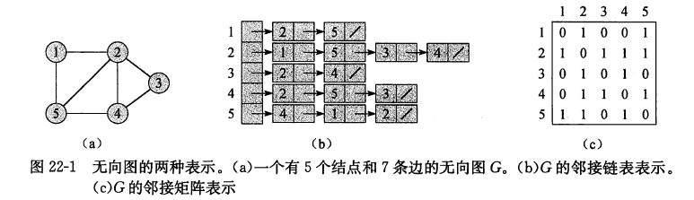
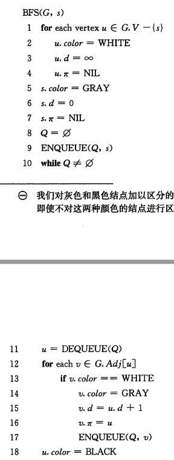
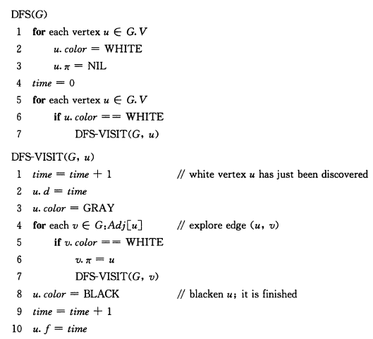
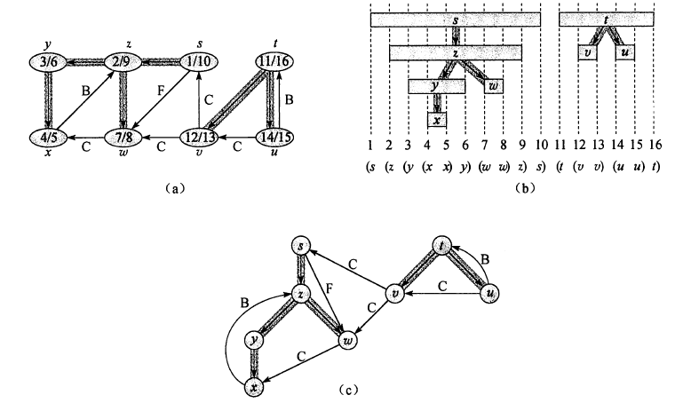
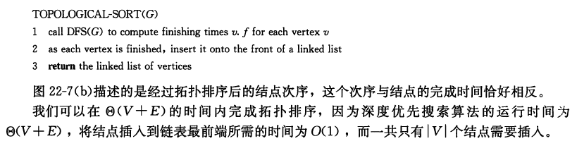
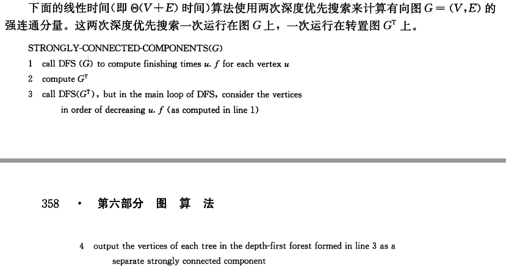
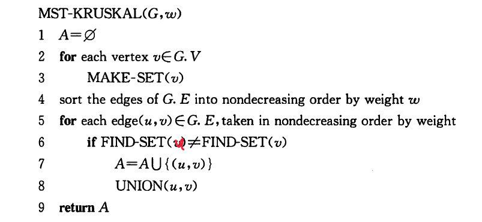
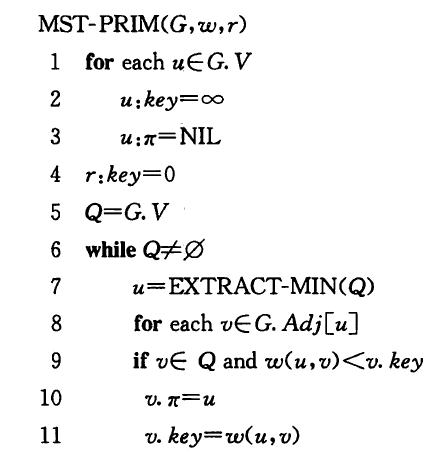
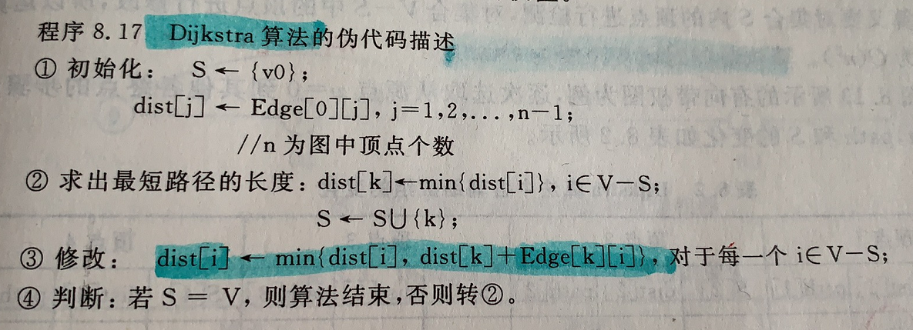

## 基本的图算法

### 图的表示

图$G=(V,E)$

 <!--more-->

#### 1、邻接链表

- 适合稀疏图
- 存储需求：$\Theta(V+E)$

#### 2、邻接矩阵

- 适合稠密图，或需要快速判断两个节点中是否有边时，或图规模较小时
- 存储需求：$\Theta(V^2)$

- 无向图的邻接矩阵是一个对称矩阵


### 广度优先搜索

- 结点颜色
  - 白色：未遍历
  - 灰色：队列中
  - 黑色：已遍历完
- 运行时间：$O(V+E)$
- **性质**：
  - **BFS计算出的v.d为s到v的最短路径距离**
  - 广度优先树：BFS搜索过程中生成的树
    - 根据v.π（前驱）可以打印s到v的最短路径



### 深度优先搜索

- 记录时间戳
  - u.d：发现时间
  - u.f：结束时间
- 运行时间：$\Theta(V+E)$



- **性质**

  - 括号化结构

    - 对于两个结点u、v：
      - 区间包含关系：在深度优先森林中具有祖先与后代关系
      - 区间不相交：没有后代关系

  - 有向图边的分类（图c）

    - 树边：深度优先森林中的边
    - 后向边（B）：子孙指向祖先的边
    - 前向边（F）：祖先指向子孙的边
    - 横向边（C）：其他边

  - **无向图中只有树边和后向边**，没有前向边和横向边

    


### 拓扑排序

- 拓扑排序：G中所有节点的一种线性次序，满足如果图G包含边(u,v)，则节点u在拓扑排序中处于节点v的前面（如果图G包含环路，则不可能排出一种线性次序）
- 拓扑排序算法：与DFS完成时间顺序相反




在图论中，**拓扑排序（Topological Sorting）**是一个**有向无环图（DAG, Directed Acyclic Graph）**的所有顶点的线性序列。且该序列必须满足下面两个条件：

1. 每个顶点出现且只出现一次。
2. 若存在一条从顶点 A 到顶点 B 的路径，那么在序列中顶点 A 出现在顶点 B 的前面。

它是一个 DAG 图，那么如何写出它的拓扑排序呢？这里说一种比较常用的方法：

1. 从 DAG 图中选择一个 没有前驱（即入度为0）的顶点并输出。
2. 从图中删除该顶点和所有以它为起点的有向边。
3. 重复 1 和 2 直到当前的 DAG 图为空或**当前图中不存在无前驱的顶点为止**。后一种情况说明有向图中必然存在环。


**实现：**（LeetCode 210 课程表II)

先建立一个邻接矩阵表示图，方便进行直接查找。拓扑排序也可以被看成是广度优先搜索的一种情况：我们先遍历一遍所有节点，把入度为0的节点（即没有前置课程要求）放在**队列**中。在每次从队列中获得节点时，我们将该节点放在目前排序的末尾，并且把它指向的课程的入度各减1；如果在这个过程中有课程的所有前置必修课都已修完（即入度为0），我们把这个节点加入队列中。当队列的节点都被处理完时，说明所有的节点都已排好序，或因图中存在循环而无法上完所有课程。

```c++
// LeetCode 210. 课程表II
class Solution {
public:
    vector<int> findOrder(int numCourses, vector<vector<int>>& prerequisites) {
        vector<vector<int>> graph(numCourses, vector<int>());   // 图
        vector<int> indegree(numCourses, 0); // 入度
        for(vector<int> pair: prerequisites)
        {
            graph[pair[1]].push_back(pair[0]);
            indegree[pair[0]] ++;
        }
        queue<int> Q; // 队列保存入度为0的结点
        vector<int> ans;
        for(int i = 0; i < numCourses; i++)
        {
            if(indegree[i] == 0)
                Q.push(i);
        }
        while(!Q.empty())
        {
            int p = Q.front();
            Q.pop();
            ans.push_back(p);
            for(int neighbor: graph[p])
            {
                indegree[neighbor] --;
                if(indegree[neighbor] == 0)
                    Q.push(neighbor);
            }
        }
        if(ans.size() != numCourses)	// 有环，没有拓扑序
            return vector<int>();
        return ans;
    }
};
```


### 强连通分量

- 强连通分量：有向图中的一个最大节点集合，该集合中的任意一对结点u和v可以互相到达

- 算法

  1. 深度优先遍历G，算出每个结点u的结束时间f[u]，起点如何选择无所谓。

  2. 深度优先遍历G的转置图G T ,选择遍历的起点时,按照结点的结束时间从大到小进行。遍历的过程中,一边遍历,一边给结点做分类标记,每找到一个新的起点,分类标记值就加1。

  3. 第2步中产生的标记值相同的结点构成深度优先森林中的一棵树,也即一个强连通分量

  


## 最小生成树

最小生成树：无向图中的一个边的子集，既能够将所有的结点连接起来，又具有最小的权重

### Kruskal算法

在所有连接森林中两棵不同树的边里，找到权重最小的边（u，v）。使用并查集数据结构。

- 运行时间：$O(ElgV)$



```c++
//leetcode 1135 最低成本连通所有城市
struct Edge
{
    int u, v;
    int weight;
    Edge(int s, int e, int w):u(s), v(e), weight(w){}
    bool operator > (const Edge& e1) const
    {
        return weight > e1.weight;
    }
};

int Kruskal(int N, vector<vector<int>>& connections)    // Kruskal算法
{
    priority_queue<Edge,vector<Edge>, greater<Edge>> min_heap;
    for(vector<int> e: connections)
    {
        min_heap.push(Edge(e[0] - 1, e[1] - 1, e[2]));
    }
    UFSet ufset(N);    // 并查集
    int count = 0;
    int ans = 0;
    while(count < N && !min_heap.empty())   // 取 N-1条边
    {
        Edge e = min_heap.top();
        min_heap.pop();
        int r1 = ufset.find(e.u), r2 = ufset.find(e.v);
        if(r1 != r2)
        {
            ufset.union_root(r1, r2);
            ans += e.weight;
            count ++;
        }
    }
    if(count != N-1)
        return -1;
    return ans;
}
```


### Prim算法

每一步在连接集合A和A之外的结点的所有边中，选择一条轻量级边加入到A中。使用最小堆数据结构。

- 运行时间：$O(ElgV)$



```c++
//leetcode 1135 最低成本连通所有城市
struct EdgeNode // 用于Prim算法的图
{
    int v;	//另一端点
    int weight;
    EdgeNode(int n, int w):v(n), weight(w){}
    bool operator > (const EdgeNode& e1) const
    {
        return weight > e1.weight;
    }
};
int Prim(int N, vector<vector<int>>& connections)    // prim算法
{
    vector<vector<EdgeNode>> graph(N, vector<EdgeNode>());
    // 建图
    for(vector<int> e: connections)
    {
        graph[e[0] - 1].push_back(EdgeNode(e[1] - 1, e[2]));
        graph[e[1] - 1].push_back(EdgeNode(e[0] - 1, e[2]));
    }
    vector<bool> used(N, false); // 顶点集合
    priority_queue<EdgeNode,vector<EdgeNode>, greater<EdgeNode>> min_heap;
    int p = 0;
    int count = 1;
    int ans = 0;
    do
    {
        // 新顶点：邻边（另一顶点不在集合中的）加入最小堆
        used[p] = true;
        for(EdgeNode neighbor: graph[p])
        {
            if(used[neighbor.v] == false)
            {
                min_heap.push(neighbor);
            }
        }
        // 选最小堆中最小的边
        while(!min_heap.empty() && count < N)
        {
            EdgeNode e = min_heap.top();
            min_heap.pop();
            if(!used[e.v])	// 需要再次判断
            {
                ans += e.weight;
                used[e.v] = true;
                p = e.v;
                count ++;
                break;
            }
        }
    }while(count < N);
    if(count < N)
        return -1;
    return ans;
}
```


## 单源最短路径

### Bellman-Ford算法

数据结构 P379

- 允许输入图中包含负权重的边
  - 不能包含带父权值的环路
  - 算法可以检测出环路

- 时间复杂度：$O(n^2)$

### Dijkstra算法

- 假设输入图的所有边权重为**非负值**
- 时间复杂度：$O(n^2)$



```c++
// 建图
vector<vector<GraphNode>> graph(n, vector<GraphNode>());
for(vector<int>& edge: edges)
{
    graph[edge[0]].push_back(GraphNode(edge[1], edge[2]));
    graph[edge[1]].push_back(GraphNode(edge[0], edge[2]));
}

vector<int> dist(n, INF);    // 初始化最短距离
dist[0] = 0;
for(GraphNode neighbor: graph[0])
{
    dist[neighbor.v] = neighbor.weight;     // 初始化
}
vector<bool> used(n, false);
used[0] = true;
int count = 1;  // 已找到最短路径的顶点个数
while(count < n)
{
    int p = findMin(dist, used);
    used[p] = true;
    count ++;
    for(int i = 1; i < n; i++)  // 更新
    {
        if(!used[i])
        {
            int w = getWeight(graph, i, p);
            if(w != -1) // i 和p 之间有边
            {
                dist[i] = min(dist[i], dist[p] + w);
            }
        }
    }
}
```


## 所有结点间的最短路径

### Floyd算法

数据结构P381

- 时间复杂度：$O(n^3)$

