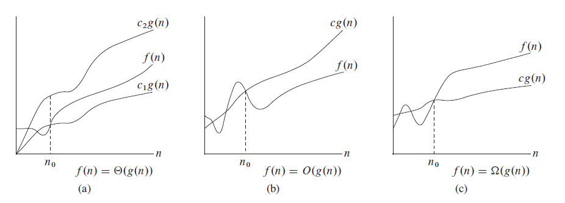
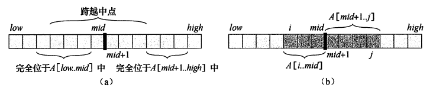
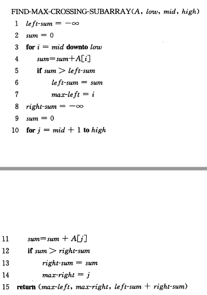
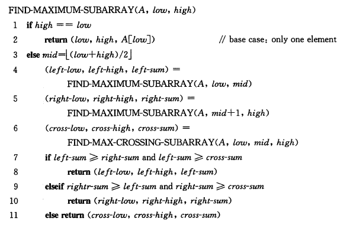

## 算法

- **算法**的定义：定义良好的计算过程。即一系列的计算步骤，用来将输入数据转换成输出结果。

- 正确的算法：如果一个算法对其每一个输入实例，都能输出正确的结果并停止，则称它是正确的。

<!--more-->

## 算法分析

- 算法的运行时间：特定输入时，算法执行的基本操作数（步数）。
- 一般考察算法的最坏运行时间

- $\Theta$记号：

  - $\Theta(g(n))=\{f(n):存在正常量c_1、c_2和n_0，使得对于所有n\geq n_0，有0 \leq c_1g(n) \leq f(n)\leq c_2g(n)\}$

    

- $O$记号和$\Omega$记号

  - $O(g(n))=\{f(n):存在正常量c和n_0，使得对于所有n\geq n_0，有0 \leq f(n)\leq cg(n)\}$
    - 算法的程序步数$f(n)$在最坏情况下存在一个增长的上限，即$cg(n)$
  - $\Omega(g(n))=\{f(n):存在正常量c和n_0，使得对于所有n\geq n_0，有0 \leq cg(n) \leq f(n)\}$

- $f(n)=\Theta(g(n))$当且仅当$f(n)=O(g(n))$且$f(n)=\Omega(g(n))$


## 分治策略（divide-and-conquer)

把原问题划分成n个规模较小而结构与原问题相似的子问题；递归地解决这些问题，然后合并其结果，就得到原问题的解。

- 分解（Divide）：划分子问题
- 解决（Conquer）：递归地求解子问题
- 合并（Combine）：合并子问题的解


### 最大子数组问题

分治法求解数组A的和最大的非空连续子数组。

- 三种情况：

  

- 求解跨越中点的子数组（$\Theta(n)$）：必须包含中点，向左右依次寻找最大数组然后合并即可

  

- 递归求解：

  

- 时间开销：$\Theta(nlgn)$

```c++
// LeetCode 53: 最大子序和
class Solution {
private:
    int MAX_INT = 0xFFFFFFF;
    int max(int a, int b, int c)
    {
        if (a >= b && a >= c)
            return a;
        else if (b >= a && b >= c)
            return b;
        else return c;
    }
    int findCrossingMaxSumArray(vector<int>&a, int left, int mid, int right)
    {
        int left_max = -MAX_INT, right_max = -MAX_INT, left_sum = 0, right_sum = 0;
        for (int i = mid; i >= left; i--)
        {
            left_sum += a[i];
            if (left_sum > left_max)
                left_max = left_sum;
        }
        for (int i = mid+1; i <= right; i++)
        {
            right_sum += a[i];
            if (right_sum > right_max)
                right_max = right_sum;
        }
        return left_max + right_max;
    }
    int findMaxSubArray(vector<int>& a, int left, int right)
    {
        if(left == right)
            return a[left];
        int mid = (left + right) / 2;
        int left_max = findMaxSubArray(a, left, mid);
        int right_max = findMaxSubArray(a, mid+1, right);
        int crossing_max = findCrossingMaxSumArray(a, left, mid, right);
        return max(left_max, right_max, crossing_max);
    }
public:
    int maxSubArray(vector<int>& nums) {
        return findMaxSubArray(nums, 0, nums.size()-1);
    }
};
```


### 矩阵乘法的Strassen算法

- 减少一次递归，时间开销：$\Theta(n^{lg7})$，即$O(n^{2.81})$


### 求解递归式的方法

- 代入法：猜测解的形式，数学归纳法证明
- 递归树
- 主方法
  - $T(n) = aT(n/b) + f(n)$
