## 排序

### 排序算法总结

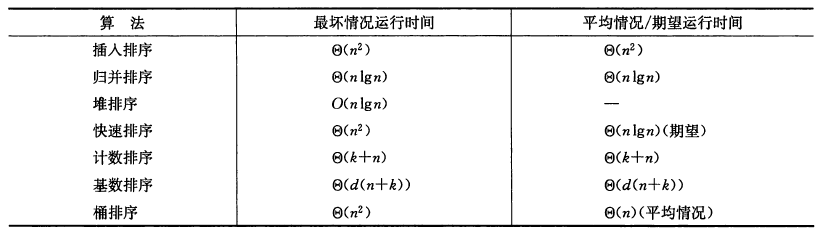

- 任何比较排序在最坏情况下都要经过$\Omega(nlgn)$次比较，因此归并排序和堆排序都是渐近最优的

<!--more-->

### 插入排序

- 把第j个数作为key插入到A[1...j-1]的有序数列中：从后向前查找，将大于key的数向后移

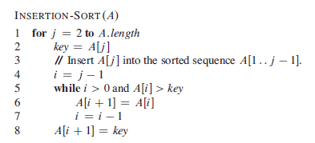

- 时间开销：$\Theta(n^2)$
- 空间开销：原址的（仅有常数个元素 需要在排序过程中存储在数组之外）

```C++
void InsertionSort(vector<int> &a)
{
    for(int i = 1; i < a.size(); i++)
    {
        int key = a[i];
        int j = i - 1;
        while(j >= 0 && a[j] > key)
        {
            a[j + 1] = a[j];
            j--;
        }
        a[j + 1] = key;
    }
}
```


### 合并排序

- 思想
  - 分解（Divide）：将n个元素分成各含n/2个元素的子序列；
  - 解决（Conquer）：用合并排序法对两个子序列递归地排序；
  - 合并（Combine）：合并两个已排序的子序列以得到排序结果。

- 辅助过程**MERGE**：（合并两个子数组A[p...q], A[q+1...r]）
  - 把两个子数组复制到两个新的数组L和R，合并两数组

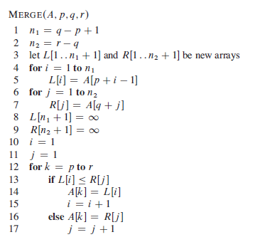

- 递归过程：MERGE-SORT

  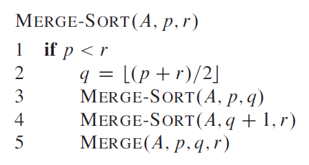

- 递归式分析代价：$$T(n)= \begin{cases} \Theta(1)& \text{n=1}\\ 2T(n/2)+\Theta(n) & \text{n>1} \end{cases}$$

  - 递归树

    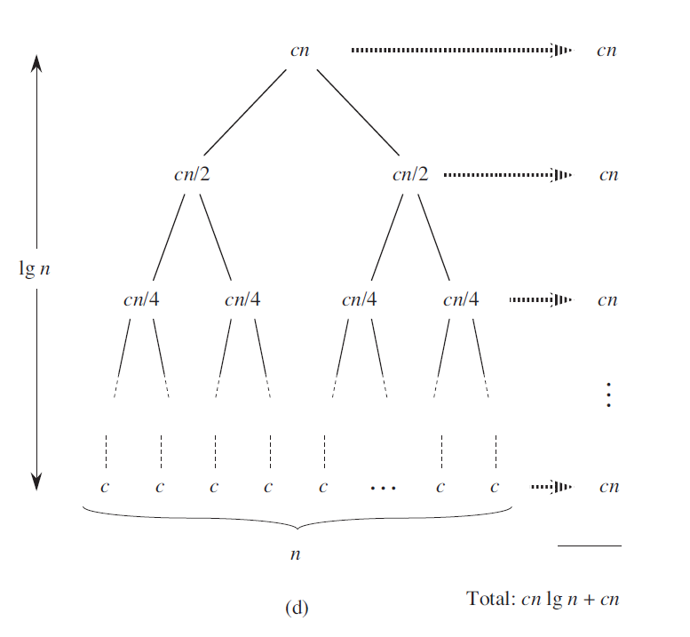

- 时间开销：$\Theta(nlgn)$

- 空间开销：非原址

```c++
void Merge(vector<int> &a, int left, int mid, int right)
{
    int n1 = mid - left + 1, n2 = right - mid;
    vector<int> L(n1), R(n2);
    for (int i = 0; i < n1; i++)
        L[i] = a[left + i];
    for (int i = 0; i < n2; i++)
        R[i] = a[mid + 1 + i];
    int i = 0, j = 0;
    for (int k = left; k <= right; k++)
    {
        if (i < n1 && j < n2)
        {
            if (L[i] <= R[j])
                a[k] = L[i++];
            else
                a[k] = R[j++];
        }
        else if (i == n1)
            a[k] = R[j++];
        else
            a[k] = L[i++];
    }

}
void MergeSort(vector<int> &a, int left, int right)
{
    if (left < right)
    {
        int mid = (left + right) / 2;
        MergeSort(a, left, mid);
        MergeSort(a, mid+1, right);
        Merge(a, left, mid, right);
    }
}
```


### 冒泡排序

- 思想：反复交换相邻的未按次序排序的元素

  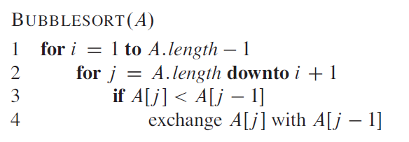

- 时间开销：$\Theta(n^2)$

```c++
void BubbleSort(vector<int> &a)
{
    for(int i = 0; i < a.size() - 1; i++)   // 已到位数字数目
    {
        for(int j = 0; j < a.size() - i - 1; j++)   //遍历剩余的相邻项
        {
            if(a[j] > a[j + 1])
            {
                int temp = a[j];
                a[j] = a[j + 1];
                a[j + 1] = temp;
            }
        }
    }
}
```


### 堆排序

#### 堆

一个近似的完全二叉树，除了最底层外，该树是完全充满的。

- $A.length$：数组长度
- $A.heap-size$：当前有效元素个数
- 根节点：$A[1]$
- 给定一个节点下标$i$，计算父节点、左孩子、右孩子的下标：

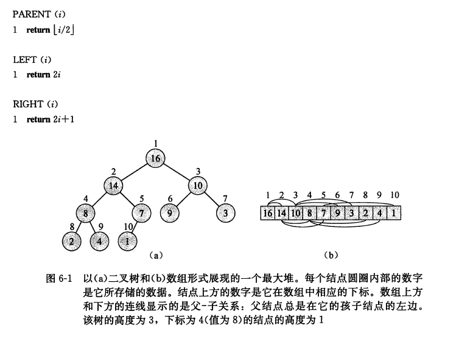

**堆的性质：**

- 最大堆性质：除了根节点以外所有节点$i$满足：$A[PARENT(i)]\geq A[i]$
- 最小堆性质：除了根节点以外所有节点$i$满足：$A[PARENT(i)]\leq A[i]$
- 树的高度：一个包含$n$个元素的堆的高度为$\Theta(lgn)$


#### 维护堆的性质

- 输入：堆$A$，节点$i$，<u>假设此时以左右子节点为根的子树都已是最大堆</u>
- 输出：当节点$i$违背最大堆性质（值小于其子节点时），让其值在最大堆中逐级下降，从而使得**以$i$为根节点的子树**重新遵循最大堆的性质。
- 在父节点、左孩子、右孩子中选出最大的，若最大的不是父节点，则将该子节点与父节点交换，对该子节点递归地调用函数。
- 代价：$O(lgn)$

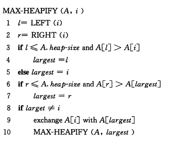

#### 建堆

从最后一个非叶节点到根节点，依次调用MAX-HEAPIFY方法

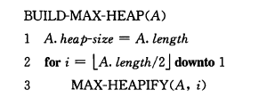

- 代价：$O(n)$

#### 堆排序

首先调用BUILD-MAX-HEAP构造最大堆，此时最大元素在$A[1]$中，交换$A[1]$和$A[n]$，此时新的根节点可能违背了最大堆性质，调用MAX_HEAPIFY(A,1)，从而在$A[1...n-1]$上构造一个新的最大堆。以此类推，直到堆的大小降到2。

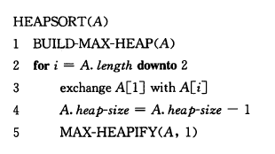

- 时间开销：$O(lgn)$

- 空间开销：原址的


#### 最大优先队列

- $MAXIMUM(S)$：返回$S$中最大键字的元素。（return A[1]）
  - $\Theta(1)$
- $EXTRACT-MAX(S)$：去掉并返回S中具有最大键字的元素。
  - 交换A[1]和A[n]，调用MAX_HEAPIFY(A,1)
  - $O(lgn)$
- $INCREASE(S,x,k)$：将元素x的关键字值增加到k（假设k不小于x节点原关键字值）
  - 将新关键字值不断与父节点进行比较，大于则交换
  - $O(lgn)$
- $INSERT(S,x)$：把元素x插入到S中。
  - 在最后增加一个大小为$-\infin$节点，调用$INCREASE(A,A.heapsize,key)$
  - $O(lgn)$


### 快速排序

PARTITION：将数组$A[p...r]$划分成两个子数组$A[p...q-1]$和$A[q+1...r]$，使得$A[p...q-1]$中每个元素都小于等于$A[q]$，$A[q]$也小于等于$A[q+1...r]$中每个元素。

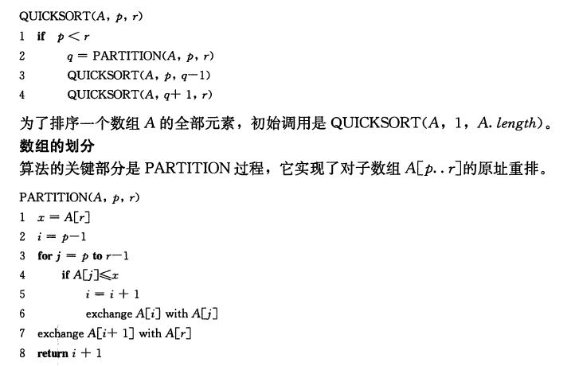

- PARTITION过程
  - 选择$x=A[r]$作为主元
  - $A[p...i]$：小于等于主元的部分
  - $A[i+1...j-1]$：大于主元的部分
  - $A[j...r-1]$：尚未考虑的部分
  - 复杂度：$\Theta(n)$，其中$n=r-p+1$

- 时间开销：最坏$\Theta(n^2)$，最好$O(nlgn)$

```c++
int Partition(vector<int> &a, int left, int right)
{
    int x = a[right];   // 主元
    int i = left - 1;       // i标记小于x、大于x的分界点（a[i]是最后一个小于主元的元素，a[i+1]是第一个大于主元的元素）
    for (int j = left; j <= right - 1; j++)     // j遍历每个除主元外的元素
    {
        if(a[j] <= x)
        {
            i ++;		
            swap(a[i], a[j]);		//将新的a[j]与第一个大于主元的元素交换
        }
    }
    swap(a[i + 1], a[right]);	// 放置主元
    return i + 1;
}

void QuickSort(vector<int> &a, int left, int right)
{
    if (left < right)
    {
        int pivot = Partition(a, left, right);
        QuickSort(a, left, pivot - 1);
        QuickSort(a, pivot + 1, right);
    }
}
```


### 计数排序

假设$n$个输入元素都是在0到$k$区间内的一个整数。对于每一个输入元素$x$，确定小于x的元素个数，利用这一信息，就可以直接把x放到它在输出数组中的位置上了。例如有17个元素小于x，则x就应该在第18个输出位置上。

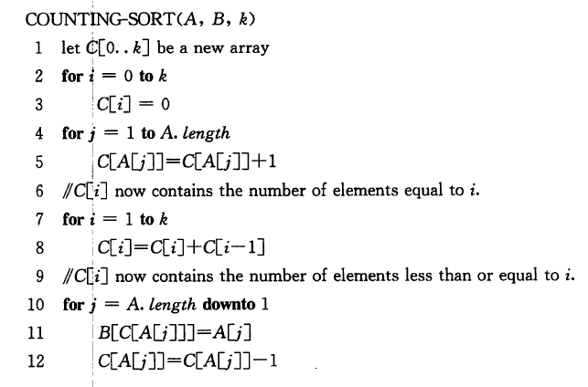

- 代价：当$k=O(n)$时，排序的运行时间为$\Theta(n)$


### 基数排序

从最低有效位到最高有效位进行排序。

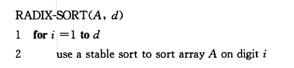

- 代价：给定$n$个$d$位数，其中每一个数位可能有$k$个可能的取值，若使用的稳定排序方法耗时$n+k$，那么它就可以在$\Theta(d(n+k))$时间内将这些数排好序。

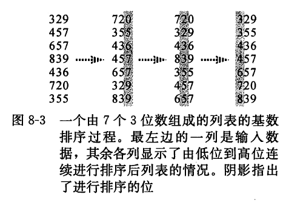

### 桶排序

假设数据服从$[0,1)$上的$均匀分布

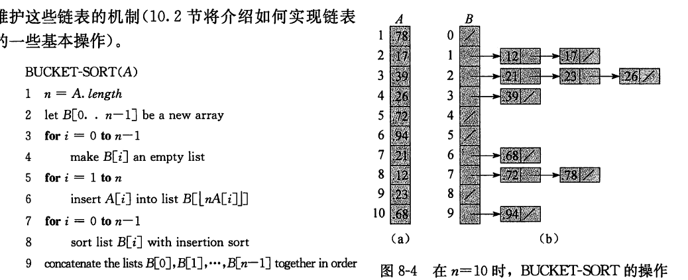

- 时间代价：$O(n)$


## 中位数和顺序统计量

### 同时找到最大值和最小值

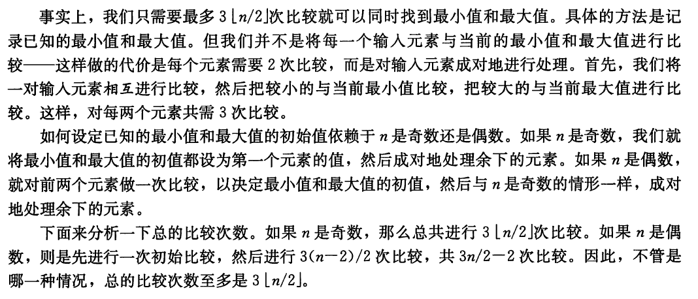

### 期望时间为线性的选择算法

一种分治算法，用到了快速排序中的RANDOMIZED-SELECT算法，但快排会递归处理划分的两边，这里只处理一边。

- 算法返回数组$A[p...r]$中第$i$小的元素
- 期望运行时间：$\Theta(n)$
- 最坏运行时间：$\Theta(n^2)$

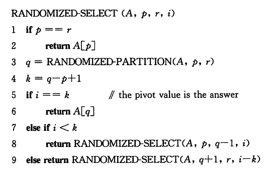

```c++
//LeetCode 215: 在未排序的数组中找到第 k 个最大的元素。
class Solution {
private:
    int Partition(vector<int>& a, int left, int right)
    {
        int x = a[right];
        int i = left - 1;
        for (int j = left; j <= right - 1; j++)
        {
            if (a[j] >= x)	// 注意这里改成了>=
            {
                i++;
                swap(a[i], a[j]);
            }
        }
        swap(a[i+1], a[right]);
        return i + 1;
    }
    int Select(vector<int>& a, int left, int right, int i)
    {
        if (left == right)
            return a[left];
        int x = Partition(a, left, right);
        int k = x - left + 1;   // 当前的x是第几个数字
        if (i == k)
            return a[x];
        else if (i < k)
            return Select(a, left, x - 1, i);
        else
            return Select(a, x + 1, right, i - k);
    }
public:
    int findKthLargest(vector<int>& nums, int k)
    {
        return Select(nums, 0, nums.size()-1, k);
    }
};
```


### 最坏情况为线性的选择算法

与随机选择相比，保证对数组能做出一个较好的划分：

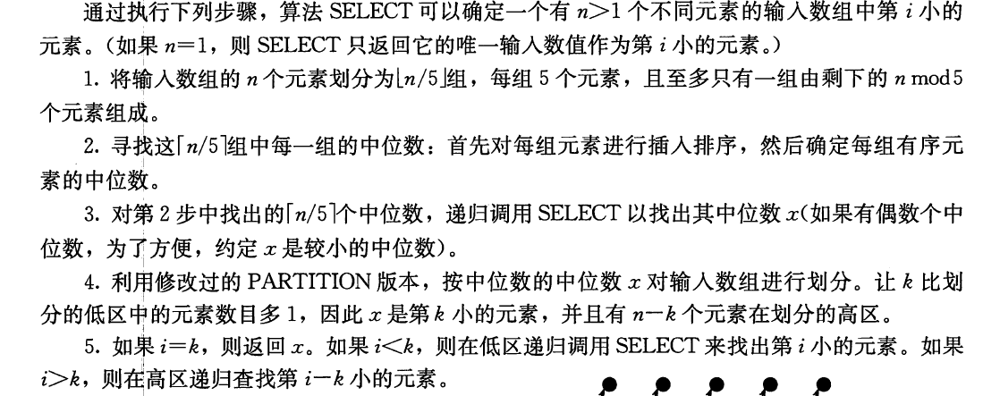