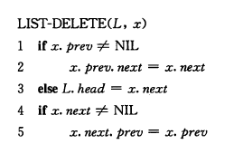
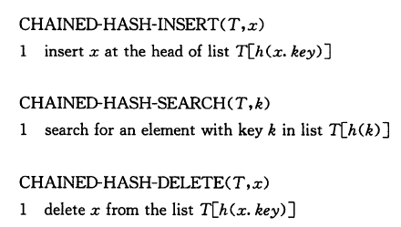

## 基本数据结构

### 栈和队列<!--more-->

#### 栈

- 后进先出

- S.top指向最新插入的元素
  - S.top=0：栈为空


#### 队列

- 先进先出

- Q.head指向队头元素，Q.tail指向下一个新元素将插入的位置

- Q.head=Q.tail时：队列为空

- 初始时：Q.head=Q.tail=1

- Q.head=Q.tail+1时：队满

  

```c++
// LeetCode 622：实现循环队列
class MyCircularQueue {
private:
    vector<int> Q;
    int head, tail;
    int size;
public:
    MyCircularQueue(int k) {
        size = k + 1;
        Q.resize(size);
        head = 0;
        tail = 0;
    }
    
    bool enQueue(int value) {
        if (isFull())
            return false;
        Q[tail] = value;
        tail = (tail + 1) % size;
        return true;
    }
    
    bool deQueue() {
        if (isEmpty())
            return false;
        head = (head + 1) % size;
        return true;
    }
    
    int Front() {
        if(isEmpty())
            return -1;
        return Q[head];
    }
    
    int Rear() {
        if(isEmpty())
            return -1;
        return Q[(tail - 1 + size) % size];
    }
    
    bool isEmpty() {
        return head == tail;
    }
    
    bool isFull() {
        return (tail + 1) % size == head;
    }
};
```


```c++
// LeetCode 641：实现循环双端队列
class MyCircularDeque {
private:
    vector<int> D;
    int size, head, tail;
public:
    /** Initialize your data structure here. Set the size of the deque to be k. */
    MyCircularDeque(int k) {
        size = k + 2;
        head = 0;
        tail = 1;
        D.resize(size);
    }
    
    /** Adds an item at the front of Deque. Return true if the operation is successful. */
    bool insertFront(int value) {
        if(isFull())
            return false;
        D[head] = value;
        head = (head - 1 + size) % size;
        return true;
    }
    
    /** Adds an item at the rear of Deque. Return true if the operation is successful. */
    bool insertLast(int value) {
        if(isFull())
            return false;
        D[tail] = value;
        tail = (tail + 1) % size;
        return true;
    }
    
    /** Deletes an item from the front of Deque. Return true if the operation is successful. */
    bool deleteFront() {
        if(isEmpty())
            return false;
        head = (head + 1) % size;
        return true;
    }
    
    /** Deletes an item from the rear of Deque. Return true if the operation is successful. */
    bool deleteLast() {
        if(isEmpty())
            return false;
        tail = (tail - 1 + size) % size;
        return true;
    }
    
    /** Get the front item from the deque. */
    int getFront() {
        if (isEmpty())
            return -1;
        return D[(head + 1) % size];
    }
    
    /** Get the last item from the deque. */
    int getRear() {
        if(isEmpty())
            return -1;
        return D[(tail - 1 + size) % size];
    }
    
    /** Checks whether the circular deque is empty or not. */
    bool isEmpty() {
        return (head + 1) % size == tail;
    }
    
    /** Checks whether the circular deque is full or not. */
    bool isFull() {
        return (tail + 1) % size == head;
    }
};
```


### 链表

- 搜索：$O(n)$

  

- 插入：$O(1)$

  

- 删除：$O(1)$

  

- 哨兵

  

```c++
// LeetCode 707. 设计链表
struct Node
{
    int val;
    Node* prev, *next;
    Node(int x): val(x), prev(NULL), next(NULL) {}
};
class MyLinkedList {
private:
    Node* dummy;	// 哨兵
public:
    /** Initialize your data structure here. */
    MyLinkedList()
    {
        dummy = new Node(-1);
        dummy->prev = dummy;    // dummy->prev指向表尾
        dummy->next = dummy;    // dummy->next指向表头
    }
    
    /** Get the value of the index-th node in the linked list. If the index is invalid, return -1. */
    int get(int index)
    {
        Node* p = dummy -> next;
        for(int i = 0; i < index; i ++)
        {
            p = p -> next;
            if(p == dummy)
                return -1;
        }
        return p -> val;
    }
    
    /** Add a node of value val before the first element of the linked list. After the insertion, the new node will be the first node of the linked list. */
    void addAtHead(int val)
    {
        Node* n = new Node(val);
        n -> next = dummy -> next;
        n -> prev = dummy;
        dummy -> next -> prev = n;
        dummy -> next = n;
    }
    
    /** Append a node of value val to the last element of the linked list. */
    void addAtTail(int val)
    {
        Node* n = new Node(val);
        n -> next = dummy;
        n -> prev = dummy -> prev;
        dummy -> prev -> next = n;
        dummy -> prev = n;
    }
    
    /** Add a node of value val before the index-th node in the linked list. If index equals to the length of linked list, the node will be appended to the end of linked list. If index is greater than the length, the node will not be inserted. */
    void addAtIndex(int index, int val)
    {
        if (index <= 0)
        {
            addAtHead(val);
            return;
        }
        Node* p = dummy -> next;
        for(int i = 0; i < index; i ++)
        {
            p = p -> next;
            if(p == dummy)
            {
                if (i + 1 == index) {
                    addAtTail(val);
                    return;
                }
                else return;
            }
        }
        Node* n = new Node(val);
        n -> next = p;
        n -> prev = p -> prev;
        p -> prev -> next = n;
        p -> prev = n;
    }
    
    /** Delete the index-th node in the linked list, if the index is valid. */
    void deleteAtIndex(int index)
    {
        Node* p = dummy -> next;
        for(int i = 0; i < index; i ++)
        {
            p = p -> next;
            if(p == dummy)
                return;
        }
        p -> prev -> next = p -> next;
        p -> next -> prev = p -> prev;
        delete p;
    }
};
```


```c++
//LeetCode 206 反转链表：
// 递归写法
ListNode* reverseList(ListNode* head)
{
    if(head == NULL || head-> next == NULL)
        return head;
    ListNode* plast = reverseList(head -> next);
    ListNode* p = plast; 
    head-> next ->next = head;
    head -> next = NULL;
    return plast;
}

// 非递归写法
ListNode* reverseList(ListNode* head) 
{
    ListNode* prev = NULL, *curr = head, *next;
    while(curr != NULL)
    {
        next = curr->next;
        curr->next = prev;
        prev = curr;
        curr = next;
    }
    return prev;
}
```


### 有根树

- 二叉树
- 多叉树
  - 左孩子右兄弟表示法

## 散列表

- 实现**字典**操作的一种有效数据结构
- 关键字为$k$的元素放置在槽$h(k)$中
- 装载因子：对能存放$n$个元素，$m$个槽位的散列表$T$，$T$的装载因子定义为$\alpha=n/m$

### 冲突解决方法1：链接法

- 把散列到同一个槽中的所有元素都放在一个链表中

  

- 插入操作最坏运行时间：$O(1)$

- 删除操作：$O(1)$（直接删除，双向链表）

- 查找操作：最坏$O(n)$（所有关键字映射到同一个槽）

  - 平均性能依赖于散列函数
  - 简单均匀散列
    - 一次成功/不成功查找的平均时间都为$\Theta(1+\alpha)$
    - 则所有操作都能在$O(1)$时间内完成

- 散列函数
  - 除法散列法
  - 乘法散列法
  - 全域散列法

```c++
// LeetCode 705: 设计哈希集合
#include<algorithm>
#include<vector>
#include<list>
using namespace std;
class MyHashSet {
private:
    vector<list<int>> hash_table;
    const int size;
    int hash_function(int key)
    {
        return key % size;
    }
public:
    /** Initialize your data structure here. */
    MyHashSet():size(100){
        hash_table.resize(size);	// 注意resize和reserve区别
    }
    
    void add(int key) {
        if (!contains(key))
            hash_table[hash_function(key)].push_back(key);
    }
    
    void remove(int key) {
        int hash_idx = hash_function(key);
        list<int> &l = hash_table[hash_idx];
        if (l.empty())
            return;
        list<int> ::iterator it = find(l.begin(), l.end(), key);
        if( it != l.end())
        {
            l.erase(it);
        }
    }
    
    /** Returns true if this set contains the specified element */
    bool contains(int key) {
        int hash_idx = hash_function(key);
        list<int> &l = hash_table[hash_idx];
        if (l.empty())
            return false;
        list<int> ::iterator it = find(l.begin(), l.end(), key); //list没有find
        return it != l.end();
    }
};
```


```c++
// LeetCode 706: 设计哈希映射
#include<vector>
#include<list>
using namespace std;
//leetcode submit region begin(Prohibit modification and deletion)
struct Pair
{
    int key, value;
    Pair(int k, int v): key(k), value(v){}
};
class MyHashMap {
private:
    vector<list<Pair>> hash_table;
    const int size;
    int hash_function(int key)
    {
        return key % size;
    }
public:
    /** Initialize your data structure here. */
    MyHashMap():size(100){
        hash_table.resize(size);
    }
    
    /** value will always be non-negative. */
    void put(int key, int value) {
        int hash_idx = hash_function(key);
        list<Pair>& l = hash_table[hash_idx];
        if(l.empty()) {
            l.push_back(Pair(key, value));
            return;
        }
        for(list<Pair>::iterator it = l.begin(); it != l.end(); it++)
        {
            if (it -> key == key)
            {
                it -> value = value;
                return;
            }
        }
        l.push_back(Pair(key, value));
        return;
    }
    
    /** Returns the value to which the specified key is mapped, or -1 if this map contains no mapping for the key */
    int get(int key) {
        int hash_idx = hash_function(key);
        list<Pair>& l = hash_table[hash_idx];
        if(l.empty())
            return -1;
        for(list<Pair>::iterator it = l.begin(); it != l.end(); it++)
        {
            if (it -> key == key)
            {
                return it -> value;
            }
        }
        return -1;

    }
    
    /** Removes the mapping of the specified value key if this map contains a mapping for the key */
    void remove(int key) {
        int hash_idx = hash_function(key);
        list<Pair>& l = hash_table[hash_idx];
        if(l.empty())
            return;
        for(list<Pair>::iterator it = l.begin(); it != l.end(); it++)
        {
            if (it -> key == key)
            {
                l.erase(it);
                return;
            }
        }
        return;
    }
};
```


### 冲突解决方法2：开放寻址法

- 散列表可能会被填满，装载因子$\alpha$不能超过1

  

  

- 删除操作比较困难：用特定值DELETED代替NIL来标记

  - 一般需要删除时还是用链接法更好

- 探查序列的方法

  - 必须保证探查序列是<0,1,...,m-1>的一个排列
  - 均匀散列假设：每个关键字的探查序列等可能地为<0,1,...,m-1>的m!种排列中的任一种
    - 插入：至多$1/(1-\alpha)$次探查
    - 不成功查找：至多$1/(1-\alpha)$次探查
    - 成功查找：$\frac { 1 } { \alpha } \ln \frac { 1 } { 1 - \alpha }$
  - 三种探查技术
    - 线性探查：$h ( k , i ) = ( h ^ { \prime } ( k ) + i ) \bmod m, i = 0,1 ,\cdots m - 1$
      - m种不同的探查序列
    - 二次探查：$h ( k , i ) = ( h ^ { \prime } ( k ) + c _ { 1 } i + c _ { 2 } i ^ { 2 } ) \bmod m$
    - 双重探查：$h ( k , i ) = ( h _ { 1 } ( k ) + i h _ { 2 } ( k ) ) \bmod m$

### 完全散列

- 最坏情况$O(1)$

  

  - 二级散列表，需要确保第二级散列表不发生冲突（略）

    

## 二叉搜索树


- 设 x 是二叉搜索树中的一个结点。

  - 如果 y 是 x 左子树中的一个结点，那么 y.key ≤x.key 。
  - 如果 y 是 x 右子树中的一个结点，那么 y.key ≥ x.key 。

- 遍历二叉树（$\Theta (n)$）

  - 中序遍历

    

  - 先序遍历

  - 后序遍历

### 查询

- 查询（O(h)）

  - 递归写法：

  

  ```c++
  // 700 二叉搜索树中的搜索
  class Solution {
  public:
      TreeNode* searchBST(TreeNode* root, int val) {
          if(!root)
              return nullptr;
          if(root -> val == val)
              return root;
          if(root -> val > val)
              return searchBST(root -> left, val);
          return searchBST(root -> right, val);
      }
  };
  ```

  

  - 迭代写法：

    

- 最大、最小元素（O(h)）

  


- 前驱和后继（O(h)）
  - <font color='red'>分两种情况：</font>

    - 若结点x的右子树非空，那么x的后继是x右子树中的最左节点

    - <u>若结点x的右子树为空，向上遍历直到遇到一个祖先节点，它是其父结点的左孩子，返回父结点的值</u>

      

### 插入

- 先搜索，直到nil，然后将nil替换为新节点（$O(h)$）


```c++
// leetcode 701：二叉搜索树中的插入操作
class Solution {
private:
    void insert(TreeNode* &root, int val)
    {
        if(root == nullptr)
        {    
            root = new TreeNode(val);
            return;
        }
        if(root -> val > val)
            insert(root -> left, val);
        insert(root -> right, val);
            
    }
public:
    TreeNode* insertIntoBST(TreeNode* root, int val) {
        insert(root, val);
        return root;
    }
};
```


### 删除

- 四种情况
  - z没有孩子结点：直接删除
  - z只有一个孩子：将孩子提升到z的位置
  - <font color='red'>z有两个孩子</font>：查找z的后继y（右子树种寻找中序下的第一个节点）
    - y就是z的右孩子：y直接替换z
    - y位于z的右子树但不是z的右孩子：先用y的右孩子替换y，然后用y替换z
  
  
  
- 实现

  - 用子树v替换u

    

  - 删除($O(h)$)

    

```c++
//leetcode 450: 删除二叉搜索树中的节点
class Solution {
private:
    void deleteBSTNode(TreeNode* &root, int key)
    {
        if(!root)
            return;
        if(root -> val > key)
            deleteBSTNode(root -> left, key);
        else if (root -> val < key)
            deleteBSTNode(root -> right, key);
        else if (root -> left && root -> right)
        {
            TreeNode* tmp = root -> right;  //寻找右子树的最左节点
            while(tmp -> left != nullptr)
                tmp = tmp -> left;
            root -> val = tmp -> val;
            deleteBSTNode(root -> right, tmp -> val);   //在右子树中删除tmp
        }
        else{
            TreeNode* tmp = root;
            if(root -> left)
                root = root -> left;
            else if(root -> right)
                root = root -> right;
            else
                root = nullptr;
            delete tmp;
        }
    }
public:
    TreeNode* deleteNode(TreeNode* root, int key) {
        if(!root)
            return nullptr;
        deleteBSTNode(root, key);
        return root;
            
    }
};
```


### 随机构建二叉搜索树

- 如果n个关键字按严格递增的顺序被插入，则这棵树一定是高度为n-1的一条链
- 随机顺序插入：性能较好


## 红黑树

- 平衡搜索树中的一种，可以保证在最坏情况下基本动态集合操作的时间复杂度为$O(lgn)$

- 一棵红黑树是满足下面红黑性质的二叉搜索树 :
  1 . 每个结点或是红色的 , 或是黑色的 .
  2 . 根结点是黑色的 .
  3 . 每个叶结点 ( NIL ) 是黑色的 .
  4 . 如果一个结点是红色的 , 则它的两个子结点都是黑色的 .
  5 . 对每个结点 , 从该结点到其所有后代叶结点的简单路径上 , 均包含相同数目的黑色结点 .


## 数据结构的扩张

### 顺序统计树

- 每个节点增加一个信息：x.size

  - 根为x的子树的结点数

- 查找根为x、秩为i（第i小）的结点

  

- 确定一个元素的秩（P194）

  - 遍历祖先节点，遇到是右子树的情况，加上左边所有节点的个数

  

- 维护子树规模

  - 插入时每个父结点size+1

### 区间树


- 搜索与区间i有重叠的区间：

  


## 并查集

维护一个不相交动态集的集合$S$，用一个代表来标识每个集合。

### 操作

- MAKE_SET(x)：建立一个新的集合，唯一成员是x
- UNION(x,y)：合并包含x和y的两个集合
- FIND-SET(x)：返回包含x的唯一集合的代表

###  链表表示

- MAKE_SET和FIND_SET：O(1)
- UNION：与合并的链表长度呈线性关系
- 启发式策略：总是把较短的表拼接到较长的表上
  - 总开销:$O(m+nlgn)$


### 有根树表示


**启发式策略**

- 按秩合并：对每个节点，维护一个秩，它表示该结点高度的一个上界，让具有较小的秩的根指向具有较大秩的根

- 路径压缩：FIND-SET时让查找路径中的每个结点直接指向根

  

运行时间：$O(m\alpha(n))$,其中$\alpha(n) < 4$

- m：总操作次数
- n：结点数

```c++
// 并查集的C++实现
class UFSet
{
private:
    int n;
    vector<int> parent;
public:
    UFSet(int n)
    {
        this-> n = n;
        parent.resize(n, -1);

    }
    int find(int i)
    {
        while(parent[i] >= 0)	// 注意是大于等于
            i = parent[i];
        return i;
    }
    int collapsing_find(int i)  // 路径压缩
    {
        // 搜索根root
        int root = i;
        while(parent[root] >= 0)
            root = parent[root];
        while(i != root)
        {
            int tmp = parent[i];
            parent[i] = root;
            i = tmp;
        }
        return root;
    }
    void set_union(int i, int j)
    {
        int root1 = find(i), root2 = find(j);
        if(root1 != root2)
        {
            int tmp = parent[root1] + parent[root2];
            if(parent[root1] > parent[root2])
            {
                parent[root1] = root2;
                parent[root2] = tmp;
            }
            else
            {
                parent[root2] = root1;
                parent[root1] = tmp;
            }
        }
    }
    void union_root(int root1, int root2)
    {
        if(root1 != root2)
        {
            int tmp = parent[root1] + parent[root2];
            if(parent[root1] > parent[root2])
            {
                parent[root1] = root2;
                parent[root2] = tmp;
            }
            else
            {
                parent[root2] = root1;
                parent[root1] = tmp;
            }
        }
    }
};
```


## Trie字典树

由于一个英文单词的长度n 通常在10以内，如果我们使用字典树，则可以在O(n)时间内完成搜索，且额外开销非常小。

- 插入

  - 时间复杂度：O(m)，其中 m 为键长。在算法的每次迭代中，我们要么检查要么创建一个节点，直到到达键尾。只需要 m 次操作。

    空间复杂度：O(m)。最坏的情况下，新插入的键和 Trie 树中已有的键没有公共前缀。此时需要添加 m 个结点，使用 O(m) 空间。

- 查找

  - 时间复杂度 : O(m)。算法的每一步均搜索下一个键字符。最坏的情况下需要 m 次操作。
  - 空间复杂度 : O(1)。

```c++
// LeetCode 208. 实现 Trie (前缀树)
struct TrieNode
{
    TrieNode* childNode[26];
    bool isVal;		// 此节点的前缀是否是一个单词
    TrieNode():isVal(false)
    {
        for(int i = 0; i < 26; i++)
            childNode[i] = nullptr;
    }

};
class Trie {
private:
    TrieNode* root;
public:
    /** Initialize your data structure here. */
    Trie() {
        root = new TrieNode();
    }
    
    /** Inserts a word into the trie. */
    void insert(string word) {
        TrieNode* p = root;
        for(int i = 0; i < word.length(); i++)
        {
            if(!p -> childNode[word[i] - 'a'])
                p -> childNode[word[i] - 'a'] = new TrieNode();
            p = p -> childNode[word[i] - 'a'];
        }
        p -> isVal = true; // 是一个词
    }
    
    /** Returns if the word is in the trie. */
    bool search(string word) {
        TrieNode* p = root;
        for(int i = 0; i < word.length(); i++)
        {
            if(p == nullptr)
                return false;
            p = p -> childNode[word[i] - 'a'];
        }
        if (!p || !(p -> isVal))
            return false;
        return true;

    }
    
    /** Returns if there is any word in the trie that starts with the given prefix. */
    bool startsWith(string prefix) {
        TrieNode* p = root;
        for(int i = 0; i < prefix.length(); i++)
        {
            if(p == nullptr)
                return false;
            p = p -> childNode[prefix[i] - 'a'];
        }
        return p != nullptr;
    }
};
```


## 线段树

线段树是算法竞赛中常用的用来维护 **区间信息** 的数据结构。

线段树可以在$O(logN)$的时间复杂度内实现单点修改、区间修改、区间查询（区间求和，求区间最大值，求区间最小值）等操作。

建树 ：数组空间4N

```c++
// LeetCode 307. 区域和检索 - 数组可修改
class NumArray {
private:
    vector<int> tree;   // 线段树
    int n;
    void buildTree(vector<int>& nums, int cur, int start, int end)       // 建树：O(4N)
    {
        // [start, end] 为当第cur个节点包含的区间
        if(start == end)	
            tree[cur] = nums[start];
        else
        {
            int mid = (start + end) / 2;
            int leftChild = 2 * cur + 1, rightChild = 2 * cur + 2;
            buildTree(nums, leftChild, start, mid);
            buildTree(nums, rightChild, mid + 1, end);
            tree[cur] = tree[leftChild] + tree[rightChild];
        }
    }
    int query(int cur, int start, int end, int i, int j)    // 查询区间[i, j]的和
    {
        // [start, end] 为当前节点包含的区间（建树时已经固定）
        if(i > end || j < start)
            return 0;
        if(i <= start && end <= j)  // 当前区间为询问区间的子集时直接返回当前区间的和
            return tree[cur];
        int mid = (start + end) / 2;
        int leftChild = 2 * cur + 1, rightChild = 2 * cur + 2;
        int left_sum = query(leftChild, start, mid, i, j); // 左子结点包含的区间：[start, mid]
        int right_sum = query(rightChild, mid + 1, end, i, j); // 右子节点包含的区间[mid+1, end]
        return left_sum + right_sum;
    }
    void update_tree(int cur, int start, int end, int i, int val) // 更新第i个结点值为val
    {
        if(start == end)
            tree[cur] = val;
        else
        {
            int mid = (start + end) / 2;
            int leftChild = 2 * cur + 1, rightChild = 2 * cur + 2;
            if(i >= start && i <= mid) // i在左子树中
                update_tree(leftChild, start, mid, i, val);
            else  // i在右子树中
                update_tree(rightChild, mid+1, end, i, val);
            tree[cur] = tree[leftChild] +tree[rightChild];
        }
    }
public:
    NumArray(vector<int>& nums) {
        if(nums.empty())
            return;
        n = nums.size();
        tree.resize(4 * n + 1);
        buildTree(nums, 0, 0, n-1);
    }
    
    void update(int index, int val) {
        update_tree(0, 0, n-1, index, val);
    }
    
    int sumRange(int left, int right) {
        return query(0, 0, n-1, left, right);
    }
};
```

