## 动态规划

**动态规划与分治法的区别**

- 分治法将问题划分为<u>互不相交</u>的子问题，递归地求解子问题，再将它们的解组合起来，求出原问题的解。
- 动态规划适用于<u>子问题重叠</u>的情况，即不同的子问题具有公共的子子问题，在这种情况下，分治法会做许多不必要的工作，会反复地求解那些公共子子问题。而动态规划对每个子子问题只求解一次，将其解保存在一个表格中，避免了不必要的计算工作。

<!--more-->

**动态规划算法**

- 通常用来求解**最优化问题**
- 步骤
  1. 刻画一个最优解的结构特征
  2. 递归地定义最优解的值
  3. 计算最优解的值，通常采用自底向上的方法
  4. 利用计算出的信息构造一个最优解

### 钢条切割

#### 钢条切割问题

- 给定一段长度为$n$英寸和一个价格表$p_i$，求钢条切割方案，使得销售收益$r_n$最大。

- 满足**最优子结构性质**
  - 问题的最优解由相关子问题的最优解组合而成，而这些子问题可以独立求解
- 思路1：完成首次切割后，将两段钢条看成两个独立的钢条切割问题实例。通过组合两个相关子问题的最优解，并在所有可能的两段切割方案中选择组合收益最大者，构成原问题的最优解。
- 思路2：进一步，将钢条从左边切下长度为$i$的一段，只对右边剩下的长度为$n-i$的一段继续进行切割，左边的一段不再切割。则原问题的最优解只包含一个相关子问题，而不是两个。

#### 自顶向下递归实现

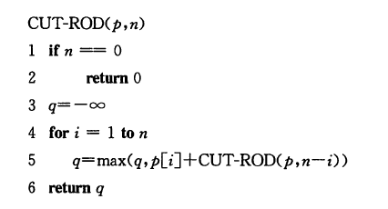

- 考虑了所有$2^{n-1}$种切割方案
- 运行时间为$O(2^n)$

#### 动态规划算法实现

##### 方法一：带备忘的自顶向下法

仍按自然递归形式编写过程，但过程会保存每个子问题的解（数组/散列表），当需要一个子问题的解时，先检查过去是否已保存过此解。(是一种深度优先搜索)

- 运行时间$\Theta(n^2)$

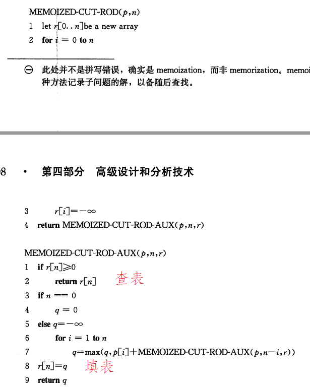

##### 方法二：自底向上法

将子问题由小到大的顺序进行求解，当求解某个子问题时，它所依赖的那些更小的子问题都已经求解完毕。（逆拓扑序）

- 运行时间$\Theta(n^2)$

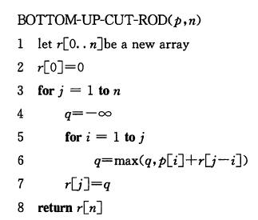

##### 重构解

增加数组s保存钢条长度为j时第一段钢条的切割长度s[j]：

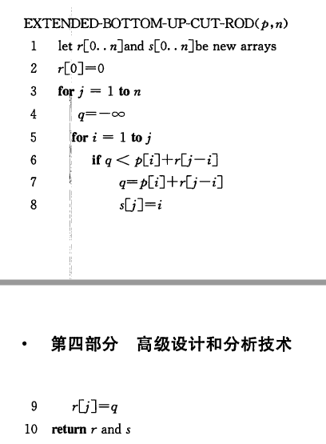

输出解：

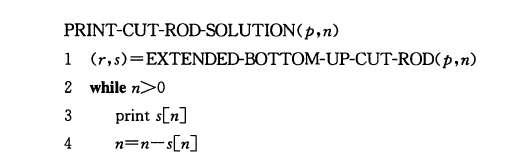


### 矩阵链乘法

给定$n$个矩阵的链$<A_1,A_2,...,A_n>$，矩阵$A_i$的规模为$p_{i-1}\times p_i(1\leq n \leq n)$，求完全括号化方案，使得计算乘积$A_1A_2\cdots A_n$所需的标量乘法次数最少。

- 令$m[i,j]$表示计算矩阵$A_{i,j}$所需标量乘法次数的最小值，原问题的最优解为$m[1,n]$
- 递归求解方案：

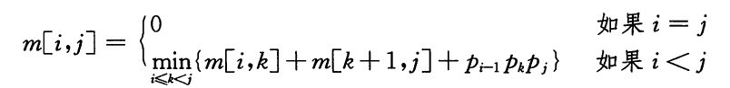

- 自顶向上求解
  - 代价$O(n^3)$

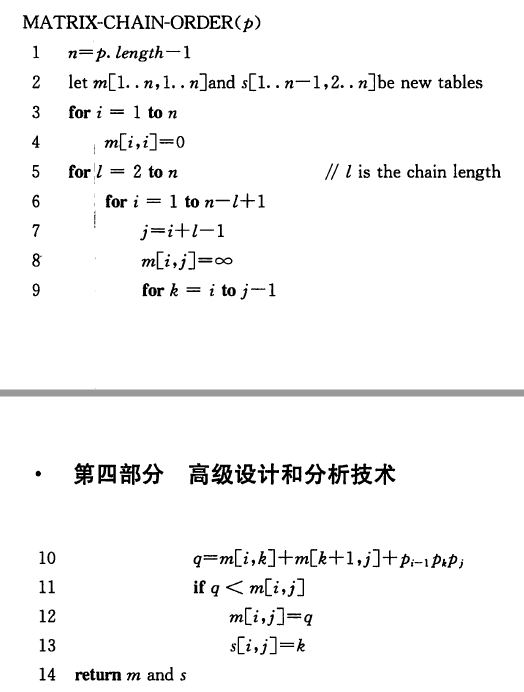

- 重构最优解

  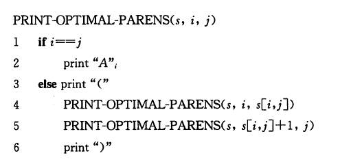

### 动态规划原理

适合用动态规划求解的最优化问题应该具备两个要素：最优子结构和子问题重叠

**最优子结构**

- 如果一个问题的最优解包含其子问题的最优解，我们就称此问题具有最优子结构性质。

- 子问题必须是互相独立的
  - 一个子问题的解不影响另一个子问题的解，互不相交

**重叠子问题**

递归算法会反复地求解相同的子问题，而不是一直产生新的子问题。


### 最长公共子序列

给定两个序列$X=<x_1,x_2,...,x_n>$和$Y=<y_1,y_2,...,y_m>$，求$X$和$Y$的最长公共子序列。

- 最优子结构

  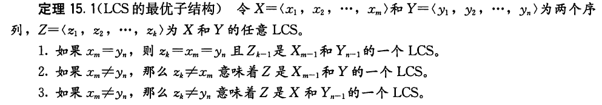

- 递归式

  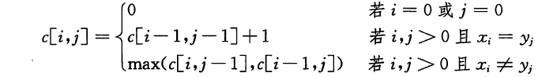

- 自底向上求解

  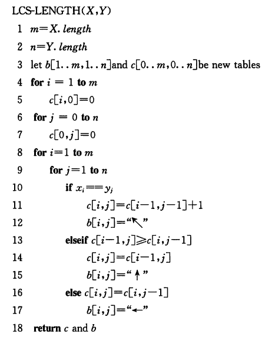

```c++
// LeetCode 1143 最长公共子序列：
class Solution {
private:
    int max(int a, int b)
    {
        return a > b ? a : b;
    }
public:
    int longestCommonSubsequence(string text1, string text2) {
        int m = text1.length(), n = text2.length();
        vector<vector<int>> dp(m, vector<int>(n, 0));
        for(int i = 0; i < m; i++)
        {
            for(int j = 0; j < n; j++)
            {
                if(text1[i] == text2[j])
                {
                    if (i == 0 || j == 0)
                        dp[i][j] = 1;
                    else
                        dp[i][j] = dp[i-1][j-1] + 1;
                }
                else if (i > 0 && j >0)
                    dp[i][j] = max(dp[i-1][j], dp[i][j-1]);
                else if(i > 0)
                    dp[i][j] =dp[i-1][j];
                else if (j > 0)
                    dp[i][j] =dp[i][j-1];
            }
        }
        return dp[m-1][n-1];
    }
};
```


### 最优二叉搜索树

在给定单词搜索频率的前提下，应该如何组织一棵二叉搜索树，使得所有搜索操作访问的节点数最少？（P226)


## 贪心算法

### 活动选择问题

给定$n$个活动的集合$S={a_1,a_2,...,a_n}$，每个活动$a_i$有一个开始时间$s_i$和结束时间$f_i$。选出一个最大兼容活动集，假定活动已经按结束时间的单调递增顺序排序。

**贪心算法**：总是选择剩余活动集合中最早结束的活动。

- 迭代写法：(复杂度$\Theta(n)$)

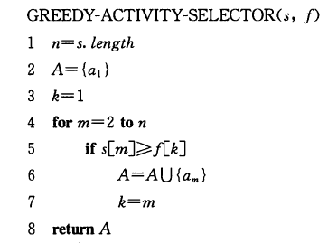

```c++
// leetcode 435: 无重叠区间
class Solution {
public:
    int eraseOverlapIntervals(vector<vector<int>>& intervals) {
        if(intervals.empty())
            return 0;
        int n = intervals.size();
        // 按结束时间排序
        sort(intervals.begin(), intervals.end(), [](vector<int>a, vector<int>b)->bool{
            return a[1] < b[1];
        });
        int max = 1, last_end = intervals[0][1];
        for(int i = 1; i < n; i++)
        {
            if(intervals[i][0] >= last_end)
            {
                last_end = intervals[i][1];
                max ++;
            }
        }
        return n - max;
    }
};
```


### 贪心算法原理

贪心算法步骤：

1. 将最优化问题转化为这样的形式 : 对其做出一次选择后 , 只剩下一个子问题需要求解 .
2.  证明做出贪心选择后 , 原问题总是存在最优解 , 即贪心选择总是安全的 .
3. 证明做出贪心选择后 , 剩余的子问题满足性质 : 其最优解与贪心选择组合即可得到原问题的最优解 , 这样就得到了最优子结构 .


对比：

- 0-1背包问题：只能用动态规划解决
- 分数背包问题：可以贪心


### 赫夫曼编码

自底向上，每次选择频率最低的两个结点作为一个新节点的左右子结点。

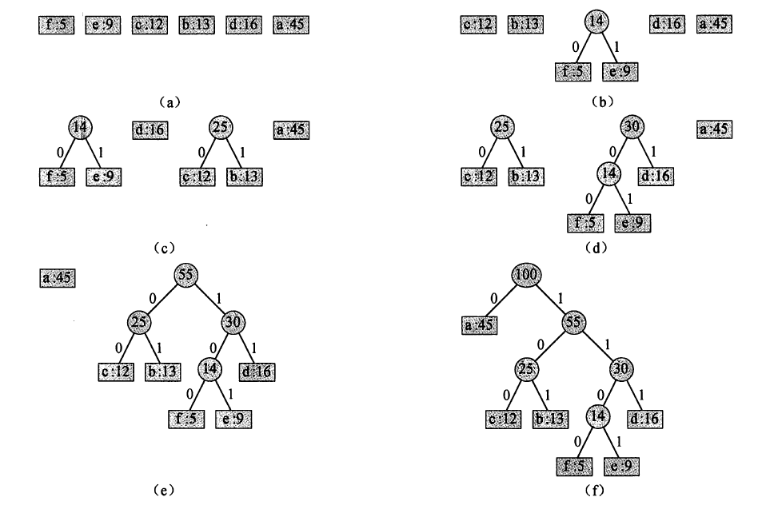