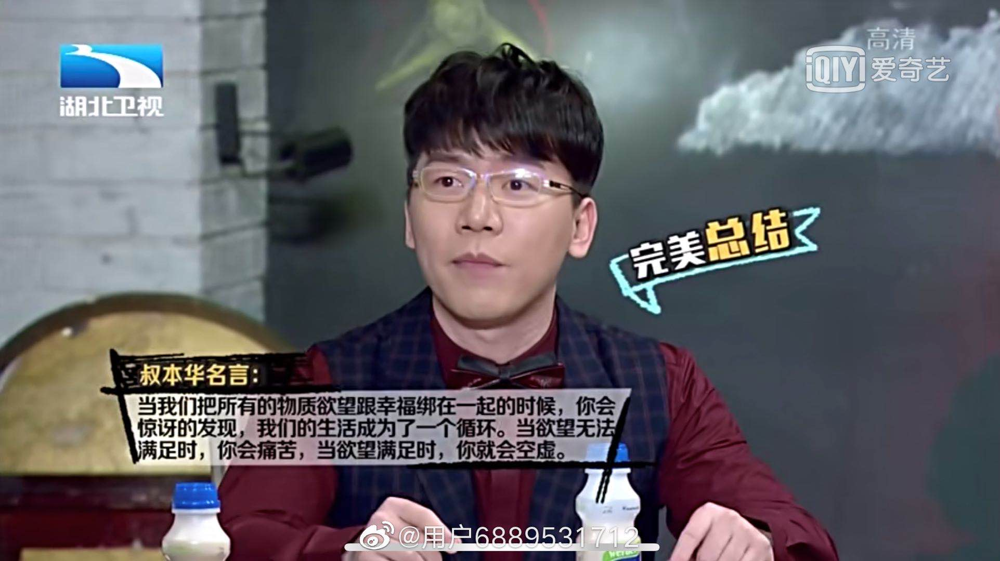

`摆在书架上很久的书，心血来潮拿下来觉得该读一读了。这本书与“幸福论”有关，教导人们如何尽量称心、愉快地度过一生这样一门艺术。在此摘抄下一些觉得有道理的句子，以备将来不时之需。`<!--more-->

## 第1章 基本的划分

我认为决定凡人命运的根本差别在于三项内容，它们是：
 （1）人的自身，即在最广泛意义上属于人的个性的东西。因此，“人的自身”包括健康、力量、外貌、气质、道德品格、精神智力及其潜在发展。
 （2）人所拥有的身外之物，亦即财产和所有意义上的占有物。
 （3）人向其他人所展示的样子，众所周知的就是人在其他人眼中所呈现的样子，亦即人们对它的看法。他人的看法又可分为名誉、地位和名声。

***

每一个人到底生活在何样的世界，首先取决于这个人对这个世界的理解，这因个人头脑的差异而相应不同：是贫瘠的、浅薄的和肤浅的，抑或是丰富多彩、趣味盎然和充满意义的。例如，不少人羡慕他人在生活中发现和经历饶有趣味的事情，其实他们应该羡慕后者理解事物的禀赋才对，因为正是因为由于理解事物的禀赋，他们经历过的事情，在其描绘中才是那样耐人寻味。这是因为在一个思想丰富的人看来是意味深长的事情，由一个头脑肤浅、平庸的人理解的话，那不过是平凡世界里乏味的一幕而已。

***

每个人都囿于自己的意识，正如每个人都囿于自己的皮囊，并且只是直接活在自己的意识之中。

***

苏格拉底在看到摆卖的奢侈品时，说道：我不需要的东西，可真不少啊！

## 第2章 人的自身

### 关于愉快心情

当愉快心情到来之时，我们应该敞开大门欢迎，因为它的到来永远不会不合时宜。

***

高兴的心情直接使我们获益。它才是幸福的现金，而其他别的都只是兑现幸福的支票，因为高兴的心情在当下直接给人以愉快。所以，对于我们的生存，它是一种无与伦比的恩物，因为我们生存的真实性就体现在无法割裂的此时此刻，连接着两段无尽的时间。据此，我们应把获得和促进愉快的心情放在各种追求的首位。

***

只需泛泛浏览一下生活，就可知道：人类幸福的两个死敌就是痛苦和无聊。还有我们成功远离了上述其中一个死敌的时候，也就在同等程度上接近了另一个死敌，反之亦然。这样，我们的生活确实就是在这两者之间或强或弱地摇摆。这是因为痛苦和无聊是处于双重的对立关系。一重是外在的，或说客体的；另一重是内在的，或说主体的。也就是说，外在的一重对立关系就是生活的艰辛和匮乏造成了痛苦，而丰裕和安定就产生了无聊。

### 关于无聊和空虚

`以前就听陈铭老师说过这句话，没想到出处是这里。`

内在空虚就是无聊的真正根源，这种人无时无刻不在向外面寻求刺激，试图借助某事某物使他们的精神和情绪活动起来。...能让我们免于这种痛苦的可靠手段，莫过于拥有丰富的内在，即丰富的精神思想。因为人的精神思想财富越优越和显著，留给无聊的空间就越小。这些人头脑里面的思想活泼，奔涌不息，不断更新；这些人玩味和摸索着内在世界和外部世界的多种现象；还有把这些思想进行各种组合的冲动和能力——所有这些，除了精神松弛下来的个别时候，都使卓越的头脑远离了无聊。但在另一方面，突出的智力以敏锐的感觉为直接前提，以激烈的意欲，亦即强烈的冲动和激情为根基。这些素质结合在一起极大地提高了情感的强烈程度，提高了对精神痛苦，甚至肉体痛苦的敏感性。对任何不如意的事情，甚至细微的骚动，都会感到更加不耐烦。

***

一个人的自身拥有越丰富，他对身外之物的需求也就越少，别人对他来说就越不重要。所以，卓越的精神思想会导致一个人不喜与他人交往。...在独处的时候，每个人都返回到自身，这个人的自身拥有就会暴露无遗。

***

愚蠢的人饱受无聊之苦。——塞内加

***

我们大致上可以发现：一个人对与人交往的热衷程度，与他贫乏的思想和总体的平庸成正比。人们在这个世界上要么选择独处，要么选择庸俗，除此之外，再没有更多别的选择了。

### 关于闲暇

人们辛苦挣来的闲暇，就是人的一生的果实和收获，因为这闲暇让人能够自由地享受自己的意识和个性所带来的乐趣。除此闲暇以外，人的整个一生就只是辛苦和劳作而已。但闲暇给大多数人带来了什么呢？如果不是声色享受和胡闹，就是无聊和浑噩。人们消磨闲暇的方式显示出闲暇对于他们是何等的没有价值。他们的闲暇也就是阿里奥斯托所说的“一无所知者的无聊“。常人考虑的只是如何去打发时间，而略具才华的人却考虑如何利用时间。头脑思想狭隘的人容易受到无聊的侵袭，其原因就是他们的智力纯粹服务于他们的意欲，是发现动因的手段。

***

归根到底，每个人都孑然独立，最关键的就是他到底是个什么样的人。

***

幸福属于那些自得其乐的人。——亚里士多德

这是因为幸福和快乐的外在于安全，就其本质而言，都是机器不保险、不确定、为时短暂和受制于偶然的。因此，甚至在形势大好的情况下，这些外在源泉仍会轻易终结。的确，只要这些外在源泉不在我们的控制之下，这种情形就是不可避免的。

***

我们这个世界乏善可陈，到处充斥着匮乏和痛苦，对于那些侥幸逃过匮乏和痛苦的人们来说，无聊却正在每个角落等待着它们。

***

生活在这样一个世界里，一个拥有丰富内在的人，就像在冬月的晚上，在漫天冰雪当中拥有一间明亮、温暖、愉快的圣诞小屋。因此，能够拥有了优越、丰富的个性，尤其是深邃的精神思想，无疑是在这地球上得到的最大幸运。

### 关于精神生活

一般来说，每个无事可做的人都会根据自己的强项能力而挑选一种能够运用此能力的消遣。

***

每个人都会根据自己身上所突出的或这或那的能力而选择相应的异类快乐。第一类是机体新陈代谢能力所带来的快乐。第二类是发挥肌肉力量所带来的快乐。第三类为施展感觉能力方面的快乐。...

感觉能力比人的另外两种生理能力更为优越，因为人在感觉方面的明显优势就是人优胜于动物之处，而人的另外两种生理基本能力在动物身上也同样存在，甚至超过人类。感觉能力隶属于人的认知能力，因此，卓越的感觉力使我们有能力享受到属于认知的，亦即所谓精神思想上的快乐。

***

一个具有思想天赋的人除了个人生活之外，还过着另一种精神的生活，精神的生活逐渐成为了他的唯一目标，而个人生活只是实现自己目标的一种手段而已。但对于芸芸众生来说，只有这一浅薄、空虚和充满烦恼的存在才必须是生活的目标。精神卓越的人首要关注的是精神生活。随着他们对事物的洞察和认识持续地加深和增长，他们的精神生活获得了某种连贯性和持续提升，越来越完整和完美，就像一件逐步变得完美的艺术品。与这种精神生活相比，那种纯粹以追求个人自身安逸为目标的实际生活则显得可悲——这种生活增加的只是长度而不是深度。正如我已经说过的，这种现实生活对于大众就是目的，但对于精神卓越者而言，那只是手段而已。

***

孤身独处正是他们求之不得的，闲暇则是至高的礼物，其他的别的一切好处都是可有可无的。

***

虽然如此，我们却要考虑到一个具有优异思想禀赋的人由于头脑超常的神经活动，对形形色色的痛苦的感受力大大加强了。另外，他拥有这些思想禀赋的前提条件，亦即那激烈的气质，以及与此密不可分的头脑中那些更加生动、更加完美的表象，都会让透过这些表象而刺激起来的激动情绪更增加了烈度。总的来说，这些激动情绪是痛苦多于愉快。最后就是巨大的精神思想禀赋使拥有这些禀赋的人疏远了其他人及其追求。因为自身的拥有越丰富，他在别人身上所能发现得到的就越少。其他人引以为乐的、花样繁多的事情，在他眼里既乏味又浅薄。

### 菲利斯特人

在这里，我们不会不提及这样一类人：由于仅仅具备了常规的、有限的智力配给，所以，他们并没有精神思想上的需求，他们也就是德语里所说的“菲利斯特人”。...菲利斯特人就是一个没有精神需求的人。

***

对这种人来说，真正的快乐只能是感官上的快乐，他们就通过这些补偿自己。

***

在与他人的交往中，他们会寻求那些能满足自己生理上的需要，而不是精神上的需求的人。因此，在他们对别人的诸多要求中，最不重要的就是别人必须具备一定的头脑思想。

***

菲利斯特人的巨大痛苦就是在于任何观念性的东西都无法带给他们愉快。为了逃避无聊，他们不断需要现实性的东西。但由于现实性的东西一来很快就会被穷尽，一旦这样，它们不但不再提供快乐，反而会使人厌烦；二来还会带来各种祸殃。相比较而言，观念性的东西却是不可穷尽的，它们本身既无邪也乌海。

