## 一、生物神经系统与人工神经网络
### 生物神经系统的结构<!--more-->

- 什么是意识？

  - 意识是人脑对大脑内外表象的觉察
  - 人的头脑对于客观物质世界的反映，也是感觉、思维等各种心理过程的总和
  - 我：意识是一种信息

- 人工神经网络

  - 能从输入数据中学习“信息”

  - 信息以某种方式存储在神经网络这个“黑匣子”中

  - 人工神经网络能利用学到的“信息”完成很多任务

    <u>人工神经网络在“信息”意义上已经具有了某种“意识”</u>

- 意识是如何产生的？

  - 二元论：心理和身体是两种不同的物质，他们独立存在——违背了能量守恒定律
  - 一元论：宇宙只是由一种物质构成
    - 唯物主义：所有存在的物质都是物质的、有形的
    - 唯心主义：没有心理去感知，物理世界将不会存在
    - 同一性观点：心理过程和某些大脑活动过程是一样的，只不过用不同的术语来描述

### 人工神经网络简介

- 神经网络：模拟人类大脑的模型
  - 大规模并行分布处理器，由一些简单的处理单元（神经元）组成，能够保存经验知识，并且能够利用这些经验知识完成一些任务
  - 通过“学习”来从环境中积累知识，知识被保存在神经元之间的连接上
- **有两个方面类似于人脑**：
  1. 知识由网络通过学习过程得到；
  2. 神经元间的互联，用来存储知识的已知的联合权值
- **神经网络的特点**
  - 面向神经元和联结性
  - 信息的分布表示
    - 并行、分布处理结构
    - 一个处理单元的输出可以被任意分枝，且大小不变
    - 记忆效应
  - 运算的全局并行和局部操作
    - 处理单元完全的局部操作
    - 集体效应
  - 处理的非线性性
    - 可以模拟任意的数学模型
  - 自组织性
- **神经网络的能力**
  - 学习能力
    - 学习从环境中获取的信息
  - 泛化能力
    - 对从未学习过的输入产生可信的输出
  - 容错能力
    - 系统受到局部损伤时仍然能够正常工作

## 二、人工神经元

### MP神经元

- 结构（f为阶跃函数）

  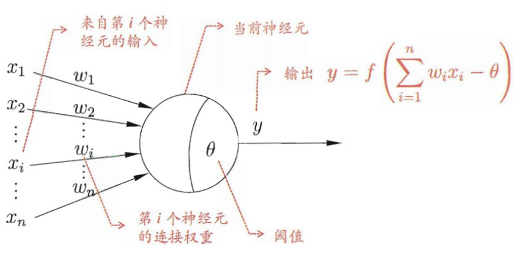

- 特征

  - 二值网络（binary：fire-1, or not fire-0）：自变量及其函数的值、向量分量的值只取0和1函数、向量。
  - 由有方向的、带权重的路径联系
  - 权为正：刺激；权为负：抑制
  - 全或无：每个神经元有一个固定的阈值，如果输入大于阈值，就fires
  - 绝对抑制：阈值被设为使得抑制为绝对的，即，非0的抑制输入将阻止该神经元兴奋。
  - 花费一个时间单位使得信号通过一个连接
  - 任意命题逻辑函数都可由一两层的MP模型计算
  - 所有的命题逻辑函数都可以用MP AND逻辑门、MP OR逻辑门、MP NOT逻辑门予以表达和实现（*重点） 
  - MP模型具有神经计算模型一般和普遍的特性，可表达一般人工神经网络的赋权联结和相对抑制

- 与

  - W = 1，threshold = -2

  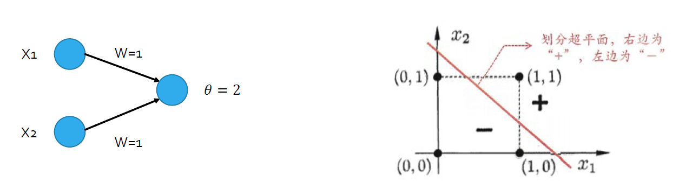

- 或

  - W = 1，threshold = -1

    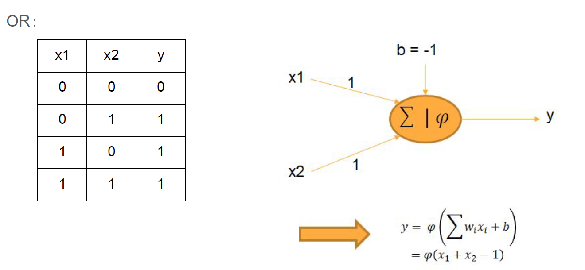

- 非

  - W=-1,threshold=0

    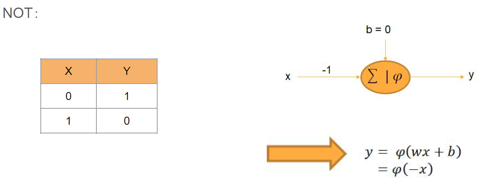

- 与非

  - W = 2, p = 1, threshold = 2

- 异或

  - X1 XOR x2 <-> (x1 AND NOT x2) OR (x2 AND NOT x1)
  
    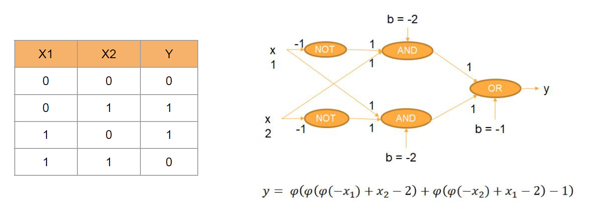
  
  - X1 XOR x2 <-> NOT (NOT x1 OR x2) OR NOT(x1 OR NOT x2)

### 线性模型

#### 最小二乘法（*重点）

假设$h(x)=wx+b$，均方误差$ E= \frac{1}{n} \sum _{i=1}^{n} \left[ h(x_{i})-y_{i} \right] ^{2} $ ，问题就被化为求$ =argmin_{w,b}\frac{1}{n} \sum _{i=1}^{n}(wx_{i}+b-y_{i})^{2} $ 。令导数为0，解得：

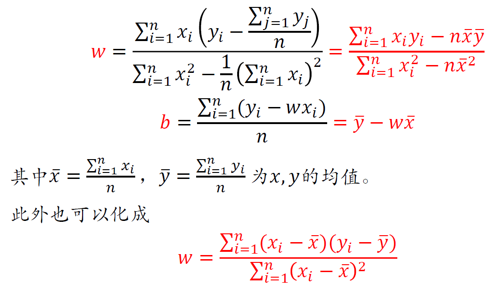

神经元表示：

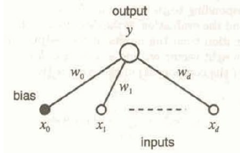

### 线性分类

线性分类需要更复杂的神经元来解决，两分类问题可用一个神经元来表示，但不同于线性回归，神经元中对数据加权求和后需要在进行一步非线性操作，即用单位阶跃函数对求和结果进行映射。输出𝑦也不再是一个常数，两分类中用0,1表示不同的类别

### 感知器神经元

#### 激活函数

- 功能：将神经元的加权输入线性/非线性转换成一个输出的激活函数

- 阶跃式激活函数

  - Identity function (同一函数)
  - Threshold function (阈值函数)
    - f(x)=1, if x>=阈值
    - f(x)=-1, if x<阈值
  - Piecewise linear function(分段线性函数)
    - f(x)=1, if x>=阈值
    - f(x)=x, if -阈值<x<阈值
    - f(x)=-1, if x<=-阈值

- 非线性激活函数：保持在上限和下限之间的非线性的连续函数
  （1）非线性：函数的输出随输入做非线性的变化，
  （2）连续函数：函数中没有顶点或者中断，可以从始至终进行微分

  $ Sigmoid (z)= \frac{1}{1+e^{-z}} $ 
  
  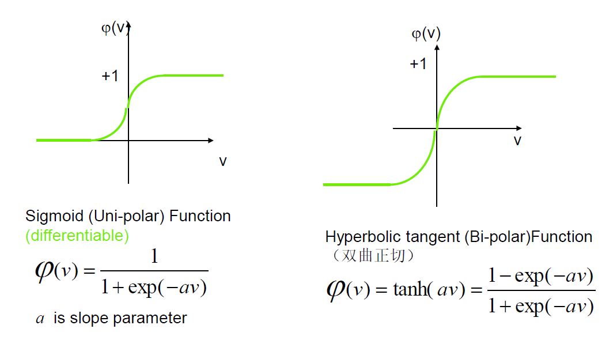

### FT神经元

启发来源：神经元A接收到来自神经元B的刺激信号后的响应，不仅取决于神经元B的轴突传递强度，还依赖与神经元A的树突浓度，这与神经元A的记忆单元有关。

## 三、人工神经元的学习

### 生物神经元的学习

学习的两种具体类型

- 经典条件作用
  - 由一个刺激或事件预示另一个刺激或事件的到来
  - 巴浦洛夫的狗——巴浦洛夫条件作用
  - 刺激泛化：反应自动扩展到与刺激相似的新刺激上
- 操作性条件作用
  - 操作：自发产生的行为，可按照他作用于环境并使环境发生了可观察的结果来描述其特点
  - 效果律：带来满意结果的反应出现的概率会越来越大，带来不满意结果的反应出现的概率越来越小
  - 桑代克的迷笼（猫）——指向成功的特定冲动则因愉快的结果而保留下来 

### 感知器学习方法

#### 随机学习

- 随机更新权矩阵𝑾和偏置矩阵𝑩，然后慢慢对赋值进行修正

- 尽管随机学习效率很低，但其思想简单，实现容易，且具有能找到全局最优解等特点，在对其搜索方法进行改进后，也能够具有一定的实际应用意义

#### Hebbian学习

- 一个网络里的信息被储存在神经元之间的权值中；
- 假定两个神经元之间<u>的权值变换是与它们神经元的输出成比例</u>的；
- 假定随着通过重复和激励一组弱连接神经元而发生学习时，它们之间权值的强度和模式经历逐步增加改变，最终导致神经元形成强连接集合形式。
- 假设两个神经元有x和y的输出，如果x激励y，它们之间的连接强度就会增加。两个神经元之间的权值改变Δw与x和y成比例：$\Delta w= \beta x \cdot y$
  - 比例系数𝛽叫做“学习率”，决定学习发生的速度。𝛽越大，权值改变得越快。

#### 实例1：作为分类器的有监督学习的感知器（PPT 29-36， *会计算) 

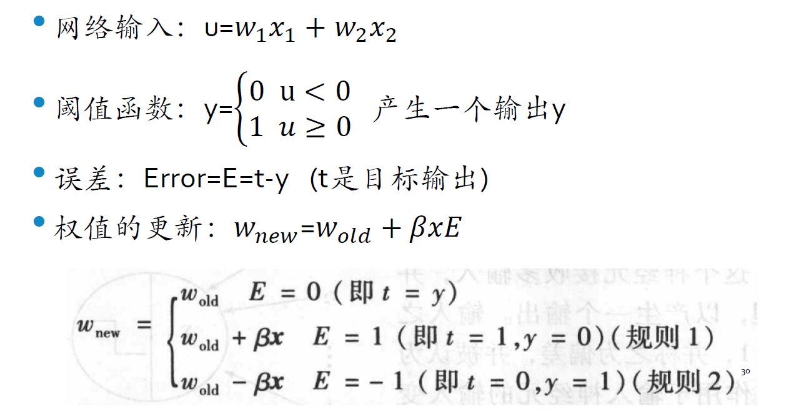

#### 实例2：线性神经元预报器 (PPT 38-42， *会计算)

上述方法尝试利用一个样本来更新w权重，为何有效？

- 其本质是利用单个样本在平方差损失函数$ L(t,y)= \frac{1}{2}(y-t)^{2} $ 上的梯度信息，进行更新。

#### 梯度下降法学习

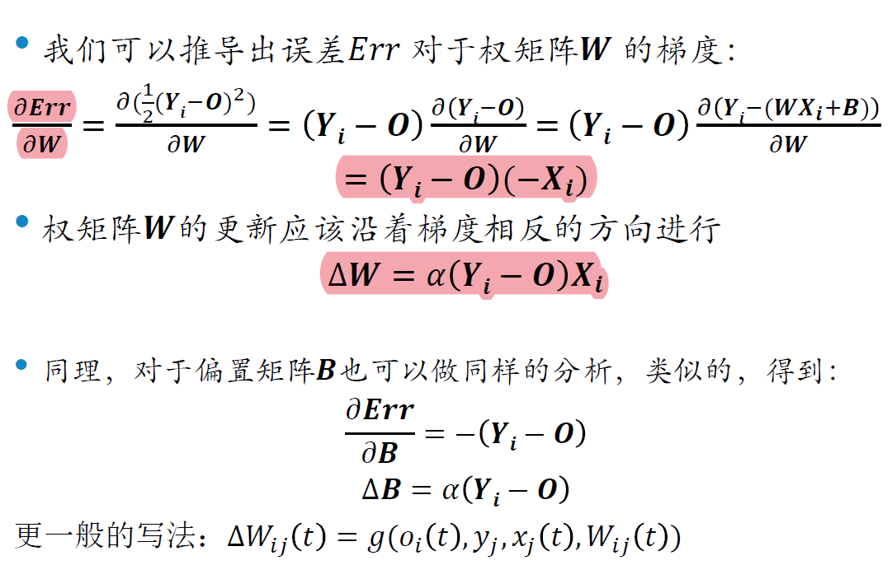

- **学习率调整方法：**

  - （1）学习率衰减

    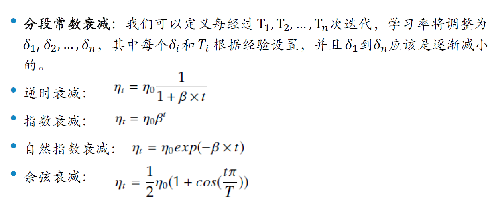

  - （2）学习率预热

    为了让初始阶段的学习更加稳定：在初始的几轮，采用较小的学习率。梯度下降到一定程度之后，再恢复到初始设置的学习率

  - （3）周期学习率

    循环学习率（Cyclic）是让学习率在一个区间内周期性的增大和缩小

  - （4）自适应调整学习率：AdaGrad，RMSprop，AdaDelta

- **梯度下降面临的困难**

  - 很难选择一个合适学习率
  - 对于所有的参数，均使用相同的学习率。不同参数的梯度大小有差异。
  - 在非凸函数的优化过程中，我们往往希望模型能够跳过那些局部极值点，去找一个更好的极值。实际问题中，鞍点问题很难解决。

- 感知机学习算法

  - 算法的收敛性：证明经过有限次迭代可以得到一个将训练数据集完全正确划分的分离超平面及感知机模型。
  - 感知机算法存在许多解，既依赖于初值，也依赖迭代过程中误分类点的选择顺序。
  - 为得到唯一分离超平面，需要增加约束。
  - 线性不可分数据集，迭代震荡。

### ADALINE: Adaptive Linear Element

- 结构
  - 与感知器网络结构非常相似
  - 激活函数不同：**线性函数**
- ADALINE的学习：LMS（Least-Mean-Square learning algorithm）
- **ADALINE和感知器的比较**
  - 神经元模型不同
    - 感知器：非线性模型，只能输出两种可能的值，其激活函数是**阈值函数**
    - ADALINE：线性模型，输出可以取任意值，其激活函数是线性函数
  - 功能不同
    - Perceptron:感知器只能做简单的分类
    - LMS：还可以实现拟合或逼近
  - **分类性能不同**
    - LMS算法得到的分类边界往往处于两类模式的正中间
    - 感知器学习算法在刚刚能正确分类的位置就停下来，使分类边界离一些模式距离过近，使系统对误差更敏感

## 四、神经元的连接

### 神经元的联结综述

- 神经元的连接方式
  - 层级结构和互联网型结构：通常同一层不具有连接、两个相邻层完全连接(每一层的每一个神经元到另一层的每个神经元)。
  - 层（级）内联结模式：用来加强和完成层内神经元之间的竞争
  - 互联网型连接模式：最典型的就是马可夫链和Hopfield网络(HN)。
- 神经元计算方式
  - 循环联结模式
  - 卷积计算模式

### 宽度扩展：以多输出的单层感知器为例

算法思想：将单输出感知器的处理逐个地用于多输出感知器输出层的每一个神经元的处理。

- 离散多输出感知器训练算法

  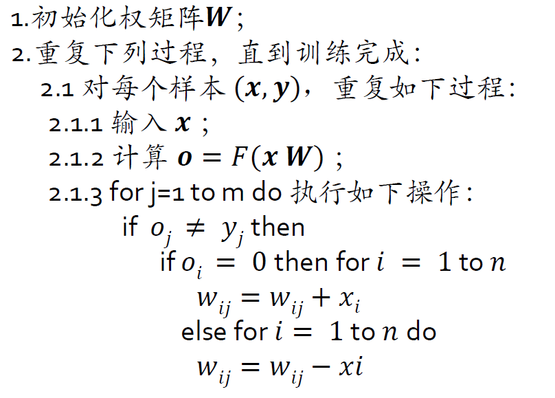

- 连续多输出感知器训练算法

  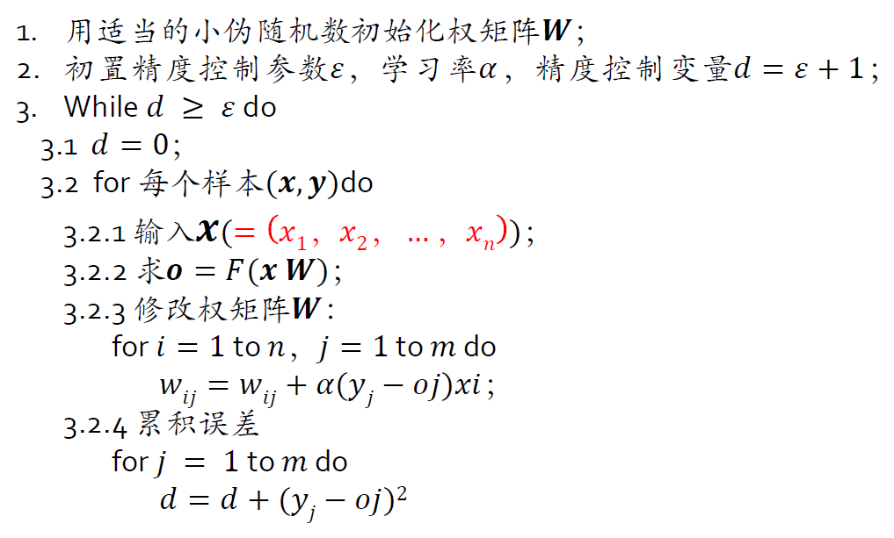

### 深度扩展：多层感知器

在输入层和输出层之间至少有一层（称之为隐藏层，hidden layer）

- 和单层神经网络相比能解决更加复杂的问题
- 训练更加困难
- 有些情况下能解决单层不能解决的问题

代表：多层感知器、CNN

- 手工搭建并设置单隐藏层网络模型：拟合sin函数 (*计算,PPT53-60)

  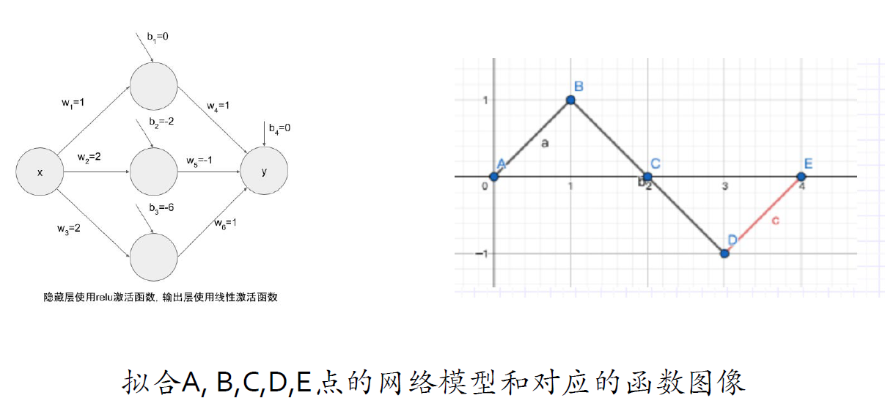

### 其他连接方式

- 卷积神经网络（Convolutional Net）
- 竞争神经网络（Competitive Net ）
- 循环神经网络（Recurrent Net ）
- 其他类型网络

### 作业

- 阈值函数为什么不适合作为激活函数？

  - 理由，大多数激活函数都需要满足以下条件（当然也存在不完全满足的，比如relu函数）
    1. 神经网络的激活函数需要满足的条件之一就是函数是**连续可导**的，这样才能使用梯度下降法更新网络参数，这里该函数在x=0处不是连续可导的
    2. 神经网络激活函数还需要满足函数是**单调增/减**的，这里也不满足
  - <u>不适合，因为它不连续、不光滑，导致在x=0处不可微，并且在其他地方的导数是零，无法使用基于梯度的参数优化方法。</u>
  
- 能否用一个神经元拟合二次曲线吗？如果能，请给出实例。如果不能，请说明至少需要多少个神经元才能拟合二次曲
  线。

  - 能，考虑二次函数的一般形式 $y=ax^2 + bx + c$，可设计如下单个神经元结构就能拟合二次曲线。

    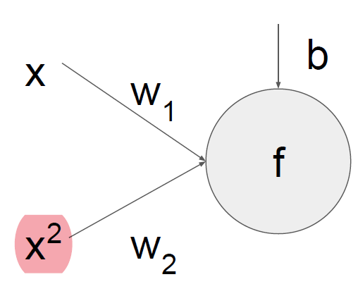

## 五、多层感知器

### BP网络的训练—基本算法

- 弱点：训练速度非常慢、局部极小点的逃离问题、算法不一定收敛

- 优点：广泛的适应性和有效性

  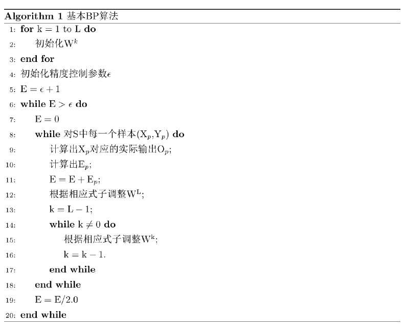

计算例子（PPT 21-24）

### BP算法的改进

- BP针对单个样例进行更新
  - 不同样例的更新的效果可能“抵消”。BP网络接受样本的顺序对训练结果有较大影响。它更“偏爱”较后出现的样本。给样本安排一个适当的顺序，是非常困难的。
  - **用多个样本的“总效果”修改权重**$ \Delta w_{ij}^{(k)}= \sum _{p} \Delta w_{ij}^{(k)} $ 

- 消除样本顺序影响的BP算法:
  - 较好地解决了因样本的顺序引起的精度问题和训练的抖动问题
  - 收敛速度：比较慢
  - 偏移量：给每一个神经元增加一个偏移量来加快收敛速度
  - 冲量：<u>联接权的本次修改要考虑上次修改的影响，以减少抖动问题</u>

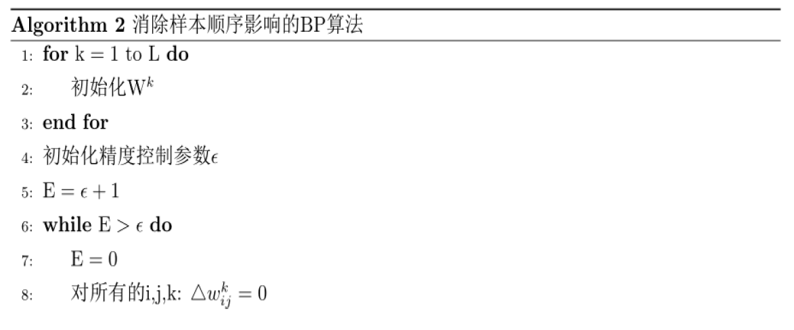

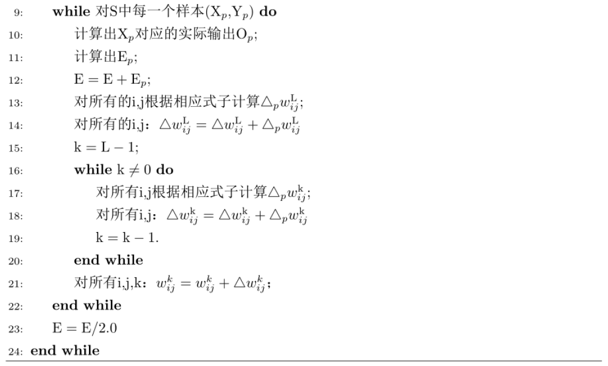

- 设置冲量的BP算法

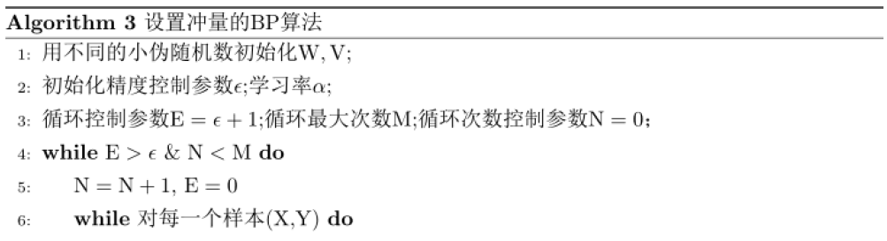

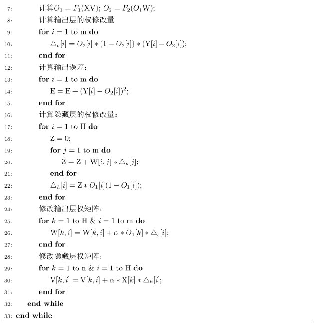

### 算法的理论基础（*掌握）

- 实例：拟合正弦波的第一个1/4周期波形(PPT 42-63)

- 局部极小点问题
  - 修改初值：从多个初始点开始进行搜索。
  - 模拟退火：以一定概率接受比当前结果更差的解。
  - **随机梯度下降：计算梯度值时，加入了随机因素，极小值点处计算的梯度不为0，有机会跳出局部极小。**
  - 遗传算法
- 几个问题的讨论
  - 收敛速度问题
  - 网络瘫痪问题
    - 在训练中，权可能变得很大，这会使神经元的网络输入变得很大，从而又使得其激活函数的导函数在此点上的取值很小。根据相应式子，此时的训练步长会变得非常小，进而将导致训练速度降得非常低，最终导致网络停止收敛
  - 稳定性问题
    - 用修改量的综合实施权的修改
    - 连续变化的环境，它将变成无效的
  - 步长问题
    - BP网络的收敛是基于无穷小的权修改量
    - 步长太小，收敛就非常慢
    - 步长太大，可能会导致网络的瘫痪和不稳定
    - 自适应步长，使得权修改量能随着网络的训练而不断变化。[1988年，Wasserman]
      - AdaGrad方法：在模型训练初期，参数变化快（学习率大），而在模型训练后期，参数变化慢且梯度更新值小。

### 作业

- 进一步提高神经网络识别率的方法：

1. 增加隐藏层数；
2. 增加隐藏层神经元个数；
3. 增加训练轮数；
4. 获取更多训练数据；
5. 使用卷积神经网络等其他网络结构

## 六、正则化、归一化和预训练

### 数据、模型与特征工程

- 常见的数据问题
  - 不同维度差异过大（数据中心偏置）
  - 正负例样本不均衡
- 模型问题
  - 过/欠拟合
  - 梯度消失/梯度爆炸
  - 模型过大，难以重新训练等
- 解决上述问题常用的手段有：
  1、正则化，规一化
  2、预训练和迁移学习
  3、特征预处理（特征工程）

### 正则化与归一化

#### 正则化

- 过拟合和欠拟合

  - 过拟合：模型过于复杂，参数过多或训练数据过少，噪声过多。
  - 欠拟合：模型比较简单，特征维度过少。

- 偏差和方差：定量分析

  - 偏差：衡量模型预测值和实际值之间的偏离关系，即模型在样本上拟合得好不好。

  - 方差：描述模型在整体数据上表现的稳定情况，在训练集和验证集/测试集上表现是否一致

    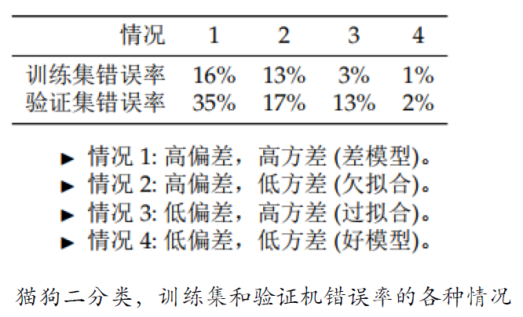

- 正则化：**通过限制模型的复杂度，避免过拟合，提高泛化能**

- 不同的正则化方法
  

1、L1和L2正则化（*掌握）

  - l1正则化：$ argmin_{ \theta } \frac{1}{N}( \sum _{i}^{N} L(y_{i},f(x_{i}, \theta ))+ \lambda | \theta |) $ 
    
    - 目的：**使𝜃更容易为0，整体权重矩阵更为稀疏，抑制过拟合。**
  - l2正则化：$ argmin_{ \theta } \frac{1}{N}( \sum _{i}^{N}L(y_{i},f(x_{i}, \theta ))+ \lambda \theta ^{2}) $ 
    
  - 目的：**使得权重变得更小**
  
- 参数$\lambda$的意义
    - $\lambda$：正则化项系数，用来控制正则化项的“力度”，<u>平衡损失函数和正则化项之间的关系</u>。
  - 若ƛ项越大，正则化项在损失函数中所占比例更大，因此损失函数更倾向于优化正则化项，对原始的损失函数V产生较小影响，易导致模型简单，发生欠拟合；
    - 若ƛ项越小，相比于原始的损失函数，正则化项在损失函数中所占比例很小，几乎
    不起作用，容易发生过拟合问题。
  

  2、权重衰减法
  
  - 每次参数更新时，都先对参数进行一定衰减：$ \theta :=(1-w) \theta - \alpha d \theta $ （其中w为权重衰减系数）

  3、丢弃法

  - 在训练时，以概率p随机丢弃部分神经元。
  - 1.相当于取平均的作用，取每次丢弃后子网络的平均结果。
    - 2.降低神经元之间的敏感度，增加整体鲁棒性。

  4、提前停止

  - 思路：提早结束训练
  
  - 验证集错误率基本不下降时或有反增趋势时，可以提前停止训练。
  
  5、数据增强
  
  - 在不实质增加数据的情况下，对当前数据执行一些操作达到数据增加的效果。
    - 图像数据：翻转、旋转、镜像、裁剪、增加高斯白噪声等
    - 文本数据：同义词替换、随机插入、随机交换、随机删除等

#### 归一化

- 为什么要归一化？

  - 提升模型的收敛速度
    - 所形成的等高线非常尖。当使用梯度下降法寻求最优解时，很有可能走“之字型”路线（垂直等高线走），从而导致需要迭代很多次才能收敛

- 最常用的归一化方法

  - Min-max归一化：将结果映射到[0,1]之间$ \widehat{x}= \frac{x- \min (x)}{ \max (x)- \min (x)} $ 

  - Z-score归一化（标准归一化）：$ \widehat{x}= \frac{x- \mu }{ \sigma } $ 

  - **批归一化（Batch Normalization，BN）**

    - 思路：逐层归一化方法，对神经网络中任意的中间层进行归一化操作。使得净输入的分布一致（例如正态分布），一般应用在激活函数之前。
    - 加快了模型的收敛速度，而且更重要的是在一定程度缓解了深层网络中“梯度弥散”的问题，从而使得训练深层网络模型更加容易和稳定。
    - BN的输出服从什么分布？
      - 标准正态分布，N(0,1)：均值为0，方差为1.
    - **Batch normalization为什么归一化后还有放缩（γ ）和平移（β ）？**
      - 平移和放缩是变换的反操作。通过反操作将标准化后的数据尽可能恢复。如果批标准化没有发挥作用，通过放缩和平移可以抵消一部分标准化的作用。防止网络表达能力下降，恢复数据。弥补归一化后模型损失的表征能力。
      - 规范化操作让每一层网络的输入数据分布都变得稳定，但却导致了数据表达能力的缺失。也就是我们通过变换操作改变了原有数据的信息表达，使得底层网络学习到的参数信息丢失。另一方面，通过让每一层的输入分布均值为0，方差为1，会使得输入在经过sigmoid或tanh激活函数时，容易陷入非线性激活函数的线性区域。放缩和平移这两个参数对规范化后的数据进行线性变换，是为了<u>恢复数据本身的表达能力，保留原始输入特征的分布信息。</u>
    - 算法
    
    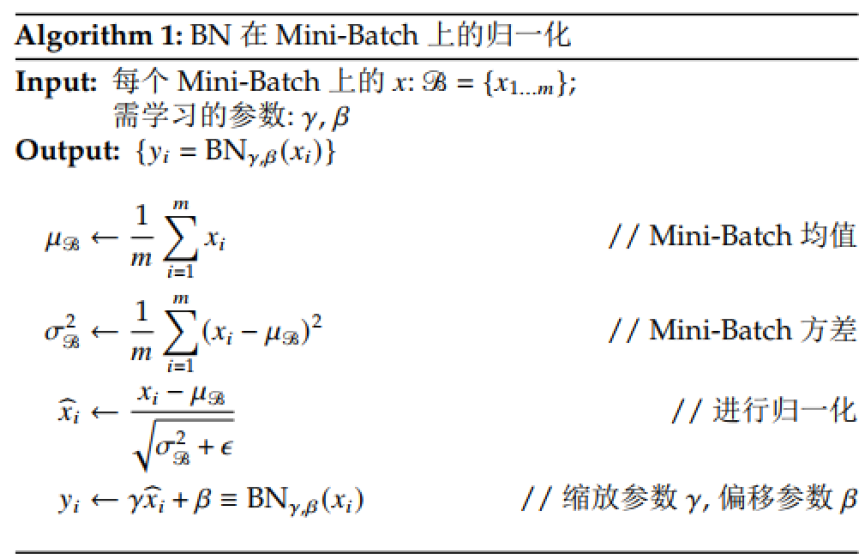
    
  - 层归一化（Layer Normalization，LN）

    - 思路：对中间层的所有神经元进行归一化

  - 实例归一化（Instance Normalization，IN）

    - 主要用于依赖于某个图像实例的任务。
  - N：batch维度，C：特征通道维度，H、W：特征图高和宽维度。
    - 对每个样本的H和W的数据求均值和标准化，保留N、C维度。

  - 组归一化（Group Normalization，GN）
  
    - 把特征通道分为G组，每组有C/G个特征通道，在组内归一

  - 可转换归一化（Switchable Normalization，SN）

    - 将批归一化、层归一化、实例归一化结合起来的方法，使网络自适应学习如何组合起来的权重。

    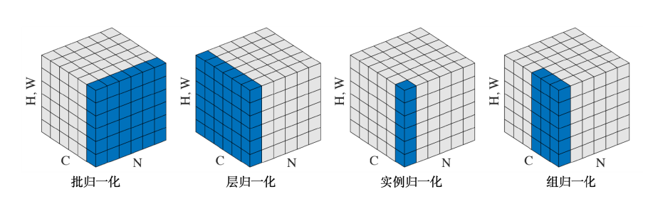

### 初始化、预训练和迁移学习

#### 网络参数初始化

- 不同的初始化参数，计算得到的“全局最小”差距很大。好的初始化值能够帮助网络更快地计算得到最优值，更容易收敛到目标函数。

- 目前没有发现一种初始化方式可以适用于任何网络结构。初始化需要避免“对称权重”现象（唯一确知的特性）

- 权重矩阵的初始化

  - 均匀分布初始化
    - 主要思想：在区间(-r,r)的均匀分布U(-r,r)中随机选取所有网络权值
    - 如何确定区间范围？尽量保持梯度能够在多层网络中传播
    - 规则1：对于任意网络权值$w_{ij}$，从如下分布中随机选取初始值：$ w_{ij} \sim U(- \frac{1}{ \sqrt{n_{i}}}, \frac{1}{ \sqrt{n_{i}}}) $ (其中$n_i$表示第i层的神经元数量。)
    - 规则2：Xavier 初始化
  - 高斯分布初始化
    - 主要思想：在固定均值和固定方差的高斯分布中随机选取所有网络权值
    - 缺陷：深层模型会非常难以收敛
  - 稀疏初始化
    - 主要思想：稀疏初始化降低连接数量，使得初始化的数值不会太小
  - 正交初始化
    - 主要思想：正交初始化可以避免训练开始时就出现梯度消失或梯度爆炸现象

- 偏置矩阵初始化

  - 偏置矩阵通常不需要考虑破坏对称性的问题，通常我们可以把偏置矩阵初始化为<u>全0矩阵</u>；
  - 除了一些例外情况：
    - 偏置作为输出单元，初始化偏置以获得正确的输出边缘的统计是有利的；
    - 需要选择偏置以避免初始化引起的太大饱和

- **不合理的初始化会导致梯度消失或爆炸现象**
  （1）大的梯度会使网络十分不稳定，会导致权重成为一个特别大的值，最终导致溢出而无法学习
  （2）小的梯度传过多层网络，达到靠近输入的隐藏层后会越来越小，导致隐藏层无法正常地进行学习。

  

#### 网络预训练和迁移学习

- 网络预训练：采用相同结构的，并且已经训练好的网络权值作为初始值，在当前任务上再次进行训练
- 为什么使用网络预训练？
  - 为了能够在更短时间内训练得到更好的网络性能
  - 相似的任务之间，训练好的神经网络可以复用，通常作为特征提取器
- 预训练方法
  - 无监督预训练
    - 玻尔兹曼机
    - 自编码器
  - 有监督预训练：迁移学习
    - 主要思想：通过大量带标签的数据集，大幅减少网络收敛的训练时间。站在巨人的肩膀上，复用已经得到的研究成果
    - 使用预训练模型的方式：
      - （1）**直接作为特征提取网络**：即将网络直接用于数据的特征提取，将输出作为特征，根据任务目标进行后续的分类、回归等操作，不再对这些预训练层进行进一步的学习，可以看作预训练模型“冻结（frozen）”了；
      - （2）**作为初始化模型进行微调**：部分或全部使用这个模型作为初始化模型，根据手头的数据对这个模型进行再次训练，这个过程被称为“精调（fine-tune）”。

## 七、神经动力学系统

### 概述

- 神经动力学：研究神经系统随时间的变化过程和规律

  - 确定性神经动力学：神经网络有确定的行为。用一组非线性微分方程描述。

  - 统计性神经动力学：神经网络受到噪声扰动，在数学上采用随机性的非线性微分方程来描述系统的行为，方程的解用概率表示

- 动力学系统
  - 大型的非线性动力学系统的动力特性可用下面的微分方程表示： $\frac{d}{dt}V(t)=F(V(t)) $
  - 如果一个非线性动力系统的向量函数$F(V(t))$不隐含地依赖于时间$t$，则此系统称为自治系统，否则不是自治的。

### 离散Hopfield网络（重点）

- 离散Hopfield网络是单层全互连的，其表现形式有两种

  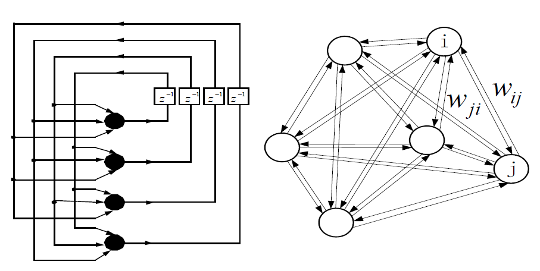

  - 神经元可取二值{0/1}或{−1/1}
  - **条件**：神经元之间联接是对称的，即$ W_{ij}=W_{ji} $ ；神经元自身无联接,即$W_{ii} = 0$
  - 每个神经元都将其输出通过突触权值传递给其它的神经元，同时每个神经元又都接收其它神经元传来的信息
  - 对每个神经元来说，其输出信号经过其它神经元后又有可能反馈给自己，所以Hopfield网络是一种**反馈神经网络**。
  - 输出计算：$ u_{i}(t)= \sum _{j=1,j\neq i}^{n}w_{ij}v_{j}(t)+b_{i} $ , $ v_{i}(t+1)=f(u_{i}(t)) $ 
    - 其中的激励函数$f(\cdot)$可取阶跃函数或符号函数

- 运行规则：Hopfield网络的工作方式主要有两种形式

  - **串行（异步）工作方式**：在任一时刻$t$，只有某一神经元$i$（随机的或确定的选择）依上式变化，而其他神经元的状态不变。

    > 第一步：对网络进行初始化
    > 第二步：从网络中随机选取一个神经元$i$
    > 第三步：求出该神经元$i$的输入 $ u_{i}(t)= \sum _{j=1,j\neq i}^{n}w_{ij}v_{j}(t)+b_{i} $
    >
    > 第四步：求出该神经元$i$的输出$ v_{i}(t+1)=f(u_{i}(t)) $ ，此时网络中的其它神经元的输出保持不变
    >
    > 第五步：判断网络是否达到稳定状态，若达到稳定状态或满足给定条件，则结束；否则转到第二步继续运行。这里网络的稳定状态定义为：若网络从某一时刻以后，状态不再发生变化，则称网络处于稳定状态。

    - Hopfield网络“能量函数”（Lyapunov函数）的“能量”在网络运行过程中应不断地降低，**最后达到稳定的平衡状态**

      - 能量函数：$ E=- \frac{1}{2} \sum _{i=1,i\neq j}^{n} \sum _{j=1,j\neq i}^{n}w_{ji}v_{j}v_{j}+ \sum _{j=1}^{n}b_{i}v_{i} $ 
      - 上式所定义的“能量函数”值应单调减小。所以在满足参数条件下，Hopfield网络状态是向着能量函数减小的方向演化。由于能量函数有界，所以系统必然会趋于稳定状态，该稳定状态即为Hopfield网络的输出

      - 能量函数的变化曲线含有全局最小点和局部最小点。将这些极值点作为记忆状态，可将Hopfield网络用于<u>联想记忆</u>；将能量函数作为代价函数，全局最小点看成最优解，则Hopfield网络可用于<u>最优化计算</u>

  - 并行（同步）工作方式：在任一时刻t，部分神经元或全部神经元的状态同时改变。

  

### 连续Hopfield网络

激励函数为连续函数

### 联想记忆

- 人工神经网络的联想就是指系统在给定一组刺激信号的作用下，该系统能联系出与之相对应的信号。联想是以记忆为前提的，即首先信息存储起来，再按某种方式或规则将相关信息取出。联想记忆的过程就是信息的存取过程。

- 所谓的联想记忆也称为**基于内容的存取**（Content-addressed memory），信息被分布于生物记忆的内容之中，而不是某个确定的地址。

  - （1）信息的存贮是按内容存贮记忆的(content addressable memory CAM)，而传统的计算机是基于地址存贮的（Addressable Memory）即一组信息对应着一定的存储单元。
    （2）信息的存贮是分布的，而不是集中的。

- 联想记忆的分类：联想记忆可分为自联想与异联想。Hopfield网络属于自联想。

  - **自联想**记忆(Auto-AssociativeMemory)
    自联想能将网络中输入模式映射到存贮在网络中不同模式中的一种。联想记忆网络不仅能将输入模式映射为自己所存贮的模式，而且还能对具有缺省/噪音的输入模式有一定的容错能力。
    - 设在学习过程中给联想记忆网络存入$M$个样本,若给联想记忆网络加以输入$ X^{ \prime }=X^{m}+V $ ，其中$X^{m}$是$M$个学习样本之一，$V$是偏差项（可代表噪声、缺损与畸变等），通过自联想联想记忆网络的输出为$X^{m}$，即使之复原（比如，破损照片→完整照片）
  - **异联想**网络：在受到具有一定噪音的输入模式激发时，能通过状态的演化联想到原来样本的模式对(如从破损照片得到某人的姓名)

- 联想记忆的工作过程

  - （1）**记忆阶段**：在记忆阶段就是通过设计或学习网络的权值，使网络具有<u>若干个稳定的平衡状态</u>，这些稳定的平衡状态也称为**吸引子（Attractor）**

    - 吸引子有一定的吸引域（Basin of Attraction），吸引子的吸引域就是能够稳定该吸引子的<u>所有初始状态的集合</u>，吸引域的大小用吸引半径来描述，吸引半径可定义为：吸引域中所含所有状态之间的最大距离或吸引子所能吸引状态的最大距离
    - 吸引子也就是<u>联想记忆网络能量函数的极值点</u>，记忆过程就是将<u>要记忆和存储的模式设计或训练成网络吸引子的过程</u>

  - （2）**联想阶段**

    - 联想过程就是给定输入模式，联想记忆网络通过动力学的演化过程达到稳定状态，即收敛到吸引子，回忆起已存储模式的过程。

    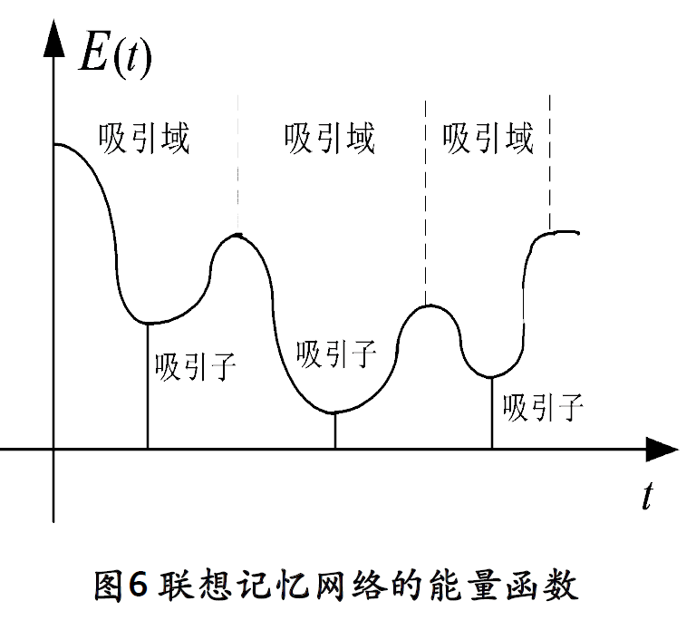

    - 吸引子的数量代表着AM的记忆容量（Memory Capacity）或存储容量（Storage Capacity），存储容量就是在一定的联想出错概率容限下，网络中存储互不干扰样本的最大数目
    - 吸引子具有一定的吸引域，吸引域是衡量网络容错性的指标，<u>吸引域越大网络的容错性能越好，或者说网络的联想能力就越强</u>

- **Hopfield联想记忆网络**

  - 将Hopfield网络作为AM需要设计或训练网络的权值，使吸引子存储记忆模式。常用的设计或学习算法有：外积法（OuterProductMethod）、投影学习法（ProjectionLearningRule）、伪逆法（PseudoInverseMethod）以及特征结构法（EigenStructureMethod）等

  - Hopfield联想记忆网络运行步骤

    - 第一步：设定记忆模式。将欲存储的模式进行编码，得到取值为1和−1的记忆模式($m<n$)：

      $ U_{k}= \left[ u_{1}^{k},u_{2}^{k}, \cdots ,u_{i}^{k}, \cdots ,u_{n}^{k} \right] ^{T}k=1,2, \cdots ,m $ 

    - 第二步：设计网络的权值

      $ w_{ij}= \begin{cases} \frac{1}{N} \sum _{ \mu =1}^{M}u_{i}^{k}u_{j}^{k},j \neq i \\\\ 0,j=i \end{cases} $ 

    - 第三步：初始化网络状态。将欲识别模式$ U^{ \prime }= \left[ u_{1}',u_{2}', \cdots ,u_{i}', \cdots ,u_{n}'\right] ^{T} $ 设为网络状态的初始状态，即：$ \nu _{i}(0)=u_{i} $ ，是网络中任意神经元$i$在$t=0$时刻的状态

    - 第四步：迭代收敛，随机地更新某一神经元的状态$ \nu _{i}(t+1)=Sgn \left[ \sum _{j=1}^{N}w_{ij}x_{j}(n) \right] $ 。反复迭代直至网络中所有神经元的状态不变为止

    - 第五步：网络输出，这时的网络状态（稳定状态），即为网络的输出$y=v_i(T)$

  - Hopfield联想记忆网络的记忆容量：就是在一定的联想出错概率容限下，网络中存储互不干扰样本的最大数目。记忆容量$\alpha$反映所记忆的模式$m$和神经元的数目$N$之间的关系：$\alpha=m/N$。记忆$m$个模式所需的神经元数$N=m/\alpha$，联接权值数目为$(m/\alpha)^2$，若$\alpha$增加一倍，联接权值数目降为原来的$1/4$，这是一对矛盾。在技术实现上也是很困难的。实验和理论研究表明Hopfield联想记忆网络记忆容量的上限为$0.15N$。

  - Hopfield AM网络存在伪状态（Spurious States），伪状态是指除记忆状态之外网络多余的稳定状态。

### 最优化计算

将Hopfield神经网络应用于求解组合优化问题，就是把目标函数转化为网络的能量函数，把问题的变量对应于网络的状态，当网络的能量函数收敛于极小值时，网络的状态就对应于问题的最优解。

## 八、随机神经网络

### 基本的非确定方法

- 非确定的方法：生物神经网络按照概率运行（别称：统计方法（Statistical Method））
  
- 既可以用于训练，又可以用于运行
  
- 基本思想

  - 从所给的网络中“随机地选取一个联接权”
  - 对该联接权提出一个“伪随机调整量”
  - 当用此调整量对所选的联接权进行修改后
    - 如果“被认为”修改改进了网络的性能，则保留
      此调整；
    - 否则放弃本次调整。

- 算法1 基本统计训练算法

  1、从样本集$S$中取一样本$(X,Y)$；

  2、将$X$输入到网络中，计算出实际输出$O$；

  3、求出网络关于$Y$、$O$的误差测度$E$；

  4、随机地从$W ^ { ( 1 ) } W ^ { ( 2 ) }, \ldots, W ^ { ( L ) }$中选择一个联接权$ w_{ij}^{(p)} $ ；

  5、生成一个小随机数$ \Delta w_{ij}^{(p)} $ ；

  6、用$ \Delta w_{ij}^{(p)} $ 修改$ w_{ij}^{(p)} $ ；

  7、用修改后的$W ^ { ( 1 ) } W ^ { ( 2 ) }, \ldots, W ^ { ( L ) }$重新计算$X$对应的实际输出$O'$；
  8、求出网络关于$Y$、$O'$的误差测度$E'$ ；
  9、如果$E'<E$，则保留本次对$W ^ { ( 1 ) } W ^ { ( 2 ) }, \ldots, W ^ { ( L ) }$的修改，否则，根据概率判断本次修改是否有用，如果认为有用，则保留本次对$W ^ { ( 1 ) } W ^ { ( 2 ) }, \ldots, W ^ { ( L ) }$的修改，如果认为本次修改无用，则放弃它；
  重复上述过程，直到网络满足要求。
  

### 模拟退火（重点）

- 金属中原子的能量与温度有关。原子能量高的时候，有能力摆脱其原来的能量状态而最后达到一个更加稳定的状态——全局极小能量状态
- 在金属的退火过程中，能量的状态分布$ P(E) \propto exp(- \frac{E}{kT}) $ 
  - $P(E)$——系统处于具有能量$E$的状态的概率；
  - $k$——Boltzmann常数；
  - $T$——系统的绝对温度(Kelvin)
- 高温情况下：$T$足够大，对系统所能处的任意能量状态$E$，有$exp(- \frac{E}{kT}) $ 将趋于1
- 中温情况下：$T$比较小，$E$的大小对$P(E)$有较大的影响，设$E_1>E_2,P(E_2)>P(E_1)$，即，系统处于高能量状态的可能性小于处于低能量状态的可能性
- 低温情况下：$T$非常小，$E$的大小对影响非常大，设$E_1>E_2,P(E_2)>>P(E_1)$，即，当温度趋近于0时，系统几乎不可能处于高能量状态

#### 基本思路

- 首先在高温下进行搜索，此时各状态出现概率相差不大，可以很快进入“热平衡状态”，这时进行的是一种“粗搜索”，也就是大<u>致找到系统的低能区</u>
- 随着温度的逐渐降低，各状态出现概率的差距逐渐被扩大，搜索精度不断提高。这就可以<u>越来越准确地找到网络能量函数的全局最小点</u>

#### 模拟退火与传统迭代最优算法的比较
（1）当系统在非零温度下时，从局部最优中跳出是非常可能的，因此不会陷入局部最优。
（2）系统最终状态的总特征可以在较高温度下看到，而状态的好的细节却在低温下表现，因此，模拟退火是自适应的。

#### 模拟退火原理

1.Metropolis抽样过程

- ΔE表示系统从状态vi转移至状态vj所引起的能量差。如果能量差ΔE为负，这种转移就导致状态能量的降低，这种转移就被接受。接下来，新状态作为算法下一步的起始点。
- 若能量差为正，算法在这一点进行概率操作。首先，选定一个在[0,1]内服从均匀分布的随机数ξ。如果$ξ<e^{-ΔE/T}$，则接受这种转移，否则，拒绝这种转移；即在算法的下一步中拒绝旧的状态。如此反复，达到系统在此温度下的热平衡。

2.退火过程（降温过程）

- Metropolis抽样过程中温度$T$缓慢地降低。
- 初始温度值：初始温度值$T_0$要选得足够高，保证模拟退火算法中所有可能的转移都能被接受。
- 温度的下降：原先使用指数函数实现温度的下降。但是这种方法使降温幅度过小，从而延长搜索时间。在实际中，通常使用下式：$ T_{k}= \lambda T_{k-1},k=1,2, \cdots $ 
- 终止温度：如果在连续的若干个温度下没有可接受的新状态，系统冻结或退火停止。

### 模拟退火算法用于组合优化问题

第一步：初始化。依据所要解决的组合优化问题，确定代价函数𝐶(﹒)的表达式，随机选择初始状态𝑉=𝑉(0)，设定初始温度$T_0$，终止温度$T_{final}$，概率阈值ξ。

第二步：Metropolis抽样过程
（1）在温度𝑇下依据某一规定的方式，根据当前解所处的状态𝑉，产生一个近邻子集𝑁(𝑉)（可包括𝑉，也可不包括𝑉），在𝑁(𝑉)内随机寻找一个新状态𝑆’作为下一个当前解的候选解，计算Δ𝐶’=𝐶(𝑉’)−𝐶(𝑉)。

（2）若Δ𝐶’<0,则𝑉=𝑉’，作为下一状态；若Δ𝐶’>0，则计算概率$ e^{- \Delta C^{ \prime }/T} $ ，若其大于给定概率阈值ξ，则取下一状态为𝑉=𝑉’，否则，保留这一状态。
（3）<u>按某一给定的收敛算法检查算法在温度T下是否应停止，若符合收敛条件则表示已达到热平衡，转向第三步的退火过程，若不符合收敛条件，则转向（1）继续迭代，直至在此温度下收敛。</u>

第三步：退火过程。
按照一定的降温方法得到一个新的温度𝑇，检查𝑇是否小于给定的温度终止阈值$T_{final}$。若小于，则退火过程结束，当前状态𝑉即为算法最终输出解。若温度𝑇大于等于给定阈值，则转至Metropolis抽样过程，在新的温度下搜索状态。

### 玻尔兹曼机

#### 随机神经网络与其他网络的比较

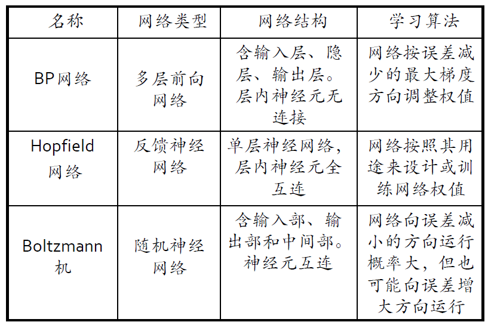

- BP网络是一种“贪心”算法，容易陷入局部最小点。
- Hopfield网络很难避免出现伪状态，网络是严格按照能量减小的方向运行的，容易陷入局部极小点，而无法跳出。
- 所以，在用BP网络和Hopfield网络进行最优化的计算时，由于限定条件的不足，往往会使网络稳定在误差或能量函数的局部最小点，而不是全局最小点，即所得的解不是最优解。

#### 随机神经网络的基本思想

网络向误差或能量函数减小方向运行的概率大，同时向误差或能量函数增大方向运行的概率存在，这样网络跳出局部极小点的可能性存在，而且向全局最小点收敛的概率最大。

#### Boltzmann机的网络结构

- Boltzmann机由输入部、输出部和中间部构成。输入神经元和输出神经元可称为显见神经元，它们是网络与外部环境进行信息交换的媒介。中间部的神经元称为隐见神经元，它们通过显见神经元与外部进行信息交换。
- 每一对神经元之间的信息传递是双向对称的，即$w_{ij}=w_{ji}$，而且自身无反馈即$w_{ii}=0$。学习期间，显见神经元将被外部环境“约束”在某一特定的状态，而中间部隐见神经元则不受外部环境约束。

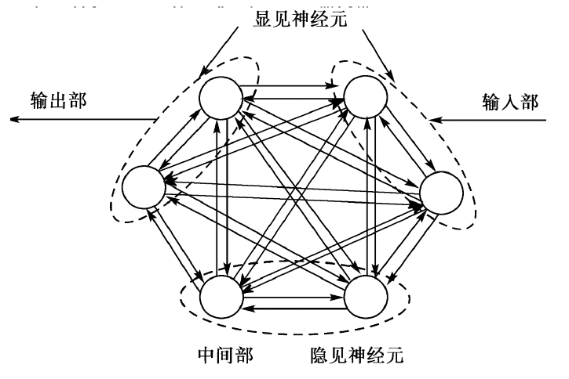

- **单个神经元的运行特性**

  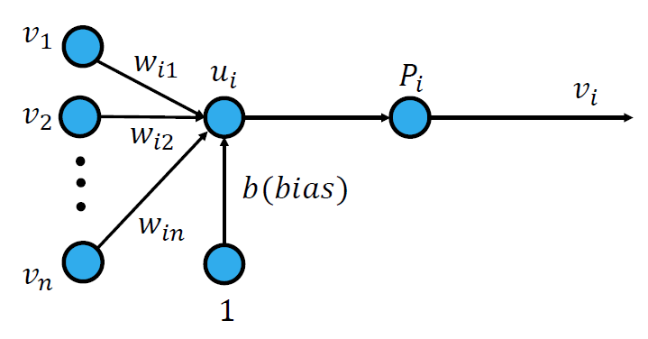

  - 神经元$i$的全部输入信号的总和为$u_i$为：$ u_{i}= \sum _{j}^{n}w_{ij}v_{j}+b_{i} $ 
  - 神经元的输出$v_i$依概率取1或0：
    - $v_i$取1的概率：$ P( v _{i}=1)=1/(1+e^{-u_{i}/T}) $ 
    - $v_i$取0的概率：$ P( v _{i}=0)=1-P( v _{i}=1)$
  - 由此可见，$v_i$取1的概率受两个因素的影响：
    (1) $u_i$越大$v_i$则取1的概率越大，而取0的概率越小；
    (2)参数$T$称为“温度”，在不同的温度下$v_i$取1的概率$P$随$u_i$的变化如图所示。
    - 可见，$T$越高时，曲线越平滑，因此，即使$u_i$有很大变动，也不会对$v_i$取1的概率变化造成很大的影响；反之，$T$越低时，曲线越陡峭，当$u_i$有稍许变动时就会使概率有很大差异。<u>即温度高时状态变化接近随机，随着温度的降低向确定性的动作靠近。</u>
    - 当$T$→0时，每个神经元不再具有随机特性，而具有确定的特性，<u>激励函数变为阶跃函数，这时Boltzmann机趋向于Hopfield网络。</u>

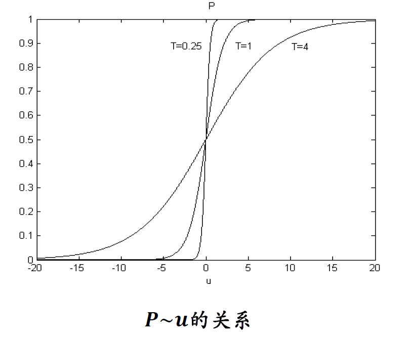

#### Boltzmann机的工作原理

- Boltzmann机采用下式所示的能量函数作为描述其状态的函数: $ E=- \frac{1}{2} \sum _{i,j}w_{ij}v_{i} \nu _{j} $ 
- Boltzmann机在运行时，假设每次只改变一个神经元的状态，如第$i$个神经元，设$v_i$取0和取1时系统的能量函数分别为0和$ - \sum _{j}w_{ij}v_{j} $ ，它们的差值为$\Delta E_i$。$ \Delta E_{i}=E|_{v_{i}=0}-E|_{v_{i}=1}=0-(- \sum _{j}w_{ij} \nu _{j})= \sum _{j}w_{ij} \nu _{j} $ 
- $\Delta E_i$的取值可能有两种情况：$\Delta E_i$>0或$\Delta E_i$<0
  - 当$\Delta E_i>0$时，即$ u_{i}= \sum _{j}w_{ij}v_{j}>0 $ 时，$E|_{v_{i}=0}>E|_{v_{i}=1}$
    - 神经元取1的概率：$ P( v _{i}=1)=1/(1+e^{-u_{i}/T}) $ 
    - 神经元取0的概率：$P( v_{i}=0)=e^{-u_{i}/T}/(1+e^{-u_{i}/T})$
    - $u_i>0$时，$ e^{-u_{i}/T}<1 $ ，$ P( v _{i}=1)>P( v _{i}=0) $ 
    - 这时神经元$i$的状态取1的可能性比取0的可能性大，即网络状态取能量低的可能性大。
  - 当$\Delta E_i<0$时，即$ u_{i}= \sum _{j}w_{ij}v_{j}<0 $ 时，$E|_{v_{i}=0}<E|_{v_{i}=1}$
    - 此时，$ P( v _{i}=1)<P( v _{i}=0) $ 
    - 神经元$i$的状态取0的可能性比取1的可能性大，即网络状态取能量低的可能性大。
- 网络状态取能量低的可能性大。运行过程中总的趋势是朝能量下降的方向运动，但也存在能量上升的可能性。

#### Boltzmann机的运行步骤

- 第一步：对网络进行初始化。设定初始温度$T_0$、终止温度$T_{final}$和阈值𝜉，以及网络各神经元的连接权值$w_{ij}$。
- 第二步：在温度$T_m$条件下（初始温度为$T_0$）随机选取网络中的一个神经元$i$，计算神经元$i$的输入信号总和$u_i$：$ u_{i}= \sum _{j=1,i\neq j}^{n}w_{ij}v_{j}+b_{i} $ 
- 第三步：若$u_i$>0，即能量差$Δ𝐸_𝑖$>0，取$v_i=1$为神经元$i$的下一状态值。若$u_i$<0，计算概率：$ P_{i}=1/(1+e^{-u_{i}/T}) $ 
- 第四步：判断网络在温度$T_m$是否达到稳定，若未达到稳定，则继续在网络中随机选取另一神经元$j$，令$j=i$，转至第二步重复计算，直至网络在$T_m$下达到稳定。若网络在$T_m$下已达到稳定则转至第五步计算。
- 第五步：以一定规律降低温度，使$T_{m+1}<T_m$ ，判断$T_{m+1}$是否小于$T_{final}$，若$T_{m+1}$大于等于$T_{final}$，则$T_m=T_{m+1}$，转至第二步重复计算；若$T_{m+1}$小于$T_{final}$，则运行结束。此时在$T_m$下所求得的网络稳定状态，即为网络的输出。

#### Boltzmann机的学习规则

- Boltzmann机是一种随机神经网络，可使用概率中的似然函数量度其模拟外界环境概率分布的性能。因此，Boltzmann机的学习规则就是根据最大似然规则，通过调整权值$w_{ij}$，最小化似然函数或其对数

