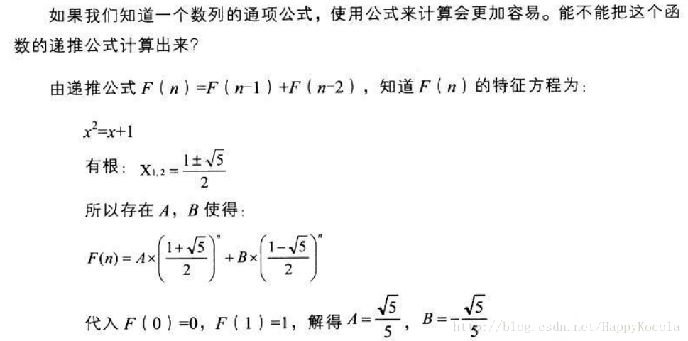
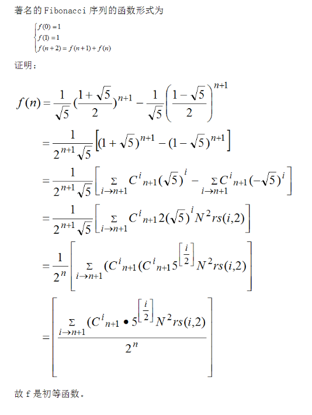

## 第一章 递归函数

### 1.1 数论函数（P1）<!--more-->

- 数论函数

  - k元数论全函数

  - 部分数论函数

- 本原函数（$\mathcal{IF}$）

  - 零函数$Z$

  - 后继函数$S$

  - 投影函数$P_i^n$

- 常用数论函数（P2）

  - 前驱函数pred
  - 加法函数add
  - **算术差函数sub**
  - 绝对差函数diff
  - 乘法函数mul
  - 除法函数div
  - 求余函数rs
  - 指数函数pow
  - 平方函数sq
  - $E(x)=x-\lfloor \sqrt{x}\rfloor$
  - max、min
  - 最大公约数函数gcd、最小公倍数函数lcm
  - **素数枚举函数$P$**
  - **$ep(n,x)$：x的素因子分解式中第n个素数的指数**
  - $eq(x,y)$：相等时等于0，否则为1
  - **$N$：否定，x=0时为1，否则为0**
  - **$N^2$：x=0时为0，否则为1**
  
- 函数的复合（P4）
- 有界迭加算子$\sum$
- 有界迭乘算子$\prod$
- 有界$\mu-$算子
- 有界$max-$算子
- 基本函数类$\mathcal{BF}$（P6）
  - $\mathcal{IF} \subseteq \mathcal{BF}$
  - $\mathcal{BF}$对于复合封闭

### 1.2 配对函数（P7）

- 配对函数、配对函数组
- Godel编码
- 若配对函数组$\{pg,K,L\}$使pg穷尽一切自然数，则称该配对函数组是一一对应的
  - 康托编码（P9）
- 多元配对函数（P11）
- Godel $\beta-$函数（P13）
  - 定理1.11：有穷数列的编码和解码（中国剩余定理）

### 1.3 初等函数（P14）

- 初等函数类$\mathcal{EF}$
  - 定义
    - $\mathcal{IF} \subseteq \mathcal{EF}$
    - $x+y,x−y(绝对差),x×y,⌊x/y⌋∈\mathcal{EF}$
      - 加、乘、除可省
    - $\mathcal{EF}$对于复合，有界迭加算子$∑[⋅]$和有界迭乘算子$∏[⋅]$封闭
  - 性质
    - $\mathcal{EF}$对于有界$\mu-$算子和max-算子封闭
- 数论谓词
  - 数论谓词的特征函数：真为0，假为1
  - 初等数论谓词：若谓词$P$的特征函数属于$\mathcal{EF}$，则称$P$是初等的
- 数论集合
  - 数论集合的特征函数：属于集合为0，不属于为1
  - 初等数论集合：若数论集合$S$的特征函数属于$\mathcal{EF}$，则称$S$是初等的
- 重要的初等函数（P19）
  - $x^y$
  - $\lfloor \sqrt[y] x \rfloor$
  - 余数$rs(x,y)$
  - $\tau (x)$：x因子的数目
  - $prime(x)$：判定x是否为素数（数论谓词）
  - $\pi (x)$：不超过x的素数个数
  - 素数枚举函数$P(n)$=第n个素数
  - $ep(n,x)$
- 控制函数（P24）
  - $\mathcal{EF}$的控制函数G（P22）
    - 控制函数不属于$\mathcal{EF}$

### 1.4 原始递归函数（P25）

- 原始递归算子
  - 带参原始递归算子
  - 无参原始递归算子
- 原始递归函数类$\mathcal{PRF}$
  - 定义
    - $\mathcal{IF} \subseteq \mathcal{PRF}$
    - $\mathcal{PRF}$对于复合、带参原始递归算子、无参原始递归算子封闭
  - 重要的原始递归函数
    - add、pred、sub、diff、mul、sq（平方）、N、$N^2$、sqrt、E
- 原始复迭算子It​、弱原始复迭算子​Itw​ (P30)
- 原始复迭函数类$\mathcal{ITF}$
  - 定义
    - $\mathcal{IF} \subseteq \mathcal{ITF}$
    - $\mathcal{ITF}$对于复合、原始复迭算子It[·]、弱原始复迭算子Itw[·]封闭
  - $\mathcal{ITF=PRF}$
- 若干形式不同的递归式化归到原始递归式（P34）
  - 串值递归
  - 联立递归
  - 变参递归
  - 多重递归
- $\mathcal{PRF}$的控制函数
  - Ackermann函数：$Ack(m,n)$（P38）
    - 不是原始递归函数
- $\mathcal{EF} \subset \mathcal{PRF}$ (P41)
  - 真包含：$\mathcal{EF}$的控制函数G属于$\mathcal{PRF}$

### 1.5 递归函数（P42）

- 正则函数（全函数）、正则$\mu-$算子（区别于有界$\mu-$算子）
- 一般递归函数类$\mathcal{GRF}$
  - 定义
    - $\mathcal{IF} \subseteq \mathcal{GRF}$
    - $\mathcal{GRF}$对于复合和原始递归算子（带参和无参）封闭
    - <u>$\mathcal{GRF}$对于正则$\mu-$算子封闭</u>
- $\mu-$算子（部分函数）
- 部分递归函数类$\mathcal{RF}$ （P43）
  - 定义
    - $\mathcal{IF} \subseteq \mathcal{RF}$
    - $\mathcal{RF}$对于复合和原始递归算子（带参和无参）封闭
    - <u>$\mathcal{RF}$对于$\mu-$算子封闭</u>
  - 显然$\mathcal{GRF} \subset \mathcal{RF}$ ：正则$\mu-$算子是$\mu-$算子的特例
- 递归数论谓词、$\mu-$谓词、递归集
- $\mathcal{PRF} \subset \mathcal{GRF}$ 
  - 法1：利用控制函数，证明Ackermann函数是一般递归函数但不是原始递归函数（P45）
  - 法2：利用通用函数（P47）
- $\mathcal{GRF} \subset 全数论函数\mathcal{NTF}$ （P48）
  - 存在数论全函数f，f不是一般递归函数 

### 1.6 结论（P48）

$$本原函数类\mathcal{IF} \subset 基本函数类\mathcal{BF} \subset 初等函数类\mathcal{EF} \subset 原始递归函数类\mathcal{PRF} = 原始复迭函数类\mathcal{ITF} \subset 一般递归函数类\mathcal{GRF} \subset 部分递归函数类\mathcal{RF}$$

## 第三章 $\lambda-$演算

### 3.1 $\lambda-$演算的语法（P72）

- 变量：小写字母，表示一个参数（形参）或者一个值（实参）
- 抽象：$\lambda x.M$，绑定变量x于该函数抽象的函数体M，简单来说就是表示一个<u>形参</u>为x的函数M。
- 作用：$MN$，表示将函数M应用于参数N，简单来说就是给函数M输入<u>实参</u>N。
  - 函数作用是左结合的，即：`M N P`意为`(M N) P`而非`M (N P)`
- 自由变元和约束变元（P74）
  - 在函数抽象中，形参绑定于函数体，即形参是约束变元，相对应地，不是约束变元的自然就是自由变元
  - 闭$\lambda-$项：没有自由变元的项，$\Lambda ^ \circ$表示全体闭$\lambda-$项的集合
  - 约束变元改名后仍等价
  - 自由变元的替换：$M[x:=N]$，$x$为自由变元

### 3.2 转换（P76）

- 形式理论$\lambda \beta$ (P76)
  - 标准组合子$I,K,K^*,S$
- 形式理论$\lambda \beta + ext$ 和$\lambda \beta \eta$ (P79)

### 3.3 归约（P80）

- $\to_R$（一步$R-$归约）、$\twoheadrightarrow_R$ （$R-$归约）、$=_R$（$R-$转换）
- 二元关系$\beta$、$\alpha$、$\eta$、$\beta \eta$
  - $M =_\beta N \Leftrightarrow \lambda \beta \vdash M=N$
- $\beta-$可约式、$\beta-$范式（$\beta-$nf）、$\beta-$范式的集合（$NF_R$）、$M$有$\beta-$nf

### 3.4 Church-Rosser定理（P85）

- CR性质：$P \twoheadrightarrow M \bigwedge P \twoheadrightarrow N \Rightarrow \exists T.(M \twoheadrightarrow T \bigwedge N \twoheadrightarrow T)$
  - 对$\twoheadrightarrow_\beta$、$\twoheadrightarrow_\eta$、$\twoheadrightarrow_{\beta \eta}$成立
- con($\lambda \beta$)：存在推不出的公式

### 3.5 不动点定理（P93）

- 不动点定理：对于任何的$F \in \Lambda$，存在$Z \in \Lambda$，使得$FZ =_\beta Z$
- 不动点组合子
  - $Y$： 对于任何的$F \in \Lambda$，$F(YF)=_\beta YF$
  - $\Theta$：对于任何的$F \in \Lambda ^ \circ$，$\Theta F \twoheadrightarrow_\beta F(\Theta F)$
- $([M_1,...,M_n])^n_i \twoheadrightarrow_\beta M_i$

### 3.6 递归函数的$\lambda-$可定义性（P95）

- Church数项：$\ulcorner n \urcorner \equiv \lambda fx.f^nx$
- $\lambda-$可定义性：$F \ulcorner n_1 \urcorner ...  \ulcorner n_k \urcorner =_\beta  \ulcorner f(n_1,...,n_k) \urcorner$
- $D\ulcorner n \urcorner MN$ = if (n = 0) then M else N​ (P97)
- **一般/部分递归函数是$\lambda-$可定义的**

### 3.7 与递归论对应的结果（P100）

- $\lambda-$项的编码：对每个$M \in \Lambda$ ，都有唯一的自然数$\sharp M$与之对应 （$\lambda-$项 $\rightarrow$ $\mathbb{N}$）
- $\lambda-$项的内部编码：$M$的内部编码定义为$\ulcorner M \urcorner \equiv \ulcorner \sharp M \urcorner$ （$\lambda-$项 $\rightarrow$ $\lambda-$项)
- 枚举子$E$，对于任何$M \in \Lambda^ \circ$，有$E\ulcorner M \urcorner =_\beta M$
- 第二不动点定理：$\forall F. \exists Z. F \ulcorner Z \urcorner =_ \beta Z$
- **不可判定性**（P102）
  - 若自然数集S的特征函数$\mathcal{X}_s \in \mathcal{GRF}$，则称$S$是可判定的
  - 若$\lambda-$项集合$\mathcal{A} \subseteq  \Lambda$的编码集合是可判定的，则称$\mathcal{A}$是可判定的
  - 设$\mathcal{A} \subseteq  \Lambda$非平凡、$\mathcal{A}$对$=_\beta$封闭，则$\mathcal{A}$不可判定
  - $=_\beta$关系不可判定
  - 集合$\mathcal{N}=\{M:M有\beta-nf\}$不可判定

## 第五章 Turing机

### 5.1 Turing机的形式描述（P121）

- Turing机定义：$M=(d,p,s)$，论域$Dom(M)$
- Turing可计算的定义：存在机器M计算函数f
- 基本机器：
  - 零函数：$\boxed{Z}$
  - 后继函数：$\boxed{S}$
  - 投影函数：$\boxed{I}$、$\boxed{K}$、$\boxed{L}$
  - 常数函数：$\boxed{C^k_l}$
  - 前驱函数：$\boxed{pred}$
  - 加法函数：$\boxed{add}$
  - 乘法函数：$\boxed{multi}$ (习题5.3)
  - 幂函数$2^x$：习题5.4
  - 平方根函数：习题5.7

### 5.2 Turing机的计算能力（P127）

- 常用机器（P128）
  - $f(x)=2x$：$\boxed{double}$
  - $\boxed{copy_1}$（习题5.2）、$\boxed{copy_2}$、$\boxed{copy_k}$、$\boxed{copy_k}^k$
  - $\boxed{compress}$
  - $\boxed{erase}$
  - $\boxed{shiftr}$、$\boxed{shiftl}$
- Turing可计算函数类对于复合算子、原始递归算子、正则$\mu-$算子封闭
- 若f是一般/部分递归函数，则f是Turing-可计算的

### 5.3 可判定性与停机问题（P138）

- 可判定性：设$A \subseteq \mathbb{N}$，$A$是可判定的指$A$的特征函数$\mathcal{X}_A$是Turing-可计算的（可构造出机器）
- Turing机的编码
  - 从#M可反向求出M
- 自停机问题$K=\{\sharp M:M对于输入\overline{\sharp M}停机\}$：不可判定
- 停机问题$\hat{K}=\{\sharp M:M对于一切输入皆停机\}$：不可判定

### 5.4 通用Turing机（P141）

- 带位置编码
- 标准输入编码和解码：$\boxed{code}$、$\boxed{decode}$
- 计算后继带位置函数STP、TS
- 通用图灵机$U$的定义（P146）

### 5.5 Church-Turing论题（P147）

## 题型

- 问答题

  - 什么是配对函数组？什么是配对函数？请构造一例。（P7 定义1.10，如引理1.14构造）
  - 什么是一般递归函数？（P42 定义1.31）
  - 什么是部分递归函数？（P43 定义1.33）
  - 什么是$\lambda \beta$系统的CR性质？（P85）
  - 什么是Turing 机？（P122）
  - 什么是Church-Turing Thesis？你认可它吗？/你拥护吗？（P148）
  - 为什么算法和Turing 机概念在可以构成“思维机器”的现代观点中占有如此核心的地位？（因为图灵机的概念为现在的思维机器观点提供了抽象模型，是现代计算机的起源。）是否在原则上存在一个算法可达到绝对极限呢？（未知，自由发挥）
  - 什么是Halting Problem？它可判定吗？（P141）
  - 什么是Turing 机的通用性(universality)？什么是通⽤Turing 机？(P146)

- 判断函数类（第二大题）
  - A：$\mathcal{EF}$
    - Godel的$\beta-$函数
    - 向下取整
    - $\pi,e$的十进制展开中的第n个数字
    - $\lambda-$项呈形...
    - 组合数个数
    - 数列求和
  - B：$\mathcal{PRF} - \mathcal{EF}$
    - 形如$G(x)=2^{2^{\cdots^x}}$
    - Ack(5,n)
    - 变参递归(不确定？)
  - C：$\mathcal{GRF} - \mathcal{PRF}$
    - Ackermann函数
    - Ack(m,5)
    - $\beta_0,\beta_{x+1}$ （不确定？）
  - D：$\mathcal{RF} - \mathcal{GRF}$
    - 处处无定义的函数
    - 存在无定义的函数
  - E：不可计算的数论函数类 
    - 停机问题
    - $M有\beta-nf$、$M =_\beta N$
  
- 证明集合$S$的可判定性
  
  - 证$\mathcal{X}_s \in \mathcal{GRF}$
  
- 证明初等函数
  - 根据定义用常用函数表示（Q1.2，Q1.3，1.11，1.12）

  - 出现根号、负数等：用已知形式表示（转化为整数、分开表示等）

  - 取整
    - $f(n)=\lfloor e \cdot n \rfloor$ (Q1.8)
    - $f(n)=\lfloor (\frac{\sqrt{5}+1}{2})^n\rfloor$ (2019 四，1.19(2) 两种方法）
    - $f(n)=\lfloor (\sqrt{6} +\sqrt{5})^{2n} \rfloor$ (2019+ 四)
    - $\lfloor n! \cdot cos(1)\rfloor$
    - $\lfloor n! \cdot 2^n \cdot \sqrt{e} \rfloor$
    - $\lfloor log_{10}n \rfloor$
    - $\lfloor (n+1+\frac{1}{n+1})^{n+1} \rfloor$

  - 十进制展开式第n位

    > step1. 泰勒展开，分开整数项和小数项，证$\lfloor n!·α\rfloor \in \mathcal{EF}$
    >
    > step2. 证$\lfloor n \cdot \alpha \rfloor \in \mathcal{EF}$
    >
    > step3. $f(n) = \lfloor 10^n \alpha \rfloor - \lfloor 10^{n-1}\alpha \rfloor \cdot 10  \in \mathcal{EF},(n \geq 1)$

    - $e$ （2019+ 七，5.18，类似Q1.8）
    - $\pi$（1.25，一般递归函数）
    - $\frac{e^2+1}{2e}$ (2019 七)
    - $sinh(1)=(e-e^{-1})/2$ (2018 七)，$sin(1),cos(1)$
    - $\sqrt{e}$
    - 证明原始递归函数

  - 串值递归（Q1.5，Q1.6，1.15）
  - 变参递归（Q1.7）

- 对给定的数论函数$f(x)$，构造$F∈Λ^∘$其$λ−$定义$f(x)$
  - 判断奇偶函数：$l(x)=N^x(0)$ （2017 三）
  - add（2016 三）、$f(x,y)=x+y$ （3.16）
  - $f(x)=2x$ ，$f(x)=3x$（Q2.3，3.17）
  - $g(x)=2^x$ （Q2.7，3.20）
    - 倒推法、Rosser引理$\ulcorner n^m \urcorner = \ulcorner m \urcorner \ulcorner n \urcorner$
  - $f(x)=\lfloor \frac{x}{2} \rfloor$
  
- 在已有的公理系统中加入一个额外公理
  - $\lambda xy.xy = \lambda xy.yx$ (2017)
  - $\lambda x.x = \lambda x.xxx$ (2018)
  - $\lambda x.x = \lambda x.xx$ （2016）
  - $\lambda xy.x = \lambda xy.y$ （3.13）
  - $\lambda xyz.x(yz)=\lambda xyz.(xy)z$
  - $I=K$ （2019）
  - $I=S$（2019+）
  
- 构造图灵机
  - $f(x)=x^3$ （2019 六）、$f(x)=x^4$（2019+ 六）
  - $g(x)=2^x$ （2016 六、习题5.4、Q3.5）
  - $f(x)=\lfloor \frac{x}{2} \rfloor$
  - 满足给定的输入输出（2018、2017 五）
  
- 求图灵机运行后的输出

  - 记得写状态、箭头

- 证明停机问题不可判定（2018、 2017 六）

## Hint

- 减号写点、除号写取整
- $N$, $N^2$ 表示if-else
- Godel编码

  - P,ep
- 标准组合子$I,K,K^*,S,U^3_1,...$
- $y^nz=(\lambda fx.f^nx)yz = \ulcorner n \urcorner yz$

